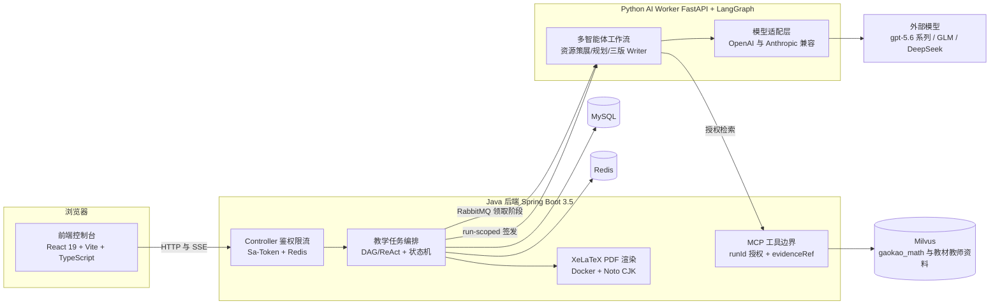
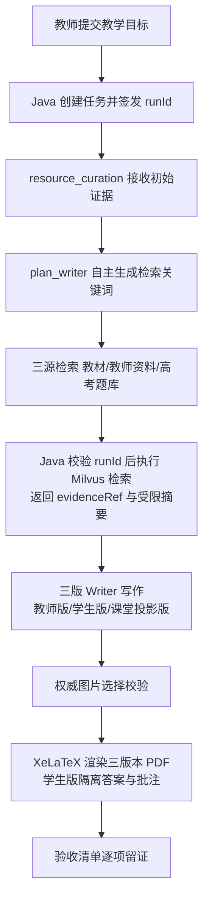
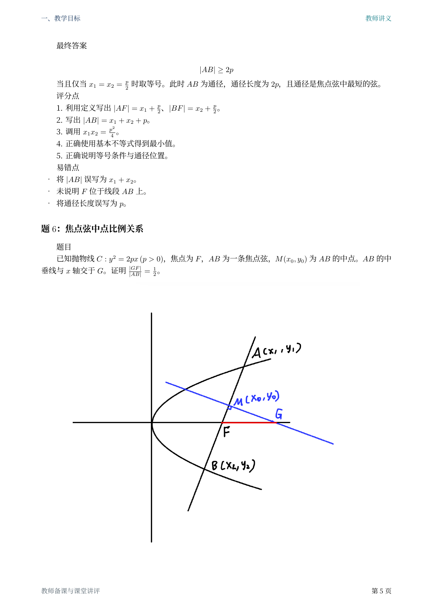
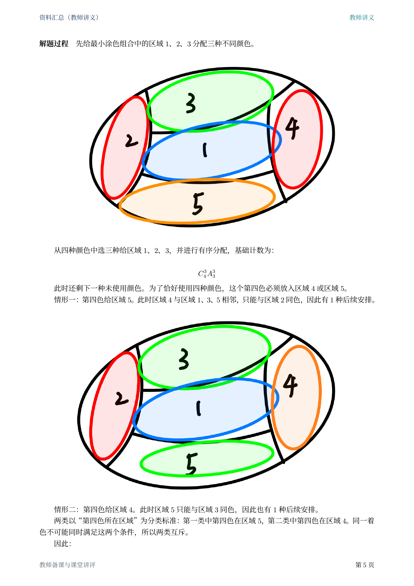
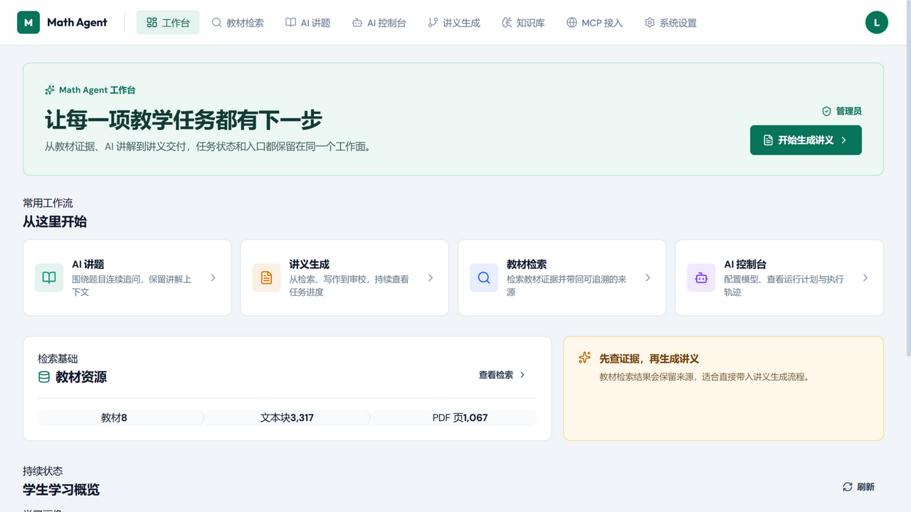
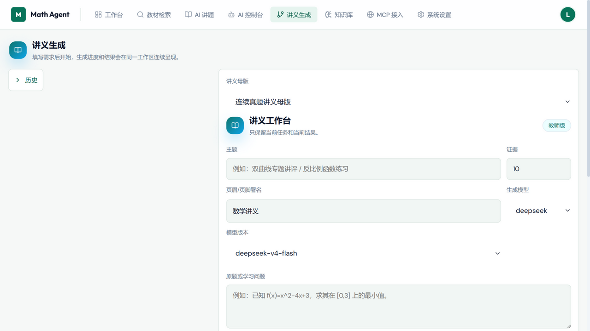
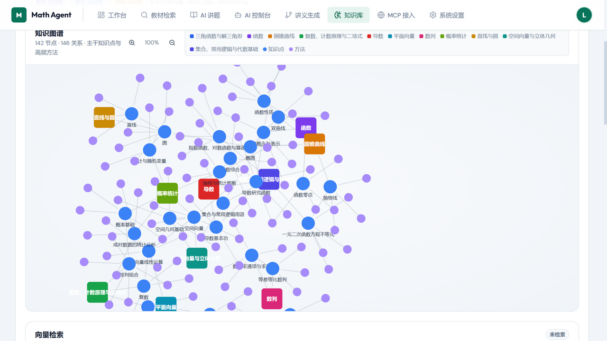
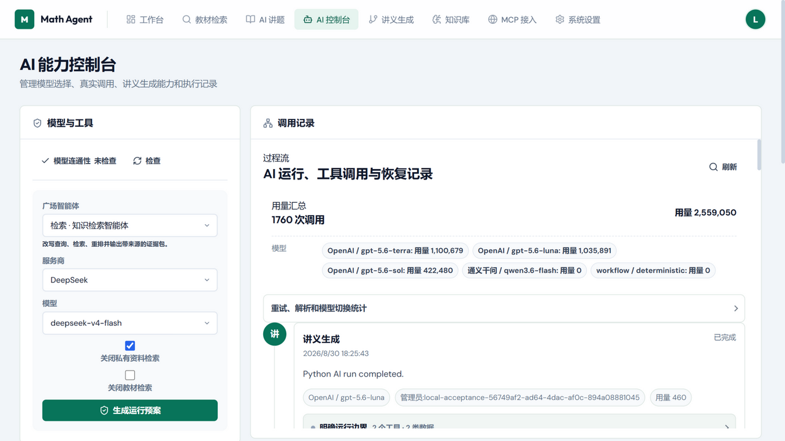
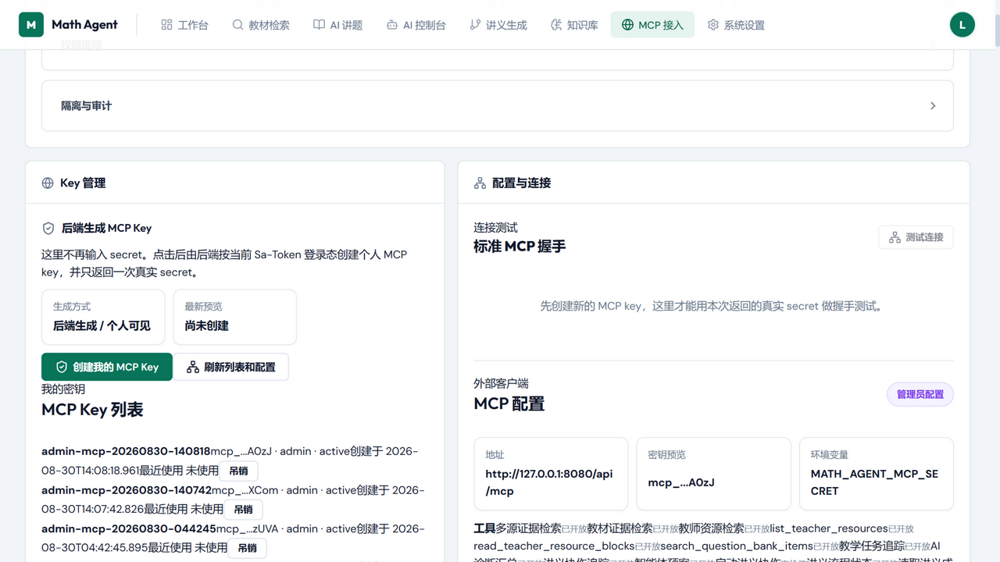

# 高中数学教学 Agent 平台

这是一个面向高中数学教学场景设计并实现的 AI 教学 Agent 平台。项目围绕教师端、学生端和管理端联动展开，把教材检索、教师资料解析、题库导入、知识图谱、学生学习画像、教学任务编排、模型治理、权限限流与审计串成一条可落地的教学业务链路。

平台以 Java 后端为核心，基于 Spring Boot 3.5、Java 21、Spring AI、MyBatis-Plus、MySQL 和 Redis 搭建 Agent/RAG 服务分层；Python Worker 基于 FastAPI + LangGraph 在 GPU 环境执行多智能体写作与讲义生成；前端采用 React 19 + Vite 7 + TypeScript 5。工程结构按 controller、service、dto、vo、mapper 拆分，业务模块之间保持清晰边界，同时为前端控制台、外部 MCP/A2A 集成和后台资料处理提供统一接口。

---

## 平台架构

系统按「前端控制台 → Java 编排控制面 → Python AI Worker 执行面 → 存储/中间件」分层，模型凭据只存在于 Worker：



讲义生成链路：检索 query 由 AI 自主生成，Java 只校验 `runId` 并执行向量检索，图片经 `evidenceRef + assetId` 授权后由渲染器物化：



---

## 讲义成品示例

以下页面均由真实任务生成：Python AI Writer 完成全部教学正文与图片选用，Java 完成鉴权、持久化与 XeLaTeX/PDF 渲染，讲义中的题目图片来自经过授权校验的真实来源资产。

**抛物线专题·教师版（第 5 页）**——题目「焦点弦中点比例关系」配真实来源图形，公式、评分点与易错点完整：



**涂色问题专题·教师版（第 5 页）**——区域涂色示意图按解题步骤着色，分类讨论与组合计数公式同页呈现：



完整成品（教师版/学生版/16:10 课堂投影版三版本 PDF 与验收记录）保留在版本库中：

- [涂色组合专题](output/acceptance/handout-mcp/handout-mcp-coloring-combinatorics-relevant-images-20260829T130201Z/)
- [立体几何专题](output/acceptance/handout-mcp/handout-mcp-solid-geometry-gaokao-figure-final-20260829T165522Z/)
- [抛物线专题](output/acceptance/handout-mcp/handout-mcp-parabola-image-binding-final-verified-20260829/)

---

## 前端控制台实拍

以下截图取自本地真实运行的前端控制台（`http://127.0.0.1:5173`）：

**工作台**——教学任务入口与教材资源统计（教材 8 册、文本块 3,317、PDF 页 1,067）：



**讲义生成**——讲义母版选择、教学目标提交与三版本 PDF 生成入口：



**知识库**——知识图谱与题库工作台（142 谱节点、146 关系边、201 知识点、6,678 条向量，SVG 力导向图支持拖拽、缩放与悬停高亮）：



**AI 控制台**——模型目录、连通性检查与真实调用记录（1,760 次调用、用量 2,559,050）：



**MCP 接入**——按当前登录态生成个人 MCP Key、标准握手配置与工具清单：



---

## 高中数学来源与讲义调用流程

高考原卷的 GPU 资产提取、Terra 页级转写、逐题 Markdown 发布、Milvus 入库、run-scoped 精读授权和 AI 选图/PDF 物化流程见[高中数学来源与讲义调用流程](docs/high-school-source-and-handout-flow.md)。

## 不可违反的讲义架构

开发前先阅读项目指令 [AGENTS.md](AGENTS.md)，交付前逐项执行[讲义架构验收清单](docs/handout-architecture-acceptance-checklist.md)。以下约束适用于教师版、学生版、课堂讲解版及其 PDF：

给 AI 的资源引用必须语义明确（如 `img01` 这类短标识），禁止把超长 UUID 等模型无法理解的标识传给模型。

1. **只有 AI/Python Writer** 可以创作任何可见教学正文，并决定图片是否使用及其位置；Java 和前端只做通用鉴权、持久化、格式化/渲染、可见性隔离与校验。
2. Java 和前端不得写入固定教学文案、按题目/知识点分支、默认标题/答案/提示，也不得自行选择或回退生成示意图、图片。
3. 图片领域和模型契约只以不透明的 `evidenceRef` 加 `assetId` 关联；禁止传递文件系统路径、URL、Base64 或 AI 生成的 LaTeX 图片命令。仅在权威 `evidenceRef` 与 `assetId` 已获授权且图片选择已校验后，通用渲染器可生成内部 LaTeX 图片标记；没有有效选择即不展示图片。
4. 高中来源材料必须遵循：GPU PaddleOCR/版面分析生成题图 PNG、`question-assets.jsonl`、`assets.md` 和源文件哈希报告，再将完整页图交给默认 Luna（或显式 Terra）转写。题图不作为单题视觉输入；其来源、页码、bbox、哈希和绑定规则会写入题目 `metadata.questionAssets`，并与向量入库和讲义资产共用。
5. **高考题讲义图片只允许使用题目级 `figures/` 资产**：以 `output/math-paper-corpus/<完整来源文件名>/figures/` 中由题目 `questions[].assets`/`assetIds` 明确绑定、且题目 Markdown 有对应引用的图片为唯一合格来源。`page-images/` 是整页定位、OCR、版面审计和来源复核的内部产物，禁止进入 AI 选图、授权资产、讲义 Markdown、XeLaTeX 物化和任何 PDF；禁止对页面进行二次切分来补图。题目没有可核验的 `figures/` 引用时，高考只使用题目文字，不显示图片。教材页面图同样不进入讲义 PDF。
6. **RAG 检索必须由 AI Agent 自主执行**：AI 通过 Java 提供的 MCP 工具（`handout-context`、`handout-document-read`、`handout-document-search`、`handout-teacher-resource-search`）自行构造检索参数并调用，Java 仅提供已授权的不透明 `evidenceRef`/`documentRef` 和受限读取接口。禁止 Java 或前端直接将用户输入作为检索 query。
7. 交付必须同时通过：来源证据和完整来源名、AI 独占可见内容、学生答案隔离、真实来源图片、中文与公式检查、PDF 视觉审阅。历史输出不能替代本次验收证据。

---

## 核心对标：成熟高中数学教师式讲解

项目把成熟教学产品的讲解态度作为讲义与单题讲解的质量基线，而不是把"模型返回了文字"当作完成：

1. 按"题型识别 → 方法梳理 → 分步推理 → 总结回顾"组织数学内容。
2. 解释概念、方法选择和每一步为什么成立，设置理解检查、追问和 `<wait>` 课堂停顿，不只给答案。
3. 用清晰板书顺序呈现题目、公式、计算和结论；先准确术语、后口语化解释，兼顾严谨、考点、评分点与常见误区。
4. 通过知识图谱说明知识点归属、先修关系、关联方法、学习阶段和难度；处理顺序是"扫描题目 → 匹配图谱 → 按知识点与思想方法组织"。
5. 推理遵循"目标 → 相关知识 → 已知条件 → 逻辑推导"，并受真实证据约束，禁止虚构题目、来源、定理条件、图形关系和数值答案。

多 Agent 流程的实际阶段由当前图版本与配置定义。Python 负责教学规划、修订以及教师版、学生版、课堂讲解版三份 Writer 文档；页眉、页脚、页码、字体和纸张比例由 PDF 渲染器控制，不写入模型正文。提示词档案与样例见 [讲义提示词档案与样式验收](docs/handout-prompt-profiles-and-style-acceptance.md)。

## 讲义与 PDF 不可违反的硬性要求

以下要求是讲义链路的开发契约，不得以"模型已返回文本"替代真实验收：

涉及讲义、公式、PDF、页眉页脚、学生作答区或 16:10 版的任何开发，**必须先阅读并遵守**[讲义 PDF 渲染开发规范](docs/handout-pdf-rendering-development-standard.md)。多智能体讲义工作流的实际拓扑与图片从授权资料到模型/PDF 的完整路径见[多智能体讲义工作流与图片编排](docs/multi-agent-handout-workflow.md)。

1. 写作前必须分别检索教材与已授权教师/飞书资料；教师讲义的每道原题均须可读地注明教材章节与资料来源，禁止只保留内部 ID。
2. 教师讲义必须包含足以达成已规划教学目标的、经来源核验的原题；不存在固定题量发布门槛。检索证据不足时必须明确失败，禁止编造题目凑数。
3. 公式必须处于 `$...$` 或 `$$...$$` 数学环境。分式只能使用 `\frac{分子}{分母}`，根式只能使用 `\sqrt{完整被开方内容}`；禁止用 `/`、`／`、`√` 或不带花括号的根式替代结构。导出器会拒绝含歧义公式的文档并回报行号。
4. 学生版的计算、证明和说明题必须给垂直留白；只有单值填空可用短横线。学生版和 16:10 版不得泄露最终答案、教师批注、trace 或来源内部标识。
5. 16:10 版仅含一个题目，题干位于首个正文区块，页面比例为 16:10，且文本密度受审计门禁约束。
6. PDF 必须由 Docker 内 XeLaTeX 与 Noto CJK 字体真实编译；验收必须在 Windows 渲染全部页面，保存截图、布局审计、SHA-256、HTTP 状态、trace、阶段耗时和 token 消耗。任何一项失败均不得标记验收完成。

### 流式输出与断点恢复设计

讲义模型请求使用 provider SSE，worker 以 `chunk_size=1` 显式读取，使已到达的中文字符尽快进入解析；公共 handout SSE 只发送不含正文、答案、教师批注、trace、来源内部标识或 asset id 的脱敏进度，并支持事件游标重连。

流式私有诊断按 250ms、8KiB、32 个 delta 任一条件批量落盘，未落盘尾部有 32KiB 硬上限；模型解析、成功、超时、取消和异常前都强制 flush。MySQL 是唯一恢复权威：checkpoint 恢复复用已持久化的授权证据，不重复提交任务；未经过可见性判定的私有草稿不得直接公开。

### 验收运行约束

- 验收前执行一次 `docker compose up -d`，之后**只能由一个 Compose owner** 管理该项目：不得并行运行 `scripts/local/start-all.ps1`、`start-backend.ps1`、`start-worker.ps1`、IDE 自动部署或 Docker Desktop 重建。
- 在 WSL 用 `scripts/wsl/compose-stack-service.sh install && scripts/wsl/compose-stack-service.sh start` 启用当前用户的 Compose owner；该服务只执行 `docker compose --env-file .env up -d --no-recreate`。
- 验收 runner 在登录/提交前、每次轮询前、每次 PDF 导出前检查 backend 与 ai-worker 的健康状态、容器 ID 与 `RestartCount`，要求稳定窗口；runner 默认兼容宿主机 `http://127.0.0.1:8080`，可用 `MATH_AGENT_ACCEPTANCE_BASE_URL` 指定 Compose 网络内 `http://backend:8080`。healthcheck 的 `exec_*` 事件是容器内探针命令，不会重启服务。

---

## 目录结构

| 目录 | 说明 |
|---|---|
| `backend-java/` | Spring Boot 3.5 + Java 21 后端，承载业务接口、Agent 编排、RAG 检索、数据库持久化、安全策略和协议服务。 |
| `ai-worker-python/` | FastAPI + LangGraph 的 GPU AI Worker，承载讲义生成、教学规划、流式输出与模型适配层。 |
| `frontend/` | 配套前端控制台，覆盖多页面导航（工作台、教材检索、AI 讲题、AI 控制台、讲义生成、知识库、MCP 接入、系统设置、独立登录页）。 |
| `docs/` | 现行架构规范、部署手册与验收清单。 |
| `wiki-export/` | 项目 Wiki 导出（10 章 61 篇），见 [Wiki 目录索引](wiki-export/README.md)。 |
| `benchmarks/` | 检索评测与数据集构建脚本。 |
| `output/acceptance/` | 讲义成品与验收证据（保留指定产物）。 |
| `output/benchmarks/` | 教师检索权威评测数据。 |

## 后端模块

后端主入口在 `backend-java/`，核心模块包括：

| 模块 | 说明 |
|---|---|
| `resources` / `retrieval` | 教材 catalog、chunk 读取、BM25-first 检索、页面质量降权、缓存和检索审计。 |
| `teacher` | 教师资料源登记、飞书同步 checkpoint/resume、资料块解析、检索和审计。 |
| `knowledge` | 题库导入、知识点、知识关系、题目与知识点绑定。 |
| `student` / `memory` | 学生学习画像、学习快照、知识图谱组装和学生记忆复用。 |
| `teaching` | 可恢复教学任务 DAG/ReAct 编排、人工反馈、讲义导出、阶段耗时统计和**异步执行（CREATED/RUNNING/COMPLETED/FAILED 状态机）**。 |
| `agent` | Agent 执行计划、模型调用、Trace 持久化、恢复查询和多 Agent 写作 workflow。 |
| `protocol` | MCP 工具发现、MCP 工具执行和 A2A Agent Card 元数据。 |
| `infrastructure.security` | 后端用户主体、角色/API 分级、Redis 限流、并发控制和审计。 |
| `infrastructure.ai` | 模型 provider/model 目录、健康检查、fallback 策略和密钥脱敏。 |

## 教材与 RAG 检索

**⚠️ 检索架构强制要求：**

1. **所有资源必须先入库向量数据库**：教材、教师资料、高考题库等所有教学资源必须先通过批量入库流程写入 Milvus，禁止在运行时直接读取本机文件系统或云存储路径。
2. **AI Agent 自主检索**：检索 query 由 Python AI Agent 根据教学目标自行生成，Java 后端仅执行已授权的向量检索并返回不透明 `evidenceRef`。禁止将用户原始输入直接作为检索参数。
3. **MCP 工具边界**：AI 通过 `/internal/agent-tools/v1/handout-*` 系列接口获取资源，Java 校验运行授权后返回受限文本块和不透明资产引用，不暴露文件路径、URL 或数据库连接。

### 教材检索链路

教材检索链路固定使用 c2 section-child corpus，不允许回退到只有 `page_summary` 的页级语料。c2 的子块保留 `section_id`、`source_chunk_id` 和原始页码；Java 先对正文 BM25、小标题 BM25、BGE 文本向量和 CLIP 页面图像做候选召回，再按 section 子块聚合为临时逻辑父块，最后使用本地 BGE reranker 排序，并返回实际命中的子块页图。

生产数据契约如下：

- 文本 Milvus 必须来自 c2 `_section_bge_index`，迁移脚本会拒绝 `bge_page_chunk_library` 等页级 manifest。
- 页面图片仍按原始页索引保存，用于 CLIP 召回和最终页面证据；图片记录不是文本子块数量。
- Java 在加载真实教材目录时校验 `_section_bge_index/manifest.json`，发现非 c2 section-child corpus 直接失败，禁止错误语料静默降级为 BM25-only。
- 当前生产版本为 `textbook-section-c2-milvus-v1`；任何重建都必须同步更新 Milvus metadata 和 benchmark 记录。

每次检索生成 `queryId`，写入审计事件，支持按 `queryId` 查询命中详情，为 RAG 回答提供可追溯的教材证据。

### 教师资料检索

教师资料检索与教材检索保持一致的证据结构。飞书同步支持 checkpoint/resume，本地 md、txt、docx、pdf 等资料解析后按 block、checksum、citation 入库到向量数据库，后续可以从教师资源块中识别数学题、去重并绑定知识点，沉淀为教师侧题库资产。Python AI 通过 `handout-teacher-resource-search` 工具自行决定是否需要检索教师私有资源，Java 仅响应已签发 `runId` 的授权请求。

#### 飞书共享资料位置与权限

部署环境将飞书同步资料以只读方式挂载到后端的 `/app/data/local-teacher-resources`，默认宿主目录为 `.local-storage/local-teacher-resources`；同步产生的规范镜像和解析资产分别保存在后端管理的 `teacher-source-imports`、`teacher-assets` 数据卷中。AI worker 不挂载这些目录，也不得在运行时扫描文件系统。

所有飞书资源必须先完成注册、下载/同步、Markdown 或文档解析、块入库、embedding 和 Milvus 索引，且 `syncStatus=synced`、`parseStatus=parsed`、`embeddingStatus=ready`、`indexStatus=ready` 后才可检索。飞书注册默认使用 `TEACHER_SHARED` 共享范围；管理员可检索本租户全部已就绪飞书共享资料，教师按同一共享范围检索，学生不会获得教师共享库。检索时后端以持久化的共享范围字段作为用户组边界，并一次性传给向量检索，禁止按每条命中加载文档或源文件。

MCP 和明文验收记录允许使用透明的相对来源引用，例如 `feishu://group/TEACHER_SHARED/resource/<documentId>/block/<blockId>`、`textbook://<bookId>/chunk/<chunkId>` 和 `gaokao://canonical/<paperId>/question/<questionId>`，并可记录完整来源名、相对文件名、块号、题号、页码和摘要。引用不得包含宿主机绝对路径、容器挂载路径、下载 URL、Token、Cookie、密码或 Base64；实际读取仍由 Java 的任务/运行授权接口完成。

高考题是公共语料，所有已认证用户都可以通过 `gaokao_math` 检索；它不依赖教师资料用户组，也不回退到飞书资源库。

## 知识图谱与学习画像

知识图谱模块提供**SVG 力导向图可视化**，基于力导向布局算法（排斥力 + 吸引力 + 向心力）自动排列知识点节点。主干模块以彩色矩形标识（12 色自动分配），知识点为蓝色圆形，高频方法为紫色圆形。图谱支持拖拽节点、拖拽平移、滚轮缩放、悬停高亮关联节点和关系、图例展示等交互。

学生端可以看到知识节点、知识边、薄弱风险、历史问题和学习进度；教师端可以结合教材、飞书资料和教师自有资料证据做备课分析。知识图谱不是孤立展示层，而是与题库、资料检索、学生画像和教学任务编排共同工作。

## 教学任务与 Agent 编排

教学任务采用可恢复 DAG/ReAct 编排，支持学生记忆复用、阶段耗时统计、并发保护、human feedback、Agent Trace 持久化与任务恢复。**教学任务已实现异步化**：提交时立即返回 `CREATED` 状态，通过 `multiAgentWritingTaskExecutor`（core=2, max=4, queue=32）在后台执行，前端每 2 秒轮询进度。任务状态机完整落地：`CREATED → RUNNING → COMPLETED/FAILED`，失败时携带 errorMessage。

多 Agent 写作 workflow 在此基础上扩展，支持异步启动、MyBatis 持久化、前端状态面板恢复和 MCP Trace 读取。教师可以围绕讲义、学生版材料、审稿反馈等角色组织多 Agent 协作，后台保留可查询的 workflow 状态和执行链路。

## 分布式 Agent Worker

多 Agent 写作支持控制面与 Worker 分离运行：控制面仅校验权限、保存 workflow 和释放满足依赖的阶段；独立 Java Worker 通过 RabbitMQ 领取阶段任务，执行后回写 Trace 和阶段结果。Worker 节点登记、心跳、离线判定、租约回收、重试和 DLQ 均由 MySQL 与 RabbitMQ 协同实现。

任务消息只传任务/工作流/阶段引用，不传用户令牌、模型密钥或原始提示词。启动方式、环境变量、状态机与恢复流程见 [Agent Worker 架构文档](docs/agent-worker-architecture.md)。

## 模型治理与安全

模型治理层维护 provider/model allow-list、fallback 顺序、真实连通性探测和密钥脱敏，前端只读取后端暴露的模型目录与健康状态，不接触 API Key。

高价值 AI 接口使用后端解析的用户主体、角色/API 分级、Redis 固定窗口限流、并发控制与审计记录保护，降低高成本接口被盗刷和越权调用的风险。MCP/A2A 暴露也遵循只读优先、范围可控、密钥不回显的原则。

## 教师资料同步 MQ

教师资料同步是当前最适合消息化的业务：一次操作可能下载飞书资料、解析 DOCX/PDF、调用 Python 视觉 Worker，并重建 Milvus 索引。接口先完成用户主体、租户和资源所有权校验，再仅把 `jobId`、`documentId` 与后端解析出的主体身份发布到 RabbitMQ；用户凭据、API Key 和原始提示词不会进入消息。

RabbitMQ 使用持久化 direct exchange、命令队列和死信队列。MySQL `source_sync_job` 仍是状态机和幂等锚点：消费者只执行 `queued`（或恢复时 `paused`）任务，重复投递不会重复解析同一资料；业务/提供方失败继续使用已有 checkpoint/pause 机制，只有格式或基础设施异常进入 DLQ。默认并发为 1、预取为 1，避免单机预占过多 CUDA/解析任务；这些值固定在 `application.yml`，启动时不接受环境变量覆盖。

## 前端设计

前端采用 **React 19 + Vite 7 + TypeScript 5**，使用 Outfit/DM Sans 字体家族。设计风格以深海军蓝导航 + 暖金琥珀色点缀 + 清爽灰白内容区为主。

### 多页面导航

| 页面 | 功能 |
|---|---|
| 工作台 | 学生学习概览、教材资源统计、快捷操作入口 |
| 教材检索 | BM25+向量混合检索、命中证据、审计追踪 |
| AI 讲题 | 单题讲解与流式输出 |
| AI 控制台 | 模型目录与连通性检查、真实调用记录、用量统计 |
| 讲义生成 | 讲义任务创建与提交、三版本 PDF 生成、SSE 进度与断点恢复 |
| 知识库 | SVG 力导向知识图谱可视化、知识点维护、题库管理、向量 RAG 检索 |
| MCP 接入 | 个人 MCP Key 生成与管理、标准握手配置、连接测试 |
| 系统设置 | MCP 配置、后端连接、教师资源管理、当前会话状态 |
| 登录页 | 独立登录页面（手动输入账号密码），登录后自动跳转工作台 |

### 核心特性

- **API 超时控制**：30 秒超时（AbortController），超时抛出明确错误
- **UUID 幂等**：所有 clientRequestId 使用 `crypto.randomUUID()`
- **统一表单体系**：所有 input/select/textarea/button 统一使用 CSS 类体系
- **登录引导**：未登录用户访问受限页面时显示引导卡片，点击跳转登录页

### 知识图谱可视化

知识图谱使用纯 SVG 力导向图实现（无外部依赖）：
- **力导向布局**：200 次迭代的弹簧模型，含排斥力、吸引力、向心力
- **节点类型**：模块（彩色矩形）、知识点（蓝色圆形）、方法（紫色圆形）
- **交互**：拖拽节点、拖拽平移、滚轮缩放（ZoomIn/ZoomOut）、悬停高亮关联
- **图例**：显示所有模块颜色 + 节点类型标识
- **工具提示**：悬停显示节点详情、关联关系、路径

## 质量与测试

三端自动化测试于 2026-08-30 全量真实运行通过：

| 端 | 命令 | 结果 |
|---|---|---|
| Java 后端 | `mvn test` | **710 个测试，0 失败**（1 个按假设跳过） |
| Python Worker | `pytest tests/` | **188 通过 + 31 子测试**（1 个按假设跳过） |
| 前端 | `npx vitest run` | **22 个文件，110 个测试全部通过** |

检索质量以 [教师资料 120 例权威评测](output/benchmarks/teacher-120case-parent-child-final-20260830/)（真实 HTTP 后端、窗口 block 口径、资源快照落盘）为准：doc@1 0.700、doc@3 0.833、block@3 0.808、P95 436ms。

讲义 PDF 交付执行 [讲义架构验收清单](docs/handout-architecture-acceptance-checklist.md)：来源证据与完整来源名、AI 独占可见内容、学生答案隔离、真实来源图片、中文与公式、全页视觉审阅逐项留证。

## 运行入口

完整的后端拆分、环境变量来源、provider 接入、资源格式、端到端流程、MySQL/Milvus 实时快照和验收产物见
[后端拆分与运行手册](docs/backend-split-operations.md)。本地 Docker 入口固定为
`http://127.0.0.1:5173/`，后端为 `http://127.0.0.1:8080`，Python worker 为 `http://127.0.0.1:8092`。

The Compose deployment is intentionally single-configuration: do not set ports, database, Milvus, embedding,
worker, retry, or concurrency environment variables. Their fixed values live in `docker-compose.yml` and
`backend-java/src/main/resources/application.yml`: frontend `5173`, backend `8080`, worker `8092`, MySQL `3307`,
Redis `6380`, Milvus `19531`, `gaokao_math`, `local_bge_embedding` (512 dimensions), and AI concurrency `20`.
The AI worker owns provider credentials and endpoints. The backend receives only route metadata and signs scoped grants; set `MATH_AGENT_PROVIDER_ROUTE_GRANT_SECRET` and the provider enable flags in the deployment environment.

GLM（智谱）走 Z.ai 的 Anthropic 兼容端点，不是 OpenAI 格式：worker 内 `app/anthropic_compat.py` 在传输边界完成 OpenAI↔Anthropic 请求/响应/SSE 转换，六个 runtime 调用点只按 provider 名分支。`glm-5.3-flash` 强制思考（网关不支持关闭，仅 low/high/max 三档，默认弱思考 `MATH_AGENT_GLM_THINKING_EFFORT=low`），思考计入 `max_tokens`（下限 `MATH_AGENT_GLM_MIN_MAX_TOKENS=2048`），且与 `temperature` 互斥（适配层自动丢弃）。凭据：`GLM_API_KEY` + `GLM_BASE_URL`（默认 `https://api.z.ai/api/anthropic`），仅注入 ai-worker。

```powershell
$env:OPENAI_API_KEY = "your-provider-key"
$env:GLM_API_KEY = "your-glm-key"
wsl.exe -d Ubuntu -- bash -lc "cd /mnt/c/Users/doob/Desktop/code/dev/math_agent_rag && docker compose up -d --build"
```

After the stack is healthy, open `http://127.0.0.1:5173`. Do not use the obsolete `5174` or `8081` ports.

构建经验：worker 使用本机已验证的 `math-agent-rag-ai-worker:deps-20260827` GPU 依赖基底；换机器首次使用或修改 `requirements.txt` 时必须先准备同名且重新校验的依赖基底。源码改动只重建 `COPY app` 层，不会重新 pip 安装或下载 `/models`；禁止使用 `--cache-from image:tag`（DaoCloud 代理会返回 403）及任何 prune。

后端本地直跑：

```powershell
cd backend-java
mvn spring-boot:run
```

配套前端：

```powershell
cd frontend
npm install
npm run dev
```

后端服务不持有 provider 密钥；provider 凭据、endpoint 和模型环境变量仅注入 `ai-worker`。Java 后端通过 `MATH_AGENT_PROVIDER_ROUTE_GRANT_SECRET` 签发受限 route grant，启动前必须配置该密钥。

## 2024 高考数学题库：真实视觉入库链路

### 数学 PDF 题目资产接入

高考数学真题和数学模拟卷统一遵循[数学 PDF 题目资产接入改造方案](docs/math-pdf-question-assets-integration-plan.md)：先由 WSL GPU 的本地版面/OCR模型生成题图 PNG、`question-assets.jsonl`、`assets.md` 和源文件哈希报告，再将完整页图交给默认 Luna（或显式 Terra）转写。题图不作为单题视觉输入；其来源、页码、bbox、哈希和绑定规则会写入题目 `metadata.questionAssets`，并与向量入库和讲义资产共用。

辽宁名校联盟 2026 年 5 月数学模拟卷的白名单配置是 `config/math-paper-ingestion-liaoning-2026-05.json`；运行命令、跨页约束、Terra/Luna 切换和验收门禁均在改造方案中定义。物理卷与答案卷不在配置白名单，不会被处理。

### 本地 PaddleOCR GPU 模型

数学 PDF 题图资产提取固定使用 WSL Ubuntu 的专用 GPU 环境：
`/mnt/c/Users/doob/Desktop/code/dev/math_agent_rag/.local-models/paddleocr-gpu/.venv`。该环境安装
`paddlepaddle-gpu==3.3.1`（官方 CUDA 12.9 wheel）和 `paddleocr==3.3.1`；不得使用 Windows Conda 中的 CPU 版
`paddlepaddle`，也不得回退到 CPU。

已下载的本地 GPU 推理模型位于 Windows `D:\ModelScope\models\PaddlePaddle`，在 WSL 中映射为
`/mnt/d/ModelScope/models/PaddlePaddle`：

- `PP-DocLayout-L`
- `PP-OCRv5_mobile_det`
- `PP-OCRv5_mobile_rec`

安装或迁移环境后，先执行以下检查。只有 CUDA 编译、可见 GPU 和实际 GPU tensor 运算全部通过，才可运行资产提取。

```powershell
wsl.exe -d Ubuntu -- bash -lc "export LD_LIBRARY_PATH=/usr/lib/wsl/lib; export PADDLE_PDX_DISABLE_MODEL_SOURCE_CHECK=True; /mnt/c/Users/doob/Desktop/code/dev/math_agent_rag/.local-models/paddleocr-gpu/.venv/bin/python -c \"import paddle; assert paddle.is_compiled_with_cuda(); assert paddle.device.cuda.device_count() >= 1; paddle.set_device('gpu:0'); result = paddle.to_tensor([1.0], place='gpu:0') + paddle.to_tensor([1.0], place='gpu:0'); assert 'gpu' in str(result.place).lower() and float(result.numpy()[0]) == 2.0; print(paddle.__version__, paddle.device.cuda.get_device_name())\""
```

本项目的高考 canonical 资料严格只来自 `config/gaokao-ingestion-2024.json` 的 `selectedFiles`：该配置当前精确列出 12 份 PDF。真实输入根目录为 Windows
`C:\Users\doob\Desktop\个人资料\高考真题\数学高考真题试卷【点进去分开保存，链接长期在】\【新·PDF版】2008-2024·高考数学真题\高考题目数学最近几年`，在 WSL 中为
`/mnt/c/Users/doob/Desktop/个人资料/高考真题/数学高考真题试卷【点进去分开保存，链接长期在】/【新·PDF版】2008-2024·高考数学真题/高考题目数学最近几年`。不得以同名文件、分类目录扫描或旧的六份清单替代这个白名单。

真实发布路径固定如下，名称必须保留原始 UTF-8 PDF 文件名，禁止乱码或改写来源名：

- GPU 资产暂存：`output/math-paper-assets/gaokao-2024/<PDF 文件名去掉 .pdf>/`，其中包含 `asset-report.json`、`question-assets.jsonl`、`page-images/` 与 `figures/`。
- canonical corpus：`output/math-paper-corpus/<完整 PDF 文件名（含 .pdf）>/`，其中包含 `source-manifest.json`、`document.md`、`questions/`、`page-images/` 与 `figures/`。
- backend 以只读 bind mount 将主机 `./output/math-paper-corpus` 挂载为容器 `/app/data/math-paper-corpus:ro`；Java 只从该挂载读取已发布且哈希通过的 canonical 文档。

唯一的真实发布命令为：

```powershell
wsl.exe -d Ubuntu -- bash -lc "cd /mnt/c/Users/doob/Desktop/code/dev/math_agent_rag && python3 scripts/wsl/run_2024_luna_milvus_ingestion.py --config config/gaokao-ingestion-2024.json --vision-provider terra"
```

该命令严格按以下顺序完成，任何一步失败都会以非零退出，不能产出"成功"结论：

1. 使用生产后端对齐的 PDFBox 渲染真实 PDF 页；GPU `PP-DocLayout-L` 和 `PP-OCRv5` 仅在这些页图上定位题目与同源图片资产，生成 hash 绑定资产报告。
2. 每页只通过已配置的 `gpt-5.6-terra` 进行视觉转写；Luna 或其他 provider 不允许执行 canonical 发布，也不得作为回退。
3. 发布 hash 绑定的完整原卷 Markdown、题级 Markdown、manifest、页图与题图；未完成 manifest 或任一哈希校验时 Java 必须 fail closed。
4. 使用本机真实 embedding 写入统一高考 Milvus collection `gaokao_math`，然后 flush 并以刚写入记录作真实 recall。

高考题统一使用 `gaokao_math` collection；之后任何高考题导入不得新建按年份或模型拆分的 collection。题目向量的最终主键固定为 `UUIDv5(URL, "question\\n" + sourceSha256 + "\\n" + numericQuestionNumber)`：同一来源同一题号只有一条记录，同一来源的不同题号保持独立。题号修复、跨页合并和答案/解析挂载全部在最终 ID 生成前完成；答案或解析变化不会改变题目身份。入库使用 embedding 批次 10、Milvus upsert 有界批次（默认 100）和单次最终 flush，历史清理只允许在 `gaokao_math` 中按当前 canonical replacement 白名单的 `sourceFile/documentFullName` 服务端过滤执行，不读取全量 collection，也不按语义、答案或关键词去重。

每个新来源必须先完成完整 PDF、Terra 页级 evidence、题目级 `figures/` 资产、`source-manifest.json` 和 `questions/*.md` 的 canonical replacement；只有 replacement 已覆盖该来源时才允许清理其历史行。未覆盖来源即使在召回中出现，也必须保留为残留风险并使资产验收失败，禁止猜测删除。

2024 视觉入库会读取全局并发值并据此创建最多相同数量的页任务；其最终报告的 `concurrency.globalLimit` 与 `concurrency.effectivePageWorkers`、以及每页审计的 `taskSequence`、`workerThread`、`taskStartedAt`、`taskCompletedAt` 共同证明没有绕开全局控制。

## 文档导航

现行规范（docs/）：

- [讲义架构验收清单](docs/handout-architecture-acceptance-checklist.md) —— 交付门禁与逐项证据要求
- [讲义 PDF 渲染开发规范](docs/handout-pdf-rendering-development-standard.md) —— XeLaTeX/PDF 契约
- [多智能体讲义工作流与图片编排](docs/multi-agent-handout-workflow.md) —— 写作拓扑与图片路径
- [高中数学来源与讲义调用流程](docs/high-school-source-and-handout-flow.md) —— 高考语料入库与授权
- [数学 PDF 题目资产接入改造方案](docs/math-pdf-question-assets-integration-plan.md)
- [Agent Worker 架构文档](docs/agent-worker-architecture.md)
- [后端拆分与运行手册](docs/backend-split-operations.md)
- [Docker WSL 部署](docs/docker-wsl-deployment.md)
- [讲义提示词档案与样式验收](docs/handout-prompt-profiles-and-style-acceptance.md)
- [高考题库的去重逻辑设计](docs/高考题库的去重逻辑设计.md)
- [Python AI 解耦审查](docs/python-ai-separation-architecture-review-2026-08-04.md)
- [教师资料 RAG 升级设计](docs/teacher-resource-service-rag-upgrade.md)

系统化的逐模块讲解（10 章 61 篇，含架构边界、分布式执行、检索与知识资源、安全与治理）见 [Wiki 目录索引](wiki-export/README.md)。
