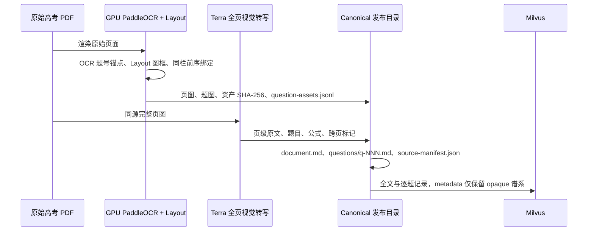
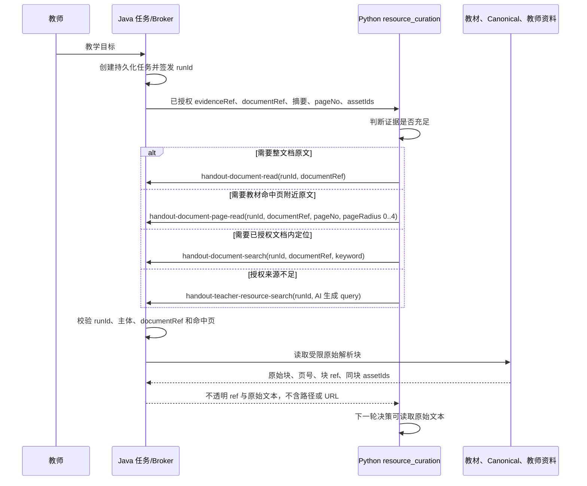

# 高中数学来源、精读与图片调用流程

本文说明高考原卷、教材和教师资料从授权检索到讲义 PDF 的调用边界。它是实施与验收依据，不替代 [讲义架构验收清单](handout-architecture-acceptance-checklist.md)。

## 参与方

| 组件 | 责任 | 不允许做的事 |
| --- | --- | --- |
| Java 任务服务与 MCP Broker | 创建并持久化任务，签发 runId，校验主体和运行授权，执行向量检索，返回受限原文块，校验 assetId，物化已选择图片 | 使用用户输入直接检索；写教学正文；替 AI 选择图片；向 AI 暴露文件路径、URL、真实文档 ID、数据库信息或 shell |
| Python Handout Runtime | `resource_curation` 自主判断资料是否足够，选择受限工具调用；Plan/Writer 产生全部可见教学内容和 `assetPlacements` | 访问本机文件系统、路径、URL、Base64；调用未签发的 documentRef；自行扩大教材页面范围 |
| GPU 资产阶段 | 用 PaddleOCR 题号锚点与 PP-DocLayout-L 的 `chart/image` 框定位真实页图和题图 | 把 OCR 当作权威题干；CPU 推理；从文本或公式框生成假图 |
| Terra 页级视觉转写 | 对同源完整页面转录 `pageText`、题目文本、LaTex、题号和跨页风险 | 生成答案、未显示正文或题图；将题图裁剪图替代完整页输入 |
| Milvus | 保存全文和逐题向量记录及不透明来源谱系 | 保存路径、URL、Base64 或临时发布字段 |
| PDF 组件 | 只排版 AI Writer 正文以及 Java 验证、物化后的图片组 | 从 Markdown 图片语法、相邻证据、同页资产或“第一张图”猜选图片；显示缺图占位 |

## 高考原卷发布与入库

输入仅来自配置白名单的原始 PDF。2024 配置的 `selectedFileNames` 是唯一允许读取的文件集合，单卷题数从实际 Terra 转写结果得出，不写死为 19 或 22。



实际顺序固定：先运行 `scripts/wsl/extract_math_paper_assets.py`，确认 GPU 成功产生 `asset-report.json`、`question-assets.jsonl`、页图和题图；再运行 `scripts/wsl/run_2024_luna_milvus_ingestion.py --vision-provider terra`。脚本名保留历史名称，但 canonical 发布只接受 Terra，Luna 不能发布 canonical 原文。

每卷 canonical 目录使用完整原文件名：

```text
output/math-paper-corpus/<完整原文件名>.pdf/
  source-manifest.json
  document.md
  questions/q-NNN.md
  page-images/page-NNN.png
  figures/q-NNN-NN.png
```

`source-manifest.json` 保存原文件名、源 PDF SHA-256、真实题目数和页数。发布或检索任一步发现 SHA-256、文件名、题图哈希、页数或 Terra 页级文本不完整，整卷失败，不生成假 Markdown。

## Collector 深读授权



教材 `document_page_read` 的 `pageNo` 必须严格等于当前 evidence 的召回页。`pageRadius` 可为 0 到 4，意味着命中页加前后各四页；它不是任意翻书能力。Java 重新校验此规则，Python 不能绕过。

Canonical 高考证据只有当 Java 能通过 `source-manifest.json`、原文件名与 UUIDv5 `documentRef` 验证对应已发布目录时才获得 `documentRef`。旧 Milvus 行、空目录、缺失 `document.md` 或哈希不符都不可精读。

## 图片选择与 PDF

Broker 给每条 evidence 返回该块已绑定的 `assetIds` 数组。Python Plan 是唯一选图方，对每个选中的组输出：

```json
{
  "questionNumber": 1,
  "assetIds": ["opaque-asset-id"],
  "anchor": "question",
  "layout": "single",
  "variants": ["teacher_writer", "student_writer", "lecture_writer"],
  "caption": "AI 编写的可见说明"
}
```

约束如下：

- assetId 必须属于该题 `evidenceRefs` 对应 evidence 的 `assetIds`，不能从相邻块、同页或其他题借用。
- `figureRequired=true` 时必须有合法 `assetPlacements`；否则 Plan 被拒绝并由 AI 修复题目或选择合法图。
- 三个 Writer 只能沿用 Plan 已批准且包含自身 stage 的 placement，不能替换、补充或删除图片。
- Java 在当前 task、主体、题号和变体均授权后才调用受控资产服务物化本地渲染副本。
- PDF 只接受 Java 在物化成功后的内部图片 token。模型 Markdown 内的 URL、路径、Base64、HTML 图片、`\\includegraphics` 和通用 marker 都会被拒绝。无效、失效或无法解码的图直接省略，不显示占位框。
- 学生版仅渲染 `variants` 明确包含 `student_writer` 的图；教师答案、批注、推理和未选资产不进入学生版。

## 运行记录与验收

每个真实验收必须记录 runId、完整来源文件名、PDF SHA-256、GPU 资产报告、Terra 完整请求/响应私有诊断、Milvus 实际召回、collector 的两轮模型可见原文、以及最终 PDF 的页面截图与文本检查。

公开事件只保留节点、状态、次数、耗时和结果计数。完整模型 prompt、模型输出、工具请求/响应与原始内容仅保存在 MySQL 私有诊断中，供受权运维人员核验。
