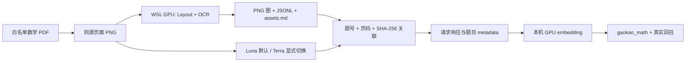

# 数学 PDF 题目划分、图形资产与视觉入库改造方案

## 目标与范围

本方案把 `PDF → 页面 → 题目 → 图形 → Markdown/文本 → 向量题库` 固化为同一条可审计生产链路，服务两类来源：

- 高考数学真题：`C:\Users\doob\Desktop\个人资料\高考真题\数学高考真题试卷【点进去分开保存，链接长期在】\【新·PDF版】2008-2024·高考数学真题\版本3：数学（按年份分类）2008-2024`；
- 高三模拟数学卷：`D:\BaiduNetdiskDownload\高中试卷\辽宁省名校联盟2026 05\数学2026年辽宁高三5月初联考.pdf`。

离线批量配置中的 `subject` 必须为 `MATHEMATICS`，并可使用 `selectedFileNames` 作为运营批次白名单。该白名单只约束管理员发起的目录扫描：物理卷、答案卷和目录外文件不会被该批次扫描或处理。它不是线上用户上传策略；原件只读，所有派生产物只写入本项目 `output/`。

## 线上上传与 MCP 生产流

教师或管理员可以在前端选择任意 PDF、Markdown、图片、文件夹或 ZIP；后端把文件保存到“租户/角色/用户/UUID”隔离目录，再复用同一份 source-sync、解析、图资产、向量与审计链路。上传入口绝不接受浏览器传入的本机路径，也不按文件名白名单拒绝用户资料。文件类型是否能被解析由既有解析器报告为可审计状态，而不是静默丢弃。

发布时，公开注册仍只产生 student，防止任意用户自行提升角色。平台管理员在前端“系统设置 → 开通教师账号”填写用户名和初始密码，页面仅对 admin 会话显示；它调用 `POST /api/auth/teachers`，角色和 tenant 都由管理员会话决定，前端不传递这两个字段。响应不含密码哈希或新教师 token，成功后清空浏览器中的初始密码且不切换管理员会话。教师登录后即可走下面的任意文件上传流程。离线 `selectedFileNames` 仅是运营批处理目录的数学卷选择器，不能作为线上上传白名单，也不会被上传接口读取。

上传属于浏览器会话下的 REST 操作，不属于 MCP：MCP 客户端既不能提供任意本地路径，也不能把二进制 PDF 写入服务端。正确的边界如下：

1. 浏览器会话调用资源接口，后端依据登录用户、租户、角色和资源所有权完成校验，并按用户主体限流；
2. 浏览器上传文件到 `POST /api/teacher/resources/upload`；后端重新计算“来源类型、标题、权限域、解析模式、相对文件名、MIME、大小、文件 SHA-256”的稳定清单，只有与令牌一致才消费令牌；
3. 同一会话用独立令牌创建、执行 source-sync job；解析后的块、图资产和索引仍按原有租户/所有者过滤；
4. 用户创建的 MCP key 由数据库保存 `tenantId + ownerUserId`。MCP 仅用 Bearer key 映射成可信后端主体，提供 `list_teacher_resources`、`read_teacher_resource_blocks`、`search_teacher_resource_evidence` 与生成工具；它不会返回存储路径或原始用户凭据。

前端与 Java 后端共享 `teacher-resource-upload-v1` 清单格式。它刻意不使用 multipart boundary（浏览器每次会变），同时将上传文件内容绑定到能力令牌，避免把对“无害文件”的令牌重放到另一份 PDF。

### 本机真实验收

在 Docker/WSL 服务健康后，以 Windows 本机 HTTP 访问执行以下命令。脚本从传入的真实数学 PDF 构造清单，不写源文件目录，只向 `output/mcp-acceptance/` 写脱敏证据：

```powershell
$pdf = Get-ChildItem -LiteralPath 'D:\BaiduNetdiskDownload\高中试卷\辽宁省名校联盟2026 05' -File -Filter '*.pdf' |
  Where-Object { $_.Name -like '数学*' -and $_.Name -notlike '*答案*' } | Select-Object -First 1
.\scripts\local\run-real-mcp-math-pdf-acceptance.ps1 -PdfPath $pdf.FullName -ParseMode TEXT
```

验收脚本真实执行管理员登录、能力申请、PDF 上传、同步任务、MCP key 创建、JSON-RPC `initialize`、`tools/list`、资源列表/块读取/检索调用，并核对 key 所有者、`lastUsedAt` 和搜索审计主体。它不会直接调用模型 provider；如需 Terra 讲义生成，应在这三项资源读取通过后使用 MCP 的 `start_multi_agent_writing`，并按现有讲义 PDF 渲染标准另行审计。

### 多题讲义输入

讲义工具的批量输入首选显式 `questions: string[]`，例如把从 `question-assets.jsonl` 选择的两道题分别放入数组。为避免数学公式、区间和分步证明中的空格被误判，空格与普通空行永远不切题。兼容旧 `questionText` 时，只有独占一行的 `---`、`###`、`<<<QUESTION>>>`，以及行首“第 N 题/题目 N/Question N”才是确定性分隔标记。服务端会给每题附加稳定的 `【题目 N】` 标签，供 Terra 在同一 MCP workflow 内分别组织讲义、trace 和 PDF 版面。

真实 Terra 讲义验收由 `scripts/local/run-real-mcp-terra-handout-acceptance.ps1` 执行：它只通过 `/api/mcp` 启动、轮询、读取 trace/artifact 和导出 `pdf-teacher`，再在 Windows 使用 Poppler 渲染全部页面并核对 SHA-256。完整通过证据与实际 workflow/provider/model 见 `docs/mcp-math-pdf-production-acceptance.md`。

### 上线安全门禁

题库资产与线上教师资料共用解析和检索实现，但不能共用授权假设。最终上线必须同时满足下列门禁：

1. 离线批次仅扫描 `subject=MATHEMATICS` 和其 `selectedFileNames`；辽宁目录中的物理卷、答案卷不进入 PDF→资产→Milvus 链路。
2. 线上教师上传不检查离线白名单，但 capability 必须绑定服务端重算的 `teacher-resource-upload-v1` 文件清单；任何文件内容、MIME、相对文件名、大小或解析参数变化都会使令牌失效。
3. 非管理员上传默认且强制为 `TEACHER_PRIVATE`；共享范围只能由管理员明确发布。资源块、图片和 MCP evidence 都必须以后端 key/session 所绑定的 tenant、role、owner 做可见性校验。
4. 图片块的 `imageRefs` 只使用带 `assetId` 的对象 JSON，由资产服务生成可授权读取的 URI；题图的源 PDF SHA-256 和裁图 SHA-256 仍是视觉入库的独立完整性门禁。
5. 讲义多题输入以 `questions[]` 为准；旧 `questionText` 只接受已定义的独占行分隔符。空格和普通空行不切题，避免把公式或证明过程错误分离。

2026-08-02 的复验已覆盖目录外 `2008年高考数学试卷（文）（全国卷Ⅰ）（空白卷）.pdf` 的真实教师上传、同步、MCP 读取/检索和跨教师拒绝；它不在两份离线白名单中。相同环境还以纯 MCP 跑通两题 Terra workflow 和 Windows PDF 渲染。实际 runId、SHA-256、审计主体和临时 key 撤销结果记录在 `docs/mcp-math-pdf-production-acceptance.md`。

## 已调研能力与采用结论

调研目录 `C:\Users\doob\Desktop\个人资料\项目收集和调研\调研如何进行题目划分和获取几何图` 提供了两类有效能力：

| 调研产物 | 可复用价值 | 生产接入决策 |
|---|---|---|
| `question_figure_extractor` | PP-DocLayout-L 检测 `chart/image`、PP-OCR 识别题号、同栏前序绑定、前页续题绑定、图裁剪 manifest | 逻辑内聚到 `scripts/wsl/extract_math_paper_assets.py`，保留 GPU、本地模型、页图坐标和可审计绑定规则。 |
| `gaokao_markdown` | 将正文、图片和 Markdown 组织在一起，并校验公式/输出 | 不直接复用其独立 API/缓存；生产以 Terra/Luna 的页级 JSON 为题干权威来源，生成的 `assets.md` 仅是题图索引，避免将 OCR 当成题干真相。 |
| 调研中的跨页方案 | 同页、题/图分页、图跨页、选项跨页四类规则 | 当前实现已覆盖“页顶图绑定到前页同栏最后题”。题图跨两页和选项跨页在资产契约中显式建模，作为上线前的增强验收项，不允许悄然拼接或误绑。 |

不直接复制调研项目的运行时、虚拟环境、缓存、实验结果或外部输出。生产脚本读取项目配置和已安装的 WSL GPU 模型目录，因此不存在双份依赖、双份证据或跨项目写入。

## 统一资产契约

每份输入 PDF 先经过本地 GPU 资产阶段，产物位于 `output/math-paper-assets/<批次>/<试卷名>/`：

| 文件 | 内容与用途 |
|---|---|
| `page-images/page-XXX.png` | 同一张源页渲染图；版面检测、OCR、图裁剪、Terra/Luna 视觉识别和人工复核均可追溯到它。 |
| `figures/qNNN_pNNN_fNN.png` | 仅 `chart/image` 检测框对应的原始比例 PNG；文本/公式框不能作为图导出。 |
| `question-assets.jsonl` | 每图一行，包含题号、页码、源 PDF SHA-256、原图相对路径、检测/裁剪 bbox、置信度、绑定规则、资产相对路径与裁图 SHA-256。视觉入库会重新校验这两个哈希，拒绝篡改或跨试卷复制的图。 |
| `ocr-pages.json` | 本地 OCR 原始文字/框，仅用于题号锚点、布局复核和人工排错，不用于替代视觉题干。 |
| `assets.md` | 按题号组织的 Markdown 图片引用，供讲义/资料资产消费。 |
| `asset-report.json` | 输入 PDF SHA-256、页数、题号锚点数、候选图数、成功绑定图数和配置参数。 |

视觉转写阶段按完整页向 Terra 或 Luna 请求 JSON，绝不把单题裁图作为替代输入。它从 `question-assets.jsonl` 读取同源 SHA-256 已验证的图资产，并将其写入每道题的 `metadata.questionAssets`。因此题干、图片、页码、坐标和检索向量共用同一题目身份；任一源 PDF、图或 provider/model 不一致都会使恢复或入库失败。



## 坐标、绑定与跨页规则

所有版面检测与 OCR 坐标均来自同一个 `renderDpi` 页 PNG，裁剪使用该像素坐标并保留原图比例。PDF point、任意 OCR 内部坐标和栅格像素不混用。绑定规则按确定性优先级执行：

1. 同页同栏、图中心之前最近的题号锚点；
2. 若页面顶部没有该栏前序题号，则只允许绑定前一页同栏最后题号，并标记 `previous_page_same_column_question_anchor`；
3. 无法满足上述证据时不导出该图，不猜测归属；
4. 图跨页时，两个图块各自保存并使用同一 `questionNumber`、`crossPageGroupId` 和 `partIndex`；只有人工审查确认连续图后才允许为讲义制作拼接派生图；
5. 选择题选项跨页时输出 `option=A|B|C|D` 的独立资产，不把选项图拼入题干图。

当前代码已落实前两项。第 4、5 项需要在高考与模拟卷的真实样本中收集金标并完成实现后，才可提升为自动发布路径；在此之前属于审阅队列，不作自动裁图成功声明。

## Provider 与运行时策略

`scripts/wsl/run_2024_luna_milvus_ingestion.py` 已改为 provider 中立的批量入口：

- 默认 `--vision-provider luna`，模型为 `gpt-5.6-luna`；Terra 仅作为显式兼容选项；
- 需要比对或 Luna 恢复后使用 `--vision-provider luna`，模型为 `gpt-5.6-luna`；
- `--vision-model` 仅允许显式覆盖模型名；证据中同时记录 `provider`、`model`、请求、响应、图片 SHA-256、HTTP 状态、耗时和 token usage；
- 恢复时 provider/model 必须与页面证据完全一致，禁止把 Terra 与 Luna 输出混合；
- 本地 PP-DocLayout-L、PP-OCRv5、BGE 均要求 GPU；脚本实际计算 CUDA tensor，Paddle CUDA 或 `gpu:0` 不可用立即失败，禁止 CPU 回退。

视觉 provider 只转写完整页，不能决定图片归属；图形资产由本地 GPU 版面阶段决定，避免模型对裁剪图重复消耗 token 或在裁剪图中丢失题号上下文。

## 运行顺序

先运行资产阶段，再运行视觉入库。运行前从现有环境读取 `OPENAI_API_KEY`、`OPENAI_BASE_URL`、`MATH_AGENT_VISION_BRIDGE_CONTAINER`（或现有兼容名 `MATH_AGENT_LUNA_BRIDGE_CONTAINER`）及本机模型路径；密钥不得写入命令行、配置、日志或证据。

### 模拟数学卷验证

```powershell
$env:WSLENV = "OPENAI_API_KEY:OPENAI_BASE_URL:MATH_AGENT_VISION_BRIDGE_CONTAINER:MATH_AGENT_LUNA_BRIDGE_CONTAINER:MATH_AGENT_WORKER_API_KEY"
wsl.exe -d Ubuntu -- bash -lc 'cd /mnt/c/Users/doob/Desktop/code/dev/math_agent_rag && python3 scripts/wsl/extract_math_paper_assets.py --config config/math-paper-ingestion-liaoning-2026-05.json'
wsl.exe -d Ubuntu -- bash -lc 'cd /mnt/c/Users/doob/Desktop/code/dev/math_agent_rag && python3 scripts/wsl/run_2024_luna_milvus_ingestion.py --config config/math-paper-ingestion-liaoning-2026-05.json --vision-provider terra'
```

若视觉页级请求已留下完整证据、但部署中的 provider bridge 已更换，可使用同一 `runId` 仅终结入库。该路径不重新请求模型，但会重新校验配置 SHA-256、源 PDF SHA-256、原始/压缩页图 SHA-256、每张题图的源/资产 SHA-256，再真实调用本机 embedding 与 Milvus 回召：

```powershell
wsl.exe -d Ubuntu -- bash -lc 'cd /mnt/c/Users/doob/Desktop/code/dev/math_agent_rag && python3 scripts/wsl/run_2024_luna_milvus_ingestion.py --config config/math-paper-ingestion-liaoning-2026-05.json --vision-provider terra --finalize-run-id <run-id>'
```

### 已完成的辽宁模拟卷验收（2026-08-02）

已使用 `数学2026年辽宁高三5月初联考.pdf` 完成真实资产与终结入库验收；物理卷和答案卷未被读取。源 SHA-256 为 `0a1d79c2167e4c1b5ec38ff10702dc5c63d62a793ea73e5cc10ef4a806cce4e8`。

- WSL RTX 5060 的 PP-DocLayout-L 与 PP-OCR 处理 2 页，识别 22 个题号锚点、2 个图候选并成功绑定第 14、19 题；资产报告在 `output/math-paper-assets/liaoning-2026-05/数学2026年辽宁高三5月初联考/asset-report.json`。
- Terra 的同源页级证据包含 2 次真实调用、19 道题、`15,841` tokens；重新校验后的终结入库写入 `gaokao_math`，并以确定性题目 ID 取得 10 条真实 Milvus 召回命中。报告在 `output/math-paper-evidence/liaoning-2026-05/terra-simulation-20260802T063445Z-d768a1b9-report.json`。
- `scripts/wsl/test_math_paper_ingestion_contract.py` 覆盖题图源/资产哈希、跨页图发布拒绝、metadata 关联和 Milvus v2 检索信封；不得以旧版无哈希清单做恢复或发布。

### 2024 高考数学卷

现有 `config/gaokao-ingestion-2024.json` 已包含同一 GPU 资产参数与六份数学 PDF 白名单，先执行：

```powershell
$env:WSLENV = "OPENAI_API_KEY:OPENAI_BASE_URL:MATH_AGENT_VISION_BRIDGE_CONTAINER:MATH_AGENT_LUNA_BRIDGE_CONTAINER:MATH_AGENT_WORKER_API_KEY"
wsl.exe -d Ubuntu -- bash -lc 'cd /mnt/c/Users/doob/Desktop/code/dev/math_agent_rag && python3 scripts/wsl/extract_math_paper_assets.py --config config/gaokao-ingestion-2024.json'
wsl.exe -d Ubuntu -- bash -lc 'cd /mnt/c/Users/doob/Desktop/code/dev/math_agent_rag && python3 scripts/wsl/run_2024_luna_milvus_ingestion.py --config config/gaokao-ingestion-2024.json --vision-provider terra'
```

高考仍写入统一 `gaokao_math` collection，不按 provider、年份或试卷新建 collection。Luna 恢复后可将相同来源在独立 evidence run 中对照，不覆盖 Terra 证据。

## 分期实施与验收

| 阶段 | 实施项 | 通过证据 |
|---|---|---|
| A：资产阶段 | 配置白名单、GPU 页图/布局/OCR、图裁剪、JSONL/Markdown、SHA-256 报告 | `asset-report.json`、`question-assets.jsonl`、每图可读 PNG，且源 hash 一致。 |
| B：视觉接入 | Luna 默认、Terra 可切换、全页 JSON、题图 metadata 关联 | 每页请求响应证据有 provider/model，`metadata.questionAssets` 路径和哈希均可读。 |
| C：题库 | GPU embedding、Milvus upsert、真实查询回召 | report 中首题的 deterministic ID 出现在 Milvus search 结果。 |
| D：发布 | 从 JSONL 生成带图 Markdown/PDF，执行现有公式、图片尺寸、跨页和版式审计 | Windows 渲染全部 PDF 页，图不拉伸、不与文本重叠，连续题与图片不跨页分离。 |
| E：跨页增强 | 实现并验证跨页图/选项图的 group/part 模型 | 真实金标样本、审阅队列、单元测试及人工视觉复核全部通过。 |

## 发布审计（2026-08-02）

本次审计以代码、MySQL 迁移、真实辽宁数学卷资产、真实 Terra/MCP 工作流和 Windows PDF 渲染产物为依据；外部调研目录与原始试卷均只读。下表是当前可发布能力与尚未自动化能力的明确边界，避免把计划项误报为已经上线。

| 审计项 | 当前结论 | 依据 |
|---|---|---|
| 离线数学范围 | 通过 | `extract_math_paper_assets.py` 与入库脚本均要求 `subject=MATHEMATICS`，且只遍历配置的 `selectedFileNames`；辽宁物理卷、答案卷未被读取。 |
| 教师任意上传 | 通过 | `POST /api/teacher/resources/upload` 不读取离线白名单；服务端从收到的 multipart 内容重算 `teacher-resource-upload-v1` 清单哈希，再消费 capability。 |
| 图文资产 | 通过 | 辽宁数学卷产出 2 页、22 个题号锚点、2 个候选图并绑定第 14、19 题；每张图同时具有源 PDF 与裁图 SHA-256，且生成 `assets.md`。 |
| 视觉题干与题图关联 | 通过 | Terra 对完整页进行 2 次真实转写，得到 19 道题；终结入库在 `gaokao_math` 完成真实 GPU embedding 和 10 条 Milvus 回召，并将同源图资产写入 `metadata.questionAssets`。 |
| MCP 资源权限和审计 | 通过 | 持久化 MCP key 绑定 tenant、owner user、owner role；实际 Bearer 调用更新 `lastUsedAt`。检索审计持久化 query 主体和命中，跨教师读取私有资源被拒绝。 |
| 多题讲义切分 | 通过 | `questions[]` 优先；兼容文本只接受独占行分隔符或题号标题。公式空格、普通空行不分题，MCP 返回 `whitespaceSplitsQuestions=false`。 |
| 带图讲义 PDF | 通过 | Terra 四阶段工作流均完成；PDF 仅嵌入 owner 可见 PNG/JPEG，隔离 XeLaTeX 工作目录不暴露 URI 或存储路径。最终复验 13 页均由 Windows Poppler 渲染成功。 |
| 图跨页和选项跨页 | 不进入自动发布 | 当前资产契约拒绝 `cross_page` 自动发布；必须先收集真实金标、实现 review record 与 group/part/option 模型，再完成单测和人工视觉复核。 |

可复核产物：辽宁资产报告为 `output/math-paper-assets/liaoning-2026-05/数学2026年辽宁高三5月初联考/asset-report.json`，真实视觉/入库报告为 `output/math-paper-evidence/liaoning-2026-05/terra-simulation-20260802T063445Z-d768a1b9-report.json`，MCP、讲义和 PDF 的脱敏验收记录为 `docs/mcp-math-pdf-production-acceptance.md`。本轮契约测试命令 `python -m pytest -q scripts/wsl/test_math_paper_ingestion_contract.py` 已真实通过（4 passed）；它验证题图双哈希、跨页拒绝、题目 metadata 关联及 Milvus v2 响应兼容性。

任何一环失败都保留证据并以失败结束，不将 OCR、模型输出或生成 PDF 当作人工正确性结论。系统不扫描非数学卷、不改 DNS/IP、不写源目录，也不在 CPU 上运行模型。
