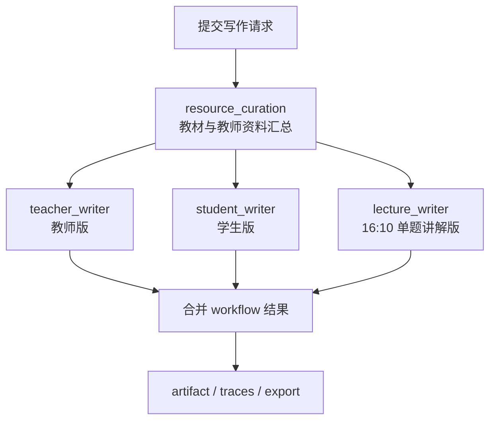

# 多智能体讲义工作流与图片编排

本文记录当前仓库中真实存在的两条讲义链路，以及图片从资料库到模型和 PDF 的完整路径。文中“当前执行”只指代码已经进入生产调度路径的阶段；“契约阶段”指提示词注册表中已经定义、但当前多 Agent 写作拓扑尚未调度的角色，不能混写。

## 1. 当前结论

### 1.1 多 Agent 写作 workflow

独立多 Agent 写作接口当前实际执行的拓扑是：



- `resource_curation` 是第一道持久化屏障，使用 `TeacherAssistantAgent`，通过公开教材和已授权教师资料检索，输出有限长度的来源片段、章节、资料名称和授权图片引用。
- `teacher_writer`、`student_writer`、`lecture_writer` 共享同一个资料屏障，彼此独立并行，最大并行分支数为 3。三者分别生成教师版、学生版和 16:10 讲解版，不互相覆盖正文。
- 当前实际拓扑在 `MultiAgentWritingService.WRITING_STAGE_GROUPS` 中声明。阶段状态、trace、provider、模型、阶段耗时和真实 token usage 持久化到 workflow/trace 记录中。
- 当前 workflow 的后续合并由 `MultiAgentWritingService` 负责，生成内容可通过 artifact 接口读取，再按 `markdown`、`latex`、`pdf`、`pdf-teacher`、`pdf-student`、`pdf-lecture` 或 `zip` 导出；`teacher-pdf`、`student-pdf`、`lecture-pdf` 和 `pdf-16-10` 是对应的兼容别名。

### 1.2 教学任务 DAG

讲义页面使用的教学任务不是上面独立 workflow 的同一个状态机。它是面向题目讲解的可恢复 DAG：

1. 学习目标识别。
2. 历史资源复用检查。
3. 公开教材、题库、教师资料三路并行检索。
4. 讲解大纲与知识点包整理。
5. 讲义结构确定。
6. AI 草稿生成和结构化解析。
7. 教师版、学生版、16:10 版 LaTeX 排版。
8. 人工反馈与后续追问。

题库中的每道原子题还会形成独立的题目 Agent 节点和耗时记录；这类节点用于题目级证据、图片和解题步骤的隔离，不等于独立写作 workflow 中的三个版本 writer。

### 1.3 目前没有调度的契约阶段

`MultiAgentHandoutPromptProfiles` 已经定义了 `template_selection`、`outline_planning`、`source_review`、`student_safety_review`、`layout_review`、`merge_coordinator` 的提示词契约。这些内容用于约束未来扩展和兼容已有产物，但它们不在当前 `WRITING_STAGE_GROUPS` 的实际执行列表中。当前实现不能对用户声称这些角色已经逐个调用。

### 1.4 `resource_curation` 的真实功能

`resource_curation` 由 `MultiAgentWritingService.writingEvidenceContext` 调用 `TeacherResourceBlockSearchService` 完成；它是一个检索和证据整理阶段，不负责写最终讲义。它实际做以下工作：

1. 使用后端解析出的租户、角色、主体 id 做权限校验，规范化 query、limit 和资料库过滤条件。
2. 通过知识图谱对齐和 focused query 提取主题词、题型词和视觉线索；空 query 直接返回空结果并记录审计。
3. 对可见教师资料做两阶段检索：先按文档级向量粗召回候选文档，再在候选文档内按 `document_block` 做精排、标题补召回、去重和跨来源配额控制。
4. 允许教材专用检索走独立的教材文本/页图检索器；混合检索时会去掉历史教材派生行，避免旧副本和真实教材结果互相污染。
5. 给每个文本块挂接同文档、同页或同题的已授权图片 asset，并在返回前再次做主体可见性检查。
6. 记录 endpoint、检索策略、命中来源、命中数和耗时审计；失败不会伪造证据，模型只会收到空的证据上下文并由后续校验决定是否允许发布。
7. 在进入 writer 前由 `WritingEvidenceContextFormatter` 做二次压缩：每个来源最多保留约 1200 个字符、每个命中最多 2 个授权图片、每个库最多 4 个命中，且保留人类可读标题、文档/块标识和正文片段。

因此，`resource_curation` 的产物是“可追溯证据包”，不是一段散文，也不是把整本教材或整份 PDF 直接塞进模型上下文。

## 2. 端到端执行顺序

### 2.1 独立多 Agent 写作

| 顺序 | 阶段 | 实际职责 | 输入 | 输出 |
| --- | --- | --- | --- | --- |
| 1 | `resource_curation` | 检索并压缩教材、题库、教师/飞书资料；保留可读来源和授权 asset 引用 | 题目、学习目标、主体权限 | 来源上下文、证据引用、图片 URI |
| 2A | `teacher_writer` | 写带答案、步骤、评分点和来源的教师版 | 阶段 1 资料 | `teacherExplanation` / 教师版内容 |
| 2B | `student_writer` | 写不含最终答案和教师批注的学生空白版 | 阶段 1 资料 | `studentWorksheet` |
| 2C | `lecture_writer` | 写单题、16:10、课堂投屏版，不泄露完整答案 | 阶段 1 资料 | `lectureCards` |
| 3 | artifact merge/export | 只合并已完成分支，保留三个版本边界 | 阶段 2A–2C | workflow artifact、LaTeX、PDF、ZIP |

每个阶段先经过 `AgentRunPlanService` 的权限、工具、数据范围、模型路由和 token 预算检查，再由 `AgentRunExecutionService` 调用真实 provider。`MultiAgentWritingService` 给每个阶段使用 `workflowId:stageCode` 作为可恢复 trace 标识；失败时只重试未完成阶段，已完成的兄弟分支不重复调用。

常用接口是：

- `POST /api/agents/writing/courseware/async`：立即创建可恢复 workflow。
- `GET /api/agents/writing/{workflowId}`：读取状态和已完成阶段。
- `GET /api/agents/writing/{workflowId}/traces`：读取按阶段排序的 trace 和真实 usage 汇总。
- `GET /api/agents/writing/{workflowId}/artifact`：读取三个版本的已合并内容。
- `GET /api/agents/writing/{workflowId}/artifact/export?format=...`：生成下载载荷。

### 2.2 教学任务 DAG

教学任务提交后先写入 `CREATED` 快照，由 RabbitMQ lecture worker 获取任务并推进 `RUNNING`、`WAITING_REVIEW`、`COMPLETED` 或 `FAILED`。前端通过任务状态和事件接口恢复进度，不把一次长 HTTP 请求当作整个生成过程。

三路资料检索都使用同一主体权限：

- 公开教材：记录教材标题、章节、页码、片段和教材页图。
- 题库：记录题目标题、题干/答案片段、题库来源和页码或原子题标识。
- 教师资料：记录教师资料名称、章节/路径、页码、文档块和授权 asset id。

AI 草稿只接收经过权限过滤、长度限制和来源格式化的上下文。渲染器再根据题目和证据的绑定关系生成三个独立 LaTeX 版本，最后由 Docker 内 XeLaTeX 编译 PDF。

## 3. 图片是否可以编排进讲义

可以，但图片必须是已授权、已物化、且与当前题目证据绑定的图片。系统不会把任意本地路径或用户伪造 URL 直接交给模型或 XeLaTeX。

### 3.1 图片进入 AI 上下文

`TeachingAiDraftService` 对第一条可用授权证据图片执行一次模型上下文准备：

1. 通过权限后的 `imagePath` 打开文件；源文件超过 32 MiB、不是普通文件或无法解码时跳过并记录失败原因。
2. 保持宽高比，最长边压到最多 1536 像素，编码为 PNG；原图不被覆盖。
3. 以 `data:image/png;base64,...` 形式作为本次多模态请求的图片输入。
4. 当前请求使用 `low` detail，代码记录固定的 85 图像 token 预算，同时记录压缩前后尺寸和字节数。
5. 真正的文本/图片请求 token 以 provider 返回的 `promptTokens`、`completionTokens`、`totalTokens` 为准，累计写入 AI draft/agent trace；固定 85 只是图片预算事件，不替代 provider usage。

因此，图片会计入上下文，但不是“把原图字节数当 token”。实际账单和 trace 以 provider 返回的 usage 为准；provider 不返回 usage 时只能显示 0，并必须在验收记录中标明“provider 未提供用量”。

### 3.2 图片进入讲义 PDF

图片进入 PDF 的路径与模型上下文路径分离：


- 教师资料图片通过 `TeacherResourceVisualEvidenceService` 和资产服务物化；数据库有记录但容器文件缺失时，资产服务会从注册的本地源文件和页码恢复图片，并保留原 `assetId`。
- 图题由 `TeachingWorkflowQuestionRenderer` 绑定：题干、授权图片、该题解析从同一个题目单元开始，图片紧跟题干，不会作为上一题的装饰图。
- 教师版、学生版和 16:10 版使用各自的图片尺寸策略；16:10 版只保留单题，并使用投影宽度和最大高度约束图片。
- 历史 Markdown 图片标记会在导出边界转为 `\includegraphics`。图片文件必须位于后端允许的资产根目录；越界、缺失或未授权图片不能作为真实图片导出。
- PDF 由 Docker 内 XeLaTeX 和 CJK 字体真实编译。PDFBox 文本绘制不能替代公式或图片渲染。

### 3.3 当前限制

- AI 草稿阶段当前只把第一条可用授权图片送入模型，避免一个长题目把上下文图片无限放大；讲义渲染阶段仍可按题目证据使用多张已授权图片。
- 不是所有证据都有图片；没有 `imagePath` 的教材或题库证据只能以文本、章节和页码进入讲义。
- “如图”题如果没有同题、可读取、已授权图片，发布校验会拒绝该版本，不会凭空绘图。
- 图片不是通用装饰资源。一个题目的图片不能跨题复用，除非证据绑定明确证明它属于当前题目。

### 3.4 资料如何存储，以及图片和文本如何统一

系统不把图片二进制塞进文本字段，也不把文本和图片粗暴地混成一个向量。统一方式是“同一来源/块/页的关系键 + 两种检索索引 + 一个证据对象”：

| 层 | 存储内容 | 关键字段/索引 |
| --- | --- | --- |
| MySQL 来源层 | 原始文档、来源标题、权限、同步状态 | `source_document`：`id/title/source_type/original_url/local_path/permission_scope` |
| MySQL 文本块层 | 文档块、章节、页码、正文、公式和图片引用 | `document_block`：`source_document_id/block_order/chapter/section/page_no/normalized_text/image_refs/formula_refs` |
| MySQL 图片资产层 | 原图/附件的权限、checksum、尺寸和后端存储位置 | `teacher_resource_asset`：`asset_id/document_id/block_id/source_path/page_no/mime_type/storage_key/status` |
| MySQL 审计层 | 每次 query、命中顺序、分数、策略和耗时 | `retrieval_query_log`、`retrieval_hit_log` |
| Milvus 文本索引 | 教师资料文本块的 BGE 向量 | 默认 `math_agent_teacher_text_blocks_bge`，512 维 |
| Milvus 教材索引 | 公开教材页文本和页图的独立向量 | `math_agent_textbook_pages_bge`（512 维）、`math_agent_textbook_pages_clip`（768 维） |
| Milvus 教师图片索引 | 教师资料页图/图片资产的 CLIP 向量 | `math_agent_teacher_page_assets_clip`，768 维 |
| 文件存储 | 原始同步文件和图片资产二进制 | `/app/data/teacher-source-imports`、`/app/data/teacher-assets`；教材页图在配置的 textbook corpus 下 |

统一证据对象是 `TeachingEvidence`，核心字段如下：

```text
sourceScope       = PUBLIC_TEXTBOOK / QUESTION_BANK / TEACHER_RESOURCE
sourceTitle       = 人类可读教材或教师资料名称
chunkId           = 文档块/题库原子题标识
pageNo            = 页码，没有页码时为 0
snippet           = 可引用正文片段
sourcePath        = 文档内路径或教材路径
sourceDocumentId  = 权限检查用的文档 id
assetIds          = 权限检查用的图片 asset id 列表
imagePath         = 后端权限边界内的渲染路径，不直接暴露给用户
imageDescription  = 已核验的可见图像事实，供模型理解
```

统一过程分为四步：

1. **检索融合**：文本 BGE、教材页图 CLIP、教师图片 CLIP 分别召回；结果通过 `document_id/block_id/page_no/asset_id` 关联，再做去重、重排和跨来源配额。
2. **证据归一化**：`TeacherResourceBlockSearchResponse.Hit` 保留文本、来源标题、页码和 `assetRefs`；`TeachingWorkflowService` 将它转换为 `TeachingEvidence`，文本和图片仍保持同一来源关系。
3. **模型上下文**：writer 收到有界文本片段和授权图片 URI；不会收到数据库密码、任意本地路径或整份原文件。
4. **讲义渲染**：渲染器依据同一 `TeachingEvidence` 的题目绑定选择 `imagePath`，将图片放在对应题干之后，再交给 XeLaTeX。这样检索、模型理解和最终 PDF 使用的是同一个来源关系，而不是模型重新猜图。

这种设计同时满足可追溯性和多模态检索：文本负责章节、题干和公式，图片负责图形/版式事实，MySQL 关系键负责把两者重新合并。

