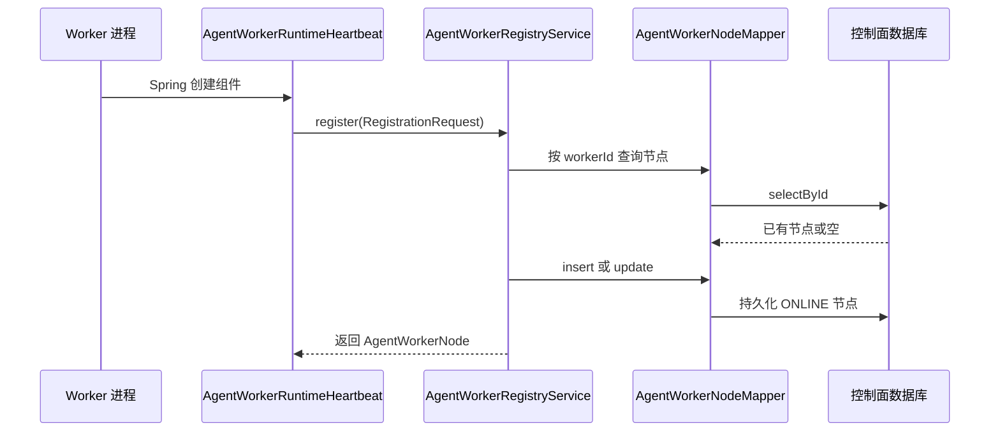

> Worker 节点注册、运行时心跳和存活监控共同维护可用执行节点状态。

# Worker 节点注册与心跳

Worker 节点注册与心跳由 Java 控制面维护。注册信息、运行时负载、任务计数和最近心跳被持久化为独立的节点状态，用于判断哪些执行节点仍具备调度资格。该状态与用户工作流状态分离，Worker 进程即使尚未承载具体工作流，也需要通过注册和心跳证明自身可用。

## 模块职责

- `AgentWorkerNode`：以不可变记录形式表达控制面看到的 Worker 节点快照。
- `AgentWorkerRuntimeHeartbeat`：运行在 Worker 进程中的注册与心跳组件。启动时注册当前进程，并按固定延迟持续发送心跳。
- `AgentWorkerRegistryService`：注册中心服务，负责参数校验、节点持久化、心跳更新、节点查询和过期节点下线。
- `AgentWorkerNodeLivenessMonitor`：控制面侧的存活监控任务，周期性识别超过心跳超时的在线节点并标记为离线。
- `AgentWorkerNodeEntity` 与 `AgentWorkerNodeMapper`：承载节点数据库实体及 MyBatis 持久化入口。
- `AgentWorkerNodeController`：对外暴露 Worker 节点相关控制面接口；具体注册和心跳业务仍由 `AgentWorkerRegistryService` 承担。

## 状态模型

`AgentWorkerNode` 包含以下状态信息：

| 字段 | 含义 |
| --- | --- |
| `workerId` | Worker 的稳定身份，用作持久化主键和后续心跳定位依据 |
| `workerVersion` | Worker 运行版本；注册时缺省为 `unknown` |
| `supportedAgents` | 该 Worker 支持执行的 Agent 标识列表 |
| `maxConcurrency` | 最大并发能力，注册时至少被设为 `1` |
| `currentLoad` | 当前负载，由心跳上报 |
| `status` | 当前状态，源码中使用 `ONLINE` 和 `OFFLINE` |
| `lastHeartbeatAt` | 最近一次注册或心跳时间 |
| `completedTaskCount` | 已完成任务计数 |
| `failedTaskCount` | 已失败任务计数 |
| `lastErrorSummary` | Worker 最近一次错误摘要 |

注册和有效心跳都会将节点状态设为 `ONLINE`，并刷新 `lastHeartbeatAt`。存活监控只处理状态为 `ONLINE` 且心跳时间早于截止时间的节点，将其改为 `OFFLINE`。因此，节点状态表达的是控制面的存活判断，而不是某个具体工作流的执行状态。

## 注册调用链



`AgentWorkerRuntimeHeartbeat` 只有在以下条件同时满足时才启用：

- `math-agent.agent-worker.runtime.enabled=true`
- `math-agent.rabbitmq.listeners-enabled=true`

组件构造时立即执行注册。注册请求从环境配置读取 Worker 身份、版本和最大并发数，并使用 `AgentWorkerRabbitConfiguration.SUPPORTED_AGENT_CODES` 作为支持的 Agent 列表。默认 Worker ID 是 `local-agent-worker`，默认版本是 `0.1.0`，最大并发数默认是 `1`。

注册采用稳定 `workerId` 复用已有记录：

1. 校验 `workerId` 非空，且 `supportedAgents` 非空。
2. 按去除首尾空白后的 `workerId` 查询节点。
3. 节点不存在时创建记录，存在时更新原记录。
4. 将支持的 Agent 列表序列化为 JSON。
5. 将版本、能力和最大并发数写入节点。
6. 将 `currentLoad`、完成数和失败数重置为初始值。
7. 设置状态为 `ONLINE`，并记录当前时间。

因此，重新部署或重新启动同一稳定身份的 Worker 会更新原节点，而不是创建新的节点记录。

## 运行时心跳

注册完成后，运行时组件通过 Spring `@Scheduled` 定时调用：

```text
AgentWorkerRuntimeHeartbeat.heartbeat()
  -> AgentWorkerRegistryService.heartbeat(workerId, heartbeatRequest)
  -> AgentWorkerNodeMapper 查询并更新节点
```

默认心跳间隔为 `15000` 毫秒，可由 `math-agent.agent-worker.runtime.heartbeat-milliseconds` 调整。当前实现发送的心跳请求包含负载、完成数、失败数和错误摘要；已读源码显示运行时默认发送的数值字段为 `0`，错误摘要为 `null`。

注册中心处理心跳时：

- `workerId` 为空会被拒绝；
- 找不到对应注册记录会抛出 `Agent Worker is not registered`；
- `currentLoad`、`completedTaskCount` 和 `failedTaskCount` 使用非负值；
- 更新 `lastErrorSummary`；
- 将状态恢复为 `ONLINE`；
- 刷新 `lastHeartbeatAt`。

由于心跳允许把 `OFFLINE` 节点重新设置为 `ONLINE`，暂时失联后恢复的 Worker 可以使用原有稳定身份重新加入执行节点集合。

## 存活监控与下线

控制面侧的 `AgentWorkerNodeLivenessMonitor` 同样要求 `math-agent.rabbitmq.listeners-enabled=true` 才启用。它以固定延迟周期执行：

```text
AgentWorkerNodeLivenessMonitor.markStaleNodesOffline()
  -> AgentWorkerRegistryService.markOffline(timeout)
  -> 批量更新过期 ONLINE 节点为 OFFLINE
```

默认检查间隔为 `15000` 毫秒，由 `math-agent.agent-worker.liveness-check-milliseconds` 配置；默认心跳超时为 `45000` 毫秒，由 `math-agent.agent-worker.heartbeat-timeout-milliseconds` 配置。

下线条件是：

```text
status == ONLINE
且 lastHeartbeatAt < now - heartbeatTimeout
```

更新条件明确限制为在线节点，因此：

- 已经是 `OFFLINE` 的节点不会被重复处理；
- 节点没有删除，历史状态和统计信息仍可查询；
- 节点恢复后，新的有效心跳可以重新上线；
- 检查周期和超时时间独立配置，实际发现故障的时间还取决于两者的组合。

## 节点查询与调度边界

注册中心的 `nodes()` 返回全部节点，并按 `lastHeartbeatAt` 倒序排列。它返回的是控制面节点快照，包含能力、并发上限、当前负载、累计计数和错误摘要。

源码证据表明，存活监控负责将失联节点移出调度资格；任务派发、RabbitMQ 消费和具体租约恢复属于 Worker 任务链路的其他职责。本页面中的注册与心跳模块只维护“节点是否存在、是否在线以及节点自报运行指标”，不负责具体任务投递或任务执行结果恢复。

## 边界条件

- 注册请求为空、`workerId` 为空白或能力列表为空时直接拒绝。
- `workerVersion` 为空时保存为 `unknown`。
- `maxConcurrency` 小于 `1` 时归一化为 `1`。
- 支持的 Agent 列表无法序列化时，注册失败并包装为参数错误。
- 心跳必须先完成注册，否则不会隐式创建节点。
- 心跳中的负载和计数不会保存为负数。
- 注册同一 `workerId` 会重置当前负载及成功、失败计数；这意味着这些字段更接近当前运行实例的运行统计，而不是跨部署永久累计指标。
- 心跳超时只改变在线状态，不删除节点记录。
- 存活监控和运行时心跳都依赖 RabbitMQ listener 开关；关闭该开关时，相关组件不会参与运行。

## 扩展点

1. **更丰富的注册能力声明**  
   可扩展 `AgentWorkerRegistrationRequest` 和 `supportedAgents` 的内容，例如增加运行时特性、模型能力或资源标签，并同步调整节点实体的序列化方式。

2. **真实运行指标上报**  
   当前运行时心跳构造的请求使用默认数值。可以接入消费者或任务存储中的实时负载、完成数、失败数和错误摘要，使节点快照反映真实执行状态。

3. **更细粒度的状态模型**  
   在 `ONLINE`、`OFFLINE` 之外增加启动中、排空、维护或不可接收新任务等状态，但需要同步修改存活监控和调度资格判断。

4. **并发安全与条件更新**  
   注册和下线目前体现为查询后插入或更新、以及按条件批量更新。多实例控制面部署时，可进一步使用数据库唯一约束、版本字段或条件更新避免并发注册和状态更新产生竞态。

5. **独立的存活策略**  
   当前策略以固定心跳超时为依据。可以在 `markOffline` 周边加入连续丢失次数、节点版本兼容性、主动探测或按 Worker 类型区分的超时策略。

## Sources

Sources: [AgentWorkerNode.java](backend-java/src/main/java/com/doob/mathagent/agent/worker/AgentWorkerNode.java#L1-L11)  
Sources: [AgentWorkerRuntimeHeartbeat.java](backend-java/src/main/java/com/doob/mathagent/agent/worker/AgentWorkerRuntimeHeartbeat.java#L1-L24)  
Sources: [AgentWorkerNodeLivenessMonitor.java](backend-java/src/main/java/com/doob/mathagent/agent/worker/AgentWorkerNodeLivenessMonitor.java#L1-L19)  
Sources: [AgentWorkerRegistryService.java](backend-java/src/main/java/com/doob/mathagent/agent/service/AgentWorkerRegistryService.java#L1-L47)  
Sources: [AgentWorkerNodeController.java](backend-java/src/main/java/com/doob/mathagent/agent/controller/AgentWorkerNodeController.java#L1-L80)
