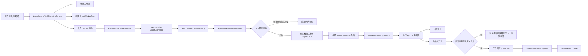

> 任务派发服务发布 Worker 命令，Rabbit 配置和消费者负责接收、执行及处理 Python 阶段任务。

# RabbitMQ 任务派发与消费

任务派发链路由 Java 控制面负责持久化任务、写入 Outbox 并发布 RabbitMQ 命令，Worker 消费者负责领取任务租约、执行 Python 手册阶段，并将成功或失败状态写回持久化存储。RabbitMQ 消息本身只携带 `taskId`，任务请求内容保存在数据库中。



## 模块职责

### `AgentWorkerTaskDispatchService`

`AgentWorkerTaskDispatchService` 是 Worker 派发状态的事务边界：

- `submit` 在一个数据库事务中保存工作流、创建任务并写入首个 Outbox 事件。
- `submitRecovery` 用于已完成工作流的显式恢复，将工作流重新排队后创建新的 Worker 任务。
- `handleFailure` 根据最大尝试次数决定重新排队还是进入终态失败。
- `requeueExpiredLeases` 回收已过期租约，并为重新获得派发资格的任务写入事件。
- `reconcileOrphanQueued` 修复已经排队但缺少当前派发版本事件的任务。
- `recoverExpiredPublishing` 恢复进程崩溃后停留在 `PUBLISHING` 的 Outbox 事件。

派发服务将任务状态和消息事件放在同一事务中处理，使数据库中的任务记录与待发布事件保持一致。发布动作由后续 Outbox 发布链路完成，而不是在工作流提交事务中直接依赖 RabbitMQ。

任务失败达到最大次数后，服务会读取对应工作流并将其状态设置为 `FAILED`，错误摘要最多保留 300 个字符，并去除换行，形成面向工作流和运维侧的安全错误信息。

### `AgentWorkerRabbitConfiguration`

RabbitMQ 拓扑使用持久化 Direct Exchange：

| 元素 | 值 |
|---|---|
| Exchange | `agent.worker` |
| 主队列 | `agent.worker.courseware.q` |
| 死信队列 | `agent.worker.courseware.dlq` |
| 默认路由键 | `CoursewareAgent` |
| Python 手册 Agent | `PythonHandoutAgent` |
| Python 手册阶段 | `python_handout` |

主队列绑定了多个 Agent 角色路由键，包括：

- `CoursewareAgent`
- `TeacherAssistantAgent`
- `HandoutFormatterAgent`
- `QualityCheckAgent`
- `PythonHandoutAgent`

当前 Worker 镜像支持这些写作角色，因此它们共享同一个队列。配置同时保留了按角色拆分队列的扩展方向：未来不同 Worker 可以绑定自己的队列。

主队列配置了死信交换机和死信路由键 `CoursewareAgent.dead`，死信队列通过该路由键接收终态拒绝的任务。

RabbitTemplate 使用：

- 相关发布确认 `CORRELATED`
- Publisher Return
- `mandatory=true`
- Jackson JSON 消息转换

因此发布方会同时检查 Broker ACK 和路由结果。消息未被绑定队列接收时，即使 Broker 接收成功，也会因为 returned message 被视为发布失败。

## 发布调用链

一次正常提交的调用链为：

```text
工作流提交
  -> AgentWorkerTaskDispatchService.submit
     -> workflowStore.save
     -> taskStore.create
     -> outboxStore.enqueue
        -> Outbox 发布器调用 AgentWorkerTaskPublisher.publish
           -> RabbitTemplate.convertAndSend
              exchange = agent.worker
              routingKey = event.agentCode()
              body = AgentWorkerTaskCommand(taskId)
```

`AgentWorkerTaskPublisher` 不把完整请求体发送到 RabbitMQ，而是只发送：

```java
new AgentWorkerTaskCommand(event.taskId())
```

发布方等待最多 10 秒的相关确认：

- ACK 缺失或 NACK：抛出异常。
- 等待超时：抛出异常。
- Publisher Return 表示路由失败：抛出异常。
- 线程中断：恢复中断标志后抛出异常。

这使 Outbox 事件只有在 RabbitMQ 确认接收且成功路由后，才具备可完成发布的条件。

## 消费与 Python 阶段执行

`AgentWorkerTaskConsumer` 只有在配置项：

```text
math-agent.agent-worker.runtime.enabled=true
```

时才会注册为 Spring 组件。

Rabbit Listener 使用专用的 `agentWorkerRabbitListenerFactory`，监听 `agent.worker.courseware.q`。消费者工厂的关键行为包括：

- `prefetchCount=1`，每个消费者一次只预取一个任务。
- 并发数由 `math-agent.agent-worker.runtime.max-concurrency` 控制，默认值为 `1`。
- `defaultRequeueRejected=false`。
- 是否自动启动由 `math-agent.rabbitmq.listeners-enabled` 控制，默认关闭。

`runtime.enabled` 与 Listener 工厂的 `listeners-enabled` 是两层独立开关。即使 Worker 组件存在，监听容器也可以保持停止，避免维护或开发环境仅因 RabbitMQ 可访问就消费 AI 任务。

消费流程如下：

1. 根据命令中的 `taskId` 调用 `store.claim`。
2. 使用配置的 Worker ID 和租约时长创建任务租约。
3. 领取失败时记录未领取日志并直接返回，不执行模型调用。
4. 领取成功后记录排队等待、领取和阶段开始指标。
5. 启动租约心跳。
6. 从任务记录的 `requestJson` 解析 `request`。
7. 通过 `writingService.resolveWorkerSubject(workflowId)` 从工作流重新解析主体。
8. 校验阶段必须为 `python_handout`。
9. 调用 `writingService.executeDispatchedPython(workflowId, request, subject)` 执行整个 Python 手册图。
10. 取消心跳并使用任务租约完成任务。
11. 如果完成时租约已经丢失，则视为失败，不接受该 Worker 的完成结果。

Python 图被视为一个由单个租约保护的完整 Worker 命令，而不是四个分别确认的 Java 阶段。消费者只负责任务领取和阶段边界，具体阶段顺序由 `MultiAgentWritingService` 管理。

## 关键状态与幂等行为

### 任务领取

RabbitMQ 可能发生重复投递。消费者在反序列化请求之前先执行数据库领取操作：

```text
taskId
  -> store.claim(...)
  -> 成功：获得 leaseToken，继续执行
  -> 失败：认为任务已被其他投递或恢复流程领取，直接确认
```

因此重复 AMQP 投递不会直接导致第二次模型调用。数据库任务领取的 CAS 和租约是消费幂等的核心边界。

### 租约与心跳

初始租约时长来自：

```text
math-agent.agent-worker.runtime.lease-seconds
```

默认值为 900 秒。心跳间隔来自：

```text
math-agent.agent-worker.runtime.heartbeat-milliseconds
```

默认值为 15000 毫秒，但实际间隔不会超过租约时长的三分之一，并且最小为 1000 毫秒。

Python 模型调用和 PDF 工作可能持续较长时间，心跳通过 `store.renew` 延长租约。如果续租失败，消费者只记录警告；最终完成时会再次检查租约是否仍然有效。

### 成功

成功路径要求 `store.complete(taskId, leaseToken)` 返回 `true`。如果返回 `false`，说明当前 Worker 已失去任务所有权，消费者抛出异常进入失败处理，避免过期租约持有者覆盖更新后的任务结果。

### 失败与重试

异常由 `handleFailure` 处理：

- 有可用重试次数：任务状态由 Store 更新为重新排队，并由派发服务写入下一次 Outbox 事件。旧 RabbitMQ 投递不重新入队。
- 已达到最大尝试次数：任务保持失败状态，工作流同步置为 `FAILED`。
- 任务已经被新的恢复拥有者接管：旧 Worker 发现自身不是失败任务的当前所有者，不再改变权威状态。
- 终态失败：抛出 `AmqpRejectAndDontRequeueException`，由于监听器关闭自动重新入队，消息进入死信队列。

最大尝试次数来自：

```text
math-agent.agent-worker.maximum-attempts
```

默认值为 `3`。

## Python 请求与安全边界

RabbitMQ 命令和任务 JSON 都不携带身份信息。消费者执行时：

- 请求体只用于解析 `MultiAgentWritingRequest`。
- 工作流主体通过 `resolveWorkerSubject(workflowId)` 从 Java 持久化状态重新加载。
- Python 阶段代码由消费者固定校验为 `python_handout`。
- 请求 JSON 不能覆盖 Java 侧解析出的身份状态。

这形成了消息内容与授权主体之间的边界：消息可重复投递或延迟处理，但权限主体仍以工作流记录为准。

## 边界条件

- RabbitMQ 发布 ACK 超时、NACK 或路由失败时，发布器抛出异常，Outbox 事件需要由发布链路继续处理。
- 消费者未获得任务租约时不会执行 Python 调用。
- 租约在执行期间丢失时，旧 Worker 的完成操作会失败。
- 任务失败不会由 RabbitMQ 自动重新入队，而是通过持久化任务状态和新的派发事件控制重试。
- 重试耗尽后，任务先完成持久化失败更新，再进入死信队列。
- 进程崩溃可能留下 `PUBLISHING` 事件，恢复方法负责重新处理。
- 已排队任务可能缺少对应派发事件，孤儿任务协调方法负责补发。
- `requestJson` 缺少 `request` 字段或阶段代码不支持时，会进入统一失败路径。
- 错误日志和工作流错误摘要都限制长度并清理换行，避免把源内容或多行异常直接扩散到日志与响应边界。

## 扩展点

### 新增 Worker 角色

可以新增 Agent code，并为其绑定现有队列或独立队列。若继续复用当前 Worker 镜像，需要同步扩展支持的 Agent code 和消费者可执行阶段。

### 按角色拆分队列

当前多个角色共享 `agent.worker.courseware.q`。未来可以为不同 Worker 声明独立队列和 Binding，使角色路由与执行镜像隔离。

### 扩展 Python 阶段

当前消费者只接受 `python_handout`，这是明确的 retired Java handout 阶段门禁。新增阶段需要定义对应的阶段代码、执行入口以及工作流状态投影，而不是直接放宽消费者条件。

### 调整吞吐与可靠性参数

可通过运行时配置调整：

- Listener 并发数：`max-concurrency`
- Worker 租约时长：`lease-seconds`
- 心跳间隔：`heartbeat-milliseconds`
- 最大重试次数：`maximum-attempts`
- 消费者是否自动启动：`listeners-enabled`
- Worker 组件是否启用：`runtime.enabled`

并发数调整需要同时考虑任务租约、Python 运行时容量以及模型提供方预算，避免仅增加 RabbitMQ 消费者数量而造成下游超载。

Sources: [AgentWorkerTaskDispatchService.java](backend-java/src/main/java/com/doob/mathagent/agent/worker/AgentWorkerTaskDispatchService.java#L1-L107), [AgentWorkerRabbitConfiguration.java](backend-java/src/main/java/com/doob/mathagent/agent/worker/AgentWorkerRabbitConfiguration.java#L1-L73), [AgentWorkerTaskPublisher.java](backend-java/src/main/java/com/doob/mathagent/agent/worker/AgentWorkerTaskPublisher.java#L1-L49), [AgentWorkerTaskConsumer.java](backend-java/src/main/java/com/doob/mathagent/agent/worker/AgentWorkerTaskConsumer.java#L1-L190), [AgentWorkerTaskStore.java](backend-java/src/main/java/com/doob/mathagent/agent/worker/AgentWorkerTaskStore.java#L1-L164)
