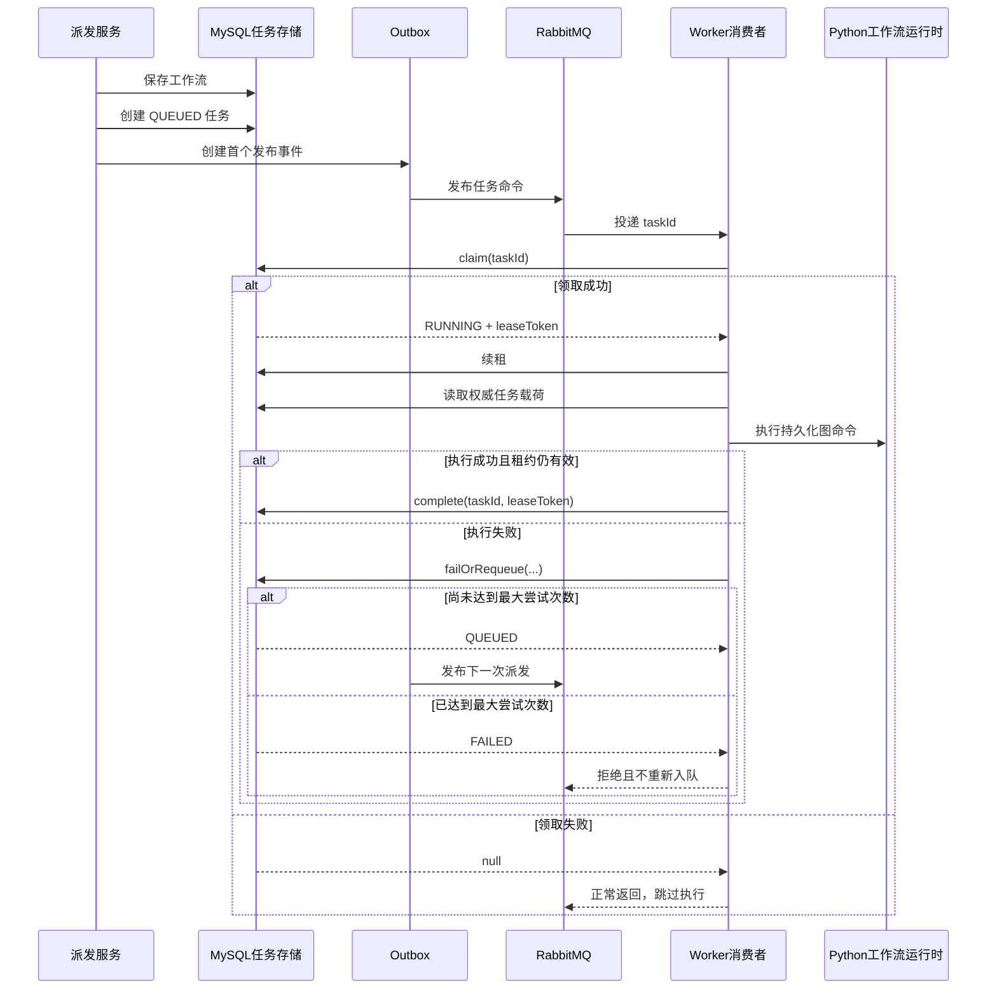

> 任务存储、租约恢复、过期处理和失败标记构成 Worker 命令的可靠性边界；重复交付通过工作流及 Python checkpoint 进行恢复。

# 任务租约、重试与故障恢复

任务存储、租约恢复、过期处理和失败标记共同构成 Worker 命令的可靠性边界。RabbitMQ 负责传递命令，但不承担任务状态的最终事实；任务状态以控制面 MySQL 中的 `AgentWorkerTask` 记录为准。重复投递由数据库租约抢占避免重复执行，执行过程中的故障则通过重新入队、过期租约恢复和终态失败标记处理。对于手册生成任务，Java Worker 最终调用 Python 的持久化图命令，Python 侧通过工作流及 checkpoint 支持重复交付后的恢复。

## 模块职责

- `AgentWorkerTaskStore`
  - 创建并持久化 Worker 任务。
  - 通过状态和租约令牌执行原子领取、续租、完成、失败或重新入队。
  - 查询并回收已经过期的运行中任务。
  - 截断失败摘要，避免过长或不安全的异常文本进入持久化记录。
- `AgentWorkerTaskDispatchService`
  - 作为 Worker 派发状态转换的事务边界。
  - 在同一事务中保存工作流、创建排队任务，并创建首个 Outbox 事件。
  - 协调任务存储、工作流存储和 Outbox 存储，保证任务状态与后续发布动作具有持久化基础。
- `AgentWorkerTaskConsumer`
  - 接收不透明的 RabbitMQ `AgentWorkerTaskCommand`。
  - 在反序列化和执行前先从数据库领取任务。
  - 持有租约执行阶段，并定时续租。
  - 根据执行结果完成任务，或交给派发服务处理失败、重试和最终拒绝。
- `AgentWorkerLeaseRecovery`
  - 由定时任务触发过期租约恢复。
  - 通过 `AgentWorkerTaskDispatchService` 重新排队过期任务，而不是在恢复循环中直接发布消息。
  - 仅在 RabbitMQ 监听能力启用时生效。
- `MultiAgentWritingService`
  - 根据工作流身份恢复 Worker 执行主体。
  - 校验阶段代码。
  - 将手册生成阶段交给 Python 的持久化图命令执行。

## 调用链

同步提交阶段首先由派发服务在数据库事务中保存工作流、创建 `QUEUED` 任务，并写入首个 Outbox 事件。之后由 Outbox 发布链路将任务命令发送到 RabbitMQ。

Worker 消费者收到命令后，先使用 `taskId` 尝试领取数据库任务。只有状态为 `QUEUED` 的任务能够被转换为 `RUNNING`；领取成功后才会读取任务载荷并执行阶段。对于 Python 手册阶段，消费者从任务载荷读取请求，但用户身份不直接信任载荷，而是通过 `workflowId` 从工作流服务重新解析执行主体。随后，`MultiAgentWritingService` 调用 Python 持久化图命令。

执行期间，消费者周期性续租。执行成功后，消费者必须使用领取时的租约令牌完成任务；若完成操作失败，则认为租约已经丢失并进入失败处理。异常处理会根据最大尝试次数决定重新排队还是标记为 `FAILED`。重新排队后的旧 RabbitMQ 投递会被确认，下一次持久化派发由调度链路发布。



图中的关键边界是数据库领取动作。RabbitMQ 的重复投递可能同时到达多个 Worker，但只有一个 Worker 能把任务从 `QUEUED` 原子转换为 `RUNNING`；未领取成功的消费者直接返回，不会执行第二次模型调用。

## 任务状态与租约

任务创建时的初始状态为：

- `status = QUEUED`
- `attempt = 0`
- `dispatchVersion = 1`
- 没有 Worker 和租约令牌
- 保存完整的 `requestJson`

领取任务时，`AgentWorkerTaskStore.claim` 使用条件更新同时检查：

- `taskId` 匹配；
- 当前状态仍为 `QUEUED`。

更新成功后，任务变为 `RUNNING`，并写入：

- `workerId`；
- 新生成的随机 `leaseToken`；
- `leaseExpiresAt`；
- `attempt + 1`。

租约令牌是不透明且按领取生成的。完成和续租操作都必须同时匹配任务 ID、当前状态和令牌，因此旧 Worker 即使在租约被回收后继续运行，也不能完成新 Worker 已经重新领取的任务。

消费者默认使用 900 秒租约，并按配置周期续租。续租间隔至少为 1 秒，同时不会超过配置心跳周期和租约时长三分之一中的较小值。续租失败只记录告警；后续完成操作会再次通过令牌和状态检查确认租约是否仍然有效。

## 过期租约恢复

恢复组件按配置的固定延迟运行，默认间隔为 30 秒。任务存储首先查询：

- 状态为 `RUNNING`；
- `leaseExpiresAt` 早于当前时间。

对于每条候选任务，恢复动作再次使用原任务的状态和租约令牌执行条件更新。只有条件仍然成立时，任务才会被：

- 改回 `QUEUED`；
- 清除 `workerId`；
- 清除 `leaseToken`；
- 清除过期时间；
- 增加 `dispatchVersion`。

这一步处理了恢复扫描与正常 Worker 续租之间的竞争：

- 如果原 Worker 已经成功续租，条件更新失败，任务不会被错误回收。
- 如果原 Worker 的租约确实已经失效，任务才会重新进入排队状态。
- 如果旧 Worker 随后尝试完成，完成操作因令牌或状态不匹配而失败。

恢复组件本身不直接向 RabbitMQ 发布消息，而是通过派发服务进入持久化派发链路。这使恢复后的任务仍然依赖任务状态和 Outbox 记录，而不是依赖恢复进程一次性的内存操作。

## 失败、重试与终态

Worker 异常或租约丢失时，消费者将任务交给 `dispatchService.handleFailure`。失败处理以当前租约为前提，最终由任务存储执行条件更新。

重试判断使用当前尝试次数和最大尝试次数：

```text
retry = attempt < maximumAttempts
```

可重试时：

- 状态从 `RUNNING` 改回 `QUEUED`；
- 清除租约令牌和过期时间；
- 保存最多 512 个字符的安全错误摘要；
- 增加 `dispatchVersion`；
- 返回任务供后续持久化派发。

达到最大尝试次数时：

- 状态改为 `FAILED`；
- 清除租约令牌和过期时间；
- 保存安全错误摘要；
- 不再增加派发版本；
- 不产生下一次重试任务。

错误摘要为空时会使用通用文本 `Worker task failed`；非空摘要最多保存 512 个字符。消费者日志中的异常消息最多保留 500 个字符，并压平成单行，同时不记录 prompt 或源文件内容，只使用任务、工作流和阶段标识进行关联。

终态失败在任务记录已经持久化为 `FAILED` 后，才通过 `AmqpRejectAndDontRequeueException` 拒绝消息。这样 RabbitMQ 不会再次自动重新入队，而数据库中的失败记录仍然是可查询的权威状态。

## 重复交付与租约竞争

重复交付可能来自 RabbitMQ 投递重复、Worker 在执行期间失联，或租约恢复后旧 Worker 继续运行。系统通过两层机制处理：

1. **Java 控制面任务租约**
   - 领取使用 `QUEUED -> RUNNING` 的条件更新。
   - 完成、续租和失败都必须持有当前租约令牌。
   - 失去租约的 Worker 不能覆盖新 Worker 的结果。

2. **工作流与 Python checkpoint**
   - Worker 命令本身不承载可变的身份信息。
   - 消费者根据 `workflowId` 重新解析执行主体，并从持久化工作流上下文恢复执行。
   - Python 在一个受租约保护的持久化图命令中执行图分支，并通过工作流 checkpoint 支持中断后的恢复。

因此，Java 侧保证“同一任务的当前所有权”，Python 侧保证“工作流内部已完成阶段的可恢复性”。二者共同降低重复模型调用和中断重跑带来的影响，但任务成功完成仍必须经过 Java 任务记录的租约校验。

## 关键边界条件

- **重复消息无法领取**：如果任务已经是 `RUNNING`、`COMPLETED`、`FAILED`，或已经被其他 Worker 抢先领取，`claim` 返回 `null`，消费者跳过执行。
- **租约在执行中丢失**：执行逻辑结束后 `complete` 返回失败，消费者将其视为租约丢失，而不是把结果标记为成功。
- **恢复与续租并发**：恢复更新包含旧租约令牌，避免把仍在运行且已经续租的任务错误地重新排队。
- **旧 Worker 失败晚到**：旧 Worker 的失败处理可能无法更新任务；如果任务已经被新的恢复所有者接管，消费者检查到任务并非 `FAILED` 后记录租约丢失并结束，不应覆盖新投递。
- **重试耗尽**：失败摘要会持久化，任务进入 `FAILED`，消息被拒绝且不重新入队。
- **不支持的阶段**：消费者当前只接受 Python 手册阶段代码；其他阶段会抛出不支持异常并进入统一失败处理。
- **载荷与身份分离**：请求内容从任务的权威 `requestJson` 读取，但授权主体从工作流重新解析，避免重复投递时使用过期或伪造的身份字段。
- **恢复开关**：租约恢复组件依赖 RabbitMQ 监听开关；监听未启用时，该定时恢复组件不会运行。
- **时间配置约束**：租约时长、心跳周期、恢复周期和最大尝试次数均通过运行时配置提供，实际部署需要确保心跳周期明显短于租约时长。

## 主要文件

- [AgentWorkerTaskStore.java](backend-java/src/main/java/com/doob/mathagent/agent/worker/AgentWorkerTaskStore.java#L14-L161)：任务状态机、条件更新、租约和失败摘要。
- [AgentWorkerTaskConsumer.java](backend-java/src/main/java/com/doob/mathagent/agent/worker/AgentWorkerTaskConsumer.java#L22-L186)：RabbitMQ 消费、领取、续租、阶段执行和异常投影。
- [AgentWorkerLeaseRecovery.java](backend-java/src/main/java/com/doob/mathagent/agent/worker/AgentWorkerLeaseRecovery.java#L7-L14)：定时触发过期租约恢复。
- [AgentWorkerTaskDispatchService.java](backend-java/src/main/java/com/doob/mathagent/agent/worker/AgentWorkerTaskDispatchService.java#L12-L34)：工作流、任务和 Outbox 的事务协调边界。
- `AgentWorkerTaskCommand.java`：RabbitMQ 中传递的不透明任务命令模型。
- `AgentWorkerTask.java`：任务状态、尝试次数、派发版本、租约和请求载荷的领域模型。
- `AgentWorkerTaskOutboxStore.java`、`AgentWorkerTaskOutboxScheduler.java`、`AgentWorkerTaskOutboxPublisher.java`：重试或恢复任务后，负责将持久化派发动作继续交给 Outbox 发布链路。
- `MultiAgentWritingService.java`：恢复 Worker 主体并调用 Python 手册工作流执行入口。

## 扩展点

- **重试策略**：当前策略仅依据尝试次数决定是否重试。可在派发服务或任务存储边界扩展按异常类型分类、退避时间和不可重试错误。
- **任务状态**：新增状态时必须同步修改所有条件更新、恢复扫描、终态判断和消息确认语义，避免出现数据库状态与 RabbitMQ 行为不一致。
- **租约策略**：可扩展租约时长、心跳策略和恢复周期，但必须保持续租与回收使用租约令牌进行竞争校验。
- **阶段路由**：当前消费者明确限制 Python 手册阶段。新增 Worker 阶段时，应同时定义请求载荷、工作流恢复方式、授权主体解析和完成结果投影。
- **失败可观测性**：已有任务终态、失败摘要、阶段日志和手册指标记录。可以在此基础上增加租约丢失、恢复次数、重试延迟和 checkpoint 恢复位置等诊断字段。
- **幂等执行**：Java 任务租约只防止同一时刻的重复领取；Python 新阶段仍应使用持久化工作流状态或 checkpoint 设计可重复执行行为，不能仅依赖消息不会重复。

Sources: [backend-java/src/main/java/com/doob/mathagent/agent/worker/AgentWorkerTaskStore.java](backend-java/src/main/java/com/doob/mathagent/agent/worker/AgentWorkerTaskStore.java#L1-L164), [backend-java/src/main/java/com/doob/mathagent/agent/worker/AgentWorkerLeaseRecovery.java](backend-java/src/main/java/com/doob/mathagent/agent/worker/AgentWorkerLeaseRecovery.java#L1-L16), [backend-java/src/main/java/com/doob/mathagent/agent/worker/AgentWorkerTaskConsumer.java](backend-java/src/main/java/com/doob/mathagent/agent/worker/AgentWorkerTaskConsumer.java#L1-L190), [backend-java/src/main/java/com/doob/mathagent/agent/worker/AgentWorkerTaskDispatchService.java](backend-java/src/main/java/com/doob/mathagent/agent/worker/AgentWorkerTaskDispatchService.java#L1-L107)
