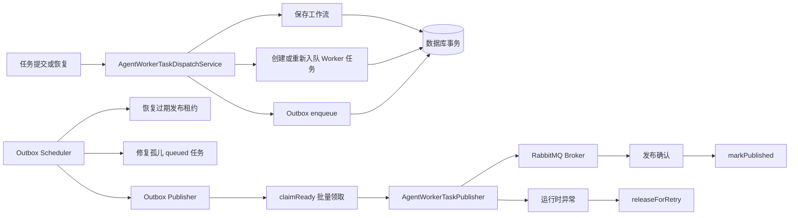

> Worker 任务 Outbox 记录、存储、调度和发布器用于在持久化任务与消息发布之间建立可靠交付机制。

# Outbox 事件发布

Worker 任务 Outbox 位于任务持久化与 RabbitMQ 消息发布之间。它将“创建或重新排队任务”和“待发布的 Worker 命令事件”纳入同一个数据库事务，再由独立调度器异步领取事件并发布到 Broker，从而避免任务已经落库但消息未发布所造成的丢失。

## 模块职责

- `AgentWorkerTaskDispatchService`：负责任务派发相关的事务边界。
  - 正常提交时保存工作流、创建 queued Worker 任务，并写入首个 Outbox 事件。
  - 恢复提交时将工作流重新置为可运行状态，创建新任务并写入 Outbox 事件。
  - 任务租约过期后重新入队，并为新的派发版本创建事件。
  - 修复没有对应当前派发版本事件的旧 queued 任务。
  - 任务最终失败时，将工作流投影为 `FAILED`。
- `AgentWorkerTaskOutboxStore`：定义 Outbox 持久化状态机，包括入队、领取、发布成功、重试释放、租约恢复和孤儿任务查询。
- `MyBatisAgentWorkerTaskOutboxStore`：基于 MyBatis 的 MySQL 持久化实现，使用任务 ID 与派发版本的唯一性约束保证重复补偿操作幂等。
- `AgentWorkerTaskOutboxPublisher`：批量领取待发布事件，调用 Worker 发布器，只有 Broker 发送成功后才将事件标记为已发布。
- `AgentWorkerTaskOutboxScheduler`：按固定延迟触发租约恢复、孤儿 queued 任务修复和 Outbox 发布。
- `AgentWorkerTaskOutboxEvent`：表示一个持久化、带版本的 Worker Broker 派发事件。事件携带任务、Agent、阶段、发布尝试次数、下次尝试时间和发布租约等信息。

## 调用链



事务提交保证工作流记录、Worker 任务和首个 Outbox 事件同时落库。之后发布动作与任务提交解耦，调度器负责周期性推进事件状态。

## 事件状态与发布租约

Outbox 事件包含以下主要状态：

| 状态 | 含义 |
| --- | --- |
| `PENDING` | 事件等待发布，且 `nextAttemptAt` 已到期时可以被领取 |
| `PUBLISHING` | 已被某个发布器领取，持有 `lockedBy` 和 `publishLeaseUntil` |
| `PUBLISHED` | Broker 发送已确认，并记录 `publishedAt` |

领取过程使用条件更新完成状态转换：

```text
PENDING
  -> PUBLISHING  （领取成功，发布尝试次数递增）
  -> PUBLISHED   （发送成功且 markPublished 条件更新成功）

PUBLISHING
  -> PENDING     （发送异常，按退避时间重试）
  -> PENDING     （发布器崩溃或租约过期后恢复）
```

`claimReady` 先查询到期的候选事件，再通过事件 ID、当前状态和 `nextAttemptAt` 进行条件更新。只有更新一行时，当前发布器才真正获得该事件，多个发布器并发运行时不会同时成功领取同一事件。

发布成功的确认条件包括：

- 事件仍处于 `PUBLISHING`；
- 锁定者仍是当前事件记录中的 `lockedBy`；
- 状态更新成功。

成功后会清除发布租约和锁定者。若发布异常，事件回到 `PENDING`，记录截断后的错误摘要，并设置下一次尝试时间。

## 调度与恢复

调度器仅在 `math-agent.rabbitmq.listeners-enabled=true` 时启用。每次固定延迟执行时依次完成：

1. 调用 `recoverExpiredPublishing`，将发布租约已经过期的 `PUBLISHING` 事件恢复为 `PENDING`。
2. 调用 `reconcileOrphanQueued`，查找超过宽限期、但当前派发版本没有 Outbox 事件的 queued 任务，并重新入队。
3. 调用发布器，按配置的批量大小领取并发布事件。

调度参数包括：

- `publisher-id`：发布器身份，默认 `agent-worker-outbox`；
- `batch-size`：单轮最多领取的事件数，默认 `100`，最小为 `1`；
- `publish-lease-seconds`：发布租约时长，默认 `30` 秒，但实际不会低于 `5` 秒；
- `reconciliation-limit`：单轮最多修复的孤儿任务数，默认 `100`；
- `reconciliation-grace-seconds`：孤儿任务判定宽限期，默认 `30` 秒，实际不会低于 `1` 秒；
- `fixed-delay-ms`：调度固定延迟，默认 `1000` 毫秒。

孤儿任务修复和发布租约恢复都有单独的 Micrometer 计数器。发布器还暴露待处理事件数量和最老未发布事件年龄，用于观察积压。

## 重试策略

发布器对每个领取到的事件独立处理：

- 发布成功后调用 `markPublished`；
- 任何 `RuntimeException` 都会增加失败和重试计数；
- 使用事件当前的 `publishAttempt` 计算退避时间；
- 退避按指数增长，最长为 `300` 秒；
- 错误信息最多保留 `300` 个字符，并移除换行。

因此，Broker 暂时不可用时，失败不会直接改变 Worker 任务的业务失败状态，而是将 Outbox 事件保留为可重试的持久化工作。只有任务自身的失败重试耗尽后，`AgentWorkerTaskDispatchService` 才会将对应工作流标记为 `FAILED`。

## 可靠性交付边界

Outbox 机制提供的是持久化任务到 Broker 发布之间的可靠衔接：

- 工作流、任务和首个 Outbox 事件由同一事务提交；
- 事件发布成功后才标记为 `PUBLISHED`；
- 发布器崩溃时，过期租约会使事件重新进入待发布状态；
- `enqueue` 遇到重复键时忽略插入异常，使并发恢复和重复对账保持幂等；
- 发布确认与 `markPublished` 之间若发生进程崩溃，事件可能再次投递；
- 重复投递由后续 Worker 任务领取的条件更新和派发版本机制兜底，而不是依赖 Outbox 直接实现严格的一次性发布。

因此，发布语义应理解为“至少一次尝试、通过任务状态 CAS 控制重复执行风险”。Outbox 只负责可靠地推动事件进入 Broker，不负责替代 Worker 消费端的幂等控制。

## 扩展点

1. **替换存储实现**  
   `AgentWorkerTaskOutboxStore` 将状态机操作与 MyBatis/MySQL 解耦，可以替换数据库或持久化技术，但必须保留领取、租约、条件状态转换和重复入队幂等语义。

2. **替换 Broker 发布器**  
   `AgentWorkerTaskOutboxPublisher` 依赖 `AgentWorkerTaskPublisher`。更换消息中间件时，应保持发布器在发送成功确认后才返回，并让异常继续触发 Outbox 重试。

3. **调整调度与吞吐**  
   可通过批量大小、固定延迟和发布租约调整吞吐与恢复速度。批量大小应结合数据库查询、Broker 确认耗时和单个发布器的处理能力设置。

4. **增强退避策略**  
   当前退避策略以 `publishAttempt` 为输入并限制最大等待时间。可以扩展为带抖动的退避、按异常类型分类，或增加最大发布尝试与人工干预状态，但需要保留事件可恢复性和错误可观测性。

5. **增强监控**  
   现有指标覆盖发布成功、失败、重试、待处理数量和最老事件年龄，也覆盖孤儿任务修复及过期租约恢复。后续可按 Agent、阶段、事件版本或错误类型增加维度，但应避免高基数标签。

## Sources

Sources: [AgentWorkerTaskOutboxEvent.java](backend-java/src/main/java/com/doob/mathagent/agent/worker/AgentWorkerTaskOutboxEvent.java#L1-L20), [AgentWorkerTaskOutboxStore.java](backend-java/src/main/java/com/doob/mathagent/agent/worker/AgentWorkerTaskOutboxStore.java#L1-L18), [AgentWorkerTaskOutboxScheduler.java](backend-java/src/main/java/com/doob/mathagent/agent/worker/AgentWorkerTaskOutboxScheduler.java#L1-L55), [AgentWorkerTaskOutboxPublisher.java](backend-java/src/main/java/com/doob/mathagent/agent/worker/AgentWorkerTaskOutboxPublisher.java#L1-L78), [AgentWorkerTaskDispatchService.java](backend-java/src/main/java/com/doob/mathagent/agent/worker/AgentWorkerTaskDispatchService.java#L1-L107), [MyBatisAgentWorkerTaskOutboxStore.java](backend-java/src/main/java/com/doob/mathagent/agent/worker/MyBatisAgentWorkerTaskOutboxStore.java#L1-L147)
