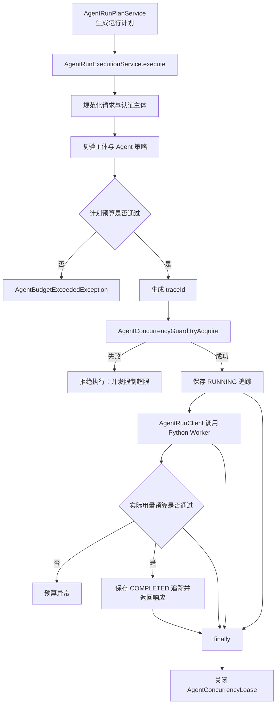

> AgentConcurrencyGuard、Redisson 实现和 AgentRunPolicy 控制并发租约及运行预算，避免超限执行。

# Agent 并发租约与预算控制

Agent 执行前由 Java 控制面完成身份、Agent 策略、预算和并发租约校验。只有通过这些检查后，才会创建运行追踪并调用 Python Worker 执行模型或工具任务。执行完成后，Java 再依据 Worker 返回的实际用量进行预算复核，并在任何退出路径释放并发租约。



图中并发租约位于昂贵的 Python 模型或工具调用之前，预算控制分为计划阶段和执行后阶段。`RUNNING` 追踪记录在 Worker 调用前持久化，用于让内部工具代理依据不透明的 `traceId` 解析已授权的主体信息。

## 模块职责

### `AgentRunPlanService`

`AgentRunPlanService` 负责生成不调用外部模型的、可审计的 Agent 运行计划。计划阶段会规范化请求和认证主体，并通过 `AgentRunPolicy.resolveAgent` 解析 Agent、验证主体角色，再结合模型路由和预算规则生成执行计划。

当前源码明确给出了几类输出预算上限：

- 免费交互场景：`900` 个输出 token。
- 默认付费场景：`4000` 个输出 token。
- 教师手册场景：`8000` 个输出 token。
- 教师问题分支的推理 token 上限：`6000`。

这些常量体现了不同工作负载的预算边界。最终是否允许执行由计划响应中的 `withinBudget()` 结果决定。

### `AgentRunPolicy`

`AgentRunPolicy` 是规划和执行共享的服务端策略目录。每个 `AgentDefinition` 包含：

- 稳定的 Agent code；
- 允许使用的主体角色；
- 允许调用的工具 scope；
- 允许读取的数据 scope。

例如，`StudentTutorAgent` 仅允许 `student` 主体；`KnowledgeRetrievalAgent` 允许学生、教师和管理员；写作、课程内容生成和质量检查相关 Agent 主要允许教师和管理员。

当请求未指定 Agent code 时，策略根据主体类型选择保守默认值：

- 教师或管理员请求课程内容任务时选择 `CoursewareAgent`；
- 教师或管理员的其它任务默认选择 `TeacherAssistantAgent`；
- 其它主体默认选择 `StudentTutorAgent`。

策略目录目前是进程内不可变列表，并明确预留了未来迁移到 MySQL 的扩展方向。策略目录用于能力发现时仍需结合当前主体再次过滤，不能把目录本身视为授权结果。

### `AgentConcurrencyGuard`

`AgentConcurrencyGuard` 抽象了 Agent 执行并发控制。调用方传入：

- 计划阶段生成的并发 key 列表；
- 持有租约的 `traceId`；
- 最大租约时长。

当所有 key 都能获得时返回 `AgentConcurrencyLease`；任意 key 忙碌时返回空结果。该接口将具体锁实现与执行服务解耦，执行服务只依赖“尝试获取并在结束时关闭租约”的合同。

### `RedissonAgentConcurrencyGuard`

`RedissonAgentConcurrencyGuard` 使用 Redisson 的 `RLock` 实现分布式并发控制，默认 Redis key 前缀为：

```text
math-agent:agent:concurrency
```

实际锁名由前缀和计划 key 拼接而成。实现具有以下行为：

- 对 key 进行去空格和去重；
- 空 key 列表不会获取任何锁，但仍返回可关闭的租约；
- 每个锁使用零等待获取；
- 使用调用方传入的显式过期时间；
- 任意一个 key 获取失败时，按已获取锁的逆序释放；
- 线程中断时恢复中断标志，并释放已获取的锁；
- 租约关闭时释放当前线程持有的锁。

实现没有使用 Redisson watchdog 自动续租。源码注释明确指出，执行服务承诺的是有界租约；若使用 watchdog，处于存活但卡住状态的请求可能持续续租，从而长期阻塞后续运行。

需要注意的是，接口语义要求“全部 key 原子获取”，而当前实现是逐个尝试并在失败时回滚已持有锁。它在应用层提供了全成或全不成的效果，但多个独立 Redis 锁之间并非单次 Redis 原子操作。

### `AgentRunExecutionService`

`AgentRunExecutionService` 是并发租约和执行预算的汇合点。Java 控制面保留身份、策略、预算、并发租约和 trace；模型调用、提供方回退、输出修复及 usage 记账交由 `AgentRunClient` 发送给 Python Worker。

生产执行服务固定使用十分钟并发租约：

```java
private static final Duration CONCURRENCY_LEASE_TIME = Duration.ofMinutes(10);
```

执行顺序为：

1. 规范化请求、计划和认证主体。
2. 复验主体与计划中的身份和策略信息。
3. 检查计划预算。
4. 生成新的 `traceId`。
5. 根据计划中的并发 key 尝试获取租约。
6. 保存 `RUNNING` 状态的追踪记录。
7. 拒绝生产环境中的 `dryRun` 请求。
8. 调用 `AgentRunClient` 执行 Python Worker 任务。
9. 根据 Worker 返回的实际用量执行预算复核。
10. 保存 `COMPLETED` 追踪记录并构造响应。
11. 无论执行成功、预算异常还是其它异常，都在 `finally` 中关闭租约。

并发检查发生在 `RUNNING` trace 保存之前，且位于 Python 调用之前，因此被拒绝的并发请求不会进入实际模型执行阶段。授权 trace 则在 Worker 调用之前保存，使内部 Java Tool Broker 可以通过 `traceId` 找到主体和授权上下文，而不需要让模型或 Worker 直接携带租户、用户字段。

## 关键状态与数据

### 并发租约状态

`AgentConcurrencyLease` 是一个可关闭的资源合同。执行服务不直接关心锁的实现，只在成功获取后持有租约，并在 `finally` 中调用 `close()`。

租约生命周期可以概括为：

```text
未获取
  -> 全部 key 获取成功：持有租约
  -> 任意 key 忙碌：释放已获取 key，执行拒绝
  -> 执行结束或异常：关闭租约，释放锁
```

Redisson 实现按逆序释放锁，降低多 key 释放时的交叉影响。由于锁绑定当前线程，释放动作要求发生在持有锁的线程中。

### 运行追踪状态

执行服务至少使用两个追踪状态：

- `RUNNING`：已通过主体、策略、计划预算和并发租约检查，并已授权即将开始的 Worker 执行；
- `COMPLETED`：Python Worker 成功返回，且实际用量预算复核通过。

完成记录包含计划和身份信息、Agent code、提供方和模型信息、并发 key、阶段耗时、实际用量、实际成本及成本是否已知等字段。`traceId` 是本次执行的关联标识，也是内部工具授权查询的 opaque key。

### 预算状态

预算控制存在两个时点：

```text
计划预算检查 -> 允许进入执行
实际用量检查 -> 允许记录为完成
```

计划阶段防止明显超出 token 或配置成本预算的请求进入 Provider；执行阶段使用 Worker 返回的 `actualUsage()` 再次校验，覆盖估算与实际消耗不一致的情况。

计划预算失败抛出 `AgentBudgetExceededException`。并发租约获取失败则抛出表示并发限制超限的 `IllegalStateException`。这些异常发生在不同阶段，调用方应分别映射为预算拒绝和并发拒绝，避免将资源限制误报为模型或 Worker 故障。

## 调用链

```text
AgentRunPlanService.plan
    -> AgentRunPolicy.resolveAgent
    -> 生成 AgentRunPlanResponse
    -> AgentRunExecutionService.execute
        -> validateSubject
        -> validatePlanPolicy
        -> plan.withinBudget
        -> AgentConcurrencyGuard.tryAcquire
            -> RedissonAgentConcurrencyGuard
                -> Redisson RLock.tryLock
        -> AgentTraceStore.save(RUNNING)
        -> AgentRunClient.execute
        -> enforceActualUsageBudget
        -> AgentTraceStore.save(COMPLETED)
        -> AgentConcurrencyLease.close
```

计划服务和执行服务分别进行策略处理并不意味着可以信任客户端提交的计划。执行入口仍会从认证主体出发复验计划中的身份和策略字段，确保计划不能被前端修改后绕过服务端授权。

## 边界条件

- `keys` 为 `null` 或空列表时，Redisson 实现不会获取 Redis 锁；这适合不需要共享并发限制的计划，但也意味着并发保护完全依赖计划是否正确生成 key。
- key 为 `null`、空白或重复值时会被过滤或去重，最终只保留去除首尾空格后的唯一 key。
- `leaseTime` 为 `null` 或转换后小于一毫秒时，底层至少使用一毫秒租约。调用方仍应提供合理的显式时长。
- 获取多个 key 时，前面的锁可能已经成功，后面的锁失败后会执行回滚释放；因此锁释放逻辑是失败路径的重要组成部分。
- 获取锁期间线程被中断时，方法恢复线程的中断标志并返回空结果。
- 执行过程中抛出异常时，完成 trace 可能不会被保存，但租约仍由 `finally` 释放。异常状态的持久化或统一失败投影不在当前证据中的执行片段内。
- `dryRun` 在租约和 `RUNNING` trace 建立后才被拒绝。由于租约处于 `try/finally` 范围内，该拒绝路径仍会释放租约。
- 十分钟租约是固定执行服务常量。若 Python 执行可能超过该时长，锁过期后其它请求可能获得相同 key；因此租约时长必须与 Worker 的最大运行时间和故障恢复策略保持一致。
- 实际成本可能未知。完成 trace 同时记录 `actualCost()` 和 `costKnown()`，不能仅根据成本字段是否为零判断是否发生消耗。
- `AgentRunPolicy.definitions()` 返回的是完整静态目录，调用方仍必须按当前主体过滤，不能直接把全部 Agent 能力暴露给用户。

## 扩展点

1. **替换并发存储实现**  
   可实现新的 `AgentConcurrencyGuard`，例如基于数据库、分布式信号量或测试内存实现，而不改变 `AgentRunExecutionService` 的调用方式。

2. **调整 key 维度**  
   并发 key 由运行计划提供，因此可以按 Agent、模型、租户、主体或其它资源维度构造限制。key 生成规则应与计划服务保持一致，并避免把未授权或不稳定的客户端字段直接作为限制边界。

3. **改进多 key 原子性**  
   当前 Redisson 实现通过逐锁获取和失败回滚实现全成或全不成语义。若部署环境要求更强的跨 key 原子性，可将获取逻辑替换为 Redis 侧脚本或专用信号量方案。

4. **集中化预算策略**  
   当前计划服务内含按场景划分的 token 上限，执行服务负责计划预算和实际用量复核。后续可将预算上限、成本阈值和不同主体的配额迁移到配置或持久化策略中，但仍应保留执行入口的服务端复验。

5. **增强失败状态投影**  
   执行服务已记录 `RUNNING` 和 `COMPLETED`，可在现有 `AgentTraceStore` 边界上补充预算拒绝、并发拒绝、Worker 异常和租约过期等终态，使诊断与用量查询能够区分资源控制失败和外部执行失败。

## Sources

Sources: [AgentConcurrencyGuard.java](backend-java/src/main/java/com/doob/mathagent/agent/service/AgentConcurrencyGuard.java#L1-L22)  
Sources: [RedissonAgentConcurrencyGuard.java](backend-java/src/main/java/com/doob/mathagent/agent/service/RedissonAgentConcurrencyGuard.java#L1-L104)  
Sources: [AgentRunPolicy.java](backend-java/src/main/java/com/doob/mathagent/agent/service/AgentRunPolicy.java#L1-L114)  
Sources: [AgentRunPlanService.java](backend-java/src/main/java/com/doob/mathagent/agent/service/AgentRunPlanService.java#L15-L66)  
Sources: [AgentRunExecutionService.java](backend-java/src/main/java/com/doob/mathagent/agent/service/AgentRunExecutionService.java#L18-L145)
