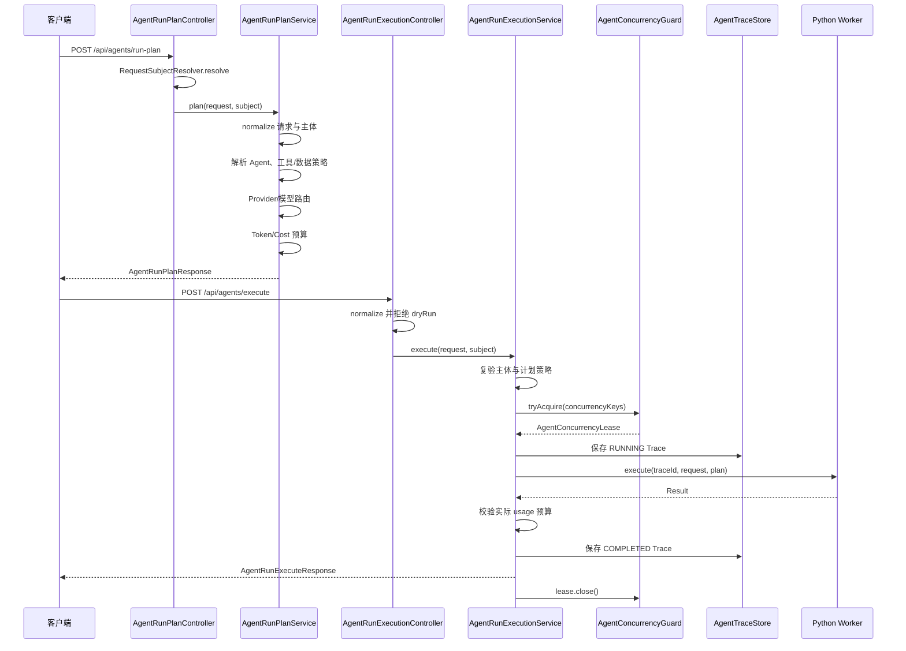
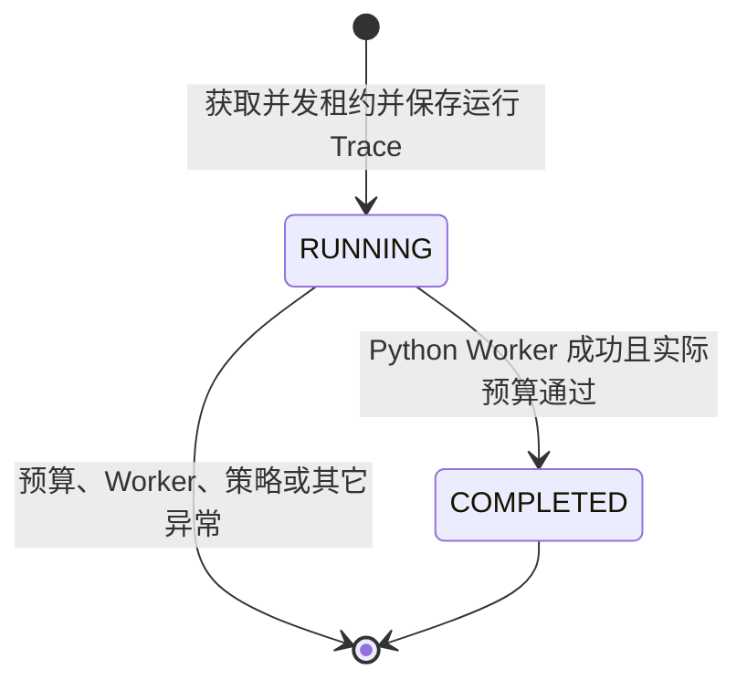

> 运行计划服务解析请求并生成执行计划，执行服务负责实际运行控制和响应投影。

# Agent 运行计划与执行

Agent 运行链路由 Java 控制面分为两个阶段：`AgentRunPlanService` 负责在真正调用模型或工具之前，解析请求、校验 Agent 策略、选择模型路由并计算预算；`AgentRunExecutionService` 负责复验计划与认证主体、获取并发租约、建立追踪记录、调用 Python Worker，并将执行结果投影为统一响应。

Java 保留身份、权限、预算、并发租约和 Trace 等控制职责。实际模型调用、Provider 回退、输出修复和 usage 记账通过 `AgentRunClient` 交给 Python Worker。

## 调用链



计划接口与执行接口是两个独立的 HTTP 入口：

- `POST /api/agents/run-plan`：生成可展示、可审计的执行计划。
- `POST /api/agents/execute`：执行已签发的计划并返回结果。

执行服务不会仅信任客户端提交的计划，而是在服务端重新校验计划中的身份和策略字段。

## 计划阶段

`AgentRunPlanService.plan` 的处理顺序如下：

1. 对 `AgentRunPlanRequest` 和 `RequestSubject` 进行规范化。
2. 通过 `AgentRunPolicy.resolveAgent` 解析 Agent 定义。
3. 根据 Agent 允许范围和请求范围计算工具策略：
   - `ALLOWED` 的工具进入允许列表；
   - 其它决策进入拒绝列表；
   - 同时保留逐项 `ToolPolicyDecision`，用于向前端展示审计结果。
4. 根据 Agent 的数据范围计算允许和拒绝的数据 Scope。
5. 根据任务类型、模型偏好、图片、公式、难度和失败次数选择 Provider 与模型能力等级。
6. 计算输入 Token 上限、输出 Token 上限、预计总 Token、预计成本及是否在预算内。
7. 返回带有唯一 `planId` 的 `AgentRunPlanResponse`。

计划本身不调用外部模型 Provider。它是执行前的策略和成本边界，也是后续执行服务复验的依据。

### Agent 与工具策略

工具请求不会直接变成可执行工具列表。服务会将请求的工具 Scope 与 Agent 的 `allowedToolScopes` 对照，并输出逐项决策。禁用的工具 Scope 会通过请求中的 `disabledToolScopes` 参与计算。

响应同时包含：

- `allowedTools`
- `deniedTools`
- `toolDecisions`
- `allowedData`
- `deniedData`
- `requiredJsonSchema`

这使前端可以看到计划结果，但执行时仍由 Java 服务端重新检查，避免客户端修改计划后扩大权限。

### Provider 与模型路由

路由首先要求至少存在一个启用的 Provider。没有启用 Provider 时，计划阶段抛出状态错误。

任务会根据请求信号被归类为以下模型能力等级：

| 条件 | 能力等级 |
| --- | --- |
| 要求 JSON Schema | `json_stable` |
| 包含图片 | `multimodal` |
| 难度为 `hard` 或包含公式 | `reasoning` |
| 其它请求 | `fast_text` |

写作类请求具有独立的路由规则。任务类型包含 `writing` 或 `handout`，或 Agent 为 `CoursewareAgent`、`HandoutFormatterAgent` 时，会进入写作路由。未指定偏好时使用目录提供的 Luna 写作 Provider；显式 Provider 或模型只有在目录允许列表中时才会接受，否则快速失败。

非写作请求可以使用请求指定的 Provider/模型，未指定时使用目录中的默认 Provider。当此前失败次数达到至少两次且存在多个启用 Provider 时，路由会选择主 Provider 后面的下一个 Provider，形成简单的顺序回退。

路由响应会返回：

- Provider 名称；
- Chat 模型；
- 模型能力等级；
- 路由原因。

路由原因不会直接把不可信的模型偏好用于 SQL 或日志；未知或不允许的写作模型会被拒绝，而不是静默切换到一个不可审计的路由。

### 预算计算

预算阶段会根据用户等级设置输入和输出上限：

- `free` 用户的输入上限为 `2400`；
- 其它用户的输入上限为 `12000`；
- `free` 用户的输出上限为 `900`；
- 普通付费或非免费场景的默认输出上限为 `4000`；
- 教师手册场景可使用 `8000` 的输出上限；
- 教师问题分支可使用 `6000` 的输出上限，以容纳 Provider 侧推理 Token。

计划响应包含预计 Token、预计成本和 `withinBudget`。该字段只用于预执行判断，执行服务还会在 Python Worker 返回实际 usage 后再次执行实际用量预算校验。

## 执行阶段

`AgentRunExecutionService.execute` 是已生成计划的受控执行入口。

### 1. 身份与计划复验

服务首先规范化执行请求和认证主体，然后执行：

- `validateSubject(plan, normalizedSubject)`：确认计划身份与当前后端认证主体一致；
- `validatePlanPolicy(plan, normalizedSubject)`：重新检查计划对应的策略；
- 检查 `plan.withinBudget()`。

如果计划已经超出 Token 或配置成本预算，服务会在 Provider 调用前抛出 `AgentBudgetExceededException`。

执行控制器还会在进入服务前拒绝 `dryRun` 请求，生产环境不支持 dry run。服务内部保留同样的检查，形成控制器和服务两层边界。

### 2. 并发租约

服务为每次执行生成新的 `traceId`，从计划中读取并清洗 `concurrencyKeys`，然后通过 `AgentConcurrencyGuard.tryAcquire` 获取并发租约。

租约有效期为 10 分钟。如果无法获得租约，执行会被拒绝，Python Worker 不会被调用。无论后续执行成功、失败还是抛出异常，`finally` 块都会关闭租约，释放并发占用。

并发键由计划阶段基于租户主体、Agent 和模型生成，用于将并发控制绑定到受控身份和模型维度。

### 3. Trace 与工具授权

获得租约后，服务先保存 `RUNNING` 状态的 Trace，再调用 Python Worker。这个顺序是 Java 工具授权边界的重要组成部分：

- Trace 保存身份、计划、Agent、Provider、模型、工具 Scope、数据 Scope、证据引用和并发键；
- Java 内部 Tool Broker 可以通过不透明的 `traceId` 找到已持久化的授权上下文；
- Python Worker 和模型不需要携带租户或用户字段；
- Worker 在 Java 侧请求受保护工具时，Broker 可以依据 Trace 恢复授权主体。

因此，`traceId` 同时承担本次运行的追踪标识和内部授权关联标识。

### 4. Python Worker 执行

执行服务通过：

```java
agentRunClient.execute(traceId, normalized, plan)
```

将运行请求和已签发计划交给 Python Worker。Java 不在这一层直接实现模型调用，也不负责 Provider 侧输出修复。

Worker 返回的 `Result` 至少参与以下结果字段：

- Provider 名称；
- 模型代码；
- 实际 usage；
- 生成内容；
- 用户可见消息；
- 实际成本；
- 成本是否已知。

Worker 返回后，Java 先校验实际 usage 是否超过计划预算，再将 Trace 更新为 `COMPLETED`。

## 状态与响应投影

当前执行链路中明确使用两个 Trace 状态：



`RUNNING` Trace 在 Python 调用前写入，用于建立持久化的运行和授权上下文。成功完成后生成 `COMPLETED` Trace，写入实际 Provider、模型、usage、消息、生成内容对应的信息以及诊断事件。

最终 `AgentRunExecuteResponse` 从完成 Trace 与 Worker 结果投影而来，包含：

- `traceId` 和 `planId`；
- 租户、主体类型、主体 ID；
- Agent、Provider 和模型；
- 执行状态；
- 预计成本、实际成本及成本可知性；
- 允许的工具和数据 Scope；
- 并发键；
- 阶段耗时；
- 实际 usage；
- 消息与生成内容。

这种投影将内部 Trace 持久化结构和外部响应结构分开，避免直接暴露执行服务内部状态，同时保留诊断和成本信息。

## 边界条件与错误投影

### 计划阶段

- 没有启用 Provider：`IllegalStateException`，控制器映射为 `503 SERVICE_UNAVAILABLE`。
- 请求的写作 Provider 或模型未被启用或未加入允许列表：`IllegalArgumentException`，控制器映射为 `403 FORBIDDEN`。
- Agent、工具或数据 Scope 不满足策略：由策略解析和决策逻辑拒绝或标记为拒绝，执行阶段还会再次复验。
- 请求带有模型偏好但未被实际采用：计划通过路由原因显式说明使用了能力等级模型。
- 前次失败次数达到阈值且有多个 Provider：非写作请求进入顺序回退路由。
- 预算计算可能得到 `withinBudget = false`；计划仍可返回给调用方，但执行服务会在外部调用前拒绝。

### 执行阶段

- `dryRun`：控制器直接返回 `400 BAD_REQUEST`。
- 认证主体与计划主体不一致，或计划策略复验失败：`IllegalArgumentException`，控制器映射为 `403 FORBIDDEN`。
- 计划超预算：抛出 `AgentBudgetExceededException`，阻止 Provider 调用。
- 无法获取并发租约：`IllegalStateException`，控制器映射为 `429 TOO_MANY_REQUESTS`。
- Python Worker 返回的实际 usage 超过计划预算：执行在完成投影前失败，避免将超预算结果标记为成功。
- Worker 调用或结果处理抛出异常：租约仍由 `finally` 关闭；运行 Trace 的失败持久化和错误投影取决于执行服务其余错误处理实现，属于需要重点验证的恢复边界。

## 主要文件与职责

- [`AgentRunPlanController`](backend-java/src/main/java/com/doob/mathagent/agent/controller/AgentRunPlanController.java)：接收计划请求、解析可信认证主体，并将计划阶段异常映射为 HTTP 状态。
- [`AgentRunExecutionController`](backend-java/src/main/java/com/doob/mathagent/agent/controller/AgentRunExecutionController.java)：接收执行请求、拒绝生产环境 dry run、解析认证主体，并将执行异常映射为 HTTP 状态。
- [`AgentRunPlanService`](backend-java/src/main/java/com/doob/mathagent/agent/service/AgentRunPlanService.java)：规范化请求，解析 Agent 策略，计算工具和数据 Scope，选择 Provider/模型并计算预算。
- [`AgentRunExecutionService`](backend-java/src/main/java/com/doob/mathagent/agent/service/AgentRunExecutionService.java)：复验身份和策略，管理并发租约，持久化 Trace，调用 Python Worker，并生成执行响应。
- `AgentRunPolicy`：提供 Agent 定义及其允许的工具、数据范围，是计划授权决策的策略边界。
- `AiProviderCatalog`：提供启用 Provider、默认 Provider、写作 Provider 以及允许的 Provider/模型组合。
- `AiModelPriceCatalog`：为预算阶段提供部署侧模型价格信息。
- `AgentConcurrencyGuard`：控制 Agent 运行并发，并返回可关闭的租约。
- `AgentTraceStore`：持久化运行中的授权上下文和完成后的执行结果。
- `AgentRunClient`：Java 到 Python Worker 的协议边界。
- `RequestSubjectResolver`：从可信后端请求上下文解析认证主体，不接受客户端自行声明的身份作为授权依据。

## 扩展点

1. **Provider 与模型目录**  
   可以扩展 `AiProviderCatalog` 的 Provider 注册、默认选择、写作路由和模型允许列表，而无需改变控制器接口。路由策略仍应保持显式、可审计，并在未知偏好时快速失败。

2. **任务路由策略**  
   `isWritingRequest`、能力等级判断和失败后回退逻辑可以演进为独立的路由策略，以支持新的任务类型、模态或 Provider 健康信号。新增路由需要同步定义预算、审计原因和失败回退行为。

3. **预算与计费策略**  
   当前预算同时关注输入 Token、输出 Token、预计成本和实际 usage。未来可替换为按租户、主体角色、Agent 或模型维度的预算策略，但必须保留执行前预算检查和执行后实际用量复核。

4. **并发控制实现**  
   `AgentConcurrencyGuard` 隔离了并发租约实现。可以替换底层实现或增加更细粒度的租户、Agent、模型配额，而不改变执行服务的主链路。

5. **Trace 存储与诊断**  
   `AgentTraceStore` 可以接入不同持久化后端或增加失败状态、重试次数和更详细的诊断事件。Trace 字段扩展时需要继续区分外部响应字段与内部授权字段。

6. **Python Worker 协议**  
   `AgentRunClient` 是执行面边界。Python 侧可以扩展 Provider 回退、输出修复、模型评审和 usage 统计，但 Java 仍应负责计划约束、主体授权、预算门禁和最终响应投影。

**Sources:** [backend-java/src/main/java/com/doob/mathagent/agent/service/AgentRunPlanService.java](backend-java/src/main/java/com/doob/mathagent/agent/service/AgentRunPlanService.java#L1-L280), [backend-java/src/main/java/com/doob/mathagent/agent/service/AgentRunExecutionService.java](backend-java/src/main/java/com/doob/mathagent/agent/service/AgentRunExecutionService.java#L1-L269), [backend-java/src/main/java/com/doob/mathagent/agent/controller/AgentRunPlanController.java](backend-java/src/main/java/com/doob/mathagent/agent/controller/AgentRunPlanController.java#L1-L59), [backend-java/src/main/java/com/doob/mathagent/agent/controller/AgentRunExecutionController.java](backend-java/src/main/java/com/doob/mathagent/agent/controller/AgentRunExecutionController.java#L1-L67)

Sources: [backend-java/src/main/java/com/doob/mathagent/agent/service/AgentRunPlanService.java](backend-java/src/main/java/com/doob/mathagent/agent/service/AgentRunPlanService.java#L1) [backend-java/src/main/java/com/doob/mathagent/agent/service/AgentRunExecutionService.java](backend-java/src/main/java/com/doob/mathagent/agent/service/AgentRunExecutionService.java#L1) [backend-java/src/main/java/com/doob/mathagent/agent/controller/AgentRunPlanController.java](backend-java/src/main/java/com/doob/mathagent/agent/controller/AgentRunPlanController.java#L1) [backend-java/src/main/java/com/doob/mathagent/agent/controller/AgentRunExecutionController.java](backend-java/src/main/java/com/doob/mathagent/agent/controller/AgentRunExecutionController.java#L1)
