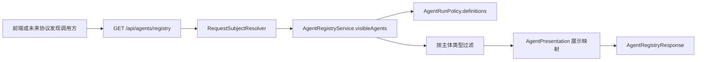
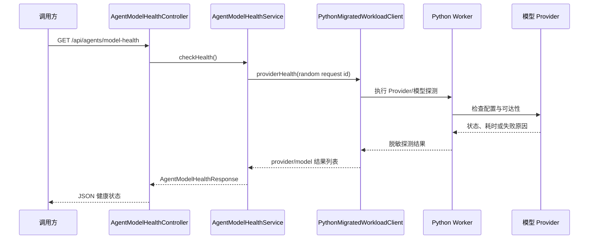

> Agent 注册服务、模型目录和模型健康服务提供可发现的 Agent 及模型能力信息。

# Agent 注册与模型目录

Agent 注册与模型目录是后端面向前端及未来协议发现能力提供的可发现性接口，覆盖两类信息：

- **Agent 注册目录**：根据当前后端解析出的用户主体，返回可见且理论上可以进入规划与执行流程的 Agent 卡片。
- **模型目录与健康状态**：返回后端允许使用的 Provider、模型及降级顺序，并通过 Python Worker 执行真实的 Provider/模型可达性检查。

该页面只描述发现和健康检查能力。Agent 的实际规划、执行、并发控制和运行追踪由其它服务负责。

## 模块职责

### Agent 注册服务

`AgentRegistryService` 将 `AgentRunPolicy` 中的服务端 Agent 定义投影为前端可展示的目录卡片：

1. 对传入的 `RequestSubject` 执行规范化。
2. 遍历 `AgentRunPolicy.definitions()` 返回的静态 Agent 定义。
3. 仅保留 `allowedRoles` 包含当前主体类型的 Agent。
4. 将策略定义与 `AgentPresentation` 中的展示信息合并。
5. 返回 Agent 代码、名称、分类、描述、工具范围、数据范围、输入提示和产物类型。

注册目录没有新增或修改 Agent 的接口。Agent 是否存在、允许哪些角色使用、可以访问哪些工具和数据，均由后端策略代码控制。新增 Agent 的扩展点是修改并审核 `AgentRunPolicy` 的服务端定义，同时为其补充展示映射。

### Agent 运行策略

`AgentRunPolicy` 是注册目录和运行时授权之间的共享策略来源。当前定义为不可变的静态列表，包含：

- Agent 稳定代码。
- 允许的主体类型。
- 允许调用的工具 Scope。
- 允许读取的数据 Scope。

当前策略中的主体过滤关系包括：

| Agent | 可用主体 | 工具范围 |
|---|---|---|
| `StudentTutorAgent` | `student` | 教材搜索、学生进度读取 |
| `KnowledgeRetrievalAgent` | `student`、`teacher`、`admin` | 教材及私有内容搜索 |
| `DocumentWriterAgent` | `teacher`、`admin` | 课件生成 |
| `SupervisorAgent` | `teacher`、`admin` | 无隐式工具 Scope |
| `TeacherAssistantAgent` | `teacher`、`admin` | 教材搜索、私有内容搜索、学生进度读取 |
| `CoursewareAgent` | `teacher`、`admin` | 课件生成及搜索 |
| `QualityCheckAgent` | `teacher`、`admin` | 质量检查 |
| `HandoutFormatterAgent` | `teacher`、`admin` | 讲义排版 |

注册目录的过滤与运行时解析使用同一组定义，但目录可见不等于绕过运行时校验。`resolveAgent` 在实际规划时仍会根据请求中的 Agent 代码和主体角色重新解析；未知代码或主体无权使用时会抛出异常。

### 展示信息映射

`AgentRegistryService.AgentPresentation` 使用受控的代码到展示信息映射，避免前端自行推断 Agent 合同。已定义的展示字段包括：

- 中文名称。
- 业务分类。
- 功能描述。
- 输入提示。
- 输出产物类型。

例如：

- `KnowledgeRetrievalAgent` 映射为“知识检索智能体”，输出类型为 `EVIDENCE_PACK`。
- `DocumentWriterAgent` 映射为“文档写作智能体”，输出类型为 `DOCUMENT_DRAFT`。
- `QualityCheckAgent` 映射为“质量审校智能体”，输出类型为 `REVIEW_FINDINGS`。

对于策略中存在但展示映射未覆盖的代码，服务使用通用展示内容，并保留原始 Agent 代码。这样未知的已审核策略项仍可以安全显示，但不会自动获得额外工具或数据权限。

## Agent 注册调用链



关键节点：

- `AgentRegistryController` 只负责 HTTP 入口和依赖注入。
- `RequestSubjectResolver` 从请求中解析后端主体，注册服务不直接根据前端传入的角色字段授权。
- `AgentRegistryService` 负责目录投影和主体过滤。
- `AgentRunPolicy` 提供执行策略定义。
- `AgentRegistryResponse` 是对外的目录合同。

## 注册接口

### `GET /api/agents/registry`

接口返回当前认证主体可见的 Agent 列表。每个目录项包含：

- `code`：稳定 Agent 代码。
- `name`：展示名称。
- `category`：业务分类。
- `description`：能力描述。
- `allowedToolScopes`：允许使用的工具 Scope，按排序后的顺序返回。
- `allowedDataScopes`：允许访问的数据 Scope，按排序后的顺序返回。
- `inputHint`：适合传入的输入类型提示。
- `outputArtifactType`：预期产物类型。

边界条件：

- 主体会先执行 `normalize()`，目录过滤基于规范化后的主体类型。
- `student` 只能看到面向学生开放的 Agent。
- `teacher` 和 `admin` 可以看到教师侧定义的 Agent，以及对所有主体开放的检索 Agent。
- 不支持的 Agent 代码不会被目录服务主动生成；实际解析时会被 `agentByCode` 拒绝。
- 注册目录没有 mutation endpoint，不能通过 API 动态注册 Agent。
- `SupervisorAgent` 虽然可以被展示和规划，但其策略定义没有工具 Scope，不能从目录推导出隐含的超级权限。

## 模型目录

### `AgentModelCatalogController`

模型目录接口由 `AiProviderCatalog` 提供后端校验后的 Provider 和模型选项：

```text
GET /api/agents/model-catalog
    -> AiProviderCatalog.modelCatalog()
    -> AgentModelCatalogResponse
```

控制器返回以下信息：

- 默认 Provider 名称。
- 默认模型代码。
- fallback Provider 顺序。
- Provider 列表。
- Provider 是否启用。
- Provider 默认模型。
- Provider 下的模型代码。
- 模型等级 `modelLevel`。
- 价格档位 `priceTier`。

模型目录只返回允许公开的配置元数据，不暴露 Provider 密钥等敏感信息。目录来源位于 `infrastructure/ai` 下的 Provider 与模型目录配置，包括：

- `AiProviderCatalog`
- `AiProviderProperties`
- `AiModelPriceCatalog`

模型目录的职责是告诉调用方“后端允许选择什么”，而不是证明当前 Provider 一定可用。真实可达性由模型健康接口单独检查。

## 模型健康检查

### `AgentModelHealthService`

模型健康服务不直接向外部 Provider 发送 health request，而是通过 `PythonMigratedWorkloadClient` 让 Python Worker 执行 Provider 可达性检查：

1. 使用注入的 `Clock` 记录本次检查时间。
2. 为本次探测生成随机请求标识。
3. 调用 `workloadClient.providerHealth(...)`。
4. 将 Python 返回结果投影为脱敏的 `AgentModelHealthResponse.Result`。
5. 为每项结果附加统一的检查时间。
6. 返回整体检查时间和结果列表。



健康结果字段包括：

- `providerName`
- `modelCode`
- `configured`
- `reachable`
- `statusCode`
- `elapsedMs`
- `safeReason`
- `checkedAt`

其中 `safeReason` 来自客户端返回的安全原因字段，Java 服务只投影公开的脱敏结果。Java 控制面不承担 Provider 直连探测逻辑，Provider 访问路径由 Python Worker 及其运行时配置负责。

### `GET /api/agents/model-health`

该接口执行一次紧凑的实时检查，而不是读取注册表中的静态状态。响应包含：

- 本次检查的统一时间戳。
- 每个 Provider/模型组合的配置状态。
- 是否可达。
- 可选状态码。
- 探测耗时。
- 脱敏失败原因。

边界条件：

- Provider 已在模型目录中出现，不代表它当前可达。
- Provider 未配置时可以通过 `configured` 与 `safeReason` 区分配置缺失和网络或服务故障。
- Python Worker 或其运行时不可用时，健康检查依赖的外部调用链会失败，具体错误投影取决于 `PythonMigratedWorkloadClient` 的实现。
- `checkedAt` 使用注入的 `Clock` 生成，便于通过固定时钟进行确定性测试。
- 每次检查使用新的随机请求标识，不能据此推断检查结果会被缓存。

## 关键状态

### Agent 可发现状态

Agent 注册本身没有独立的数据库状态。当前“是否可发现”由以下条件即时决定：

```text
Agent 存在于 AgentRunPolicy.definitions()
且
当前主体类型属于 Agent.allowedRoles()
```

目录项中的工具和数据 Scope 是策略快照，不是用户可以编辑的权限。实际执行前仍需通过运行计划服务的策略解析和主体校验。

### 模型目录状态

模型目录主要表示静态配置能力：

- Provider 是否启用。
- Provider 的默认模型。
- 后端允许的模型集合。
- 默认 Provider 和 fallback 顺序。
- 模型等级及价格档位。

它不保存本次实时健康检查的结果。

### 模型健康状态

健康检查结果是一次调用的即时投影，核心状态由 `configured` 和 `reachable` 表示：

- 未配置：Provider 或模型缺少必要运行配置。
- 已配置但不可达：配置存在，但探测未成功。
- 已配置且可达：当前探测链路成功。
- 其它异常：通过状态码和脱敏原因向调用方提供诊断线索。

源码证据只保证这些字段被返回，并未定义更高层的统一状态枚举，因此调用方不应假设存在额外的持久化状态机。

## 主要文件

| 文件 | 职责 |
|---|---|
| `agent/controller/AgentRegistryController.java` | 暴露主体过滤后的 Agent 注册接口 |
| `agent/service/AgentRegistryService.java` | 将运行策略投影为目录卡片 |
| `agent/service/AgentRunPolicy.java` | 定义 Agent、角色、工具 Scope 和数据 Scope |
| `agent/controller/AgentModelCatalogController.java` | 暴露 Provider 与模型目录 |
| `agent/controller/AgentModelHealthController.java` | 暴露实时模型健康检查接口 |
| `agent/service/AgentModelHealthService.java` | 调用 Python 探针并投影脱敏健康结果 |
| `agent/vo/AgentRegistryResponse.java` | Agent 注册响应模型 |
| `agent/vo/AgentModelCatalogResponse.java` | Provider 与模型目录响应模型 |
| `agent/vo/AgentModelHealthResponse.java` | 模型健康响应模型 |
| `infrastructure/ai/AiProviderCatalog.java` | Provider、默认模型和允许模型的目录来源 |
| `infrastructure/ai/AiProviderProperties.java` | Provider 运行配置边界 |
| `infrastructure/ai/AiModelPriceCatalog.java` | 模型等级和价格档位目录 |
| `agent/service/PythonMigratedWorkloadClient.java` | Java 到 Python Worker 模型健康能力的调用边界 |

## 边界与扩展点

### 新增 Agent

新增 Agent 需要同步处理：

1. 在 `AgentRunPolicy` 增加稳定代码、允许角色、工具 Scope 和数据 Scope。
2. 在 `AgentPresentation.forCode` 增加名称、分类、描述、输入提示和产物类型。
3. 确认运行计划与执行服务能够识别该 Agent。
4. 为新的角色过滤和策略解析行为补充测试。

仅增加展示映射不会使 Agent 可执行；仅增加策略定义则会使用通用展示内容。

### 策略持久化

`AgentRunPolicy` 当前明确表示使用静态定义，未来可以迁移到 MySQL。迁移时必须保持以下合同：

- 注册目录与实际规划、执行使用同一策略来源。
- 目录过滤仍然基于后端解析主体。
- 工具 Scope 和数据 Scope 不能由前端决定。
- Agent 代码应保持稳定，避免已有请求和历史记录失效。

### Provider 与模型扩展

Provider 或模型扩展应集中在 `infrastructure/ai` 的目录和配置边界内，并同步确认：

- Provider 是否启用。
- 默认模型是否存在于允许模型集合。
- fallback 顺序是否有效。
- 模型等级和价格档位是否有目录项。
- Python Worker 是否能够使用同一模型配置执行健康探测和实际调用。

模型目录和健康服务应继续保持分离：目录回答允许使用范围，健康服务回答当前可达性。

### 协议发现投影

注册控制器的注释表明，该目录面向 React 前端，也预留未来 MCP 发现投影。扩展到 MCP 或 A2A 时，应复用后端策略和主体授权结果，将 Agent 能力转换为协议所需的描述格式，而不是创建一套独立的 Agent 权限目录。

### 脱敏与故障处理

健康服务的对外响应应继续限制在 Provider 名称、模型代码、配置状态、可达性、状态码、耗时和安全原因范围内。Provider 凭证、内部请求细节和原始异常不应进入目录或健康响应。

Sources: [AgentRegistryService.java](backend-java/src/main/java/com/doob/mathagent/agent/service/AgentRegistryService.java#L1-L51), [AgentRegistryController.java](backend-java/src/main/java/com/doob/mathagent/agent/controller/AgentRegistryController.java#L1-L27), [AgentModelCatalogController.java](backend-java/src/main/java/com/doob/mathagent/agent/controller/AgentModelCatalogController.java#L1-L51), [AgentModelHealthService.java](backend-java/src/main/java/com/doob/mathagent/agent/service/AgentModelHealthService.java#L1-L51), [AgentModelHealthController.java](backend-java/src/main/java/com/doob/mathagent/agent/controller/AgentModelHealthController.java#L1-L35), [AgentRunPolicy.java](backend-java/src/main/java/com/doob/mathagent/agent/service/AgentRunPolicy.java#L1-L114)
