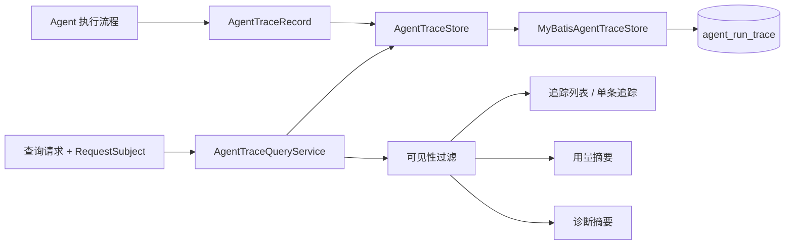
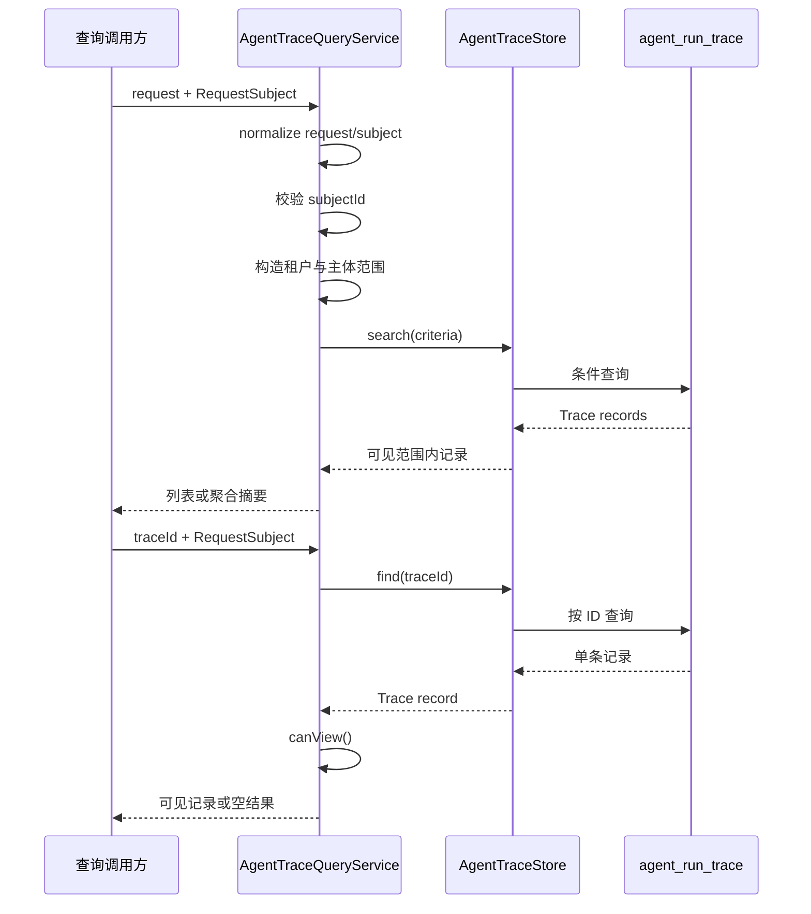

> 运行追踪记录使用 TraceStore 持久化，并通过查询服务提供追踪、诊断和用量摘要。

# Agent Trace 记录与查询

Agent Trace 模块负责记录一次 Agent 执行的可审计快照，并为后端主体提供受控的追踪查询、用量统计和诊断摘要。运行记录通过 `AgentTraceStore` 隔离持久化细节，当前提供基于 MyBatis 的数据库实现。

该模块保存的是安全化的运行元数据，不保存原始 Prompt 或模型输出。记录内容覆盖执行身份、计划与 Agent、Provider/Model、状态、成本、授权范围、证据引用、阶段耗时、Token 用量以及重试和 Provider fallback 等诊断事件。



图中 `AgentTraceQueryService` 是统一查询入口，所有列表和摘要查询都经过同一套主体与租户隔离逻辑；`AgentTraceStore` 则是持久化替换边界。

## 记录模型

`AgentTraceRecord` 是可持久化的 Java record，主要字段包括：

- `traceId`：追踪记录唯一标识。
- `planId`：来源运行计划标识。
- `createdAt`：创建时间。
- `tenantId`、`subjectType`、`subjectId`：租户和后端主体身份，用于数据隔离。
- `agentCode`：实际执行的 Agent。
- `providerName`、`modelCode`：本次选择的模型提供方和模型。
- `status`：执行状态。
- `estimatedCost`：本地预估成本。
- `actualUsage`：Provider 返回的 Prompt、Completion 和总 Token 用量。
- `actualCost`、`costKnown`：按部署价格计算的实际成本及其价格是否已知。
- `allowedToolScopes`、`allowedDataScopes`：本次运行允许使用的工具和数据范围，作为审计信息记录。
- `evidenceRefs`：运行使用的证据标识。
- `stageTimings`：阶段级耗时信息。
- `message`：安全执行消息。
- `diagnosticEvents`：安全诊断事件，例如重试和 Provider fallback。

`DiagnosticEvent` 使用稳定的 `eventType` 表示事件类型，同时记录涉及的 Provider、Model、尝试次数、是否仍可重试以及安全消息。其设计明确排除了原始 Prompt 和模型输出。

该记录提供两组向后兼容构造器：

- 未提供诊断事件时使用空事件列表。
- 未提供成本字段时使用 `actualCost = -1.0`、`costKnown = false`。

因此，历史 Trace 生产者可以继续创建记录，而不必立即补齐新增的诊断和成本字段。

## 持久化边界

`AgentTraceStore` 定义三个基本操作：

- `save(record)`：保存或更新一条追踪记录。
- `find(traceId)`：按追踪 ID 查找。
- `search(criteria)`：按已经确定后端范围的条件查询。

该接口注释保留了后续替换存储实现的扩展方向。当前 `MyBatisAgentTraceStore` 在 `math-agent.database.enabled=true` 时通过 Spring Repository 生效，并使用 `AgentRunTraceMapper` 操作 `agent_run_trace` 表。

保存流程具有幂等语义：

1. 根据 `traceId` 查询数据库中是否已有记录。
2. 不存在时执行插入。
3. 已存在时按 ID 更新。
4. 返回原始 `AgentTraceRecord`。

源码注释说明，一次运行可能先保存为 `RUNNING`，用于工具授权等运行前或运行中的审计，再用终态审计记录替换它。按 `traceId` 更新可以使 Worker 重试不会产生重复 Trace。

记录字段的数据库映射如下：

- 字符串列表字段以 JSON 数组保存，包括工具范围、数据范围和证据引用。
- 阶段耗时、实际用量、消息、诊断事件和成本字段统一保存于 `metadataJson`。
- 读取数据库实体时再将这些 JSON 内容转换回领域记录。

`planId` 有一个持久化边界：数据库字段按 96 个字符处理。超过长度时只保存前 96 个字符，以保留稳定任务前缀，避免内部诊断后缀导致已完成流程写入失败。完整任务身份由所属教学任务记录保留，因此 Trace 中的数据库 `planId` 可能只是原始运行标识的前缀。

## 查询调用链

查询服务接收不包含身份字段的 `AgentTraceQueryRequest`，身份由 `RequestSubject` 提供。列表、单条查询、用量摘要和诊断摘要都由 `AgentTraceQueryService` 统一处理。



### 列表查询

`list` 会：

1. 调用 `visibleRecords` 获取当前主体可见的 Trace。
2. 将 `AgentTraceRecord` 转换为 `AgentTraceResponse`。
3. 按 `traceId` 排序后返回。

存储层查询本身按 `created_at` 倒序排列，并限制为第一页结果。查询条件包括租户、主体类型、主体 ID、Agent、状态、完整 `planId` 和 `planIdPrefix`。因此，存储层负责时间倒序和数量限制，服务层最终又按 `traceId` 排序返回。

### 单条查询

`find` 首先校验主体身份，再通过 Store 按 `traceId` 查询，最后调用 `canView` 进行租户和所有者判断：

- Trace 的 `tenantId` 必须与当前主体一致。
- `admin` 可以查看同租户内的 Trace。
- 非管理员必须同时匹配 `subjectType` 和 `subjectId`。
- 不满足条件时返回空的 `Optional`，而不是暴露记录。

## 可见性与身份边界

`visibleRecords` 会规范化请求和主体，并要求主体具备非空的 `subjectId`。缺少真实主体 ID 时直接抛出：

```text
Agent trace query requires authenticated subject
```

查询范围始终包含当前主体的 `tenantId`：

- 管理员查询时不附加主体类型和主体 ID，因此可以查询同租户范围内的记录。
- 非管理员查询时附加当前主体的 `subjectType` 和 `subjectId`，只能查询自己的记录。

列表和两个摘要接口都复用 `visibleRecords`，保证聚合结果不会绕过列表查询的权限范围。单条查询虽然通过 Store 直接按 ID 查找，但随后仍执行相同的租户和主体可见性判断。

## 用量摘要

`usageSummary` 先获取可见 Trace，再汇总每条记录的 `actualUsage`：

- Prompt Token 求和。
- Completion Token 求和。
- Total Token 求和。
- 记录数量统计。
- 按 Provider/Model 分组统计用量。

响应同时包含当前租户、主体身份、请求中的 Agent 和状态过滤条件，使摘要能够明确对应的查询范围。Provider/Model 分组使用稳定组合键，并按最大 Token 用量优先排序，便于监控高用量模型。

该摘要基于 Provider 报告的实际用量，而不是 `estimatedCost` 或本地估算值。成本字段是否可用则由 Trace 中的 `actualCost` 与 `costKnown` 表示。

## 诊断摘要

`diagnosticSummary` 聚合可见 Trace 中的安全诊断事件，并统计以下指标：

- 诊断事件总数。
- JSON 解析失败次数。
- 已调度重试次数。
- 重试后恢复的运行次数。
- Provider 轮换次数。
- 模型调用失败次数。

统计同时生成全局总计和 Provider/Model 分组结果。分组结果首先按 JSON 解析失败次数降序排列，再按 Provider 名称和 Model 名称排序。

重试恢复计数通过 `recoveredAfterRetry(trace)` 判断；每条 Trace 的诊断事件先加入对应 Provider/Model 分组，再加入全局累计值。由此，单次运行可以同时贡献事件统计和“重试后恢复”统计。

## 关键状态与边界条件

- `RUNNING` 是运行过程中的中间状态，终态记录会按同一个 `traceId` 更新原记录。
- Worker 重试可能再次触发保存，因此保存操作必须保持按 ID 插入或更新的幂等行为。
- `traceId` 查找会拒绝 `null` 或空白输入；输入会先执行 `strip()`。
- 查询请求为空时，服务会构造默认请求并执行规范化。
- 查询主体为空时，代码会调用主体规范化；随后要求 `subjectId` 非空。
- 非管理员不能通过请求参数自行扩大主体范围，因为主体身份字段由 `RequestSubject` 注入查询条件。
- 跨租户 Trace 永远不可见，包括管理员主体。
- `actualCost = -1.0` 且 `costKnown = false` 表示没有匹配的 Provider/Model 价格配置，不应将其当作已知实际成本。
- 列表字段为 `null` 时保存为空 JSON 数组。
- 元数据中消息和诊断事件经过安全化处理，查询响应不会包含原始 Prompt 或模型输出。
- `planId` 超过数据库宽度时会截断，完整任务身份不由 Trace 单独承担。

## 扩展点

1. **替换存储实现**  
   通过实现 `AgentTraceStore`，可以将当前 MyBatis 数据库实现替换为其他持久化方式，而不改变查询服务的调用契约。

2. **扩展追踪字段**  
   新增运行元数据可以继续放入 `AgentTraceRecord` 及其数据库元数据映射。新增字段应同步考虑向后兼容构造器和旧记录读取时的默认值。

3. **扩展查询条件**  
   `AgentTraceQueryRequest`、`AgentTraceSearchCriteria` 和 `MyBatisAgentTraceStore.search` 构成查询条件扩展链。新增条件需要同时保持租户和主体范围约束。

4. **扩展诊断指标**  
   新增诊断事件类型后，可在 `DiagnosticAccumulator` 中增加对应计数，并同步扩展诊断摘要响应的聚合字段。

5. **扩展成本统计**  
   当前用量摘要按实际 Token 汇总，成本是否可信由 `costKnown` 标记。后续可以在保持未知成本语义的基础上增加 Provider/Model 成本聚合。

Sources: [AgentTraceRecord.java](backend-java/src/main/java/com/doob/mathagent/agent/service/AgentTraceRecord.java#L1-L123)  
Sources: [AgentTraceStore.java](backend-java/src/main/java/com/doob/mathagent/agent/service/AgentTraceStore.java#L1-L35)  
Sources: [MyBatisAgentTraceStore.java](backend-java/src/main/java/com/doob/mathagent/agent/service/MyBatisAgentTraceStore.java#L1-L279)  
Sources: [AgentTraceQueryService.java](backend-java/src/main/java/com/doob/mathagent/agent/service/AgentTraceQueryService.java#L1-L340)
