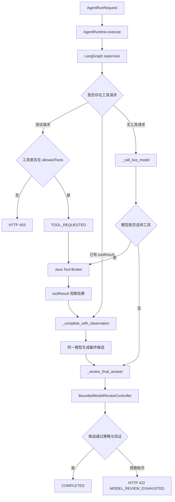

> Python 运行时负责 Agent 调用、模型评审策略和提供方诊断，模型评审策略由 JSON 配置参与控制。

# Python Agent 运行与模型评审

Python 运行时负责 Agent 的模型决策、受限工具请求、模型提供方调用和最终答案生成。Java 控制面保留身份、租户可见性及受保护数据访问；Python 只接收 `runId`、用户消息、允许使用的工具和可选工具观察结果。工具执行通过 Java Broker 完成，Python 不直接访问文件系统、数据库连接或提供方凭证。

模型评审由 `BoundedModelReviewController` 统一约束。评审策略从版本化的 `model_review_policy.json` 加载，控制节点资格、每节点调用预算、修复方式、最终强制评审、候选长度、阻断行为和允许的反馈代码。

## 模块职责

### `AgentRuntime`

`AgentRuntime` 是 Python Agent 的执行入口，使用 LangGraph 构造一个只有 `supervise` 节点的单监督图：

- `execute()` 将 `AgentRunRequest` 放入图状态并取得 `AgentRunResult`。
- `_supervise()` 判断当前回合属于工具请求、工具结果处理还是直接模型回答。
- `_call_live_model()` 按提供方路由调用 OpenAI-compatible 接口。
- `_complete_with_observation()` 将 Java 授权的工具观察结果交给同一模型生成最终答案。
- `_review_final_answer()` 对最终答案执行不带工具的强制模型评审。
- `_merge_usage()` 合并工具选择回合和最终回答回合的 token 与估算成本，避免提供方轮换隐藏部分消耗。

图状态仅包含 `request` 和 `result`。源码明确限制持久化图状态规模，源数据不通过路径进入 checkpoint。

### `BoundedModelReviewController`

`BoundedModelReviewController` 是通用的受限自评审控制器，不拥有教学语义。调用方提供：

- 模型调用函数 `invoke`
- 当前回合提示词生成函数
- 候选结果验证函数
- 可选的事件回调
- 可选的输入指纹

控制器负责：

- 解析完整候选或 JSON Patch 修复响应
- 限制评审回合预算
- 校验候选和评审包络
- 限制反馈代码为策略允许的固定值
- 保留当前候选并以窄范围 JSON Pointer Patch 修复
- 在配置要求时保留一个强制最终完整候选回合
- 在预算耗尽时抛出稳定的 `ModelReviewExhausted`

候选正文和评审文本不会进入返回的 checkpoint/event 元数据。可记录的信息包括节点、回合数、是否批准、反馈代码、候选哈希和输入指纹。

### 提供方调用与诊断

`_call_live_model()` 使用配置的提供方顺序逐一尝试，默认最多执行 `max_provider_calls` 次，构造函数会将该值限制为至少一次。路由可由构造参数提供，也可由环境变量：

- `MATH_AGENT_AI_RUNTIME_PROVIDER_ORDER`
- `MATH_AGENT_AI_RUNTIME_PROVIDER`
- `MATH_AGENT_AI_RUNTIME_MODEL`
- 各提供方专用模型和 Base URL 配置

源码支持 `openai`、`dashscope`、`deepseek` 和 `ark` 路由，并为各提供方读取对应 API Key。缺少 API Key 时记录形如 `provider:missing_key` 的失败诊断并继续尝试下一提供方。

模型请求携带：

- 当前用户消息或评审消息
- 当前回合是否允许工具
- 基于 `allowedTools` 构造的函数工具描述
- 由 Java 签名边界约束的 `maxOutputTokens`

工具描述只表达“请求 Java 执行授权工具”，Python 不自行执行受保护操作。

## Agent 调用链



关键节点如下：

1. `requestedTool` 只在 `MATH_AGENT_AI_RUNTIME_ALLOW_TEST_TOOL_REQUEST=true` 时生效，主要用于确定性传输测试；生产工具选择应来自模型调用。
2. 工具名称必须存在于请求的 `allowedTools`，否则直接返回 HTTP 403。
3. Java Broker 返回的观察结果被视为证据，而不是最终答案。Python 会把它重新交给模型，避免 Java 调用方变成隐藏的编排层，也避免原样暴露过多源内容。
4. 有工具调用时，Python会构造符合 OpenAI-compatible 协议的 assistant tool call 和 tool observation 消息，并使用固定的 `tool_call_id`。
5. 最终答案阶段关闭工具能力，防止模型在已经获得完整授权观察结果后继续发起工具调用。

## 请求与结果状态

`AgentRunRequest` 使用 Pydantic 严格解析，额外字段被拒绝。主要字段包括：

| 字段 | 作用 |
| --- | --- |
| `runId` | Java 侧身份和运行上下文反查所需的运行标识 |
| `allowedTools` | 本次运行允许模型选择的工具名称 |
| `message` | 用户输入，不能为空 |
| `maxOutputTokens` | 输出上限，范围为 1 到 32,000 |
| `toolResult` | Java 执行授权工具后返回的观察结果 |
| `requestedTool` | 仅用于测试的显式工具请求 |

`AgentRunResult` 的核心状态包括：

- `TOOL_REQUESTED`：模型或测试请求要求 Java 执行工具，结果中包含 `toolCall`。
- `COMPLETED`：最终答案已经通过模型评审，结果中包含 `message`。
- 评审耗尽不会伪造答案，而是转为 HTTP 422，错误详情为 `MODEL_REVIEW_EXHAUSTED`。
- 未授权工具请求转为 HTTP 403。

结果还可以包含 `provider_name`、`model_code` 和 `actual_usage`。`as_response()` 将状态、消息、工具调用和实际用量投影为外部响应；提供方名称和模型编码属于运行内部元数据，不会直接加入该响应方法生成的字典。

## 模型评审协议

评审模型只能返回受限 JSON 包络。最终答案评审要求的形状是：

```json
{
  "candidate": {
    "message": "final answer"
  },
  "review": {
    "approved": true,
    "feedbackCodes": []
  }
}
```

### 候选包络

`ModelFullEnvelope` 要求：

- `mode` 必须为 `full`
- `candidate` 必须是非空 JSON 对象或数组
- `review` 必须是 `ModelReviewDecision`

修复包络 `ModelPatchEnvelope` 要求：

- `mode` 必须为 `patch`
- `baseCandidateHash` 必须是 64 字符哈希
- 操作数量为 1 到 32
- 只允许 `add`、`remove`、`replace`
- JSON Pointer 必须指向非根路径
- 修复必须附带新的评审决策

最终 Agent 答案还会经过 `_validated_final_candidate()` 的领域级收敛校验：候选必须是对象，且必须包含非空字符串字段 `message`。

### 反馈代码

`ModelReviewDecision` 不接受自由文本反馈，只接受策略中声明的固定 `feedbackCodes`：

- `approved` 使用严格布尔值。
- 反馈代码最多六个。
- 代码必须属于选定 profile 的允许集合。
- 重复代码会被去重。
- 未知代码会导致验证失败。

这样可以使 checkpoint 和事件只携带可诊断的操作代码，不携带模型正文或评审描述。

## JSON 策略配置

`load_model_review_policy()` 从与运行时代码同目录的 `model_review_policy.json` 读取配置，并通过单项缓存只加载一次。配置错误被视为启动或编程错误，而不是运行时静默降级。

策略根节点必须包含 `profiles`，每个 profile 必须包含：

- `budget`
- `nodes`
- `repair`
- `blocking`
- `tool`
- `feedbackCodes`

预算存在强一致约束：

```text
globalTurns == len(nodes) * perNodeTurns
```

所有反馈代码必须是大写字符串。调用方通过 profile 名称选择策略；不存在的 profile 会抛出配置错误。

`BoundedModelReviewController` 初始化时还会检查节点是否属于该 profile 的 `nodes`。对于强制最终回合，策略必须保证：

```text
perNodeTurns == normalTurns + 1
```

在 `handout` profile 且启用强制最终回合时，控制器使用 Patch 修复；其它 profile 保留完整候选模式，兼容短响应场景。

## 评审运行状态与边界

控制器内部维护以下短生命周期状态：

- `active_candidate`：当前候选，只保留在控制器内部。
- `active_hash`：当前候选哈希，用于确保 Patch 基于正确版本。
- `feedback_codes`：上一轮评审返回的固定反馈代码。
- `usages`：每一轮模型调用的用量结果。
- `seen_states`：用于识别重复候选状态，避免无效循环。

评审流程从完整草稿开始。普通修复回合只接受 Patch；如果策略预留了最终回合，最后一轮必须重新提交完整且自评审通过的候选，并且即使此前回合格式错误也不能跳过。所有候选最终还必须通过调用方传入的确定性验证器。

主要边界条件包括：

- 配置文件缺失、JSON 损坏或结构不完整：加载失败并抛出运行时错误。
- profile 未配置或节点不在 profile 的允许节点中：拒绝创建评审控制器。
- 反馈代码不在策略集合中：候选包络验证失败。
- 候选为空、不是对象/数组，或 Agent 最终对象缺少非空 `message`：验证失败。
- Patch 使用不支持的操作或根路径：验证失败。
- 评审回合耗尽：抛出 `ModelReviewExhausted`，由 Agent 运行时映射为 HTTP 422。
- 所有配置提供方缺少凭证或调用失败：由提供方轮换逻辑收集失败诊断；若最终无法产生有效模型结果，运行不能正常完成。
- `allowedTools` 为空或最终评审阶段关闭工具时，模型只能生成直接答案。
- 输出 token 上限受请求字段和 Java 签名边界共同约束，避免单次生成占用不受控的执行窗口。

## 主要文件

| 文件 | 职责 |
| --- | --- |
| `ai-worker-python/app/agent_runtime.py` | Agent 请求模型、LangGraph 监督节点、Java 工具边界、模型调用、最终答案评审和用量合并 |
| `ai-worker-python/app/model_review_runtime.py` | 评审包络、Patch 协议、策略加载、预算控制、候选验证和安全评审元数据 |
| `ai-worker-python/app/model_review_policy.json` | 模型评审 profile、节点、预算、修复行为、阻断规则和反馈代码配置 |

## 扩展点

### 增加模型提供方

在提供方路由映射中增加：

- API Key 环境变量映射
- 默认 Base URL
- 默认或专用模型配置

同时保持 OpenAI-compatible 请求合同、最大提供方尝试次数和失败诊断格式不变。

### 增加 Agent 工具

工具名称由 Java 授权请求的 `allowedTools` 提供，Python 为工具生成函数描述和参数定义。新增工具必须继续通过 Java Broker 执行，不能在 Python 侧直接加入文件、数据库或租户数据访问。

### 增加评审 profile

在 `model_review_policy.json` 增加完整 profile，并满足必需字段、预算等式、节点列表和大写反馈代码约束。调用方以 profile 名称创建控制器，再提供适配该候选结构的提示词和确定性验证器。

### 增加候选结构

应扩展完整候选包络、Patch 验证和调用方验证器三处约束，同时保持候选正文不进入评审元数据。对于需要局部修复的结构，优先使用受限 JSON Pointer Patch，避免模型反复重写完整结果。

Sources: [ai-worker-python/app/agent_runtime.py](ai-worker-python/app/agent_runtime.py#L1-L260)  
Sources: [ai-worker-python/app/agent_runtime.py](ai-worker-python/app/agent_runtime.py#L131-L384)  
Sources: [ai-worker-python/app/model_review_runtime.py](ai-worker-python/app/model_review_runtime.py#L1-L280)  
Sources: [ai-worker-python/app/model_review_runtime.py](ai-worker-python/app/model_review_runtime.py#L166-L406)
