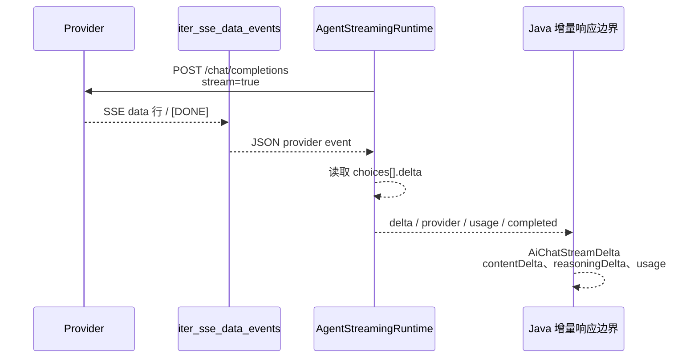

> Python 侧流式运行时、SSE 编码和 Java 的 AiChatStreamDelta 共同构成增量响应边界。

# 流式响应与 SSE

Python 侧的 `AgentStreamingRuntime` 负责把 OpenAI-compatible provider 的流式输出转换为统一的增量事件；`sse.py` 负责处理底层 SSE 分帧、JSON 拼接和编码；Java 侧的 `AiChatStreamDelta` 则定义了面向上层的单个增量响应结构。三者共同形成从 provider 字节流到产品可见响应的边界。



图中 Python 内部链路由源码直接实现；Java 的 `AiChatStreamDelta` 是增量响应的数据合同，具体 HTTP 流式适配调用方未在当前证据中展开。

## 模块职责

### `AgentStreamingRuntime`

文件：`ai-worker-python/app/streaming_runtime.py`

`AgentStreamingRuntime.stream()` 返回一个 Python 事件迭代器，事件以统一的 `{"event": ..., "data": ...}` 形式向外产生。一次运行通常经历以下阶段：

1. 发出 `started`，其中包含 `runId`。
2. 检查请求是否指定工具调用。
3. 若工具未被 `allowedTools` 授权，发出 `403` 类型的 `error` 并结束。
4. 若请求需要工具调用，发出 `tool_call`，等待 Java 工具代理返回结果，再继续模型流式生成。
5. provider 流开始后，发出 `provider`，标识实际使用的 provider、模型和尝试次数。
6. 将模型内容增量转换为 `delta` 事件。
7. 记录并发出 `usage`。
8. 根据是否需要延迟完成事件，发出 `internal_result` 或 `completed`。
9. 发生异常时，根据是否已经向用户输出内容决定是否允许 provider 轮换。

运行时同时负责 provider 轮换、工具调用片段合并、usage 统计和错误终止策略。源码明确将流式输出视为不可重写边界：一旦产生可见 delta，后续不能通过 review、重写或切换 provider 来替换已经发送的答案。

### `iter_sse_data_events`

文件：`ai-worker-python/app/sse.py`

`iter_sse_data_events()` 将 `requests.Response.iter_lines()` 提供的字节流还原成完整的 SSE `data` 事件，并输出事件载荷字符串。它处理以下 provider 行为：

- 显式以 UTF-8 解码响应字节，避免 relay 的错误 charset 导致中文内容损坏。
- 忽略以 `:` 开头的 SSE 注释行。
- 支持标准 `data:` 行和跨多行拆分的 JSON。
- 在空行处提交已缓存的事件。
- 支持通过直接拼接多行内容恢复非标准 relay 格式。
- 识别 `[DONE]`、`ping` 和 `keep-alive`。
- 对尚未完整的 JSON 暂存，对确定非法的 JSON 抛出解析错误。
- 单个缓存事件超过 `64 * 1024` 字节时抛出 `ValueError`，防止无限缓存。

`AgentStreamingRuntime._sse_json()` 在此基础上跳过 `[DONE]`，解析 JSON，并只向上层返回字典对象。

## Python 流式调用链

```mermaid
flowchart TD
    A[AgentStreamingRuntime.stream] --> B{请求是否指定工具}
    B -->|未授权| E[error 403]
    B -->|直接工具调用| C[tool_call]
    B -->|模型生成| D[_model_stream]
    D --> F[构造 provider payload]
    F --> G[POST chat/completions<br/>stream=true]
    G --> H[_sse_json]
    H --> I[iter_sse_data_events]
    I --> J[解析 choices[].delta]
    J --> K[delta content]
    J --> L[合并 tool_calls]
    J --> M[usage]
    K --> N[usage / completed]
    L --> O[internal_result 或 tool_call]
    O --> P[Java tool broker]
    P --> Q[最终模型流]
```

关键分支如下：

- **无工具结果的首次模型调用**：允许 provider 返回工具调用，因此完成事件会被延迟为 `internal_result`。如果结果中带有 `toolCall`，运行时发出 `tool_call`，调用 Java 工具代理，随后将工具观察结果加入消息并进行不允许工具调用的最终模型流。
- **已有工具结果的模型调用**：将授权工具观察结果追加到消息中，直接执行不允许工具调用的模型流。
- **不需要工具调用**：如果没有 `toolCall`，运行时在内部结果之后发出 `completed`，携带 `status=COMPLETED` 和累计 usage。

## 增量事件与关键状态

### `started`

表示运行已经进入流式运行时，数据中包含请求的 `runId`。它是运行级事件，不代表 provider 已经成功建立连接。

### `provider`

provider 请求成功建立并通过 HTTP 状态检查后产生，包含：

- `provider`
- `model`
- `attempt`

该事件用于标识当前实际尝试的 provider。Java 的执行服务仍保留身份、策略、预算、并发 lease 和 trace；provider 调用及回退由 `AgentRunClient` 交给 Python Worker。

### `delta`

模型返回非空 `choices[].delta.content` 时产生：

```json
{
  "event": "delta",
  "data": {
    "content": "..."
  }
}
```

运行时会将每个文本片段追加到 `content_parts`，用于后续 usage 兜底计算和结果汇总。已经发出的内容不会被重新组织或替换。

### `tool_call` 与 `tool_result`

工具调用参数可能跨多个 provider chunk 返回。运行时按工具调用索引聚合 `tool_calls` 片段，再规范化为完整工具调用。

完成聚合后：

1. 发出 `tool_call`。
2. 通过 `AgentRuntime._invoke_java_tool_broker()` 调用 Java 工具代理。
3. 发出只包含工具名称的 `tool_result`。
4. 将工具观察结果编码进后续模型消息。
5. 继续最终模型流。

工具权限在 Python 发起调用前检查，未授权工具直接以 `403` 结束。

### `usage`

provider 返回 usage 后，运行时结合当前 provider、模型和请求上下文计算 usage 与成本，并通过 `UsageLedger` 记录一次成功或失败尝试。对外 `usage` 事件包含 provider、model、usageSource 以及累计 usage 数据。

如果 provider 没有发送完整 usage，运行时通过请求消息和已收集内容计算 fallback token；具体 fallback 实现位于 usage 模块，当前证据只表明该策略参与 `_usage()` 和成本计算。

### `completed`

没有延迟完成时，正常模型流以如下语义结束：

```json
{
  "event": "completed",
  "data": {
    "status": "COMPLETED",
    "actualUsage": {}
  }
}
```

涉及工具调用的首次模型流不会立即发出 `completed`，而是返回 `internal_result`，由外层决定是否继续工具阶段或完成运行。

## provider 轮换与不可重写边界

`_model_stream()` 按 `_providers()` 返回顺序尝试 provider。配置缺失时记录 `provider:configuration` 并继续尝试；请求异常、JSON 错误或关键字段错误会记录失败 usage，并生成失败原因。

轮换规则取决于 `emitted_content`：

- **尚未产生可见内容**：允许发出 `provider_failed`，然后尝试下一个 provider。
- **已经产生可见内容**：不允许切换 provider。运行时发出 `503`，消息为 `provider stream interrupted after output`，并结束当前流。
- **所有 provider 都失败且尚未输出内容**：发出 `503` 的 `all providers failed`，同时返回失败列表。

这样可以避免第二个 provider 重新生成一份答案，造成浏览器端内容重复、冲突或无法判断边界。该策略也是流式系统中最重要的状态转换：`未可见输出` 一旦变为 `已可见输出`，恢复方式从 provider 轮换变为终止当前传输。

## Java 的 `AiChatStreamDelta`

文件：`backend-java/src/main/java/com/doob/mathagent/agent/service/AiChatStreamDelta.java`

`AiChatStreamDelta` 是 Java 侧表示单个真实 OpenAI-compatible SSE 增量的 record，字段包括：

- `providerName`：provider 名称。
- `modelCode`：模型标识。
- `reasoningDelta`：推理增量。
- `contentDelta`：可见答案增量。
- `promptTokens`：输入 token 数。
- `completionTokens`：输出 token 数。
- `totalTokens`：总 token 数。

推理和内容被刻意分开，使产品界面可以折叠推理过程而不延迟显示答案文本。token 字段只有在 provider 发送 usage 事件时才会填充，不能把普通 content delta 当作完整 usage。

`withProviderName()` 用 Java 后端确定的 provider 覆盖名称：传入 `null` 时写入空字符串，而不是信任 provider 响应中的 provider 字段。这与 Java 执行服务的职责边界一致：Java 保留身份和策略信息，Python 执行 provider 调用及 usage 处理。

## 边界条件

### SSE 格式异常

SSE 解析器允许一个 JSON 被拆成多个 `data:` 行，也允许部分 relay 将后续内容作为非 `data:` 行发送。只有被判断为“不完整”的 JSON 才会继续缓存；已经确定非法的 JSON 会抛出异常，并由流式运行时进入 provider 失败处理。

### UTF-8 内容

响应按 UTF-8 显式解码，且使用替换策略处理无法解码的字节。该处理重点保护中文标题等多字节内容，避免 `requests` 根据错误或缺失的 charset 推断为 ISO-8859-1。

### 空事件和心跳

空行提交缓存事件；注释行被忽略；`ping` 和 `keep-alive` 会先刷新已有缓存，再作为特殊值返回。`[DONE]` 由 SSE 解析器传递给上层后，在 `_sse_json()` 中跳过，不会被当作 JSON 事件处理。

### 缓存上限

单个 SSE 数据事件的 UTF-8 字节数不能超过 `64 KiB`。超限会抛出 `ValueError`，防止 provider 或 relay 持续发送未闭合 JSON 造成内存增长。

### 输出后失败

provider 在已经发送一个或多个 `delta` 后断开时，调用方只能收到终止性 `503`。此时不能依赖 provider 回退、重新审查或输出修复来恢复，因为浏览器已经观察到部分答案。

### Java 侧执行与持久化

Java `AgentRunExecutionService` 在调用 Python 前：

- 规范化请求和认证主体。
- 校验主体与计划策略。
- 检查预估预算。
- 获取并发 lease。
- 持久化 `RUNNING` trace，供受保护的 Java 工具代理解析授权。
- 通过 `AgentRunClient` 调用 Python Worker。

Python 返回后，Java 校验实际 usage，保存最终 trace，并将 provider、模型、状态、生成内容和实际 usage 投影到 `AgentRunExecuteResponse`。因此，增量传输和最终运行记录是两个不同层次：流式事件面向实时响应，trace 和执行响应面向运行完成后的持久化与查询。

## 扩展点

1. **增加 provider**  
   扩展 `_providers()` 和 `_provider_config()` 的 provider 配置即可复用同一套 SSE、usage 和轮换逻辑。需要保持“可见输出后不可轮换”的约束。

2. **适配 provider 的 SSE 变体**  
   优先扩展 `iter_sse_data_events()` 的分帧规则，保持 `_model_stream()` 只接收完整 JSON 字符串，避免 provider 特殊格式扩散到运行时业务逻辑。

3. **扩展增量类型**  
   可以在 `AiChatStreamDelta` 中继续区分推理、内容和其他 provider 增量，但应保持 reasoning 与 content 分离，并明确 usage 事件才是 token 统计的来源。

4. **扩展工具调用流**  
   工具参数需要继续按 `index` 聚合，并在进入 Java 工具代理前完成规范化和授权检查。工具调用后的最终模型请求应保持 `allow_tools=false`，避免工具阶段无限循环。

5. **扩展可观测性**  
   provider、attempt、usageSource、失败类型和 traceId 已经构成主要诊断维度。新增事件或字段时应同时考虑 Python 流事件、Java trace 记录和最终响应投影之间的一致性。

Sources: [ai-worker-python/app/streaming_runtime.py](ai-worker-python/app/streaming_runtime.py#L1-L127)  
Sources: [ai-worker-python/app/sse.py](ai-worker-python/app/sse.py#L1-L113)  
Sources: [backend-java/src/main/java/com/doob/mathagent/agent/service/AiChatStreamDelta.java](backend-java/src/main/java/com/doob/mathagent/agent/service/AiChatStreamDelta.java#L1-L30)  
Sources: [backend-java/src/main/java/com/doob/mathagent/agent/service/AgentRunExecutionService.java](backend-java/src/main/java/com/doob/mathagent/agent/service/AgentRunExecutionService.java#L18-L145)
