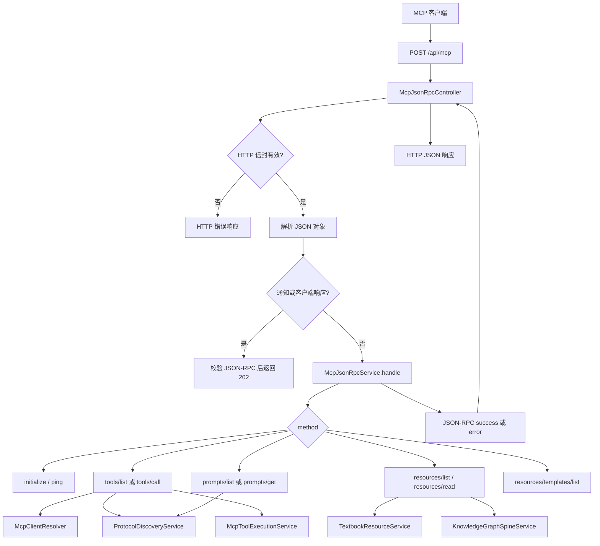

> McpJsonRpcController 和 McpJsonRpcService 处理 MCP JSON-RPC 请求，并连接发现、工具调用和资源能力。

# MCP JSON-RPC 入口

MCP 入口由 `McpJsonRpcController` 和 `McpJsonRpcService` 组成，对外提供单一的 Streamable HTTP 地址：

```text
POST /api/mcp
```

外部 MCP 客户端将该地址配置到 `mcpServers` 后，控制器负责 HTTP 和 JSON-RPC 外壳校验，服务负责 MCP 方法分派，并连接协议发现、工具执行和资源读取能力。

## 模块职责

### `McpJsonRpcController`

控制器位于 HTTP 边界，主要职责包括：

- 接收 `POST /api/mcp` 的 JSON 请求体。
- 校验 `Accept`、`MCP-Protocol-Version` 和 `Origin`。
- 将 JSON 文本解析为 JSON 对象，再转换为 `Map<String, Object>`。
- 处理协议版本响应头。
- 在进入服务前识别通知和客户端响应。
- 将 JSON 解析错误、非法 JSON-RPC 结构和 HTTP 信封错误转换为 HTTP 响应。
- 将普通请求交给 `McpJsonRpcService.handle(...)`。
- 对没有响应体的通知返回 `202 Accepted`。
- 对 `GET` 和 `DELETE` 返回 `405 Method Not Allowed`，因为该入口不提供独立 SSE 流，也不维护客户端可主动终止的会话。

控制器要求 MCP POST 请求的 `Accept` 头同时包含：

- `application/json`
- `text/event-stream`

当前实现虽然接受 Streamable HTTP 约定中的 SSE 媒体类型，但服务端本身不暴露独立的 SSE GET 流，普通请求仍以 JSON 响应返回。

### `McpJsonRpcService`

服务是 MCP JSON-RPC 的方法分派中心，负责：

- 校验 `jsonrpc` 必须为 `2.0`。
- 区分请求、通知和客户端响应。
- 根据 `method` 分派 MCP 能力。
- 生成 JSON-RPC 成功响应或错误响应。
- 根据客户端声明协商 MCP 协议版本。
- 通过 `ProtocolDiscoveryService` 提供工具、提示和资源描述。
- 通过 `McpToolExecutionService` 执行工具调用。
- 通过 `TextbookResourceService` 和 `KnowledgeGraphSpineService` 提供资源读取相关能力。
- 通过 `McpClientResolver` 解析注册的 MCP 客户端身份和访问配置。

服务构造时对这些依赖执行非空校验，因此协议入口的发现、工具、客户端解析和资源能力均属于必需组件。

## 请求调用链



关键节点如下：

1. **HTTP 边界校验**  
   控制器先校验来源、媒体类型和协议版本，未通过时不会读取或分派 JSON-RPC 方法。

2. **JSON-RPC 结构解析**  
   空请求体或无效 JSON 返回 `-32700`。解析结果必须是 JSON 对象，否则返回 `-32600`。当前入口不接受 JSON-RPC 批量数组。

3. **通知和响应处理**  
   没有 `id` 的方法消息被视为通知；没有 `method`、但包含 `result` 或 `error` 的消息被视为客户端响应。控制器会先验证其 JSON-RPC 2.0 结构，然后直接返回 `202 Accepted`，不生成 JSON-RPC 响应体。

4. **方法分派**  
   有 `id` 的请求进入服务，根据方法名选择初始化、发现、工具调用或资源操作。

5. **结果投影**  
   服务返回 JSON-RPC `result` 或 `error` 对象。控制器将其作为 `application/json` 返回，并带上协商后的 `MCP-Protocol-Version` 响应头。

## 支持的方法

`McpJsonRpcService` 当前显式分派以下方法：

| 方法 | 作用 | 主要依赖 |
| --- | --- | --- |
| `initialize` | 返回协议版本、服务信息和能力声明 | 服务自身的协议协商逻辑 |
| `ping` | 返回空结果，用于连通性检查 | 无外部能力依赖 |
| `tools/list` | 返回当前客户端可见的工具 | `McpClientResolver`、`ProtocolDiscoveryService` |
| `tools/call` | 调用 MCP 工具 | `McpClientResolver`、`McpToolExecutionService` |
| `prompts/list` | 返回提示描述 | `McpClientResolver`、`ProtocolDiscoveryService` |
| `prompts/get` | 获取指定提示 | `McpClientResolver`、`ProtocolDiscoveryService` |
| `resources/list` | 返回资源目录 | 客户端解析、资源服务和发现能力 |
| `resources/read` | 读取指定资源 | `TextbookResourceService`、`KnowledgeGraphSpineService` |
| `resources/templates/list` | 返回资源模板 | 当前固定返回空列表 |

未知方法返回 JSON-RPC 方法未找到错误 `-32601`。

## 初始化与能力声明

初始化响应固定包含：

- 协议版本。
- `tools` 能力。
- `prompts` 能力。
- `resources` 能力。
- 服务名称 `math-agent-rag`。
- 服务标题 `Math Agent RAG`。
- 服务版本 `0.1.0`。
- 面向 MCP 客户端的使用说明。

三类能力的 `listChanged` 均为 `false`，表示当前实现没有通过该入口声明动态能力目录变更。

协议版本支持：

```text
2025-11-25
2025-06-18
2025-03-26
```

其中：

- 最新版本为 `2025-11-25`。
- 未提供 HTTP 协议版本头时，控制器默认使用 `2025-03-26` 作为响应版本。
- 初始化参数中的 `protocolVersion` 会参与协商。
- 如果 HTTP 头和 `initialize.params.protocolVersion` 同时存在但不一致，请求会被拒绝。
- 不支持的 HTTP 协议版本在进入服务前返回错误。

## 访问控制与可见性

MCP 客户端通过 `Authorization` 请求头携带注册的 Bearer secret。服务将该凭据交给 `McpClientResolver`，再由客户端身份和配置参与发现及工具调用。

工具发现不是简单返回全部工具：

- 只有启用执行端点的工具会进入结果。
- 工具要求的角色必须包含当前客户端 profile 的小写形式。
- 工具执行继续交由既有的 `McpToolExecutionService`，而不是由 JSON-RPC 入口自行执行 Agent 逻辑。

因此，JSON-RPC 层负责协议映射，工具授权和具体执行仍位于客户端解析、访问策略及工具执行服务边界内。

## 关键状态

该入口表现为无会话的请求处理器：

- 控制器不保存 MCP session。
- `GET` 不用于建立或读取独立 SSE 流。
- `DELETE` 不用于终止客户端会话。
- 单次请求的身份来源于当前 `Authorization` 头。
- 协议版本由请求头或初始化参数决定，并通过响应头回传。
- 通知不产生服务端 JSON-RPC 响应，只返回 HTTP `202`。

客户端密钥注册、存储和访问策略由协议模块中的客户端密钥服务及相关策略组件承担；JSON-RPC 服务通过 `McpClientResolver` 使用这些能力，而不直接管理密钥生命周期。

## 边界条件与错误映射

### HTTP 层错误

| 条件 | HTTP 状态 | JSON-RPC 错误码 |
| --- | ---: | ---: |
| `Origin` 不允许 | `403` | `-32000` |
| `Accept` 未同时包含 JSON 和 SSE | `406` | `-32000` |
| 协议版本不支持 | `400` | `-32000` |
| JSON 无法解析 | `400` | `-32700` |
| 请求体不是 JSON 对象 | `400` | `-32600` |
| 初始化请求的版本头和参数冲突 | `400` | `-32600` |
| `GET` 或 `DELETE` | `405` | 无独立 JSON-RPC 方法分派 |

### 服务层错误

服务将方法执行异常转换为 JSON-RPC 错误：

- JSON-RPC 版本错误或缺少方法：`-32600`。
- 未知方法：`-32601`。
- 参数无效：`-32602`。
- 资源不存在：`-32002`。
- 其他参数或状态问题：`-32000`。

通知和客户端响应即使进入服务层，也不会生成普通响应对象；控制器会优先处理这类消息。

## 主要文件

- [McpJsonRpcController.java](backend-java/src/main/java/com/doob/mathagent/protocol/controller/McpJsonRpcController.java)  
  MCP HTTP 入口、请求信封校验、JSON 解析、通知处理和 HTTP 状态映射。

- [McpJsonRpcService.java](backend-java/src/main/java/com/doob/mathagent/protocol/service/McpJsonRpcService.java)  
  JSON-RPC 版本校验、方法分派、能力初始化和错误投影。

- [ProtocolDiscoveryService.java](backend-java/src/main/java/com/doob/mathagent/protocol/service/ProtocolDiscoveryService.java)  
  MCP 工具、提示和资源描述的来源。

- [McpToolExecutionService.java](backend-java/src/main/java/com/doob/mathagent/protocol/service/McpToolExecutionService.java)  
  工具调用的实际执行边界，以及已有的主体和允许列表检查。

- [McpClientResolver.java](backend-java/src/main/java/com/doob/mathagent/protocol/service/McpClientResolver.java)  
  根据 Authorization 凭据解析注册的 MCP 客户端。

- [TextbookResourceService.java](backend-java/src/main/java/com/doob/mathagent/resources/TextbookResourceService.java)  
  教材资源摘要和读取能力的外部依赖。

- `KnowledgeGraphSpineService`  
  精选知识图谱脊柱资源的读取依赖。

## 扩展点

新增 MCP 能力时，主要扩展位置是 `McpJsonRpcService.handle(...)` 的方法分派和对应结果构造逻辑。扩展应同时明确：

1. 方法参数如何校验，以及参数错误映射为何种 JSON-RPC 错误。
2. 能力描述是否由 `ProtocolDiscoveryService` 暴露。
3. 工具调用是否必须经过 `McpClientResolver` 和既有执行服务。
4. 资源读取是否需要新增受控资源服务，而不是在 JSON-RPC 层直接访问文件或后端。
5. 新能力是否需要加入 `initialize` 的 capabilities 声明。
6. 通知语义和无响应请求是否仍保持 `202 Accepted` 行为。
7. 协议版本新增时，HTTP 版本校验和初始化协商是否同步更新。

当前入口适合继续承载同步、只读式 MCP 能力。长耗时或流式能力需要额外设计响应传输和生命周期语义，不能仅通过增加一个 `switch` 分支完成。

Sources: [McpJsonRpcController.java](backend-java/src/main/java/com/doob/mathagent/protocol/controller/McpJsonRpcController.java#L1-L332), [McpJsonRpcService.java](backend-java/src/main/java/com/doob/mathagent/protocol/service/McpJsonRpcService.java#L1-L420), [McpToolExecutionService.java](backend-java/src/main/java/com/doob/mathagent/protocol/service/McpToolExecutionService.java#L1-L80), [ProtocolDiscoveryService.java](backend-java/src/main/java/com/doob/mathagent/protocol/service/ProtocolDiscoveryService.java#L1-L80)
