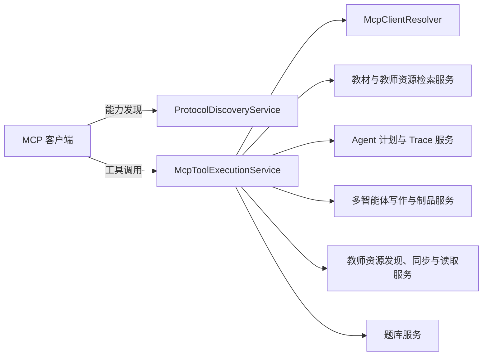

> 协议发现服务生成工具、资源和提示描述，工具执行服务负责调用具体 Agent 工具能力。

# MCP 工具发现与执行

MCP 协议层由两个核心服务组成：

- `ProtocolDiscoveryService`：生成 MCP 客户端可读取的能力目录，包括工具、资源和提示描述，并负责渲染后端拥有的协议配置。
- `McpToolExecutionService`：接收工具调用请求，根据工具名分派到教材检索、教师资源、题库、Agent 运行计划、追踪查询、飞书资源和多智能体写作等后端能力。

该页面聚焦 MCP 协议侧的能力发现与执行。JSON-RPC 请求入口由相邻的 MCP JSON-RPC 页面负责接收，本页关注入口之后的发现和工具调用服务。

## 架构关系

`ProtocolDiscoveryService` 是静态能力目录的提供者；`McpToolExecutionService` 是动态执行门面。执行服务通过依赖注入连接具体领域服务，并使用专用的 `mcpRetrievalTaskExecutor` 承载工具执行相关任务。

## 协议发现服务

### 静态能力目录

`ProtocolDiscoveryService` 被声明为 Spring `@Service`，并以只读方式提供 MCP 和 A2A 的发现元数据。工具描述由 `mcpTools()` 返回，每个工具包含：

- 工具名称和显示名称；
- 工具用途说明；
- 是否需要认证或允许调用；
- 允许的角色；
- 所需权限范围；
- 风险级别；
- 工具输入 JSON Schema。

已定义的工具覆盖以下能力：

| 能力类别 | 工具示例 | 主要用途 |
| --- | --- | --- |
| 证据检索 | `search_multi_source_evidence` | 并行搜索显式选择的一个或多个逻辑资源库 |
| 教材检索 | `search_textbook_evidence` | 搜索公共教材证据 |
| 教师资源 | `search_teacher_resource_evidence`、`list_teacher_resources`、`read_teacher_resource_blocks` | 搜索、列出和读取可见教师资源 |
| 题库 | `search_question_bank_items` | 查询可读题目及其已存答案 |
| Trace 查询 | `get_teaching_ai_trace`、`get_ai_diagnostic_summary`、`get_multi_agent_writing_trace` | 查询教学 Agent 或多智能体写作的安全追踪信息 |
| Agent 计划 | `plan_agent_run` | 生成 Agent 路由、模型和工具指导，但不执行任务 |
| 多智能体写作 | `start_multi_agent_writing` 及状态、制品、导出、恢复相关工具 | 启动和管理可恢复的教师手册写作流程 |
| 外部教师资源 | `discover_feishu_resources`、`download_feishu_resource` | 发现和下载飞书资源 |

工具描述中的角色和权限是能力目录的一部分。例如：

- 教材证据搜索允许 `student`、`teacher`、`admin`；
- 教师资源和题库工具限定为 `teacher`、`admin`；
- 教师资源工具需要 `teacher-resource:read`；
- Agent 计划工具需要 `agent:plan`；
- Trace 查询工具需要 `agent-trace:read`。

这使 MCP 客户端能够在调用前了解工具的授权要求和输入约束，实际访问控制仍由执行链路中的认证主体及领域服务负责。

### 输入约束

发现服务通过 Schema 明确表达关键边界：

- `search_multi_source_evidence` 要求提供 `library` 或 `libraries`，禁止隐式扩展搜索语料；
- 教材搜索要求指定教材逻辑库；
- 教师资源搜索支持 `permissionScopes`、`documentIds`、`sourceTypes` 和 `tags` 等过滤条件；
- 读取教师资源时必须提供物理 FILE 文档 ID，支持基于 `afterBlockOrder` 的游标读取，或基于 `centerBlockOrder` 与 `radius` 的有限证据窗口；
- `plan_agent_run` 支持 Agent、任务类型、模型偏好、Token 预算、公式和 JSON 输出要求，以及请求或禁用的工具、数据范围。

工具描述还明确声明了服务端约束。例如教师资源块读取的 `limit` 会由服务端限制，资源列表不会暴露存储路径。

### 启动期解耦

`ProtocolDiscoveryService` 提供无参构造函数，并保留一个兼容旧测试和直接实例化场景的 `McpClientResolver` 构造函数，但该参数会被有意忽略。

原因是发现元数据本身是静态的，不应在启动时强制初始化 MCP 客户端解析、会话主体解析和密钥服务依赖。这样可以避免密钥管理 Bean 创建期间形成循环启动依赖，也避免协议发现因运行时解析器尚未就绪而无法启动。

## 工具执行服务

### 统一执行门面

`McpToolExecutionService` 被声明为 Spring `@Service`，其职责是执行一组明确允许暴露给外部本地客户端的 MCP 工具。服务通过工具名称常量维护分派边界，包括：

- 多源、教材和教师资源检索；
- 教师资源列表、原始块读取和同步；
- 题库查询；
- 教学 Agent Trace 和诊断摘要；
- Agent 运行计划；
- 飞书资源发现与下载；
- 多智能体写作的启动、状态查询、Trace 查询、制品读取、导出和恢复。

执行服务不是具体领域能力的实现，而是 MCP 参数与后端服务之间的适配层。它注入并协调以下主要依赖：

- `TextbookRetrievalService`：教材检索；
- `TeacherResourceBlockSearchService`：教师资源块搜索；
- `TeacherResourceService`：教师资源领域操作；
- `TeacherFeishuDiscoveryService`：飞书资源发现；
- `TeacherSourceSyncJobService` 和 `TeacherSourceSyncExecutionService`：教师资源同步任务；
- `KnowledgeQuestionBankService`：题库查询；
- `AgentRunPlanService`：Agent 运行规划；
- `AgentTraceQueryService`：Trace 和诊断查询；
- `HandoutTaskFacade`、`MultiAgentWritingService` 和 `MultiAgentWritingArtifactExportService`：多智能体写作任务、运行结果和制品导出；
- `McpClientResolver`：MCP 客户端相关解析；
- `TaskExecutor`：工具执行任务调度。

构造函数对关键依赖执行非空校验，缺失依赖会在服务创建时直接失败，而不是延迟到第一次工具调用时才暴露。

### Agent 能力调用

`plan_agent_run` 的职责是规划，不是执行。它接受 Agent 标识、自然语言任务、任务类型、模型偏好、Token 估算、预算以及工具和数据范围等参数，返回路由、模型和工具指导。

这条边界将“是否以及如何运行 Agent”与“实际执行 Agent”区分开来。工具调用层可以先获取运行计划，再由其他 Agent 运行链路负责真正执行，从而保留模型选择、预算控制和工具范围校验的扩展空间。

### 多智能体写作调用

多智能体写作工具通过 `HandoutTaskFacade`、`MultiAgentWritingService` 和制品导出服务连接写作后端：

- 启动工具创建或触发可恢复的写作流程；
- 状态和 Trace 工具读取工作流运行状态及安全追踪；
- 制品工具读取或导出生成结果；
- 恢复工具重新进入既有工作流。

源码注释明确指出，旧版 MCP 写作工具通过 `HandoutTaskFacade` 复用教学任务授权和 Python v2 适配器。因此，MCP 层不直接承担 Python 运行时协议细节，而是沿用既有任务门面进入标准写作执行链路。

## 关键状态与边界

### 认证主体与可见性

工具描述中使用角色和权限范围表达静态授权要求，实际数据可见性还依赖认证主体。例如：

- 教师资源列表只返回认证 MCP 主体可见的资源；
- 教师资源读取要求目标 FILE 文档对当前主体可见；
- Trace 查询要求任务或工作流属于当前主体可读取的范围；
- 存储路径和 ROOT 资源不会通过工具结果暴露。

因此，MCP 工具不能仅根据客户端传入的 ID 判断访问合法性，调用链必须继续执行主体、角色、权限和资源归属校验。

### 资源选择必须显式

多源和教师资源搜索要求客户端显式指定 `library` 或 `libraries`。该约束防止一次调用隐式扩展到所有语料库，也使权限范围、检索成本和结果来源保持可解释。

教师资源搜索还允许传入权限范围、文档 ID、来源类型和标签。这些过滤器是检索提示，不代表客户端可以绕过后端授权读取对应资源。

### 读取窗口受限

教师资源块读取支持两种定位方式：

- 使用 `afterBlockOrder` 进行稳定的增量读取；
- 使用 `centerBlockOrder` 和 `radius` 获取有限证据窗口。

`limit` 由服务端限制。该设计控制单次 MCP 响应大小，并避免将整份资源或底层存储结构暴露给外部客户端。

### 工具执行与异步边界

执行服务注入限定名为 `mcpRetrievalTaskExecutor` 的任务执行器，说明工具执行包含独立的任务调度边界。检索、资源读取等工具可以通过该执行器隔离调用线程；多智能体写作则进入可恢复的后端任务或工作流，而不是要求 MCP 请求持续承载完整生成过程。

## 主要文件

- [ProtocolDiscoveryService.java](backend-java/src/main/java/com/doob/mathagent/protocol/service/ProtocolDiscoveryService.java#L19-L60)：协议发现服务职责、启动期解耦和工具目录入口。
- [ProtocolDiscoveryService.java](backend-java/src/main/java/com/doob/mathagent/protocol/service/ProtocolDiscoveryService.java#L60-L127)：多源、教材和教师资源检索工具及输入 Schema。
- [ProtocolDiscoveryService.java](backend-java/src/main/java/com/doob/mathagent/protocol/service/ProtocolDiscoveryService.java#L128-L213)：资源读取、题库、Trace 和 Agent 计划工具描述。
- [McpToolExecutionService.java](backend-java/src/main/java/com/doob/mathagent/protocol/service/McpToolExecutionService.java#L56-L98)：工具执行服务的工具名称集合、依赖和职责说明。
- [McpToolExecutionService.java](backend-java/src/main/java/com/doob/mathagent/protocol/service/McpToolExecutionService.java#L99-L132)：生产构造函数、领域服务注入和依赖校验。
- [McpToolExecutionService.java](backend-java/src/main/java/com/doob/mathagent/protocol/service/McpToolExecutionService.java#L134-L150)：面向检索测试夹具的兼容构造函数。

## 扩展点

新增 MCP 工具时，需要同时扩展两个边界：

1. 在 `ProtocolDiscoveryService.mcpTools()` 中增加工具描述、角色、权限、风险级别和输入 Schema。
2. 在 `McpToolExecutionService` 中增加工具名称常量、领域服务依赖以及对应的调用分支。

扩展时应保持以下约束：

- 发现元数据保持可启动，不把运行时解析器或密钥服务引入发现服务构造过程；
- 工具参数通过结构化 Schema 声明，尤其是资源库、文档 ID、游标和预算字段；
- 实际资源访问继续交给领域服务完成主体和权限校验；
- 资源读取保持有限窗口和服务端数量上限；
- Agent 规划与实际执行保持分离；
- 长耗时写作能力复用任务门面和可恢复工作流；
- 新工具使用专用执行器或既有执行边界，避免在 MCP 门面中复制领域实现。

Sources: [ProtocolDiscoveryService.java](backend-java/src/main/java/com/doob/mathagent/protocol/service/ProtocolDiscoveryService.java#L19-L60), [ProtocolDiscoveryService.java](backend-java/src/main/java/com/doob/mathagent/protocol/service/ProtocolDiscoveryService.java#L120-L213), [McpToolExecutionService.java](backend-java/src/main/java/com/doob/mathagent/protocol/service/McpToolExecutionService.java#L56-L98), [McpToolExecutionService.java](backend-java/src/main/java/com/doob/mathagent/protocol/service/McpToolExecutionService.java#L99-L150)
