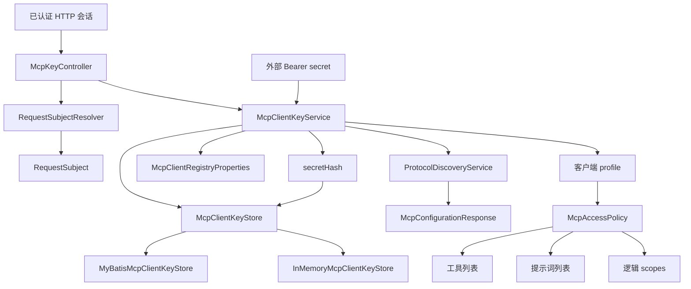

> 客户端密钥服务、存储实现、客户端解析器和访问策略构成 MCP 客户端认证及授权边界。

# MCP 客户端密钥与访问策略

MCP 客户端认证及授权边界由四部分组成：

- `McpKeyController`：面向已登录后端用户提供客户端密钥生命周期接口。
- `McpClientKeyService`：生成、查询、撤销密钥，并将外部 Bearer 密钥解析为可执行的 MCP 客户端身份。
- `McpClientKeyStore` 及其实现：持久化账户所属密钥，支持数据库实现和内存实现。
- `McpAccessPolicy`：根据后端主体角色决定可用工具、提示词和逻辑权限范围。

其中，管理密钥的请求依赖后端会话主体；MCP 外部调用则通过 Bearer secret 解析客户端配置。密钥本身不以明文持久化，而是以哈希值参与匹配。

## 模块职责

### `McpKeyController`

控制器暴露四个密钥管理接口：

| 接口 | 作用 |
| --- | --- |
| `GET /api/mcp/keys` | 查询当前认证账户拥有的全部 MCP 密钥 |
| `POST /api/mcp/keys` | 创建新的 MCP 密钥 |
| `POST /api/mcp/keys/{keyId}/revoke` | 撤销当前账户拥有的指定密钥 |
| `GET /api/mcp/configuration/me` | 获取当前账户最新活动密钥对应的 MCP 配置 |

控制器通过 `RequestSubjectResolver` 从 HTTP 请求解析后端会话主体，并要求主体存在、规范化后的 `subjectId` 非空。未通过认证时返回 `401 Unauthorized`。服务层抛出的参数或状态错误会被转换为 `400 Bad Request`。

创建密钥和生成配置时，控制器会传入 MCP 公共地址。该地址优先来自部署配置 `math-agent.mcp.public-url`，并经过规范化；控制器注释明确指出，开发代理或反向代理可能重写 `Host`，因此不能始终可靠地从请求头推断外部 MCP 地址。

### `McpClientKeyService`

服务同时承担密钥生命周期管理和客户端解析职责，并实现 `McpClientResolver`。

创建密钥时，服务执行以下步骤：

1. 验证并规范化当前 `RequestSubject`。
2. 生成 UUID 形式的 `keyId`。
3. 使用 `SecureRandom` 生成随机 secret。
4. 对 secret 计算哈希值。
5. 生成密钥名称，并记录租户、所属主体、主体角色和时间信息。
6. 以 `active` 状态保存 `McpClientKeyRecord`。
7. 返回创建结果，其中包含原始 secret、secret 预览值和 MCP 配置。

原始 secret 只在创建响应中返回；记录中保存的是 `secretHash` 和 `secretPreview`。因此，后续列表接口和配置接口只能使用预览值，不能重新还原原始 secret。

列表操作按当前主体的 `tenantId` 和 `subjectId` 查询密钥，并将领域记录转换为响应对象。响应包含密钥状态、预览值、创建时间、最近使用时间和撤销时间等信息。

当前配置接口只选择当前账户密钥列表中的第一个活动密钥。数据库存储实现按创建时间倒序返回，因此该接口实际使用最新创建的活动密钥；如果没有活动密钥，则抛出“当前用户没有活动 MCP 密钥”的错误。

撤销操作同样绑定当前租户和主体，只允许撤销该主体拥有的活动密钥。撤销成功后状态变为 `revoked` 并记录撤销时间；如果没有匹配到所属主体的活动密钥，则返回错误。

### 客户端解析

`McpClientResolver` 定义了从原始 Bearer secret 查找启用客户端的最小接口：

```java
Optional<McpClientRegistryProperties.Client> findEnabledClientBySecret(String secret)
```

`McpClientKeyService` 的解析顺序是：

1. 对传入 secret 计算哈希。
2. 在密钥存储中查找活动账户密钥。
3. 如果命中，更新该密钥的 `lastUsedAt`。
4. 将密钥记录转换为客户端配置。
5. 如果持久化密钥未命中，再回退到部署配置中的客户端注册表。

持久化密钥优先于部署拥有的客户端。部署配置客户端使用哈希形式的 secret，主要用于用户尚未创建数据库密钥时的本地 WorkBuddy 或集成探针等场景。该回退机制使系统同时支持账户自助创建的密钥和部署级预配置客户端。

### 存储抽象与实现

`McpClientKeyStore` 是账户所属 MCP 密钥的持久化抽象，包含以下操作：

- 创建密钥记录。
- 按 secret 哈希查找活动密钥。
- 按租户和所有者列出密钥。
- 按租户、所有者和 `keyId` 查找密钥。
- 更新最近使用时间。
- 原子撤销活动密钥。

`MyBatisMcpClientKeyStore` 在 `math-agent.database.enabled=true` 时启用，并被声明为主要实现。它通过 `McpClientKeyMapper` 操作 `McpClientKeyEntity`：

- 活动密钥解析同时约束 `secretHash` 和 `status = active`。
- 列表查询约束租户和所有者，并按 `createdAt` 倒序排列。
- 撤销更新同时约束租户、所有者、密钥 ID 和活动状态，只有实际更新了记录才返回成功。
- 最近使用时间按 `keyId` 更新。

代码库还提供 `InMemoryMcpClientKeyStore`，可作为非数据库环境或测试场景的存储实现。新增其他存储后端时，应保持 `McpClientKeyStore` 的所有者隔离、活动状态过滤和撤销语义。

## 调用链



关键节点含义：

- `RequestSubjectResolver` 只负责从会话请求中解析后端身份，密钥服务负责进一步验证主体是否可用。
- `McpClientStore` 隔离存储实现，数据库开关决定是否启用 MyBatis 实现。
- `McpClientKeyService` 是密钥管理和外部 secret 解析的汇合点。
- `McpAccessPolicy` 不负责保存密钥，而是根据解析出的客户端角色生成授权能力集合。
- `ProtocolDiscoveryService` 在生成账户 MCP 配置时参与配置描述构建。

## 关键状态

密钥生命周期目前使用两个明确状态：

- `active`：可被 secret 解析，并可用于生成当前配置。
- `revoked`：不可再通过活动密钥查询匹配，也不能再次撤销。

密钥记录还维护以下时间状态：

- `createdAt`：创建时间。
- `updatedAt`：记录更新时间。
- `lastUsedAt`：成功通过持久化密钥解析后的最近使用时间。
- `revokedAt`：撤销时间。

部署配置中的客户端不经过账户密钥表，因此其使用时间不会通过 `McpClientKeyStore.updateLastUsedAt` 记录。该差异是持久化账户密钥与部署级客户端之间的重要行为边界。

## 访问策略

`McpAccessPolicy` 将后端角色规范化为三个 profile：

- `admin`
- `teacher`
- `student`

角色比较会先去除首尾空白并转为小写。无法识别的角色，包括空值，默认归入 `student`。因此，角色字段异常时不会自动获得教师或管理员能力。

### 工具权限

学生工具集合包括：

- `search_textbook_evidence`
- `get_teaching_ai_trace`
- `get_ai_diagnostic_summary`
- `plan_agent_run`

教师在学生能力基础上增加：

- 多来源和教师资源检索
- 教师资源列表及内容读取
- 多智能体写作的启动、查询、读取、导出和恢复
- 飞书资源发现与下载

管理员工具集合与教师基本一致，并额外包含：

- `search_question_bank_items`

### 提示词权限

学生可见：

- `student_blank_handout_writer`
- `solution_reviewer`

教师和管理员可见：

- `teacher_handout_writer`
- `student_blank_handout_writer`
- `solution_reviewer`

### 逻辑 scopes

学生 scopes：

- `PUBLIC_TEXTBOOK`
- `agent-trace:read`
- `agent:plan`

教师 scopes 在此基础上增加教师资源和写作能力：

- `teacher-resource:read`
- `teacher-resource:sync-execute`
- `agent-writing:execute`
- `agent-writing:read`
- `agent-writing:export`

管理员 scopes 在教师能力基础上增加：

- `question-bank:read`

工具、提示词和 scopes 是三套独立集合。调用方需要根据具体能力使用相应集合，不应假设拥有某个工具就必然拥有同名或对应的逻辑 scope。

## 所有者隔离与边界条件

密钥管理始终以规范化后的会话主体为边界：

- 创建时，密钥记录绑定当前主体的租户、主体 ID 和角色。
- 列表时，只查询当前租户和当前主体拥有的记录。
- 撤销时，更新条件同时包含租户、主体、密钥 ID 和活动状态。
- 当前配置只从当前主体自己的活动密钥中选择。
- 未认证或主体 ID 为空时，管理接口拒绝请求。
- 已撤销密钥不会被活动密钥解析逻辑接受。
- secret 解析未命中持久化密钥时，才检查部署级配置客户端。
- 持久化密钥命中后优先返回，即使部署注册表中也存在匹配配置。
- 未知角色默认使用学生策略，避免因角色值异常而扩大权限。

此外，`currentConfiguration` 依赖存储实现的排序契约来选择“最新”密钥。MyBatis 实现按创建时间倒序返回；如果替换存储实现，应保持这一排序语义，或在服务层显式排序，避免当前配置选择结果不一致。

## 扩展点

### 增加存储后端

实现 `McpClientKeyStore` 即可接入新的持久化方式。实现需要保持：

- secret 仅按哈希匹配。
- 只允许活动密钥参与认证解析。
- 所有者查询必须同时约束租户和主体。
- 撤销操作必须具备活动状态条件，并返回是否实际变更。
- 成功解析持久化密钥后支持更新最近使用时间。

### 扩展部署级客户端

`McpClientRegistryProperties` 提供部署拥有客户端的配置入口。该路径适合预置集成客户端，不替代账户密钥生命周期管理。部署客户端应以哈希 secret 配置，并提供 profile、租户和所有者等客户端属性，使其能够进入统一的访问策略计算。

### 扩展角色策略

新增角色或调整能力时，应同步评估：

- `normalizeProfile` 的角色归一化规则。
- 工具集合。
- 提示词集合。
- scopes 集合。
- 客户端记录转换时的 profile 映射。

角色默认回退到学生策略，因此新增角色必须显式加入归一化逻辑，否则会静默获得学生权限而不是预期权限。

### 扩展协议配置生成

账户密钥配置通过 `ProtocolDiscoveryService.mcpConfiguration(...)` 生成。需要调整 MCP 客户端配置内容时，应沿着 `configurationForRecord` 到发现服务的调用边界扩展，而不是在控制器中重复拼装配置。

## 主要文件

- [McpKeyController.java](backend-java/src/main/java/com/doob/mathagent/protocol/controller/McpKeyController.java#L22-L104)：密钥管理 REST 接口、会话主体解析和公共 MCP 地址处理。
- [McpClientKeyService.java](backend-java/src/main/java/com/doob/mathagent/protocol/service/McpClientKeyService.java#L19-L158)：密钥生命周期、secret 解析、持久化优先级和配置生成。
- [McpClientResolver.java](backend-java/src/main/java/com/doob/mathagent/protocol/service/McpClientResolver.java#L5-L17)：从 Bearer secret 解析启用客户端的接口契约。
- [McpClientKeyStore.java](backend-java/src/main/java/com/doob/mathagent/protocol/service/McpClientKeyStore.java#L7-L40)：账户密钥存储抽象。
- [MyBatisMcpClientKeyStore.java](backend-java/src/main/java/com/doob/mathagent/protocol/service/MyBatisMcpClientKeyStore.java#L14-L118)：基于 MyBatis 的数据库实现。
- [McpAccessPolicy.java](backend-java/src/main/java/com/doob/mathagent/protocol/service/McpAccessPolicy.java#L5-L105)：角色规范化以及工具、提示词和 scopes 策略。
- `backend-java/src/main/java/com/doob/mathagent/protocol/service/InMemoryMcpClientKeyStore.java`：内存密钥存储实现。
- `backend-java/src/main/java/com/doob/mathagent/protocol/entity/McpClientKeyEntity.java`：数据库密钥实体。
- `backend-java/src/main/java/com/doob/mathagent/protocol/mapper/McpClientKeyMapper.java`：密钥实体的数据访问 Mapper。

Sources: [McpClientKeyService.java](backend-java/src/main/java/com/doob/mathagent/protocol/service/McpClientKeyService.java#L19-L158), [McpClientKeyStore.java](backend-java/src/main/java/com/doob/mathagent/protocol/service/McpClientKeyStore.java#L7-L40), [MyBatisMcpClientKeyStore.java](backend-java/src/main/java/com/doob/mathagent/protocol/service/MyBatisMcpClientKeyStore.java#L14-L118), [McpAccessPolicy.java](backend-java/src/main/java/com/doob/mathagent/protocol/service/McpAccessPolicy.java#L5-L105), [McpClientResolver.java](backend-java/src/main/java/com/doob/mathagent/protocol/service/McpClientResolver.java#L5-L17), [McpKeyController.java](backend-java/src/main/java/com/doob/mathagent/protocol/controller/McpKeyController.java#L22-L104)
