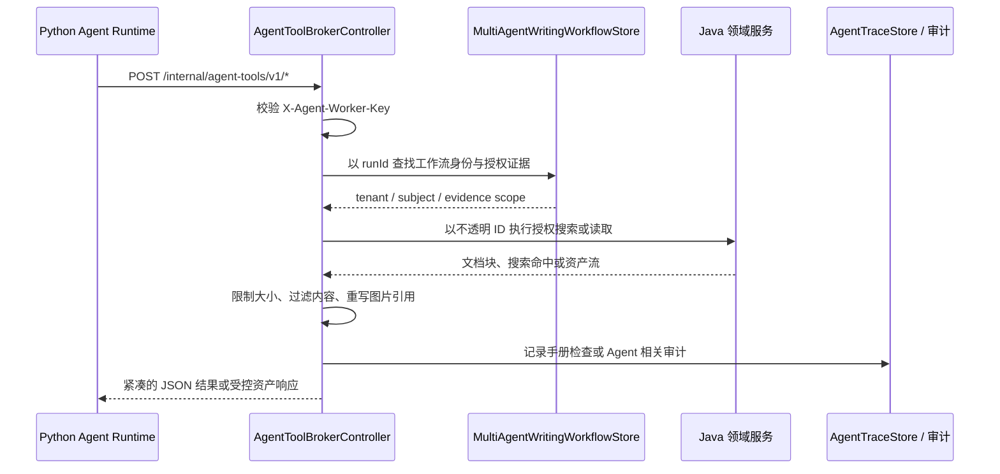

> Agent Tool Broker 暴露资源读取、资产读取和搜索请求，将外部工具调用映射到后端 Agent 与知识能力。

# Agent Tool Broker

Agent Tool Broker 是 Java 控制面提供给 Python Agent 运行时的内部工具桥接层。它位于外部 Agent 工具调用与受保护的 Java 领域服务之间，负责将资源搜索、文档块读取、页面读取、资产读取及手册上下文请求映射到教师资源、教材、数学论文语料和手册工作流能力。

该模块的核心实现是 `AgentToolBrokerController`，路由前缀为：

```text
/internal/agent-tools/v1
```

控制器明确定位为 Python Agent runtime 与 Java 领域服务之间的内部桥接器。Python 侧只能提交已经解析的运行身份和不透明资源标识，不能直接提供文件系统路径、任意 URL 或浏览器授权值。

## 模块职责

Broker 主要承担以下职责：

- 校验 Python Worker 的共享密钥。
- 根据 `runId` 从 Java 持久化工作流中恢复租户、主体类型和主体身份。
- 将不透明的 `documentId`、`documentRef` 或 `assetId` 转换为受授权的领域读取操作。
- 连接教师资源搜索和资产服务。
- 连接教材授权块读取器。
- 连接规范化数学论文的授权块读取器和图资产服务。
- 为手册生成运行时提供压缩后的知识上下文。
- 对文档图片引用进行可见性校验和重写。
- 限制读取块数、字符数和资产读取缓冲区大小。
- 对手册文档检查操作写入审计记录。

控制器通过构造函数注入以下主要依赖：

| 依赖 | 职责 |
| --- | --- |
| `TeacherResourceBlockSearchService` | 搜索教师资源文档块 |
| `TeacherResourceAssetService` | 读取教师资源资产 |
| `TextbookAuthorizedBlockReader` | 读取教材授权块或页面窗口 |
| `CanonicalMathPaperAuthorizedBlockReader` | 读取规范化数学论文内容 |
| `CanonicalMathPaperAssetService` | 读取数学论文题目或图形资产 |
| `MultiAgentWritingWorkflowStore` | 根据运行 ID 查找手册工作流和身份范围 |
| `TeachingTaskStore` | 读取教学任务相关状态 |
| `AgentTraceStore` | 连接 Agent 运行追踪数据 |
| `HandoutDocumentImageRewriter` | 将受授权图片引用重写为运行时可见形式 |
| `Environment` | 读取图片标签前缀、最大图片数等配置 |

## 调用链

典型调用链从 Python Agent 发起内部 HTTP 请求开始：



调用链的关键约束是：`runId` 是 Java 侧的身份锚点。请求体中的 `tenantId`、`subjectType` 和 `subjectId` 虽然存在于 DTO 中，但手册上下文的身份由 Java 工作流记录派生，Python 不能通过请求体自行选择租户、角色或用户主体。

## 请求身份与授权边界

### Worker 密钥

所有已展示的 Broker 入口都要求：

```http
X-Agent-Worker-Key: <shared-worker-key>
```

控制器在进入业务逻辑前调用 `authorize(workerKey)`。共享密钥用于认证本地 Worker 进程，而不是授权具体资源。资源级授权仍由 `runId` 对应的工作流身份和领域服务完成。

### 运行绑定身份

手册上下文入口的处理顺序是：

1. 校验 Worker 密钥。
2. 根据 `runId` 调用 `subjectForHandoutRun`。
3. 读取请求中的证据引用。
4. 通过 `authorizedHandoutEvidence` 过滤出该运行实际拥有的证据。
5. 再根据资源类型和资源可用性决定是否对 Python 可见。

当新的运行尚未预选任何引用时，`handout-context` 返回与该运行绑定的空上下文，使 Python 计划节点可以决定是否调用教师资源搜索 Broker。非空引用必须经过精确授权，不能仅凭请求参数声明获得访问权限。

### 不透明标识符

读取请求只接受资源标识符，不接受路径或任意 URL。例如：

```java
public record AgentToolBrokerReadRequest(
        @NotBlank String runId,
        String tenantId,
        String subjectType,
        String subjectId,
        @NotBlank String documentId) {
}
```

资产请求同样只接受 `assetId`：

```java
public record AgentToolBrokerAssetRequest(
        @NotBlank String runId,
        String tenantId,
        String subjectType,
        String subjectId,
        @NotBlank String assetId) {
}
```

这种合同将存储布局和文件系统能力留在 Java 后端内部。Python Agent 只能请求已经由后端识别的文档或资产，不能借此获得通用文件读取能力。

## 主要能力

### 手册上下文读取

`POST /internal/agent-tools/v1/handout-context` 用于为完整的 Python 手册生成图获取一次紧凑证据快照。

处理特点：

- 请求通过 `runId` 恢复主体身份。
- `evidenceRefs` 为空时返回空的运行绑定上下文。
- 非空证据引用必须经过工作流授权。
- 对带有可展开文档能力的证据，会额外检查源是否仍然可用。
- 公共教材通过 `TextbookAuthorizedBlockReader` 判断可用性。
- 规范化数学论文通过 `CanonicalMathPaperAuthorizedBlockReader` 判断可用性。
- 其他资源通过教师资源搜索服务检查租户范围内的源可用性。
- 返回结果会按请求限制截断，并转换为紧凑的上下文条目。

因此，手册运行时拿到的不是任意原始文档，而是结合工作流授权、资源可用性和大小限制后的证据视图。

### 文档块读取

`POST /internal/agent-tools/v1/handout-document-read` 读取某个已授权文档的可见块：

1. 校验 Worker 密钥。
2. 根据 `runId` 恢复主体。
3. 通过 `authorizedHandoutDocumentEvidence` 验证 `documentRef` 属于当前运行。
4. 读取授权文档块。
5. 优先保留与证据对应的块。
6. 依据 `maxBlocks` 和 `maxChars` 压缩返回内容。
7. 记录一次 `read` 类型的手册检查审计。

控制器定义了读取上限：

```text
MAX_HANDOUT_DOCUMENT_BLOCKS = 80
MAX_HANDOUT_DOCUMENT_CHARS  = 48,000
```

调用方可以提交更小的限制，但不能突破服务端上限。

### 教材页面读取

`POST /internal/agent-tools/v1/handout-document-page-read` 只对公共教材证据开放。若证据不是公共教材，或教材授权读取器不可用，则返回 `404`，而不是尝试回退到任意文档读取。

页面读取通过 `TextbookAuthorizedBlockReader.readPageWindow` 获取页面窗口，并继续执行块数、字符数和审计处理。这使教材页面能力与教师私有资源、数学论文资源保持明确边界。

### 规范化数学论文题目读取

`POST /internal/agent-tools/v1/handout-canonical-question-read` 用于读取规范化数学论文中的特定题目。

只有满足以下条件时才允许读取：

- 证据属于规范化数学论文。
- 规范化论文块读取器已配置。
- 证据包含非空的规范化题号。

否则返回：

```text
404 Authorized canonical question is unavailable
```

读取失败时，`IllegalArgumentException` 和 `IllegalStateException` 也会被转换为 `404`，避免将底层存储或解析错误直接暴露给 Python 运行时。

读取到的块会经过 `HandoutDocumentImageRewriter`。图片可见性由 `CanonicalMathPaperAssetService.openVisibleQuestionFigure` 决定，只有能够通过资产服务打开的题目图形才会被保留为运行时可见引用。

### 搜索请求

Broker 还承载教师资源和手册文档搜索请求，对应的请求模型包括：

- `AgentToolBrokerSearchRequest`
- `HandoutDocumentSearchRequest`
- `HandoutTeacherResourceSearchRequest`

搜索能力的边界仍由 `runId`、租户主体和不透明资源标识控制。搜索结果进入 Agent 前需要转换为受控的文档块或证据条目，而不是直接暴露后端索引、存储路径或底层查询结构。

### 资产读取

资产请求使用 `assetId`，由教师资源资产服务或规范化数学论文资产服务处理。控制器设置了固定读取缓冲区：

```text
ASSET_READ_BUFFER_BYTES = 8,192
```

源码注释明确说明该限制用于分块读取，避免畸形或过大的授权资产耗尽 Worker 进程内存。资产读取不是开放式流代理，资产是否可见必须由对应领域资产服务确认。

## 图片引用处理

手册文档可能包含 Markdown 图片引用。Broker 在返回文档内容时会处理这些引用：

- 用图片重写器为受授权图片生成运行时可见引用。
- 将原始内容中的图片目标与重写后的图片行建立映射。
- 只保留能够在授权资产服务中解析的图片。
- 对无法绑定的 Markdown 图片移除引用。
- 通过配置控制图片标签前缀和单次最大图片数。

控制器初始化重写器时读取：

```text
math-agent.handout.source-image-label-prefix
math-agent.handout.max-images
```

默认最大图片数为 `12`。这保证了 Python 侧获得的文档内容与图片能力保持同一授权范围，避免文本中残留不可访问或未经授权的图片链接。

## 关键状态

Broker 本身不维护长生命周期的 Agent 执行状态；关键状态来自其依赖的持久化和运行时对象：

| 状态 | 来源 | 作用 |
| --- | --- | --- |
| Worker 认证状态 | `X-Agent-Worker-Key` | 判断请求是否来自受信任的 Python Worker |
| 手册运行身份 | `MultiAgentWritingWorkflowStore` | 确定 `runId` 对应的租户和主体 |
| 授权证据引用 | 手册工作流及 `TeachingEvidence` | 限定可读取的文档和证据 |
| 资源可用状态 | 教材、论文或教师资源服务 | 防止读取已失效或不可展开的源 |
| 图片可见状态 | 资产服务 | 决定图片引用是否可以返回 |
| 审计状态 | `AgentTraceStore` 及手册检查记录 | 支持对 Agent 资源检查行为进行追踪 |
| 读取预算 | 服务端块数、字符数和缓冲区常量 | 控制单次请求的响应大小和内存风险 |

其中，授权状态不是由请求体中的主体字段决定，而是由 Java 后端持有的工作流和领域服务决定。`tenantId`、`subjectType`、`subjectId` 的存在主要服务于请求合同和兼容性，不能替代服务端授权解析。

## 边界条件与失败行为

### 身份和参数缺失

`runId`、文档标识和资产标识使用 `@NotBlank` 校验。缺失值会在进入资源服务前被拒绝。

### 未授权文档

文档读取首先执行运行绑定的证据授权。如果 `documentRef` 不属于当前手册运行，不能通过修改请求参数绕过授权。

### 源不可用

上下文构建会排除源不可用的证据。不同来源使用不同的可用性检查器，公共教材、数学论文和教师资源不会共享未经区分的回退路径。

### 能力不适用

页面读取仅支持公共教材；规范化题目读取仅支持带有规范化题号的数学论文。能力不适用时统一以 `404` 表示资源能力不可用。

### 读取结果过大

文档块和上下文结果受块数、字符数及资产缓冲区限制。超出限制的内容会被压缩或截断，避免一次 Agent 工具调用造成过大的响应和内存占用。

### 图片无法授权

文档中存在图片语法不代表图片可以返回。无法通过资产服务打开的图片会被移除，避免 Python 运行时获得悬空或越权引用。

### 测试兼容性

控制器保留多个兼容构造函数，使聚焦 Broker 测试可以不加载完整的工作流持久化、教材读取器、论文服务或追踪服务。生产构造函数则注入完整依赖，包括规范化数学论文读取和资产能力。

## 扩展点

### 增加新的资源类型

增加新资源类型时，应保持现有分层方式：

1. 增加专用授权读取器或资产服务。
2. 在 Broker 中通过证据类型选择对应能力。
3. 明确源可用性检查逻辑。
4. 将资源转换为统一的文档块、上下文条目或资产响应。
5. 为该资源定义独立的失败状态和审计类型。

不应将新资源直接映射为通用文件路径或任意 URL。

### 增加新的 Agent 工具

协议层的 `McpToolExecutionService` 负责 MCP 工具发现和执行，而 Agent Tool Broker 负责具体的受保护领域能力。扩展工具时，应让协议层只负责工具合同和调用转发，将身份恢复、资源授权、内容裁剪和领域服务调用继续集中在 Broker 或对应领域服务中。

### 增加读取限制

当前文档限制以控制器常量为主：

```text
MAX_HANDOUT_DOCUMENT_BLOCKS
MAX_HANDOUT_DOCUMENT_CHARS
MAX_HANDOUT_SEARCH_BLOCKS
MAX_HANDOUT_SEARCH_CHARS
ASSET_READ_BUFFER_BYTES
```

后续可将其提升为配置属性或按工具、租户、运行策略分级，但必须保留服务端上限，不能由 Python 请求单方面扩大。

### 增加可观测性

现有实现已经通过手册检查审计和 `AgentTraceStore` 具备追踪接入点。扩展新的读取或搜索入口时，应记录运行 ID、操作类型、资源引用和返回规模，同时避免记录原始密钥、文件路径或不必要的完整文档内容。

## 与协议层的关系

MCP JSON-RPC、工具发现、客户端密钥和访问策略属于协议入口；Agent Tool Broker 属于被协议工具调用后触达的 Java 领域桥接层。两者边界可以概括为：

```text
MCP / 外部工具调用
        |
        v
协议认证、发现与工具执行
        |
        v
Agent Tool Broker
        |
        +--> 教师资源搜索与资产
        +--> 教材授权块与页面读取
        +--> 数学论文授权块与图资产
        +--> 手册工作流身份与证据
        +--> Agent 追踪与审计
```

协议层决定“调用哪个工具以及调用者是否能调用”；Broker 决定“当前运行是否能访问哪个具体资源，以及返回哪些经过限制和重写的内容”。

Sources: [backend-java/src/main/java/com/doob/mathagent/agent/controller/AgentToolBrokerController.java](backend-java/src/main/java/com/doob/mathagent/agent/controller/AgentToolBrokerController.java#L1-L80)、[backend-java/src/main/java/com/doob/mathagent/agent/controller/AgentToolBrokerController.java](backend-java/src/main/java/com/doob/mathagent/agent/controller/AgentToolBrokerController.java#L156-L240)、[backend-java/src/main/java/com/doob/mathagent/agent/controller/AgentToolBrokerController.java](backend-java/src/main/java/com/doob/mathagent/agent/controller/AgentToolBrokerController.java#L280-L350)、[backend-java/src/main/java/com/doob/mathagent/agent/dto/AgentToolBrokerReadRequest.java](backend-java/src/main/java/com/doob/mathagent/agent/dto/AgentToolBrokerReadRequest.java#L1-L13)、[backend-java/src/main/java/com/doob/mathagent/agent/dto/AgentToolBrokerAssetRequest.java](backend-java/src/main/java/com/doob/mathagent/agent/dto/AgentToolBrokerAssetRequest.java#L1-L13)
