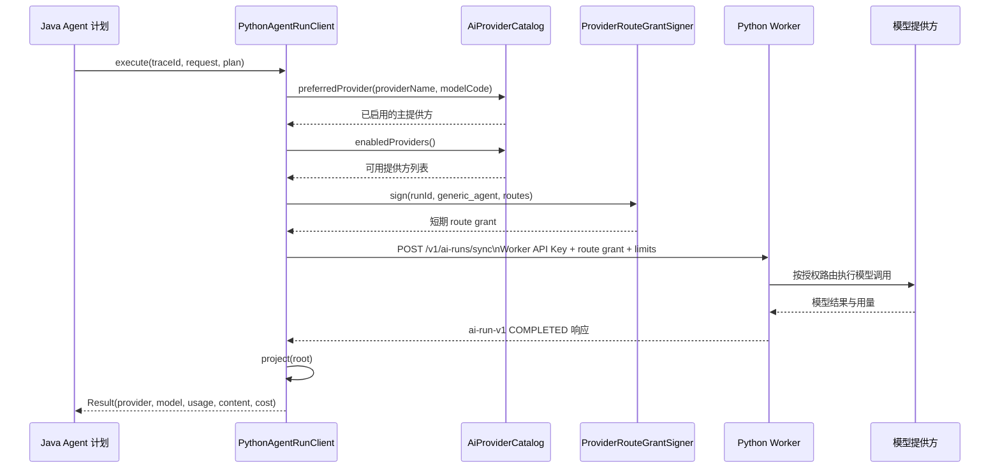

> ProviderRouteGrantSigner、Python 客户端和运行时配置共同约束 Java 到 Python 或模型提供方的路由授权。

# Python 提供方路由与授权签名

`ProviderRouteGrantSigner`、`PythonAgentRunClient` 与 Python Worker 运行时配置共同构成 Java 到 Python 及模型提供方的路由授权边界。Java 负责将已校验的 Agent 计划投影为受限的内部请求，并签发只包含运行标识、工作负载、有效期和允许路由的短期授权凭证；Python 负责依据该请求执行模型调用、重试、结构化输出和用量记账。

## 模块职责

### `ProviderRouteGrantSigner`

文件：`backend-java/src/main/java/com/doob/mathagent/agent/service/ProviderRouteGrantSigner.java`

该组件是 Spring `Component`，职责是为 Python Worker 签发 provider route grant：

- 从配置读取签名密钥，优先使用 `math-agent.ai.route-grant-secret`，兼容旧配置 `math-agent.python-agent.route-grant-secret`。
- 密钥为空时立即失败，不允许生成未授权的路由凭证。
- 默认有效期为 900 秒，可通过 `route-grant-ttl-seconds` 配置。
- 载荷包含：
  - `runId`
  - `workload`
  - `expiresAt`
  - `routes`
- `runId` 最多 128 个字符，`workload` 最多 64 个字符。
- 路由只包含提供方名称和模型名称，不包含密钥或端点。
- 载荷经过无填充 URL-safe Base64 编码后，使用 HMAC-SHA256 签名，最终格式为：

```text
<base64url(payload)>.<base64url(hmac)>
```

该设计将“允许调用哪些提供方和模型”与“如何连接提供方”分离：Java 只授权路由，Python 运行时配置保留实际凭证和连接参数。

### `PythonAgentRunClient`

文件：`backend-java/src/main/java/com/doob/mathagent/agent/service/PythonAgentRunClient.java`

该服务是 Java 到 Python 内部协议的适配器。它不直接调用模型提供方，而是将 Java 已生成的 `AgentRunPlanResponse` 转换为 Python Worker 请求。

主要职责包括：

- 创建到 Python Worker 的 HTTP 客户端。
- 使用 Worker API Key 保护 Java 到 Python 的内部调用。
- 将计划中的提供方和模型解析为实际启用的 Provider。
- 构造主路由、备用路由和签名后的 route grant。
- 传递调用次数、Token 上限、输出字符上限、证据引用和允许工具。
- 设置 trace、幂等键和截止时间。
- 校验 Python 返回的有限协议字段，避免未经验证的结果进入 Java trace 或公共 API。

客户端使用固定的内部合同版本 `ai-run-v1`，请求发送到：

```text
POST /v1/ai-runs/sync
```

请求同时携带：

- `Authorization: Bearer <worker-key>`
- `X-Trace-Id`
- `contractVersion`
- `runId`
- `workload`
- `idempotencyKey`
- `traceparent`
- `deadlineEpochMs`
- `providerRoute`
- `limits`
- `input`
- `evidenceRefs`
- `allowedTools`

### Python 运行时配置

文件：`ai-worker-python/app/settings.py`

Python Worker 的设置模型集中承载 Worker 密钥、模型提供方凭证、基础 URL 以及本地模型顺序等运行时配置。源码明确将部分提供方顺序定义为安全不变量：

- 文本向量模型固定优先使用 `local_bge_embedding`。
- 重排模型固定优先使用 `local_bge_reranker`。
- CLIP 模型固定优先使用 `local_clip`。

这些顺序用于约束本地检索相关模型，即使进程继承了远程提供方密钥或旧的提供方顺序变量，也不能随意将嵌入、重排和 CLIP 任务切换到远程提供方。

## 调用链



关键节点如下：

1. `AgentRunPlanResponse` 是 Java 侧路由选择的输入，客户端不会直接接受任意字符串作为有效提供方。
2. `AiProviderCatalog.preferredProvider(...)` 必须找到已启用的提供方，否则请求在 Java 侧被拒绝。
3. 主提供方进入 `routes` 的第一项；其他启用提供方可按调用次数上限进入备用路由。
4. `ProviderRouteGrantSigner` 对最终路由集合签名，Python 收到的是受有效期约束的授权材料。
5. Worker API Key 保护 Java 到 Python 的传输边界；route grant 进一步约束 Python 可使用的提供方和模型。
6. Python 返回后，Java 只接受合同版本为 `ai-run-v1` 且状态为 `COMPLETED` 的结果。

## 路由与调用限制

默认情况下，单次 Agent 运行最多允许 4 次提供方调用：

```text
MAX_PROVIDER_CALLS = 4
```

`TeacherAssistantAgent` 使用更严格的单提供方调用限制：

```text
QUESTION_AGENT_MAX_PROVIDER_CALLS = 1
```

该特例用于避免父级讲义任务已经具备持久化重试能力时，子分支再次叠加提供方超时和重试成本。

请求中的 `limits` 至少包括：

- `maxProviderCalls`
- `maxTotalTokens`
- `maxOutputTokens`
- `maxOutputChars`

其中 `maxOutputTokens` 被明确作为 Worker 到提供方的完成长度上限；仅设置 `maxTotalTokens` 不能阻止短输入任务产生过长输出。输出字符数还会被 Java 投影逻辑限制为最多 64,000 个字符。

证据引用也受到约束：

- 每条引用最多 320 个字符。
- 空引用被过滤。
- 重复引用被去重。
- 最多传递 24 条引用。

业务工具 scope 不会原样交给模型。Java 只将以下内部 scope 映射为固定的 Broker 工具：

```text
tool:search:textbook
tool:search:private
    -> search_visible_resources
```

没有授权 scope 时，`allowedTools` 为空。

## 关键状态与合同边界

### 请求侧状态

一次 Python Agent 请求至少携带以下状态：

- `traceId`：同时作为 `runId`、`X-Trace-Id` 和幂等键组成部分。
- `providerRoute`：主提供方、备用提供方和 route grant。
- `deadlineEpochMs`：根据 Java HTTP 超时计算出的截止时间。
- `limits`：提供方调用次数、Token 和输出上限。
- `evidenceRefs`：经过长度、去重和数量限制的证据引用。
- `allowedTools`：从 Java 业务 scope 映射出的固定工具名。

### 超时状态

客户端超时受 Worker lease 预算约束：

- 默认请求超时为 120 秒。
- 默认连接超时为 5 秒。
- 实际读取超时不会超过 Worker lease 减去安全余量。
- Worker lease 默认按 900 秒计算。
- 安全余量默认为 15 秒。
- 超时至少保持为 1 秒。

因此，部署配置中的 HTTP 超时不能无限超过任务租约，否则客户端会先于租约边界失效。

### 响应侧状态

Java 的 `project` 方法要求 Python 响应满足：

- 响应非空。
- `contractVersion` 必须是 `ai-run-v1`。
- `status` 必须是 `COMPLETED`。
- `providerName`、`modelCode` 和 `generatedContent` 不能为空。
- `promptTokens`、`completionTokens` 和 `totalTokens` 必须是非负整数。
- `totalTokens` 不得小于 prompt 或 completion Token 数。
- `costKnown=false` 时，实际成本被统一视为未知。
- `costKnown=true` 时，`actualCost` 不得为负数。

不满足这些条件时，Java 抛出异常，不将结果投影为正常的 Agent 执行结果。

## 配置优先级

route grant 相关配置采用新的 AI 配置前缀优先、旧 Python Agent 前缀兼容的策略：

```text
math-agent.ai.<suffix>
    优先于
math-agent.python-agent.<suffix>
```

涉及的配置包括：

- `route-grant-secret`
- `route-grant-ttl-seconds`

Python 客户端本身还读取：

- `math-agent.python-agent.base-url`
- `math-agent.python-agent.worker-key`
- `math-agent.worker-api-key`
- `math-agent.python-agent.timeout-ms`
- `math-agent.python-agent.connect-timeout-ms`
- `math-agent.agent-worker.runtime.lease-seconds`
- `math-agent.python-agent.lease-safety-margin-ms`

Worker Key 缺失时，客户端不会发起请求；route grant secret 缺失时，签名器不会生成授权凭证。这两个配置缺失点分别保护 Java-Python 内部调用边界和 Python-Provider 路由授权边界。

## 边界条件

- `providerName` 或 `modelCode` 未被 `AiProviderCatalog` 识别为启用配置时，Java 侧直接拒绝执行。
- route grant secret 为空时，签名失败并抛出配置错误。
- Worker API Key 为空时，不创建有效的 Python 调用。
- route grant 的 `runId`、`workload` 和响应字段会被截断，避免不受控数据进入内部合同或 trace。
- Provider 列表为空时，主提供方解析失败；备用提供方数量受最大调用次数限制。
- `TeacherAssistantAgent` 仅允许一个提供方调用，因此不会生成多级备用路由。
- Python 返回空响应、未完成状态、字段缺失、用量不一致或非法成本时，Java 将其视为协议失败。
- `costKnown=false` 不代表成本为零，而是明确表示成本未知。
- route grant 的默认 TTL 与 Worker lease 都是 900 秒，但客户端 HTTP 请求仍有独立的较短超时和安全余量；三者需要协同配置。

## 扩展点

### 增加或调整提供方

提供方选择通过 `AiProviderCatalog` 完成。新增提供方应进入启用提供方目录，并确保 `preferredProvider(providerName, modelCode)` 能解析主路由。备用路由目前按启用提供方列表补齐，若未来需要权重、区域或能力匹配，应扩展目录选择逻辑，而不是让模型或 Python 自行决定未授权路由。

### 调整授权凭证策略

`ProviderRouteGrantSigner` 可扩展：

- 更细粒度的 workload 类型。
- 更短或按任务类型变化的 TTL。
- 增加签发版本、租户或策略标识。
- 在 Python 侧加入对应的校验与拒绝原因。

当前源码证据只展示了 Java 侧签发逻辑；route grant 在 Python 侧的验签、过期检查和路由执行实现不在本页已读范围内，因此这些逻辑应被视为必须保持一致的跨进程合同。

### 扩展业务工具授权

`brokerTools` 是 Java 业务 scope 到固定工具名的映射边界。新增工具时，应继续采用显式 scope 到固定 Broker 工具名的映射，避免把 Java 内部权限命名直接交给模型。

### 扩展运行时模型约束

Python `WorkerSettings` 已将本地嵌入、重排和 CLIP 提供方顺序定义为固定安全策略。需要新增模型类别时，应明确它属于本地强制约束、远程授权路由，还是两者之一，避免通用 provider order 配置意外覆盖安全不变量。

Sources: [ProviderRouteGrantSigner.java](backend-java/src/main/java/com/doob/mathagent/agent/service/ProviderRouteGrantSigner.java#L1-L76) [PythonAgentRunClient.java](backend-java/src/main/java/com/doob/mathagent/agent/service/PythonAgentRunClient.java#L1-L243) [settings.py](ai-worker-python/app/settings.py#L7-L39)
