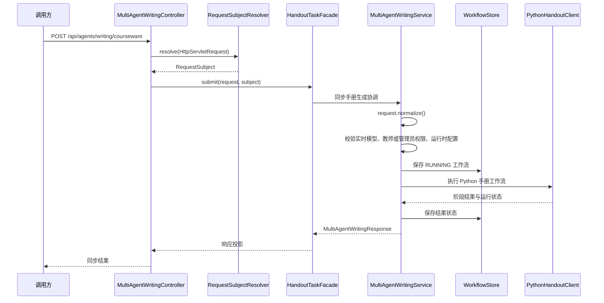

> 请求规范化、实时模型校验、教师或管理员权限校验、运行时配置检查、工作流持久化，以及 Python 手册运行结果投影组成同步入口。

# 同步手册生成流程

同步入口由 Java 控制面负责请求接收、身份与权限校验、运行时前置检查、工作流持久化和结果投影；Python 运行时负责执行手册生成图。Java 不负责规划或执行具体模型阶段，而是保存工作流归属并将 Python 结果转换为现有响应和制品合同。

## 入口与调用链

同步 HTTP 接口为：

```text
POST /api/agents/writing/courseware
```

控制器首先通过 `RequestSubjectResolver` 从 HTTP 请求解析后端信任的请求主体，然后将请求交给 `HandoutTaskFacade`。当门面未注入时，控制器兼容性回退到 `MultiAgentWritingService.run`。



关键节点是：

- `MultiAgentWritingController` 定义受保护的同步 API，并负责解析请求主体。
- `HandoutTaskFacade` 是生产路径上的门面；控制器注释明确指出，兼容性流量从一个教学任务投影，不额外创建第二条工作流记录。
- `MultiAgentWritingService` 是 Java 控制面核心，负责前置校验、工作流记录和 Python 调用。
- `PythonHandoutClient` 连接 Python 手册运行时，Java 只接收并投影有边界的执行结果。
- `MultiAgentWritingWorkflowStore` 保存工作流状态，使同步执行在进入 Python 前就拥有 Java 控制面的持久化记录。

## 请求规范化

`MultiAgentWritingService.run` 的第一步是调用：

```java
MultiAgentWritingRequest normalized = request.normalize();
```

后续模型校验、运行时检查和 Python 执行均基于规范化后的请求。规范化将请求处理固定在服务边界内，避免控制器直接将原始输入传递给模型运行时。

请求对象由 `MultiAgentWritingRequest` 承载。当前同步链路中，控制器使用 `@Valid` 触发 Spring 参数校验，服务层再执行领域级的 `normalize()` 和后续前置条件检查。

## 前置校验顺序

同步执行的服务调用链是：

```text
request.normalize()
  -> requireLiveModelExecution(normalized)
  -> subject.normalize()
  -> requireTeacherOrAdmin(normalizedSubject)
  -> requireConfiguredHandoutRuntime()
  -> 创建 workflowId 和 createdAt
  -> 保存 RUNNING 工作流
  -> executePythonHandout(...)
```

### 实时模型校验

`requireLiveModelExecution` 在工作流创建前执行，用于阻止不满足实时模型执行要求的请求进入运行流程。该检查发生在请求规范化之后，因此模型能力判断面对的是统一后的输入。

### 教师或管理员权限

请求主体同样会先经过 `RequestSubject.normalize()`，之后由 `requireTeacherOrAdmin` 校验主体类型。手册生成同步入口只允许教师或管理员继续执行，权限判断不依赖客户端自行提交的身份字段，而依赖后端解析出的 `RequestSubject`。

### Python 运行时配置

`requireConfiguredHandoutRuntime` 在持久化和 Python 调用前执行。运行时配置不完整时，请求不会创建一个已经进入执行状态的工作流，也不会继续调用 Python 手册客户端。

这些检查共同形成同步入口的启动门禁：只有请求、模型、身份权限和运行时依赖均满足条件时，才会创建运行记录。

## 工作流持久化与关键状态

通过前置校验后，服务生成新的 `workflowId` 和 `createdAt`，并保存初始工作流：

```java
saveWorkflow(
    workflowId,
    normalizedSubject,
    "RUNNING",
    createdAt,
    List.of(),
    "Python LangGraph handout workflow started."
);
```

初始记录包含：

- `workflowId`：本次手册生成的工作流标识。
- `createdAt`：工作流创建时间。
- `normalizedSubject`：规范化后的租户、主体类型和主体标识，用于归属与可见性控制。
- `RUNNING`：表示 Python 手册工作流已启动。
- 初始阶段列表：同步入口创建时为空。
- 状态消息：说明 Python LangGraph 手册工作流已开始。

之后 `executePythonHandout` 负责执行 Python 图并继续更新或保存工作流结果。Java 工作流记录是控制面上的权威归属记录，Python 执行结果则作为阶段快照和最终状态进入该记录。

## Python 结果投影

`MultiAgentWritingService` 的职责边界明确：Java 持久化工作流所有权、校验可见性、执行控制面协调，并将有界的 Python 结果投影到公共响应和制品合同；它不规划或执行 provider stage。

结果投影至少包含两层：

1. `MultiAgentWritingResponse`：面向 API 的工作流响应，承载当前状态和执行结果。
2. `MultiAgentWritingArtifact`：从工作流阶段记录构造的制品视图。

制品投影遍历工作流阶段，将每个阶段映射为 `StageArtifact`，保留：

- `stageCode`
- `agentCode`
- `traceId`
- `providerName`
- `modelCode`
- `status`
- 安全处理后的 `generatedContent`
- 合并后的引用信息
- 资源放置结果

没有生成内容的阶段不会继续生成结构化章节。这样可以将 Python 阶段快照转换为稳定的 Java 制品模型，同时避免把空阶段投影为无意义的文档内容。

## 边界条件与错误映射

### 请求主体和可见性

控制器通过 `RequestSubjectResolver` 获取请求主体；服务读取工作流时使用 `workflowStore.findVisible(...)`，因此工作流查询和结果投影都受租户及主体归属约束。工作流 ID 在读取路径中会经过规范化，找不到可见记录时返回工作流不存在。

### 权限或输入不满足要求

控制器将服务抛出的 `IllegalArgumentException` 映射为 HTTP `403 FORBIDDEN`。这覆盖了权限拒绝以及服务层以非法参数形式报告的领域边界错误。

### 执行资源受限

控制器将 `IllegalStateException` 映射为 HTTP `429 TOO_MANY_REQUESTS`，用于表达当前执行资源或运行条件不允许继续处理的情况。

### Python 执行失败

同步路径在工作流已保存为 `RUNNING` 后进入 Python 执行。Python 阶段失败时，最终状态由服务根据执行结果投影到工作流响应；异步 Worker 的重试耗尽另有失败标记路径，但不改变同步入口由 Java 先持久化、再执行和投影的控制面边界。

### 重复或已完成记录

执行分发后的路径会先读取可见工作流；如果记录已经是 `COMPLETED`，服务直接返回已有响应，避免重复执行 Python 图。这一规则为重复投递和恢复场景提供了基础，也使工作流记录成为结果恢复的入口。

## 主要文件

- [MultiAgentWritingController.java](backend-java/src/main/java/com/doob/mathagent/agent/controller/MultiAgentWritingController.java#L31-L107)：定义同步 API、解析请求主体、选择生产门面或兼容性服务路径，并映射服务异常。
- [MultiAgentWritingService.java](backend-java/src/main/java/com/doob/mathagent/agent/service/MultiAgentWritingService.java#L25-L65)：实现同步入口的规范化、模型和权限校验、运行时检查、工作流创建及 Python 执行协调。
- [MultiAgentWritingService.java](backend-java/src/main/java/com/doob/mathagent/agent/service/MultiAgentWritingService.java#L182-L210)：读取工作流并将阶段快照投影为手册制品。
- [MultiAgentWritingRequest.java](backend-java/src/main/java/com/doob/mathagent/agent/dto/MultiAgentWritingRequest.java#L1-L80)：同步手册请求 DTO 和请求规范化边界。
- [PythonHandoutClient.java](backend-java/src/main/java/com/doob/mathagent/agent/service/PythonHandoutClient.java#L1-L80)：Java 到 Python 手册运行时的客户端边界。
- [MultiAgentWritingWorkflowStore.java](backend-java/src/main/java/com/doob/mathagent/agent/service/MultiAgentWritingWorkflowStore.java#L1-L80)：工作流记录的存储抽象。
- [MultiAgentWritingWorkflowRecord.java](backend-java/src/main/java/com/doob/mathagent/agent/service/MultiAgentWritingWorkflowRecord.java#L1-L80)：工作流状态、主体归属和阶段结果记录模型。

## 扩展点

- 在 `MultiAgentWritingRequest.normalize()` 扩展输入兼容规则，可集中处理新字段和默认值。
- 在 `requireLiveModelExecution`、`requireTeacherOrAdmin` 或 `requireConfiguredHandoutRuntime` 对应的服务逻辑中扩展模型、权限和配置门禁。
- 通过 `PythonHandoutClient` 扩展 Python 运行时协议，而不把 provider 阶段逻辑引入 Java 控制面。
- 通过 `MultiAgentWritingWorkflowStore` 或其 MyBatis 实现扩展状态保存和恢复能力。
- 在 `MultiAgentWritingService` 的响应或制品映射处扩展新的阶段字段、引用信息或资源放置结果，同时保持公共响应合同稳定。

Sources: [MultiAgentWritingController.java](backend-java/src/main/java/com/doob/mathagent/agent/controller/MultiAgentWritingController.java#L31-L107), [MultiAgentWritingService.java](backend-java/src/main/java/com/doob/mathagent/agent/service/MultiAgentWritingService.java#L25-L65), [MultiAgentWritingService.java](backend-java/src/main/java/com/doob/mathagent/agent/service/MultiAgentWritingService.java#L182-L210)
