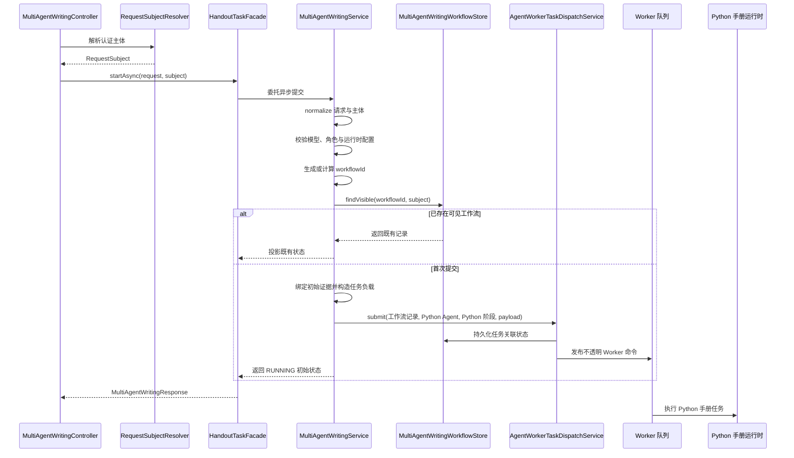

> 异步提交为 Java 工作流生成或复用 workflowId，支持基于认证主体和 clientRequestId 的幂等恢复，并派发一个不透明的 Python Worker 命令。

# 异步手册任务与幂等提交

异步手册提交由 Java 控制面负责入口校验、工作流持久化、任务派发和状态投影；Python 运行时负责实际的手册生成图执行。Java 不负责规划或执行 Python 的 provider 阶段，而是向 Worker 派发一个不透明的手册任务命令。

## 模块职责

### `MultiAgentWritingController`

`MultiAgentWritingController` 暴露异步提交接口：

```text
POST /api/agents/writing/courseware/async
```

控制器先通过 `RequestSubjectResolver` 从 HTTP 请求解析后端认证主体，再将请求交给 `HandoutTaskFacade` 或兼容路径下的 `MultiAgentWritingService.startAsync`。

控制器不接受调用方直接提供的用户身份作为工作流所有者。工作流可见性和幂等范围都建立在后端解析出的 `RequestSubject` 上。

异步入口将异常投影为 HTTP 状态：

- `IllegalArgumentException` 映射为 `403 Forbidden`
- `IllegalStateException` 映射为 `429 Too Many Requests`
- 成功时立即返回工作流初始状态，而不是等待 Python 图执行完成

控制器还提供工作流读取接口：

```text
GET /api/agents/writing/{workflowId}
```

读取时同样使用当前认证主体进行可见性约束。兼容生产路径通过 `HandoutTaskFacade` 投影现有教学任务，避免为同一个教学任务额外创建第二条工作流记录。

### `MultiAgentWritingService`

`MultiAgentWritingService` 是 Java 控制面门面，主要负责：

1. 规范化 `MultiAgentWritingRequest`
2. 校验实时模型执行条件
3. 规范化并校验认证主体
4. 要求主体具有教师或管理员权限
5. 检查 Python 手册运行时配置
6. 生成或复用 `workflowId`
7. 通过工作流存储检查可见的既有记录
8. 创建工作流记录并提交 Worker 任务
9. 将工作流记录转换为公开的 `MultiAgentWritingResponse`

服务明确将 Python 手册图视为外部运行时。Java 持久化工作流所有权、发布一个受租约保护的 Worker 命令，并将 Python 结果投影回已有的工作流和制品合同。

### 工作流持久化

`MultiAgentWritingWorkflowStore` 及其 MyBatis 实现承担工作流记录的保存和查询。异步提交在派发前构造工作流记录，记录初始状态、创建时间、主体归属、阶段信息以及“派发待处理”的提示。

工作流实体和记录是恢复幂等提交、查询执行状态以及处理重复投递的持久化基础。

### Worker 派发边界

`AgentWorkerTaskDispatchService` 接收工作流记录、Python 手册 Agent 类型、阶段类型和任务负载，并负责提交 Worker 任务。

异步服务使用：

- `PYTHON_HANDOUT_AGENT_CODE`
- `PYTHON_HANDOUT_STAGE_CODE`
- `workerTaskPayload(bound)`

其中 `workerTaskPayload` 承载绑定了工作流身份和初始证据的请求。对 Java 控制面而言，该命令是不透明的 Python 手册任务；Java 不在异步提交请求线程中展开或执行 Python 阶段。

## 调用链



关键节点如下：

- **认证主体解析**：主体由后端请求上下文解析，决定权限和工作流可见范围。
- **幂等键计算**：只有提供有效的 `clientRequestId` 时，才根据认证主体和请求标识计算确定性的工作流 ID。
- **可见性查询**：服务调用 `findVisible(workflowId, normalizedSubject)`，因此相同 ID 但不属于当前主体的记录不会直接作为幂等结果返回。
- **任务提交**：首次提交才创建运行中的工作流并调用 Worker 派发服务。
- **异步返回**：提交接口返回初始工作流响应，Python 执行在后续 Worker 链路完成。

## 幂等提交

异步方法支持两种工作流 ID 生成策略：

```java
String workflowId = clientRequestId == null || clientRequestId.isBlank()
        ? UUID.randomUUID().toString()
        : idempotentWorkflowId(normalizedSubject, clientRequestId);
```

### 未提供 `clientRequestId`

没有提供请求幂等标识，或标识为空白时，服务生成随机 UUID。相同请求重复提交会获得不同的工作流 ID，因此不能依靠该路径恢复既有提交。

### 提供 `clientRequestId`

提供非空请求幂等标识时，服务通过 `idempotentWorkflowId(normalizedSubject, clientRequestId)` 计算确定性的工作流 ID。其设计含义是：

- 同一认证主体使用同一 `clientRequestId`，可以得到同一个工作流 ID。
- 不同认证主体即使使用相同的 `clientRequestId`，也不会共享同一幂等范围。
- 重复提交先查询当前主体可见的既有工作流。
- 如果记录存在，直接返回该记录的响应，不再次派发 Writer 任务。

因此，幂等恢复发生在 Worker 命令再次入队之前，核心判断是：

```java
Optional<MultiAgentWritingWorkflowRecord> existing =
        workflowStore.findVisible(workflowId, normalizedSubject);

if (existing.isPresent()) {
    return toResponse(existing.get());
}
```

这种机制恢复的是持久化工作流状态，而不是重新执行一次手册生成。后续 Worker 层的重复投递还需要依赖任务租约、工作流状态以及 Python checkpoint 共同保证执行恢复。

## 关键状态

异步首次提交创建的工作流状态为：

```text
RUNNING
```

初始阶段信息来自请求中的初始证据，并附带：

```text
Python LangGraph handout workflow queued; dispatch pending.
```

这表示工作流已经被 Java 控制面接受并进入派发流程，但 Python 图尚未必完成执行。

从当前入口可以确认的状态行为包括：

- `RUNNING`：工作流已创建，任务处于排队或执行链路中。
- `COMPLETED`：执行分发入口发现已有工作流已完成时，直接投影已有结果，不重复执行。
- 工作流不存在或对当前主体不可见：查询或执行恢复时抛出工作流不存在错误，由上层映射为相应的访问或资源错误。

完整阶段状态和失败状态由工作流记录、Worker 任务存储及 Python 执行结果共同维护；异步提交入口本身只负责建立初始状态并返回可恢复标识。

## 请求绑定与任务负载

提交前请求会经历两个重要转换：

```text
原始 MultiAgentWritingRequest
    -> normalize()
    -> bindInitialEvidence(workflowId, normalized)
    -> workerTaskPayload(bound)
```

`normalize()` 统一请求输入，避免直接使用未规范化的数据参与后续流程。服务随后提取初始 `TeachingEvidence`，将其关联到生成的工作流 ID，再构造发送给 Worker 的任务负载。

这使工作流身份、初始证据和 Python 任务命令在提交时建立关联，同时保留 Java 控制面和 Python 执行面的职责边界。

## 边界条件

### 权限和主体边界

异步任务要求认证主体通过教师或管理员权限校验。主体在校验前会被规范化，工作流查找也使用规范化后的主体。

调用方不能通过请求体替换工作流所有者。所有权来自 `RequestSubjectResolver` 解析的后端身份。

### Python 运行时未配置

在创建工作流和派发任务前，服务调用 `requireConfiguredHandoutRuntime()`。运行时配置缺失时，请求不会进入正常的异步派发路径。

### 重复提交

带有相同主体和 `clientRequestId` 的重复提交在已有工作流可见时只返回既有响应，不重新创建工作流，也不重复提交 Worker 命令。

如果不使用 `clientRequestId`，每次提交都生成随机工作流 ID，调用方需要自行保存返回的 ID 以进行后续查询和恢复。

### 已完成工作流

分发执行入口会先读取工作流；如果状态为 `COMPLETED`，直接返回已有结果。这是重复 Worker 投递或恢复调用的重要短路条件。

### 错误投影

控制器将服务层的参数或权限类 `IllegalArgumentException` 投影为 `403`，将状态限制类 `IllegalStateException` 投影为 `429`。因此，调用方应区分：

- 请求主体无权执行
- 运行条件或执行预算导致的状态拒绝
- 工作流查询不存在或不可见

## 扩展点

### 幂等策略扩展

`idempotentWorkflowId` 是幂等标识到工作流 ID 的集中转换点。若未来需要支持请求摘要、租户标识或版本化幂等策略，可以在此处扩展，但必须继续将认证主体纳入计算范围。

### Worker 命令扩展

`AgentWorkerTaskDispatchService` 和 `AgentWorkerTaskCommand` 是 Java 到 Worker 的任务边界。新增执行阶段或新的 Python 工作负载时，可以沿用 Agent code、stage code 和不透明 payload 的组合，而不把 Python 图逻辑引入 Java 控制面。

### 工作流存储扩展

`MultiAgentWritingWorkflowStore` 与 MyBatis 实现隔离了工作流查询和持久化细节。增加状态恢复字段、阶段结果或查询索引时，应保持 `findVisible` 的主体可见性约束。

### 兼容门面扩展

控制器保留 `HandoutTaskFacade` 作为生产兼容入口；在未注入门面时回退到 `MultiAgentWritingService`。这为现有教学任务投影和新工作流服务的迁移提供了边界，但兼容路径仍应保持“一个教学任务对应一条工作流记录”的约束。

### 结果投影扩展

`toResponse` 将持久化工作流记录投影为公开响应。若增加前端可见的阶段、恢复信息或制品状态，应在响应投影层扩展，避免让 Worker 命令协议直接暴露给 API 调用方。

## Sources

Sources: [MultiAgentWritingController.java](backend-java/src/main/java/com/doob/mathagent/agent/controller/MultiAgentWritingController.java#L31-L151)  
Sources: [MultiAgentWritingService.java](backend-java/src/main/java/com/doob/mathagent/agent/service/MultiAgentWritingService.java#L25-L114)  
Sources: [MultiAgentWritingWorkflowStore.java](backend-java/src/main/java/com/doob/mathagent/agent/service/MultiAgentWritingWorkflowStore.java#L1-L80)  
Sources: [AgentWorkerTaskDispatchService.java](backend-java/src/main/java/com/doob/mathagent/agent/worker/AgentWorkerTaskDispatchService.java#L1-L80)  
Sources: [AgentWorkerTaskCommand.java](backend-java/src/main/java/com/doob/mathagent/agent/worker/AgentWorkerTaskCommand.java#L1-L80)
