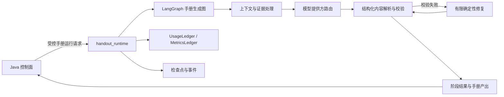

> Python 手册运行时承载手册生成图、节点执行、上下文处理和结果产出，是 Java 控制面之后的执行主链路。

# Python 手册工作流运行时

Python 手册工作流运行时位于 Java 控制面之后，负责实际的 AI 生成与图执行。它使用 LangGraph 组织手册生成流程，并将模型调用、结构化结果校验、流式响应、用量统计和持久化检查点纳入同一运行时边界。

Java 仍然是身份、证据可见性、资源资产、业务持久化和 PDF 发布的权威；Python 只承载 AI 工作。运行时的检查点和事件在节点返回前写入，使进程重启后可以从持久化边界恢复，避免重复执行已经完成的模型调用。

图中，Java 只提供受控输入并接收结果；手册图负责 AI 阶段编排；上下文处理负责限制输入规模和保留授权证据；结构化校验决定是否进入一次有限修复；检查点、事件和用量账本构成运行时的恢复与计量边界。

## 模块职责

### `handout_runtime.py`

[`ai-worker-python/app/handout_runtime.py`](ai-worker-python/app/handout_runtime.py#L1-L260) 是手册运行时的核心实现，职责集中在以下几类：

- 构建并执行手册生成图。
- 组织模型阶段之间的输入和输出。
- 对证据、文档内容、问题文本和模型结果进行边界控制。
- 解析不同模型提供方可能返回的结构化 JSON 包装。
- 校验教师版、学生版和课堂投影等不同受众的内容合同。
- 记录模型用量、估算成本、阶段事件和检查点。
- 在节点完成前写入可恢复状态。

运行时默认使用：

- 图版本：`handout-v2`
- AI 合同版本：`handout-ai-v2`
- 初始上下文上限：12 条
- 采集阶段证据容量：24 条
- 文档检查数量：3
- 单个来源读取块数：80
- 单个来源读取字符数：24,000
- 最大证据字符数：64,000
- 最大检查来源字符数：64,000
- 最大输出字符数：24,000

这些限制说明运行时并不把所有原始资料直接交给模型，而是以受控容量构造上下文，并为后续规划和写作阶段保留可用证据。

### 受众阶段

源码中的阶段标题表明手册至少包含三类写作产出：

| 阶段代码 | 产出 |
| --- | --- |
| `teacher_writer` | 教师版讲义 |
| `student_writer` | 学生版讲义 |
| `lecture_writer` | `16:10` 课堂投影 |

不同阶段有不同的结构化字段：

- 教师阶段优先读取 `teacherExplanation`。
- 学生阶段优先读取 `studentWorksheet`。
- 课堂投影阶段优先读取 `lectureCards`。
- 通用回退字段包括 `markdown`、`content`、`body` 和 `result`。

课堂投影不是简单地把原始 JSON 返回给调用方。`_markdown_from_cards` 会过滤 `resource`、`evidence`、`source`、`transition` 和 `checkpoint` 类型的卡片，只把可见教学内容转换为 Markdown，并根据卡片标题和内容生成文档结构。

## 调用链

手册运行时的执行主链路可以概括为：

1. Java 控制面发起手册运行请求。
2. Python 运行时接收受控的运行上下文和授权证据。
3. LangGraph 从起始节点进入手册生成图。
4. 图内节点执行资源收集、规划、蓝图或文档写作等模型阶段。
5. 每个阶段使用限定的上下文、输出和模型调用预算。
6. 模型结果先经过确定性结构化解析。
7. 解析后的内容经过阶段合同和内容安全规则校验。
8. 若结果可修复，则最多执行一次确定性修复生成。
9. 节点返回前写入检查点和事件。
10. 最终阶段结果、用量和运行状态返回 Java，由 Java 负责业务持久化和发布投影。

运行时将模型调用和确定性节点的用量尝试号分开管理。`RUNTIME_USAGE_ATTEMPTS` 为资源整理、规划写作、教师蓝图、学生写作、课堂投影和结构化校验预留稳定编号；提供方调用还按阶段划分尝试槽位，使同一 `(run_id, provider, model, attempt)` 组合具备幂等识别能力。

## 上下文与证据处理

上下文处理有三个重要边界。

### 证据容量

初始上下文默认最多保留 12 条，但采集阶段的证据容量默认为 24 条。源码注释明确说明，后续授权命中不能因为 Java 初始提供了 12 条证据就被丢弃；因此初始上下文上限和采集阶段证据容量是两个不同层次的约束。

### 文档读取

单次运行对文档检查、读取块数和字符数都有上限：

- 最多检查 3 个文档。
- 单个文档最多读取 80 个块。
- 单个文档读取最多 24,000 个字符。
- 受控来源文本和最终证据还分别受到 64,000 字符级别的硬限制。

这些边界避免来源文档无限扩大模型上下文，也为后续写作阶段保留可预测的资源预算。

### 问题批次和语义门禁

题目解析使用显式的 `【题目 n】` 标记。若输入包含题目标记，题号必须从 1 开始连续递增，题目内容不能为空；普通空白或空行不会被当作题目边界。

运行时还会从题目中提取有限数量的公式、几何术语、数字或中文短语，用于轻量级、保持顺序的语义匹配。通用词如“已知”“函数”“求”“问题”等会被排除，最多保留四个区分性词元。这一机制用于约束生成结果与原始题目之间的基本对应关系，而不是替代完整的数学评审。

## 结构化结果处理

模型返回值不会直接作为手册正文使用。运行时会先进行确定性适配：

- 标量字符串可以直接作为候选内容。
- 列表会递归合并其中的内容字段。
- 字典只沿允许的内容字段递归查找。
- `id`、用量、工具记录和内部推理等元数据不会被当成教学正文。
- 提供方将文档包装在 `data`、`document`、`output` 或 `response` 等字段中时，运行时会沿白名单字段恢复真实可见文本。
- 课堂投影卡片会转换为 Markdown，并过滤资源卡、证据卡和过渡卡等内部或渲染辅助内容。

这种适配层隔离了提供方返回格式差异，使阶段合同面对的是规范化的可见内容。

## 数学标记和内容门禁

手册写作合同要求所有读者可见的数学表达式使用完整 LaTeX 定界符。检查范围包括：

- 标题。
- 正文 Markdown。
- 课堂投影卡片标题。
- 课堂投影卡片内容。

规则要求：

- 变量、函数、集合、区间、方程、不等式、分式、根式、角度和运算式必须放入 `$...$` 或 `$$...$$`。
- 分式使用 `\frac{...}{...}`。
- 根式使用 `\sqrt{...}`。
- 不允许裸露的 `^`、Unicode 上标或未定界的数学结构。
- 一个表达式不能跨出 LaTeX 定界符。

除数学格式外，运行时还定义了若干内容过滤规则：

- 课堂内容不得包含等待标记、教师资源内部路径、资料依据或完整解答标记。
- 通用输出不得暴露教师资源接口路径、内部日志、资源卡或证据卡。
- 学生内容不得泄露“参考答案”“评分标准”“教师提示”等教师侧信息。
- 教师版内容必须包含题目、解题过程、最终答案、评分点和易错点等必要段落标记。

这些规则将“模型生成了文本”和“文本可以作为手册产出”区分开来。

## 模型调用、修复与预算

运行时对模型调用采用有限预算策略：

- 默认单次模型调用超时为 75 秒。
- 默认修复调用超时为 45 秒。
- 每个结构化合同轮次默认最多安排一次确定性修复。
- 传输失败会作为错误报告，不会静默增加付费生成轮次。
- 默认总 token 预算为 1,200,000。
- 默认最多进行 16 次提供方调用。
- 默认单次手册输出 token 上限为 32,000。
- 资源收集决策有独立的 4,800 token 输出上限。
- 自适应补充完成量存在 128,000 token 的硬上限。

用量合并时，输入 token、输出 token、总 token 和估算成本都会累加。若任一阶段的成本未知，合并结果保持未知值 `-1.0`，不会把未知成本错误地计算成负数或确定金额。

阶段使用固定的尝试槽位：

- `plan_writer` 从 0 开始。
- `teacher_blueprint_writer` 从 100 开始。
- `student_writer` 从 200 开始。
- `lecture_writer` 从 300 开始。

每个阶段在自己的槽位内保留初始生成和最多一次修复的空间，从而同时满足预算控制和重复执行幂等。

## 状态与恢复

手册图的恢复边界不是单纯的最终结果保存，而是节点级检查点和事件记录：

- 检查点在节点返回前写入。
- 事件与检查点共同记录阶段进展。
- 进程重启后可以从最近的持久化边界继续。
- 已完成的模型调用不会因为重启被重新播放。
- 同一运行的第二个副本会等待第一个副本的持久化结果，而不是为同一个运行再次建立模型连接。

运行时还限制事件历史：

- 默认单页事件数量为 100。
- 单页最大数量为 500。
- 总事件历史最多保留 10,000 条。
- 流式模型增量不会为每个 token 单独写入完整事务，而是在内存中累积到阈值后刷新检查点。

流式检查点刷新受以下阈值控制：

- 默认每 250 毫秒刷新。
- 累积 8 KiB 时刷新。
- 累积 32 个分片时刷新。
- 单次硬上限为 32 KiB。

这样可以保留可恢复的输出前缀，同时避免每个流式分片都触发完整持久化操作。

## 与其它 Python 运行时的边界

[`ai-worker-python/app/agent_runtime.py`](ai-worker-python/app/agent_runtime.py#L1-L280) 是通用 Agent 运行时，不是手册生成图本身。它使用单一 `supervise` 节点：

- 模型可以请求 Java 工具。
- 工具名称必须出现在 `allowedTools` 中，否则返回 403。
- 工具参数只包含查询和 `runId` 等不透明数据。
- Java 执行工具并按租户权限返回观察结果。
- Python 再基于授权观察结果生成最终回答。
- 文件路径、SQL、数据库连接串和提供方凭据不会跨越边界。

[`ai-worker-python/app/teaching_draft_runtime.py`](ai-worker-python/app/teaching_draft_runtime.py#L1-L300) 则是独立的教学草稿合同，服务于仍由旧版确定性渲染器负责的教学任务流程。它接收经过 Java 授权且有界的证据摘要，拥有自己的 JSON 合同、重试策略和用量账本。该运行时不应被当作大型 LangGraph 手册图的替代入口。

## 主要扩展点

### 增加手册阶段

可以在手册图中增加新的阶段节点，并为其定义：

- 阶段代码和显示标题。
- 输入上下文和证据容量。
- 输出结构化字段。
- 提供方尝试槽位。
- 用量账本中的稳定尝试号。
- 阶段专属内容校验规则。

新增阶段必须同时纳入预算、检查点和恢复语义，否则重复投递时可能产生重复模型调用或无法正确投影结果。

### 增加提供方适配

提供方路由通过 `ProviderRoute` 和模型调用运行时接入。扩展提供方时，需要保证：

- 返回结果能够进入结构化内容适配器。
- 成本未知时遵循未知成本传播规则。
- 请求超时和传输失败不会隐式扩大重试次数。
- 初始生成与修复生成使用可识别的幂等尝试槽位。

### 增加内容合同

新的可见字段应进入允许的结构化内容字段集合，并明确：

- 哪些字段是读者可见正文。
- 哪些字段属于内部元数据。
- 哪些受众可以看到这些内容。
- 数学标记、资源引用和答案泄露规则如何适用。

不能通过任意递归读取字典值来恢复正文，否则可能把内部 ID、用量或工具记录误投影为手册内容。

### 调整运行预算

上下文、文档、输出和模型调用预算均为显式常量。调整时需要同步评估：

- 模型上下文是否仍可完整容纳。
- 流式检查点是否会频繁刷新。
- 总 token 预算是否覆盖所有阶段及修复调用。
- 事件历史是否会超过查询和存储上限。
- 并发运行时是否仍能保持单运行锁和结果复用行为。

## 边界条件与失败行为

运行时的主要风险集中在以下边界：

- 题目标记不连续或题目为空时，输入解析直接失败。
- 提供方返回结构化 JSON 但字段包装异常时，运行时尝试沿白名单恢复正文。
- 结构化内容仍不满足合同规则时，只允许有限修复，不能无限自我审查。
- 模型传输失败不会自动扩展付费调用次数。
- 成本数据缺失时，最终成本保持未知。
- 输出、证据和来源内容超过硬上限时会被截断或拒绝进入后续阶段。
- 学生内容若出现教师答案、评分标准或内部提示标记，应被判定为不合格。
- 运行重启或重复投递时，检查点和运行锁用于避免重复执行已完成模型阶段。
- Python 不负责身份、证据授权、资源发布和 PDF 持久化；这些职责必须由 Java 控制面完成。

Sources: [ai-worker-python/app/handout_runtime.py](ai-worker-python/app/handout_runtime.py#L1-L260), [ai-worker-python/app/handout_runtime.py](ai-worker-python/app/handout_runtime.py#L140-L620), [ai-worker-python/app/agent_runtime.py](ai-worker-python/app/agent_runtime.py#L1-L280), [ai-worker-python/app/teaching_draft_runtime.py](ai-worker-python/app/teaching_draft_runtime.py#L1-L300)
