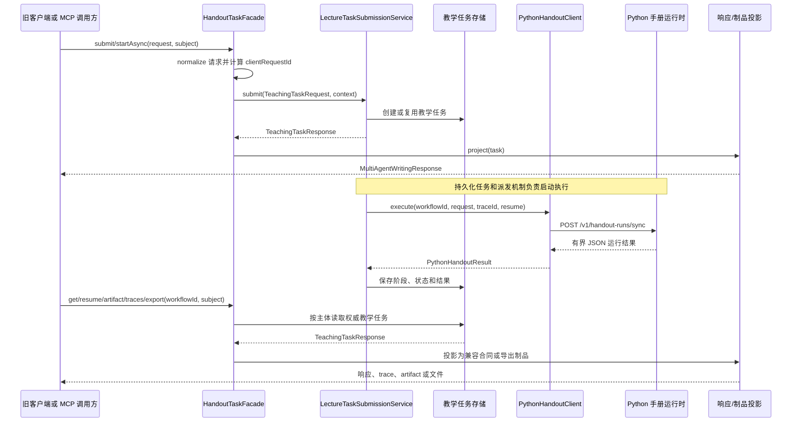

> Java 通过 HandoutTaskFacade、PythonHandoutClient 连接外部运行时，并将运行结果转换为工作流、响应和制品合同。

# 手册任务门面与 Python 客户端

本页描述手册生成在 Java 控制面与 Python 外部运行时之间的适配边界。`HandoutTaskFacade` 负责兼容旧的多智能体写作 API，将请求统一转换为教学任务，并从权威教学任务存储投影出旧响应、阶段、追踪和制品结构；`PythonHandoutClient` 负责以受限 HTTP 合同调用 Python LangGraph 手册运行时。

Java 保留任务所有权、租户与主体授权、工作流状态和发布门禁。Python 只接收规范化写作输入、运行标识和不透明证据引用，不接触 Java 数据库连接、本地路径、浏览器身份、模型凭据或原始资源字节。

## 模块职责

### `HandoutTaskFacade`

`HandoutTaskFacade` 是已退役 Agent 写作 API 的兼容门面。旧浏览器或客户端仍可以调用它，但每次请求都会转换为一个教学任务，避免同时维护旧工作流记录和新的教学任务记录。

主要职责包括：

- 调用 `LectureTaskSubmissionService` 创建或恢复持久化教学任务。
- 通过 `TeachingWorkflowService` 查询当前主体拥有的任务。
- 将 `TeachingTaskResponse` 投影为旧的 `MultiAgentWritingResponse`。
- 将教学任务节点投影为旧的阶段结果。
- 将持久化教学事件投影为旧的 Agent trace 响应。
- 将教学任务中的教师版、学生版和课堂投影内容投影为临时旧制品结构。
- 通过 `TeachingHandoutPdfExportService` 和导出逻辑提供 Markdown、LaTeX、PDF 与 ZIP 制品。
- 将旧请求字段转换为唯一公开的 `TeachingTaskRequest` 业务请求。

门面不再读取退休的 workflow store，也不重新构造旧的 Agent plan 或 provider trace。教学任务存储是状态、阶段结果和已发布内容的唯一持久化来源。

### `PythonHandoutClient`

`PythonHandoutClient` 是 Java 到 Python LangGraph 手册运行时的一次请求边界。它负责：

- 根据 Spring 配置创建带连接超时和读取超时的 `RestClient`。
- 将 Java 请求转换成版本化、受限的 Python 请求合同。
- 过滤只允许发送已签发格式的证据引用。
- 为初始证据生成运行时范围内的不透明文档引用和透明来源引用。
- 使用 Worker 密钥调用 Python 的 `/v1/handout-runs/sync` 接口。
- 设置 trace、幂等、恢复和截止时间字段。
- 校验 Python 是否返回非空响应。
- 将 JSON 响应解析为 `PythonHandoutResult`，供 Java 后续工作流和结果投影使用。

## 调用链



关键节点：

- 创建与恢复都经过 `LectureTaskSubmissionService`，HTTP 请求本身不直接启动运行。
- `workflowId` 在兼容 API 中仍然保留，但实际代表教学任务标识。
- Python 使用同一个运行标识执行和恢复，使其能够复用持久化 checkpoint。
- 查询、恢复和导出都先通过教学工作流服务检查主体可见性。
- 外部响应不会直接暴露 Python 原始结构，而是转换为 Java 既有的响应、阶段和制品合同。

## 请求规范化与幂等

`HandoutTaskFacade.toTeachingTaskRequest` 先处理空请求：

```java
request == null
    ? new MultiAgentWritingRequest("", "", List.of(), false, "", "")
    : request.normalize()
```

随后计算证据数量边界：

- 最小证据限制为 `1`。
- 最大证据限制为 `24`。
- 实际限制取规范化请求中的证据引用数量，并限制在上述范围内。

旧请求中的题目文本、写作目标、偏好提供方和偏好模型会被映射到 `TeachingTaskRequest`。其他未由当前兼容合同承载的字段保持为空，不在门面层伪造新的业务语义。

默认情况下，稳定摘要作为教学任务的幂等键。摘要包含所有可能影响生成结果的旧请求字段，因此：

- 同一请求的 HTTP 重试会返回同一个任务。
- 发生实质性内容变化时会创建新任务。
- MCP 调用方若提供 `clientRequestId`，则使用调用方作用域内的幂等键。
- `clientRequestId` 只参与传输层恢复，不参与写作输入、证据选择或最终手册内容。

这使得一次不确定的 POST 可以恢复原任务，同时避免不同内容的请求因为内容摘要相同而错误复用旧任务。

## Python 请求合同

`PythonHandoutClient.requestPayload` 构造固定的 `handout-ai-v1` 合同，主要字段如下：

| 字段 | 作用 |
| --- | --- |
| `runId` / `taskId` | 使用教学任务标识作为 Python 运行标识 |
| `contractVersion` | 标识 Java 与 Python 之间的手册合同版本 |
| `writingGoal` | 写作目标 |
| `questionText` | 原始题目文本 |
| `evidenceRefs` | 过滤后的已签发证据引用 |
| `initialEvidence` | 与证据引用配对的初始证据元数据 |
| `graphVersion` | Python 手册图版本，默认 `handout-v1` |
| `traceId` | 链路追踪标识，缺省时使用 workflow ID |
| `traceparent` | 由 trace 标识派生的追踪上下文 |
| `idempotencyKey` | 固定为 `handout:{workflowId}` |
| `resume` | 是否复用 Python 持久化节点 checkpoint |
| `deadlineEpochMs` | 本次请求的绝对截止时间 |

幂等键和运行 ID 均由同一任务标识派生。队列重新投递或租约恢复时，Python 可以根据这些字段返回已有持久化制品，避免重复模型调用。

请求通过以下接口发送：

```text
POST /v1/handout-runs/sync
Authorization: Bearer <worker-key>
X-Trace-Id: <trace-id>
Content-Type: application/json
```

Worker 密钥优先读取 `math-agent.python-handout.worker-key`，否则回退到 `math-agent.worker-api-key`。两个配置都为空时，客户端直接抛出配置错误，不发起外部请求。

## 证据边界

Java 只把满足 `ev_[0-9a-f]{32}` 格式的证据引用发送给 Python。该格式校验阻止任意字符串被当作已授权证据引用。

初始证据按证据项与已过滤引用的相同索引进行配对，输出：

- `ref`
- 标题和文档名
- `documentRef`
- `transparentRef`
- 页码
- 摘要片段
- 图片引用

`documentRef` 使用共享密钥、运行 ID、固定命名空间和源文档 ID 计算 SHA-256 指纹，并截取前 16 个字节的十六进制结果。这一命名空间必须与 `AgentToolBrokerController` 使用的规则一致，否则 Python 后续通过 broker 读取证据时会无法通过授权。

透明来源引用只对已知来源类型生成：

- `PUBLIC_TEXTBOOK`：`textbook://.../chunk/...`
- `TEACHER_RESOURCE`：`feishu://.../resource/.../block/...`
- `CANONICAL_MATH_PAPER`：`gaokao://canonical/.../question/...`

缺少必要的文档 ID、块 ID或题号时，透明引用为空。未知来源类型也不会被拼接成未经定义的 URI。

## 超时与租约关系

客户端在构造时计算单次 HTTP 请求预算：

```text
requestTimeoutMs =
  max(1 秒,
      min(配置的请求超时,
          max(1 秒, Worker 租约时长 - 租约安全余量)))
```

默认值为：

- 请求超时：900 秒。
- Worker 租约：900 秒。
- 租约安全余量：15 秒。
- 连接超时：5 秒。

连接超时和读取超时都受同一个有界请求预算约束。请求必须在 RabbitMQ/Worker 租约被回收前结束，否则旧 Worker 可能在重新投递后继续完成任务并发布重复制品。

`deadlineEpochMs` 也会被发送给 Python，使 Python 运行时能够感知同一绝对截止时间。实际部署时，Python 运行时、Worker 租约和 Java HTTP 超时需要保持一致，否则恢复、重复投递和重复发布的行为会变得不可预测。

## 状态与恢复

门面直接使用 `TeachingTaskStatus.name()` 作为对外状态值，避免重新定义一套兼容状态枚举。任务状态来自权威教学任务快照，阶段状态来自持久化的 `TeachingWorkflowNode`。

主要操作及其状态语义：

| 操作 | 行为 |
| --- | --- |
| `submit` | 创建或复用一个持久化教学任务 |
| `startAsync` | 与同步兼容入口使用相同的持久化创建语义 |
| `get` | 读取当前主体拥有的任务 |
| `resume` | 恢复原任务，并创建独立的 outbox 重试事件，不创建新任务 |
| `artifact` | 从任务快照投影阶段制品和结构化章节 |
| `traces` | 从教学任务事件投影 trace，不读取旧 Agent trace 存储 |
| `export` | 从任务拥有的版本生成指定格式的导出文件 |

读取任务时，`workflowService.get(workflowId, context)` 若无结果则抛出 `Teaching task not found`。因此不存在任务、任务不属于当前主体，或者任务不可见时，对兼容客户端表现为同一类查找失败。

## 响应与阶段投影

`project` 将任务节点转换为 `MultiAgentWritingResponse.StageResult`：

- 阶段代码来自 `TeachingWorkflowNode.code()`。
- 阶段状态来自节点状态。
- 阶段摘要来自节点摘要。
- 旧的 Agent 类型、计划、内容和成本字段不从快照中臆造。

教学任务快照当前没有 provider ledger 字段，因此响应中的 token usage 使用全零值，含义是“没有账本数据”，不是实际成本为零。trace 投影同样将未知 provider 成本表示为 `-1`，并将 `costKnown` 设为 `false`。这避免把缺失的用量或价格误报成真实计费数据。

任务没有错误消息时，门面生成类似 `Teaching task <status>` 的状态消息；任务存在错误消息时，优先返回持久化错误文本。

## 制品投影与导出

`artifact` 将任务内容映射为三个阶段制品：

| 阶段代码 | Agent 标签 | 数据来源 |
| --- | --- | --- |
| `teacher_writer` | `CoursewareAgent` | 教师版讲义 LaTeX |
| `student_writer` | `TeacherAssistantAgent` | 学生版讲义 LaTeX |
| `lecture_writer` | `HandoutFormatterAgent` | 课堂投影 LaTeX |

同时生成三个结构化章节：

- `teacher`：教师版讲义，使用教师解释。
- `student`：学生版讲义，使用学生练习内容。
- `lecture`：课堂投影，将课堂卡片按空行连接。

最终手册内容来自任务快照中的 `handoutLatex`。所有这些数据都来自当前教学任务，不从旧 workflow store 读取。

导出格式由 `ArtifactExportFormat` 规范化和校验，支持：

- Markdown：`handout.md`
- LaTeX：`handout.tex`
- 教师版 PDF：`handout-teacher.pdf`
- 学生版 PDF：`handout-student.pdf`
- 课堂投影 PDF：`handout-lecture.pdf`
- ZIP：包含任务制品的压缩包

LaTeX 导出会经过 `TeachingHandoutPdfExportService.sanitizeLatexForExport`。PDF 导出通过 Java 发布渲染服务完成；XeLaTeX 不满足发布门禁时，兼容入口不会创建 PDFBox fallback。

导出响应包含：

- 新生成的导出 ID。
- 任务 ID。
- 规范化后的格式。
- 文件名和 MIME 类型。
- 字节长度。
- SHA-256 校验值。
- Base64 编码内容。
- 从生成时间起 30 分钟后的过期时间。

页面头部和尾部文本在教学任务创建时已经固定。兼容导出请求若试图提供非空 `headerText` 或 `footerText`，会直接拒绝，而不会静默生成与审计内容不一致的文件。

## 主要文件

- [`HandoutTaskFacade.java`](backend-java/src/main/java/com/doob/mathagent/agent/service/HandoutTaskFacade.java)：兼容 API 门面、教学任务转换、查询恢复、响应投影、trace 和制品导出。
- [`PythonHandoutClient.java`](backend-java/src/main/java/com/doob/mathagent/agent/service/PythonHandoutClient.java)：Python 手册运行时 HTTP 边界、请求合同、证据引用处理、超时配置和结果解析。
- `LectureTaskSubmissionService`：任务提交、持久化创建、恢复和重试事件入口。
- `TeachingWorkflowService`：按主体读取教学任务并提供任务快照。
- `TeachingHandoutPdfExportService`：LaTeX 清理和手册 PDF 发布渲染。

## 边界条件

需要重点关注以下情况：

1. **Python Worker 密钥缺失**  
   `execute` 在发送请求前抛出 `Python handout worker key is not configured`。

2. **Python 返回空响应**  
   空 JSON 响应会抛出 `Python handout returned an empty response`，不会生成 Java 侧结果。

3. **请求超时大于 Worker 租约**  
   客户端会将请求预算压缩到租约安全余量之前；配置过大不会突破租约边界。

4. **证据引用未签发或格式非法**  
   这些引用会被过滤，不会发送到 Python。

5. **初始证据与引用数量不匹配**  
   只处理两者共同索引范围内的项目，额外证据不会进入初始证据列表。

6. **任务不存在或无权访问**  
   门面统一抛出任务不存在错误，避免泄露其他主体任务是否存在。

7. **导出格式不支持**  
   由 `ArtifactExportFormat.requireSupported` 拒绝。

8. **导出修改页面头尾**  
   任何非空头部或尾部参数都会被拒绝，因为页面装饰属于任务创建时的固定审计内容。

9. **成本和 token 账本缺失**  
   响应使用零 token usage，trace 使用未知成本标识；这些值不应被解释为真实模型用量或实际价格。

## 扩展点

### 合同版本演进

Python 请求中的 `contractVersion` 当前为 `handout-ai-v1`。增加字段或调整字段语义时，应通过新合同版本协调 Java 客户端与 Python 运行时，并保持旧版本的兼容策略，避免异步重试期间同一任务使用不同解释方式。

### Python 图版本

`graphVersion` 通过 `math-agent.python-handout.graph-version` 配置，默认值为 `handout-v1`。图版本适合用于区分节点编排、阶段结构或 checkpoint 兼容性发生变化的运行时实现。

### 幂等与恢复

`idempotencyKey`、`runId`、`taskId` 和 `resume` 共同构成外部运行恢复边界。扩展运行时节点时，需要确保同一运行 ID 的 checkpoint 和最终制品仍然可以安全重放，且租约重新投递不会重复触发不可幂等的发布操作。

### 证据引用类型

新增证据来源时，需要同时定义：

- 已签发引用的格式和校验规则。
- broker 可识别的运行范围文档引用。
- 面向审计或展示的透明引用。
- Python 初始证据字段与后续读取权限之间的对应关系。

仅增加 URI 拼接而不更新 broker 授权命名空间，会导致运行时能够看到证据元数据，却无法完成后续受控读取。

### 账本投影

当前响应和 trace 对 provider usage、价格和 token ledger 使用占位值。后续接入不可变用量账本时，应替换投影层的数据来源，同时保持 `costKnown` 等字段的明确语义，避免将“无数据”与“实际为零”混淆。

### 导出格式

新增制品格式时，应扩展 `ArtifactExportFormat`、MIME 类型、文件名、内容生成和发布门禁，并继续保证导出只读取任务拥有的持久化版本。对于可能影响审计结果的页面配置，应继续采用任务创建时固定、后续拒绝变更的策略。

Sources: [backend-java/src/main/java/com/doob/mathagent/agent/service/HandoutTaskFacade.java](backend-java/src/main/java/com/doob/mathagent/agent/service/HandoutTaskFacade.java#L1-L280), [backend-java/src/main/java/com/doob/mathagent/agent/service/PythonHandoutClient.java](backend-java/src/main/java/com/doob/mathagent/agent/service/PythonHandoutClient.java#L1-L334)
