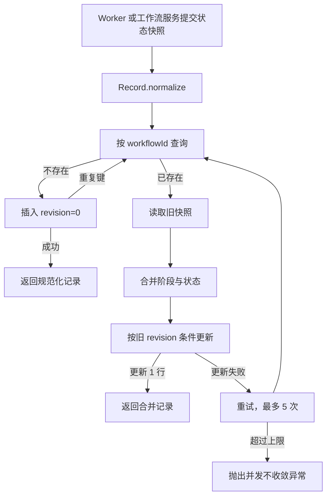

> 工作流记录、存储接口和 MyBatis 实现保存状态、阶段及结果，使异步派发和重复投递具备恢复基础。

# 手册工作流持久化与状态恢复

手册生成工作流由 `MultiAgentWritingWorkflowRecord` 表示。它是一个可持久化的状态快照，使用同一个 `workflowId` 关联整个多智能体写作流程及其阶段结果。记录同时携带租户和拥有者信息，使工作流查询能够执行可见性校验。

持久化层的职责是保存工作流当前状态、已完成阶段、累计用量和安全状态消息，并在异步 Worker 重复投递或多个阶段并行完成时，合并最新结果而不是直接覆盖已有状态。

## 模块职责

### 工作流记录

[`MultiAgentWritingWorkflowRecord`](backend-java/src/main/java/com/doob/mathagent/agent/service/MultiAgentWritingWorkflowRecord.java#L8-L32) 定义工作流状态快照：

- `workflowId`：后端工作流标识，所有写作阶段共享。
- `tenantId`：租户标识，用于隔离学校或部署。
- `subjectType`、`subjectId`：工作流所属主体的角色和标识。
- `status`：工作流状态，例如 `RUNNING`、`COMPLETED`、`FAILED`。
- `createdAt`、`updatedAt`：创建时间和最近更新时间。
- `stages`：已经完成或保存的阶段结果。
- `totalUsage`：已完成阶段累计的模型 Token 用量。
- `message`：安全的状态消息，不保存原始提示词或模型输出。

`normalize()` 在进入存储层前统一处理缺省值：

- 空工作流字段被转换为空字符串。
- 缺失租户默认使用 `"default"`。
- 缺失状态默认使用 `"RUNNING"`。
- 缺失时间使用当前时间。
- 缺失阶段列表转换为空列表，并复制为不可变列表。
- 缺失 Token 用量转换为全零用量。

因此，记录对象为内存实现和数据库实现提供了统一的空值边界。

### 存储接口

[`MultiAgentWritingWorkflowStore`](backend-java/src/main/java/com/doob/mathagent/agent/service/MultiAgentWritingWorkflowStore.java#L6-L47) 抽象了工作流状态的持久化操作：

- `save(record)`：保存或替换一个状态快照，并返回规范化后的快照。
- `findVisible(workflowId, subject)`：面向后端主体查询可见工作流。
- `findByIdInternal(workflowId)`：供已经完成共享 Worker 身份认证的内部边界读取工作流。
- `requeue(record)`：持久化显式恢复转换。

`requeue` 与普通 `save` 的语义不同。它表示恢复调用方已经为同一个 `workflowId` 创建了持久任务，因此允许已完成工作流回到 `RUNNING`。接口默认实现退化为 `save`，具体存储实现可以根据并发和恢复要求覆盖该行为。

## MyBatis 持久化实现

[`MyBatisMultiAgentWritingWorkflowStore`](backend-java/src/main/java/com/doob/mathagent/agent/service/MyBatisMultiAgentWritingWorkflowStore.java#L17-L43) 是数据库启用时注册的 Repository。它通过 `MultiAgentWritingWorkflowMapper` 访问数据库，并使用 `ObjectMapper` 序列化工作流元数据。

该实现受 `math-agent.database.enabled=true` 条件控制。数据库关闭时，这个 MyBatis 实现不会被装配，应用可以使用其他 `MultiAgentWritingWorkflowStore` 实现，例如内存实现或测试替身。

### 数据库实体

[`MultiAgentWritingWorkflowEntity`](backend-java/src/main/java/com/doob/mathagent/agent/entity/MultiAgentWritingWorkflowEntity.java#L7-L42) 映射 `multi_agent_writing_workflow` 表，主要字段包括：

- `workflowId`：表主键。
- `tenantId`、`subjectType`、`subjectId`：租户和主体归属。
- `status`、`message`：工作流状态和安全消息。
- `metadataJson`：阶段结果和累计 Token 用量的 JSON。
- `revision`：乐观锁版本号。
- `createdAt`、`updatedAt`：生命周期时间。

阶段结果没有拆分成独立阶段表，而是与累计用量一起存入 `metadataJson`。实体的 `revision` 独立存储，用于并发 Worker 更新时执行条件更新。

## 保存调用链

工作流状态写入时，存储实现执行以下步骤：

1. 对输入记录调用 `normalize()`。
2. 按 `workflowId` 查询当前数据库行。
3. 如果记录不存在，尝试插入初始行，版本设为 `0`。
4. 如果插入期间其他 Worker 已创建相同行，则捕获重复键异常并重新读取。
5. 如果记录已存在，将当前数据库快照与输入快照合并。
6. 使用旧 `revision` 执行条件更新。
7. 条件更新成功后返回合并结果；如果版本已被其他 Worker 修改，则重新读取并重试。
8. 最多重试 `5` 次，仍无法收敛时抛出 `IllegalStateException`。

这里的“保存或替换”并非无条件覆盖。数据库实现通过重新加载和合并保护并行阶段结果，避免较晚到达的旧 Worker 把其他 Worker 已写入的阶段删除。

## 阶段合并与状态规则

`merge()` 会以数据库中的阶段列表为基础处理输入阶段：

1. 对每个输入阶段按 `stageCode` 删除旧值。
2. 添加输入阶段结果，因此同一阶段的新快照会替换旧快照。
3. 按固定阶段顺序重新排序。
4. 重新计算所有已合并阶段的累计 Token 用量。
5. 选择合并后的工作流状态和消息。

当前固定顺序为：

| 顺序 | 阶段代码 |
| --- | --- |
| 0 | `resource_curation` |
| 1 | `teacher_writer` |
| 2 | `student_writer` |
| 3 | `lecture_writer` |

阶段顺序属于手册导出契约的一部分。实现没有按字符串字典序排序，因为并发合并后即使阶段数量完整，错误排序也会改变最终用户可见的文档顺序。

状态合并具有终态保护：

- 如果已有记录状态是 `COMPLETED`，合并后仍保持 `COMPLETED`。
- 否则使用输入快照的状态。
- 普通过期或乱序快照不能让已经完成的工作流回退到非完成状态。
- 显式恢复必须调用 `requeue()`，由恢复流程明确写入新的状态。

累计用量也从合并后的阶段集合重新计算，而不是直接采用输入快照中的总量。这样可以避免较旧快照中的低用量覆盖并行阶段已经贡献的用量。

## 恢复与重复投递

工作流记录为异步任务恢复提供了两个内部能力：

- Worker 可通过 `findByIdInternal()` 按不透明的 `workflowId` 读取当前状态。
- 恢复流程可通过 `requeue()` 将已有工作流状态切换为新的运行状态。

`findByIdInternal()` 只校验工作流标识是否为空；其注释规定调用方必须先完成共享 Worker 密钥认证。它不承担浏览器用户的租户和主体授权。

恢复流程的关键边界是持久化任务和工作流状态的先后关系：`requeue()` 的实现假设同一工作流的恢复任务已经创建，因此允许用恢复快照替换已完成记录，避免后续普通保存中的终态保护将恢复执行隐藏掉。

重复投递不会依赖“最后一次写入获胜”。多个 Worker 可能从同一阶段前缀完成不同阶段，数据库实现会通过：

- 阶段代码去重；
- 阶段集合合并；
- 固定阶段排序；
- Token 用量重算；
- `revision` 条件更新；
- CAS 失败重试；

将并行结果收敛到同一个工作流快照。

## 查询可见性

面向浏览器或普通后端主体的查询使用 `findVisible()`。查询前会规范化 `RequestSubject`，并拒绝空的工作流标识或空的主体标识。

记录读取后通过 `canView()` 进行两层判断：

1. 工作流 `tenantId` 必须与请求主体的租户一致。
2. 请求主体是 `admin`，或者工作流的 `subjectType` 和 `subjectId` 必须同时匹配请求主体。

因此：

- 不同租户不能读取彼此的工作流。
- 普通主体只能读取自己拥有的工作流。
- 管理员可以读取同租户内的工作流。
- 内部 Worker 读取路径与浏览器可见性路径分离，避免将内部认证边界误当作用户授权。

## JSON 元数据边界

数据库实体只将阶段结果和 Token 用量放入 `metadataJson`。写入时，`WorkflowMetadata` 会先规范化，再由 Jackson 序列化；序列化失败会抛出 `IllegalArgumentException`，阻止不可持久化的状态继续传播。

读取时采用防御式策略：

- 空 JSON 被视为空元数据。
- JSON 解析失败时返回空阶段列表和零用量。
- 缺失的阶段列表或 Token 用量被补齐为安全默认值。

实体本身只保存安全状态消息，源码明确约束不应持久化原始提示词或模型输出。这使工作流快照适合作为状态恢复记录，而不是完整模型运行日志。

## 主要边界条件

- `workflowId` 为空时，内部读取和可见查询都返回空结果；保存流程则依赖规范化后的标识。
- 首次插入和并发插入之间存在竞态，重复键会触发重新读取和合并。
- 乐观锁最多尝试五轮，持续竞争时以异常结束，而不是无限等待。
- 数据库中缺少或损坏的元数据不会导致查询失败，但会丢失该行中可恢复的阶段元数据并回退为空结果。
- 普通 `save()` 不允许已完成状态因旧快照回退；明确恢复必须使用 `requeue()`。
- 未知阶段代码会被排到固定顺序之后。新增阶段如果未同步扩展 `stageOrder()`，仍可被保存，但其顺序不属于当前定义的稳定拓扑。
- `totalUsage` 以合并后的阶段结果为准，调用方提供的旧累计值不会成为最终权威。
- `findByIdInternal()` 不执行租户和主体可见性判断，只能位于已认证的内部 Worker 边界之后。

## 扩展点

### 替换存储实现

`MultiAgentWritingWorkflowStore` 是主要替换边界。可以在不改变工作流服务调用方式的情况下提供：

- 内存实现，用于本地开发或测试；
- 其他关系型数据库实现；
- 远程状态存储实现；
- 带缓存的读优化实现。

替代实现需要保持 `normalize()`、`findVisible()` 的授权语义，以及 `requeue()` 对显式恢复的特殊语义。

### 扩展阶段拓扑

增加手册阶段时，需要同时考虑：

- `StageResult` 的可序列化结构；
- 阶段代码的唯一性；
- `stageOrder()` 中的稳定顺序；
- 阶段合并时的替换规则；
- 导出文档对阶段顺序的要求；
- 累计 Token 用量是否仍可从阶段结果重算。

### 强化并发策略

当前实现采用固定次数的乐观 CAS 重试。若未来并发量继续上升，可在保持阶段单调合并语义的前提下扩展退避策略、数据库条件更新指标或独立的阶段存储。但任何扩展都需要继续保证旧快照不会删除并行 Worker 已完成的阶段。

Sources: [MultiAgentWritingWorkflowRecord.java](backend-java/src/main/java/com/doob/mathagent/agent/service/MultiAgentWritingWorkflowRecord.java#L1-L70), [MultiAgentWritingWorkflowStore.java](backend-java/src/main/java/com/doob/mathagent/agent/service/MultiAgentWritingWorkflowStore.java#L1-L48), [MyBatisMultiAgentWritingWorkflowStore.java](backend-java/src/main/java/com/doob/mathagent/agent/service/MyBatisMultiAgentWritingWorkflowStore.java#L1-L272), [MultiAgentWritingWorkflowEntity.java](backend-java/src/main/java/com/doob/mathagent/agent/entity/MultiAgentWritingWorkflowEntity.java#L1-L180)
