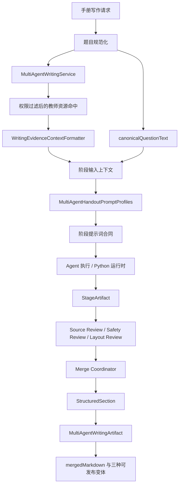

> 手册生成使用多智能体提示词配置、写作证据上下文格式化和阶段结果模型组织输入与可见证据。

# 手册阶段、证据与提示词配置

手册生成的输入组织由 Java 控制面负责：它统一维护多智能体写作协议、按阶段选择提示词、将已授权的教师资源命中格式化为模型可读证据，并把各阶段输出组织为可审阅、可合并、可发布的结果模型。Python 运行时负责具体模型阶段执行，但阶段契约、受众边界、证据可见范围和最终制品结构由 Java 侧定义。

## 模块职责

### `MultiAgentHandoutPromptProfiles`

`MultiAgentHandoutPromptProfiles` 是手册多智能体写作协议的集中注册表，职责包括：

- 保存所有阶段共享的教学规范 `CORE_TEACHING_PROTOCOL`。
- 保存每个阶段的专用合同 `STAGE_CONTRACTS`。
- 根据阶段编码生成最终提示词。
- 根据后端规范化后的题目文本判断单题请求或多题批次。
- 约束教师版、学生版和课堂投影版之间的受众隔离。

共享教学协议要求模型按照“题型识别 -> 方法梳理 -> 分步推理 -> 总结回顾”组织内容，并说明知识点、先修关系、方法选择、考试提示、常见错误和迁移问题。协议同时规定数学公式必须使用合法 LaTeX，分数使用 `\frac`，根式使用 `\sqrt`，不得使用 `/`、`√` 等视觉替代形式。

协议还明确了证据边界：模型不得虚构来源、题目、定理条件、图示事实或数值结果；发现证据不足时必须标记证据缺口。

### 阶段提示词合同

阶段合同将同一份教学输入拆分为不同职责：

- `resource_curation`：扫描主题和证据，返回来源锚点、知识点、先修关系、相关方法、学习阶段、难度及考试陷阱，不直接写正文。
- `template_selection`：为 `teacher_deep`、`student_blank` 和 `single_question_16_10` 三种产物选择结构。布局指令属于元数据，不应出现在课堂内容中。
- `outline_planning`：生成三个输出共享的课程主线，包括教学目标、知识图谱路径、题型识别、方法选择、已知条件、推导检查点、考试要点、陷阱、迁移任务和互动停顿。
- `teacher_writer`：只返回包含 `teacherExplanation` 的 JSON 对象，生成可打印的教师讲义。
- `student_writer`：只返回包含 `studentWorksheet` 的 JSON 对象，生成不泄露答案和教师推理的学生练习册。
- `lecture_writer`：只返回包含 `lectureCards` 的 JSON 对象，生成面向课堂投影的 16:10 卡片序列，并保持无答案状态。
- `source_review`：检查事实、定理条件、计算、答案、知识点归属、难度标签和证据锚点，返回具体修订补丁。
- `student_safety_review`：将学生版或投影版中的答案、完整推导、评分规则、教师指令、提示词和诊断信息视为阻断性泄露。
- `layout_review`：检查 LaTeX、题目与图示的关联、标题重复、学生空白区域及投影卡片布局约束。
- `merge_coordinator`：应用审查补丁，返回最终教师 Markdown，同时保留三个独立可发布的变体。

阶段合同负责内容语义和输出形状；页眉、页脚、页码、字体、颜色、几何尺寸等渲染属性由渲染器负责，不应被模型写入课堂正文。

## 单题与多题批次判定

`instructionsFor(stageCode, canonicalQuestionText)` 在生成阶段提示词前，会读取由 `MultiQuestionTextParser` 规范化的题目文本。只有匹配以下后端定义的完整标签才会计入批次：

```text
【题目 1】
【题目 2】
```

标签识别使用多行正则 `^【题目\s+\d+】$`。当识别到至少两个标签时，教师写作阶段必须：

- 按原始顺序解释每一道提交题目。
- 不因为题目数量少于产品要求的六道题而拒绝批次。
- 不添加替代题目或虚构题目。

当请求不是多题批次时，教师写作阶段要求至少生成六道有证据支持的独立原创题目。如果来源无法支持所需题目数量，模型必须返回明确的证据缺口，而不是补齐未经支持的内容。

这项判定只依赖规范化题目标签，不依赖公式中的空格或自然段落，因此普通题干文字不会意外改变教学合同。

## 写作证据上下文

`WritingEvidenceContextFormatter` 是检索结果进入写作提示词前的安全边界。它接收已经完成权限过滤的 `TeacherResourceBlockSearchResponse.Hit`，按检索排名顺序生成紧凑的证据段落。

每个有效命中包含：

```text
[资料来源：文档标题; 文档=文档 ID; 块=块 ID]
证据文本
TEACHER_IMAGE: 授权图片 URI 列表
```

格式化过程具有以下约束：

1. 输入为空或没有命中时返回空字符串。
2. 证据文本为空的命中会被丢弃。
3. 文档标题、文档 ID 和块 ID 会分别进行长度限制。
4. 证据正文通过 `maxTextChars` 截断。
5. 图片 URI 最多保留 `maxAssets` 个。
6. 只保留 MIME 类型以 `image/` 开头的资源。
7. 只保留没有 `pageNo` 的图片资源。
8. 空 URI 不会进入模型上下文。
9. 原始路径、凭证和本地文件不会跨过该边界。

`pageNo` 过滤体现了一个重要的发布安全规则：页面渲染图只能作为检索证据，不能直接作为可发布的教学图片进入讲义或投影提示词。没有页码的提取附件或题目关联图可以作为授权图片引用，题目最终是否使用该图片仍可由后续确定性渲染逻辑处理。

## 阶段结果模型

`MultiAgentWritingArtifact` 表示一个工作流的所有者可见内容快照，包含：

- `workflowId`：手册工作流标识。
- `tenantId`：租户边界。
- `subjectType` 与 `subjectId`：被写作对象。
- `status`：当前结果状态。
- `totalUsage`：累计模型用量。
- `stages`：各阶段的原始或投影结果。
- `sections`：可合并的结构化章节。
- `mergedMarkdown`：最终合并后的教师版 Markdown。

### `StageArtifact`

`StageArtifact` 记录单个阶段的执行上下文和结果：

- 阶段编码 `stageCode`。
- Agent 编码 `agentCode`。
- 追踪标识 `traceId`。
- 提供方和模型编码。
- 阶段状态。
- 生成内容。
- 引用列表 `citations`。
- 资源放置关系 `assetPlacements`。

引用和资源放置列表在构造时会被规范化为空列表，并通过不可变副本保存，避免调用方通过可变集合修改已记录的阶段结果。

### `StructuredSection`

`StructuredSection` 是面向合并器的结构化章节，包含：

- 章节编码和标题。
- 产生该章节的阶段编码。
- 章节正文。
- 审查意见和风险。
- 制品引用。
- 写作者拥有的引用信息。
- 不透明的资源放置关系。

字符串字段为空值会归一化为空字符串，列表字段为空值会归一化为空列表。该模型允许写作、审查和合并阶段分别保留自己的信息，同时避免把 Agent 日志、提示词、证据内部 ID 或布局指令泄露到课堂内容中。

## 调用链

手册阶段的核心调用链可以概括为：



关键节点含义：

- `MultiAgentWritingService` 负责把请求、规范化题目、证据上下文和阶段结果串联成写作流程。
- `WritingEvidenceContextFormatter` 控制进入模型的来源标签、文本范围和图片引用。
- `MultiAgentHandoutPromptProfiles` 根据阶段和题目批次生成适用的提示词。
- Agent 执行阶段产生结构化 JSON 或阶段内容。
- 审查阶段返回具体修订信息，学生安全审查对答案和教师内部信息执行阻断检查。
- 合并阶段生成教师版 Markdown，并保留教师、学生和投影三个独立变体。
- `MultiAgentWritingArtifact` 作为工作流查询、结果投影和后续导出的统一快照模型。

## 关键状态与边界条件

### 输入边界

写作上下文必须来自已经完成权限过滤的检索命中。格式化器不会自行执行权限判断，因此调用方必须保证传入数据已经过授权筛选。原始本地路径、凭证和未授权资源不得由上游直接拼接到提示词中。

证据正文和元数据均有长度上限。`maxTextChars` 或 `maxAssets` 为非正值时，对应内容不会被保留；空文本命中不会产生空的来源段落。

### 受众边界

教师版可以包含完整推导、答案、评分点和课堂互动内容。学生版必须隐藏最终答案、完整推导、评分点、教师备注及隐藏推理。投影版同样保持答案-free，只呈现题目、知识点、已知条件和供课堂推进使用的计算检查点。

### 输出边界

教师、学生和投影阶段都要求单一 JSON 对象和指定顶层字段，避免 Markdown、诊断信息或额外说明污染结构化解析。投影卡片还要求每张卡片有非空 `type`、`title` 和 `content`，空白区域使用结构化的 `blankSpacePx`，而不是下划线或占位文字。

### 证据不足

当题目、定理条件、计算结果、来源锚点或原创题目数量无法从证据中得到支持时，模型应返回证据缺口。教师阶段尤其不能通过虚构题目满足最少六道原创题目的要求。

### 可见结果

阶段结果同时保留生成内容、引用、资源放置、审查意见和风险；最终课堂内容则由合并阶段筛选产生。这样可以在可见制品中保留足够的追踪信息，同时避免将内部 Agent 日志、证据 ID、提示词和模型诊断写入课堂正文。

## 主要文件

- [MultiAgentHandoutPromptProfiles.java](backend-java/src/main/java/com/doob/mathagent/agent/service/MultiAgentHandoutPromptProfiles.java#L1-L148)：共享教学协议、阶段合同、题目批次判定和输出要求。
- [WritingEvidenceContextFormatter.java](backend-java/src/main/java/com/doob/mathagent/agent/service/WritingEvidenceContextFormatter.java#L1-L71)：权限过滤命中到写作安全上下文的格式化边界。
- [MultiAgentWritingArtifact.java](backend-java/src/main/java/com/doob/mathagent/agent/service/MultiAgentWritingArtifact.java#L1-L76)：工作流快照、阶段结果和结构化章节模型。
- [MultiAgentWritingService.java](backend-java/src/main/java/com/doob/mathagent/agent/service/MultiAgentWritingService.java#L1-L260)：多智能体写作流程的服务编排入口。
- [MultiAgentWritingRequest.java](backend-java/src/main/java/com/doob/mathagent/agent/dto/MultiAgentWritingRequest.java#L1-L80)：写作请求输入模型。
- [MultiAgentWritingResponse.java](backend-java/src/main/java/com/doob/mathagent/agent/vo/MultiAgentWritingResponse.java#L1-L80)：面向调用方的写作结果投影。
- [MultiQuestionTextParser.java](backend-java/src/main/java/com/doob/mathagent/agent/service/MultiQuestionTextParser.java#L1-L80)：规范化题目文本并提供后端拥有的批次标签语义。

## 扩展点

新增写作阶段时，应在 `STAGE_CONTRACTS` 中增加稳定的阶段编码和专用输出约束，并同步确认该阶段结果如何进入 `StageArtifact` 或 `StructuredSection`。如果阶段面向新的受众，应明确其答案可见性、教师内部信息和诊断信息边界。

新增证据字段时，应继续通过 `WritingEvidenceContextFormatter` 处理，不能绕过该边界直接把检索对象序列化到提示词。新的资源类型需要同时定义 MIME 类型、数量上限、授权路由和是否允许进入模型上下文。

新增手册变体时，需要在模板选择、对应 writer 合同、安全审查、布局审查及合并结果中保持一致，并为该变体定义独立的内容键和发布约束。对于新的题目批次规则，应继续由 `MultiQuestionTextParser` 提供规范化语义，避免让自然语言或格式噪声改变阶段合同。

Sources: [MultiAgentHandoutPromptProfiles.java](backend-java/src/main/java/com/doob/mathagent/agent/service/MultiAgentHandoutPromptProfiles.java#L1-L148), [WritingEvidenceContextFormatter.java](backend-java/src/main/java/com/doob/mathagent/agent/service/WritingEvidenceContextFormatter.java#L1-L71), [MultiAgentWritingArtifact.java](backend-java/src/main/java/com/doob/mathagent/agent/service/MultiAgentWritingArtifact.java#L1-L76), [MultiAgentWritingService.java](backend-java/src/main/java/com/doob/mathagent/agent/service/MultiAgentWritingService.java#L1-L260)
