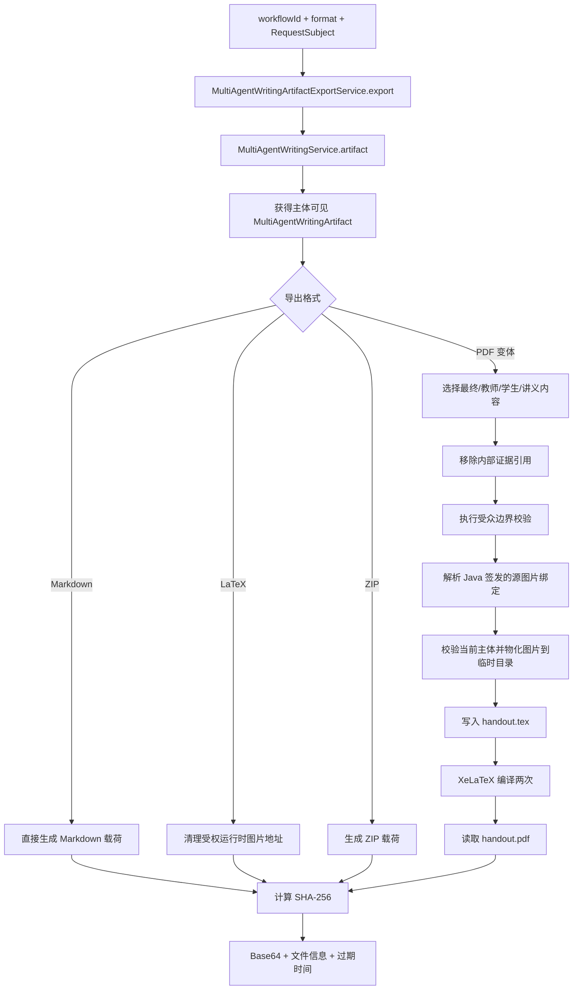

> 完成后的多智能体制品可导出，并通过文档图片重写器处理手册文档中的图片资源。

# 手册制品导出与文档图片处理

多智能体写作完成后，Java 控制面通过 `MultiAgentWritingArtifactExportService` 读取当前认证主体可见的工作流制品，并将其转换为 Markdown、LaTeX、PDF 或 ZIP。导出结果以短期有效的 Base64 载荷返回，同时携带文件名、MIME 类型、字节长度、SHA-256 校验和及过期时间。

文档图片在进入 Python 写作运行时之前，由 `HandoutDocumentImageRewriter` 将已授权的源图片 Markdown 行替换为本次运行稳定的、不透明别名。Python 只接触逻辑路径和别名，不接触资产 ID、存储键、绝对路径、URL 或二进制内容。后续 PDF 导出阶段再依据 Java 生成的绑定关系和当前主体权限，将这些逻辑图片物化到隔离的 LaTeX 编译目录中。

## 模块职责

### `HandoutDocumentImageRewriter`

`HandoutDocumentImageRewriter` 负责文档块进入 Python writer 之前的图片边界处理：

- 读取文档块中的 `imageRefs` JSON 元数据。
- 按文档块和图片出现顺序处理图片。
- 校验 Markdown 图片行、逻辑路径、扩展名和 MIME 类型。
- 通过 `ImageAuthorizer` 重新确认当前主体是否有权访问图片。
- 将图片 alt 文本改写为运行稳定的别名，例如 `source-image:<fingerprint>-image-001`。
- 同步重写文档块正文和 `imageRefs` JSON。
- 对超过图片预算的后续文档块整体丢弃，避免未重写的图片行穿过模型边界。

图片别名只在本次运行中稳定：别名由 `runId`、文档 ID 和源顺序共同决定，同一文档块中的相同 Markdown 行会复用同一别名。重写器默认最多处理 12 张图片，构造参数可将上限限制在 1 到 50 之间；标签前缀必须符合受限字符集，以避免把任意内容引入模型可见标识。

### `MultiAgentWritingArtifactExportService`

导出服务负责完成制品读取、格式选择、内容清理、图片物化和结果封装：

- 通过 `MultiAgentWritingService.artifact(workflowId, subject)` 获取主体可见的制品。
- 规范化外部格式值，并拒绝不支持的格式。
- 生成 Markdown、LaTeX、PDF 或 ZIP 载荷。
- 为 PDF 导出提供最终版、教师版、学生版和讲义版变体。
- 处理导出层专属的页眉和页脚标签。
- 计算 SHA-256、生成导出 ID，并按配置 TTL 设置过期时间。
- 将二进制结果编码为 Base64，供 MCP 或其他传输层返回。

页眉和页脚只由导出层接收，不进入 Agent prompt，因此可以在不重新生成内容的情况下调整渲染标签。导出对象默认使用 30 分钟 TTL，也可由 `math-agent.agent.writing.artifact-export-ttl-minutes` 配置，实际 TTL 至少为 1 分钟。

## 主调用链

关键节点如下：

1. **主体可见性检查**  
   导出首先从写作服务获取制品，并传入后端解析出的 `RequestSubject`。因此导出不是仅凭工作流 ID 读取任意制品。

2. **格式分派**  
   支持的导出分支包括 Markdown、LaTeX、ZIP，以及 PDF 的最终版、教师版、学生版和讲义版。具体格式先经过外部值规范化，再由支持性校验决定是否继续。

3. **PDF 专用处理**  
   PDF 导出会先移除内部证据引用，执行受众边界检查，然后选择 XeLaTeX。缺少 XeLaTeX 时直接失败，不使用可能导致公式显示错误的 PDFBox 文本兜底。

4. **图片物化与编译**  
   图片只会写入本次导出的临时目录，生成 `handout.tex` 后调用 XeLaTeX 两次，以支持交叉引用或目录等需要多轮编译的场景。导出结束后递归删除临时目录。

## 图片处理链路

### 写入 Python 前：逻辑路径与别名

重写器接收文档块列表、运行 ID、主体和授权器。对于没有图片引用的块，原样保留；对于有图片引用的块，则从 `rawText` 或 `normalizedText` 获取正文，并要求每个授权图片 Markdown 行确实存在于正文中。

授权成功后，图片行的目标路径保持不变，只替换 alt 标签。重写后的 `imageRefs` 仍保存：

- 改写后的 `markdownLine`
- 原始的、相对的 `logicalPath`

这样 writer 可以继续输出原始 Markdown 结构，同时不会获得底层资源信息。授权失败、元数据格式错误、正文缺少声明图片或图片超出安全约束时，处理会失败关闭，而不是将未经后续物化路径保障的图片行交给模型。

### PDF 导出时：绑定关系与主体授权

PDF 导出不会信任模型自行提供图片映射，而是从制品中的 `resource_curation` 阶段结果读取 Java 签发的图片绑定。该阶段内容会解析 `items` 和 `inspectedItems` 中的 `imageRefs`，再建立逻辑图片与后端资产之间的内部绑定关系。

模型的职责只是保留经过重写的源图片 Markdown 行。导出器根据这些行查找 Java 侧绑定，并使用导出主体重新执行资源授权，之后才将图片写入隔离编译目录。由此形成“模型保留引用，Java 决定资源”的边界。

### 不支持二进制承载的格式

独立 `.tex` 文件无法携带主体授权的图片二进制内容，因此 LaTeX 导出会将后端签发的资源 URL 替换为提示文本，提示使用受权 PDF 导出查看图片。Markdown 导出则直接输出合并后的 Markdown 内容；当制品正文为空时生成占位内容。

## 关键状态与数据

### 制品状态

导出输入是 `MultiAgentWritingArtifact`，其中包含：

- `workflowId`
- 租户和主体信息
- 合并后的 Markdown
- 多个阶段制品
- `resource_curation` 阶段产生的图片绑定信息

PDF 变体依据 `HandoutVariant` 选择内容，并在生成标题、文件后缀和页面内容时保持变体隔离。教师页眉和页脚属于渲染状态，不会改变原始多智能体制品。

### 导出响应状态

导出响应包含：

- 随机生成的 `exportId`
- 对应的 `workflowId`
- 规范化后的格式
- 文件名和 MIME 类型
- 原始字节长度
- SHA-256 校验和
- Base64 编码内容
- `expiresAt`

TTL 只描述导出响应的短期有效期；源码证据显示导出服务在生成响应时计算过期时间，但未显示独立的导出文件持久化或后续下载端点。

### 图片处理状态

重写器维护：

- 当前运行的安全化 `runId`
- 已分配图片序号
- `(documentId, markdownLine)` 到别名的映射
- 本次运行的最大图片数

当图片数超过上限时，当前超限图片所在的整个文档块被跳过，之后的块继续按照已有源顺序处理。已经分配的别名不会回滚；该行为保证前面已通过边界的图片行保持稳定。

## 安全边界与边界条件

### 主体与资产边界

- 导出制品必须通过 `MultiAgentWritingService` 按 `RequestSubject` 获取。
- 图片授权由 `ImageAuthorizer` 决定，授权失败直接抛错。
- PDF 导出再次依据当前主体解析并物化资源。
- 模型不能提供资产 ID、存储键、绝对路径、远程 URL 或图片二进制来绕过 Java 侧绑定。

### 图片引用校验

图片 Markdown 目标必须满足以下条件：

- 使用合法的 `` 形式。
- 目标不能为空。
- 不允许 `http://`、`https://`、`data:`、绝对路径或 Windows 绝对路径。
- 不允许包含父目录段 `..`。
- 扩展名仅支持 `.jpg`、`.jpeg` 和 `.png`。
- 逻辑路径必须是相对路径，不能包含协议、绝对路径、Windows 绝对路径或父目录段。
- MIME 类型为空或必须属于 JPEG/JPG/PNG 支持集合。

图片元数据必须是 JSON 数组，数组元素必须是对象；无效行或无法解析的 JSON 会终止重写。文档块中声明了图片，但正文不包含对应 Markdown 行时，同样终止处理，避免元数据和模型可见正文不一致。

### PDF 生成边界

- XeLaTeX 不存在时拒绝生成 PDF。
- XeLaTeX 编译超时或失败会导致导出失败。
- 编译产物必须确实生成 `handout.pdf`。
- 临时目录在成功或失败后都尝试删除。
- PDF 不采用 PDFBox 文本回退，以避免公式和中文内容被静默降级。

### 内容清理边界

PDF 导出会移除内部证据引用和内部证据引用标题，避免 `ev_` 形式的内部引用或 writer 复制出的“证据引用”栏目出现在最终手册中。受众边界校验在编译前执行，用于阻止不应进入特定教师、学生或讲义变体的内容继续渲染。

## 主要文件

- [`MultiAgentWritingArtifactExportService.java`](backend-java/src/main/java/com/doob/mathagent/agent/service/MultiAgentWritingArtifactExportService.java)  
  负责工作流制品读取、格式分派、Markdown/LaTeX/PDF/ZIP 生成、图片授权物化、XeLaTeX 编译和导出响应封装。

- [`HandoutDocumentImageRewriter.java`](backend-java/src/main/java/com/doob/mathagent/agent/service/HandoutDocumentImageRewriter.java)  
  负责文档块图片元数据解析、图片路径安全校验、主体授权、运行稳定别名生成和模型边界前的正文重写。

- `MultiAgentWritingService`  
  由导出服务调用，用于按工作流 ID 和 `RequestSubject` 获取主体可见的多智能体写作制品。

- `TeacherResourceAssetService`  
  导出服务依赖的教师资源资产服务，用于处理授权资源资产。

- `CanonicalMathPaperAssetService`  
  导出服务依赖的规范数学论文资产服务，用于支持论文来源图片等规范化资产。

## 扩展点

1. **新增导出格式**  
   在 `ArtifactExportFormat` 的规范化和支持性校验体系中加入格式，并在导出分派中增加对应载荷生成器。新的格式需要明确是否能够携带主体授权的二进制图片；不能携带时应沿用 LaTeX 的资源脱敏策略。

2. **扩展 PDF 变体**  
   增加新的 `HandoutVariant`，同时定义其内容筛选、标题、文件后缀和受众边界规则。页眉与页脚应继续停留在导出渲染层，不进入写作 prompt。

3. **扩展图片格式**  
   需要同时更新重写器支持的扩展名和 MIME 集合，以及后续图片物化和 LaTeX 编译链路，不能只放宽 Markdown 校验。

4. **调整图片预算**  
   可通过构造参数改变单次运行图片上限，但上限仍被限制在 1 到 50。若需要更复杂的分页或按文档预算，应重新定义“超限块跳过”的策略及模型侧可见状态。

5. **替换编译器或渲染后端**  
   当前 PDF 生成依赖 XeLaTeX、临时目录和两次编译。替换渲染器时必须保留超时、失败显式返回、产物存在性检查和临时资源清理等边界。

Sources: [MultiAgentWritingArtifactExportService.java](backend-java/src/main/java/com/doob/mathagent/agent/service/MultiAgentWritingArtifactExportService.java#L1-L260) [HandoutDocumentImageRewriter.java](backend-java/src/main/java/com/doob/mathagent/agent/service/HandoutDocumentImageRewriter.java#L1-L225)
