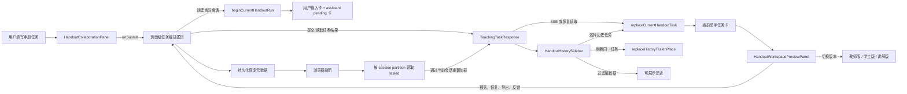

> 前端围绕任务提交、协作状态、历史记录、工作区预览和恢复状态组织手册创作体验。

# 前端手册协作工作区

前端手册协作工作区由三个相互配合的区域组成：

- **协作面板**：收集手册主题、证据数量、页眉/页脚署名及可选模型配置，展示当前任务的提交结果和工作流协作信息。
- **历史侧边栏**：展示可恢复的历史任务，负责任务切换、历史记录清理和当前任务标记。
- **工作区预览面板**：针对当前任务和选定版本提供摘要、评审、LaTeX/PDF 预览、恢复、导出及人工反馈入口。

工作区将“当前一次创作会话”和“持久化历史”分开管理。当前会话只保留本次提交对应的用户输入和一个助手任务卡；历史任务由独立侧边栏维护。这样可以避免提交新任务后，旧任务卡继续出现在当前协作流中。

## 整体调用链



图中的页面级任务编排逻辑不由这些组件直接实现，而是通过 `onSubmit`、`onPreviewPdf`、`onPreviewLatex`、`onResumeTask`、`onExportPdf` 等回调注入。组件负责输入、展示和交互状态，任务请求及后端读取由上层页面或服务处理。

## 协作面板

`HandoutCollaborationPanel` 是当前手册创作的主要输入和协作展示组件。

### 输入职责

面板接收并通过回调更新以下任务参数：

- `learningGoal`：手册主题或学习目标。
- `questionText`：题目或问题文本。
- `supplementaryRequirements`：补充要求。
- `evidenceLimit`：证据数量限制，输入限制为最小值 `1`，按整数步进。
- `watermarkText`：页眉/页脚署名，最大长度为 `32`。
- `aiProviderName`、`aiModelCode`：在存在可选项时显示生成模型和模型版本选择器。
- `selectedTemplateName`：保留用于兼容旧调用方，但源码明确标记模板由后端负责，不作为用户提示直接渲染。

提交动作通过 `onSubmit` 交给外层编排。面板根据 `loading` 将提交按钮状态显示为“生成中”或“开始生成”，说明生成中的禁用、请求控制等行为属于上层或其他组件的职责。

### 协作结果与工作流检查

组件定义了 `WorkflowNodeInspection`，用于把一个持久化工作流节点整理为前端可检查的数据：

- 节点本身；
- 与节点关联的事件摘要；
- 证据；
- 模板名称；
- 来源引用；
- 人工评审发现；
- 可用版本。

工作流节点与事件之间通过显式的 `WORKFLOW_NODE_EVENT_IDS` 映射关联。例如：

- `LEARNING_GOAL` 和 `HANDOUT_TEMPLATE` 对应 `plan`；
- 检索节点对应 `evidence`；
- `AI_DRAFT` 对应 `generation`；
- `LATEX_HANDOUT` 对应 `render`；
- `HUMAN_FEEDBACK` 对应 `review`。

源码特意避免使用事件标题作为关联键，因为标题属于可变的编辑文案，不适合作为稳定追踪标识。

检索节点还受到 `WORKFLOW_NODE_EVIDENCE_SCOPE` 限制：

- 公共教材检索只能暴露 `PUBLIC_TEXTBOOK` 范围；
- 题库检索只能暴露 `QUESTION_BANK` 范围；
- 教师资源检索只能暴露 `TEACHER_RESOURCE` 范围。

因此，工作区的证据检查不是任意展示全部证据，而是需要遵守节点和后端分配的证据作用域。教师文档证据通过 `onInspectEvidence` 异步加载，组件注释明确要求通过后端会话读取，不能把本地路径或飞书令牌传入面板。

### 当前会话滚动

面板使用 `scrollRef` 保存协作内容容器。当 `entries` 或 `loading` 变化时，自动滚动到容器底部。这适用于生成事件持续追加或当前助手卡从等待状态变为任务结果的场景。

## 当前会话状态模型

`handoutWorkspaceState.ts` 为当前协作会话提供独立的瞬时状态模型。

### 会话初始化

`beginCurrentHandoutRun` 接收提交时捕获的 `BeginHandoutRunInput`，一次性创建两条记录：

1. 用户输入记录，保存主题、问题、补充要求、模板名、证据限制和创建时间。
2. `loading: true` 的助手待处理记录。

两条记录使用请求 ID 形成稳定标识：

- `user:${requestId}`
- `assistant-pending:${requestId}`

提交时保存输入快照很重要，因为后续任务结果返回时，界面仍需要显示本次提交的原始条件，而不是读取已经被用户修改过的输入框内容。

### 任务结果替换

`replaceCurrentHandoutTask` 不追加新的助手卡，而是把最新的 `TeachingTaskResponse` 写回当前助手记录。它会判断当前任务是否仍属于同一次工作区运行：

- 助手卡仍处于 `loading`；
- 助手卡的 `taskId` 与结果一致；
- 助手卡已有任务且任务 ID 一致。

重复的 SSE 事件或恢复读取因此会更新同一张助手卡，不会产生多个看起来像教师版结果的重复卡片。

### 选择历史任务时的隔离

如果用户从历史侧边栏选择了另一个任务，新的任务 ID 与当前助手卡不匹配，函数不会继续复用旧的用户输入卡，而是根据持久化任务重新构造用户记录：

- 主题优先取 `learningGoal`，其次取 `questionText`；
- 模板名称取 `selectedTemplate.displayName`；
- 证据数量由持久化 `evidence` 数组长度推导；
- 创建时间使用当前时间，因为历史数据未必保存原始前端会话时间。

这个分支避免了“旧问题 + 新结果”配对，也避免历史选择导致工作区中的对话卡片与侧边栏顺序产生误导。

## 历史侧边栏

`HandoutHistorySidebar` 接收完整任务数组，并通过 `buildVisibleHistory` 生成实际展示列表。

### 展示过滤

历史记录只有满足以下条件才会展示：

- 存在 `taskId`；
- 状态属于 `CREATED`、`RUNNING`、`FAILED` 或 `COMPLETED`；
- 主题或问题文本非空；
- 标题未被判定为损坏；
- 内容未包含协议或内部实现泄漏；
- 失败任务至少拥有一定长度的手册正文，或拥有证据/工作流节点等可恢复进度。

`CREATED` 和 `RUNNING` 任务会保留在历史中，因为它们可能包含页面刷新后仍可恢复的证据和阶段进度。失败任务即使没有正文，只要有节点或证据，也仍然可能是有效的恢复记录。

列表还按 `taskId` 去重，并保留原始顺序。`replaceHistoryTaskInPlace` 刷新任务详情时只替换原数组中的对应位置，不重新排序历史记录，避免用户打开历史任务后列表发生跳动。

### 当前项与打开状态

侧边栏分别区分：

- `currentTaskId`：当前正在查看的任务；
- `openingTaskId`：正在异步打开的任务；
- `loading`：历史列表是否同步中；
- `isOpen`：侧边栏展开或折叠状态。

当前任务或正在打开的任务会获得 active 样式和 `aria-current="page"`；正在打开的任务还会标记 `aria-busy`，移除按钮显示加载图标。

### 脏数据防护

历史展示层会清理 Markdown 标记和图片链接，用于生成简洁标题和内容检查。同时拦截可能暴露协议或内部执行细节的内容，例如：

- `requestHash`、`idempotencyKey`、`modelCall`；
- `bearer`、`mcp`、`apiAccess`；
- 内部提示词、系统提示、模型健康或调试信息；
- 模板占位符 `{{...}}`。

这是一层前端展示门禁，不能替代后端的权限控制和数据过滤。其边界是避免旧坏任务污染新工作区，而不是修复后端任务数据。

## 工作区预览与版本操作

`HandoutWorkspacePreviewPanel` 面向当前选中的 `TeachingTaskResponse` 提供结果查看和后续操作。

### 预览对象

预览面板维护以下关键输入：

- `task`：当前任务，可为空；
- `version`：当前讲义版本；
- `previewLatex` 及其 `previewTaskKey`；
- `previewPdfUrl`、`previewPdfBytes`、`previewPdfMeta` 及其任务键；
- 当前操作状态、导出消息和预览错误；
- 人工反馈评分、决策、评论、提交状态和历史记录。

PDF 和 LaTeX 预览都使用任务 ID 与版本组成的键进行校验：

```text
taskKey = taskId:version
```

只有当预览数据的任务键与当前任务和版本完全匹配时，预览才被视为可用。这可以防止用户切换历史任务或讲义版本后，旧任务的预览内容继续显示。

### 摘要与评审模式

面板有两个本地显示模式：

- `summary`：默认摘要模式；
- `review`：评审模式。

切换任务或版本时，组件会：

- 回到摘要模式；
- 关闭编辑状态；
- 使用当前版本的讲义草稿重置 `editedLatex`。

进入评审模式时，如果当前没有可用 LaTeX 预览，会先调用 `onPreviewLatex` 生成预览数据。

### 版本切换

工作区至少支持教师版和学生版切换，按钮是否可用取决于对应任务是否存在相应的 LaTeX 内容：

- 教师版依赖 `teacherHandoutLatex` 或通用 `handoutLatex`；
- 学生版依赖对应学生内容。

组件还会对学生版草稿进行内容检查。如果学生版本中出现“答案”“解析”“评分点”“teacherExplanation”或“参考答案”等内容，会设置 `studentLeakWarning`。这属于生成结果的前端可见性提示，用于提醒学生版可能混入教师侧信息。

### 操作边界

预览面板通过回调委托具体操作：

- `onPreviewPdf`：生成或加载 PDF 预览；
- `onPreviewLatex`：生成或加载 LaTeX 预览；
- `onResumeTask`：恢复任务；
- `onExportPdf`：导出 PDF；
- `onSaveHandoutVersion`：保存编辑后的讲义版本；
- `onSubmitFeedback`：提交人工反馈。

因此，预览组件不直接决定任务如何恢复、文件如何导出或反馈如何持久化。它只根据输入状态计算按钮和预览区域的可用性，并向上层发出操作请求。

## 恢复状态与会话隔离

`handoutTaskRecovery.ts` 只在浏览器存储中保存恢复所需的最小信息：

```json
{
  "taskId": "opaque-task-id",
  "session": "role:tenantId:userId"
}
```

任务正文、证据和阶段结果仍归后端所有。刷新页面后，前端只能拿到任务 ID，并必须通过当前认证会话重新读取任务数据。

### 可恢复状态写入

`persistRecoverableHandoutTask` 仅在以下条件下写入：

- 浏览器存储对象存在；
- 当前会话存在；
- 任务状态不是终态。

终态包括：

- `COMPLETED`
- `FAILED`
- `WAITING_REVIEW`
- `DRAFT_ONLY`

这意味着恢复元数据主要服务于仍可能继续执行或需要恢复查看的任务，而不是永久保存所有任务详情。

### 读取与清理

`readRecoverableHandoutTaskId` 会解析存储内容，并校验其中的 session partition 必须等于当前会话的分区。解析失败、字段类型不正确、任务 ID 为空或会话不匹配时，返回空字符串。

`clearRecoverableHandoutTask` 只删除前端恢复元数据，不触碰后端任务数据。这样可以清除陈旧指针，同时保留服务端历史记录。

## 关键状态关系

工作区的主要状态可以归纳为以下几类：

| 状态 | 所属 | 作用 |
| --- | --- | --- |
| `entries` | 当前协作会话 | 保存本次提交的用户卡和助手任务卡 |
| `loading` | 提交/协作面板 | 表示当前是否正在生成 |
| `currentTaskId` | 历史与工作区 | 标识当前查看任务 |
| `openingTaskId` | 历史侧边栏 | 标识正在加载的历史任务 |
| `task` | 预览面板 | 当前被预览和操作的持久化任务 |
| `version` | 协作面板与预览面板 | 当前教师、学生或讲解版本 |
| `previewTaskKey` | 预览面板 | 校验 LaTeX 预览是否属于当前任务版本 |
| `previewPdfTaskKey` | 预览面板 | 校验 PDF 预览是否属于当前任务版本 |
| `mode` | 预览面板 | 摘要或评审显示模式 |
| 恢复 `taskId` | 浏览器存储 | 刷新后定位仍可恢复的任务 |

这些状态共同实现了三个重要约束：

1. 当前协作流与历史列表相互隔离。
2. 任务结果以替换方式更新，避免重复卡片。
3. 预览内容必须匹配当前任务和版本，避免跨任务残留。

## 主要文件

- [HandoutCollaborationPanel.tsx](frontend/src/app/components/HandoutCollaborationPanel.tsx#L1-L260)：手册任务输入、协作结果、工作流节点检查和证据查看入口。
- [HandoutHistorySidebar.tsx](frontend/src/app/components/HandoutHistorySidebar.tsx#L1-L172)：历史任务筛选、去重、选择、移除和顺序稳定更新。
- [handoutWorkspaceState.ts](frontend/src/app/handoutWorkspaceState.ts#L1-L116)：当前会话的用户/助手卡片模型，以及任务结果替换规则。
- [handoutTaskRecovery.ts](frontend/src/app/handoutTaskRecovery.ts#L1-L63)：基于任务 ID 和认证会话分区的刷新恢复元数据。
- [HandoutWorkspacePreviewPanel.tsx](frontend/src/app/components/HandoutWorkspacePreviewPanel.tsx#L1-L280)：讲义版本切换、LaTeX/PDF 预览、恢复、导出和人工反馈交互。
- [textbookApi](frontend/src/shared/api/textbookApi.ts)：协作区使用的任务、工作流、证据、讲义 PDF 和人工反馈类型契约。

## 边界条件与扩展点

### 边界条件

- 历史任务状态不在允许集合内时不会显示。
- 失败任务既没有足够正文，也没有证据或节点时不会显示。
- 含有协议字段、内部提示词或调试信息的旧数据会被隐藏。
- 恢复信息不包含任务正文，且跨用户、跨租户或跨角色时不能读取。
- 任务或版本切换后，旧的 LaTeX/PDF 预览会因任务键不匹配而失效。
- 学生版生成内容可能混入教师信息，前端会产生泄漏警告，但不应将此检查视为完整的安全隔离。
- 当前会话没有匹配的内存任务卡时，历史任务会重新生成用户侧记录，证据数量只能依据持久化证据列表估算。

### 扩展点

- **新增工作流节点**：在 `WORKFLOW_NODE_EVENT_IDS` 增加节点到事件类型的显式映射；若节点有证据展示，还应增加对应作用域。
- **新增讲义版本**：扩展版本类型、草稿选择逻辑、版本按钮和预览任务键计算，同时明确该版本的内容安全检查。
- **新增历史状态**：同步更新可展示状态集合、终态集合和状态中文标签，区分“可恢复”与“仅可查看”。
- **增强恢复能力**：仍应只保存不透明任务 ID和会话分区，任务详情继续由后端按当前权限读取。
- **增强人工评审**：可在 `TeachingHumanFeedbackResponse` 和预览面板回调基础上增加评审字段或节点级反馈，但持久化行为应继续由上层服务负责。
- **扩展证据来源**：新增来源时应同时定义后端作用域和前端显示策略，避免把不同权限范围的证据混在同一节点中。

Sources: [frontend/src/app/components/HandoutCollaborationPanel.tsx](frontend/src/app/components/HandoutCollaborationPanel.tsx#L1-L260), [frontend/src/app/components/HandoutHistorySidebar.tsx](frontend/src/app/components/HandoutHistorySidebar.tsx#L1-L172), [frontend/src/app/handoutWorkspaceState.ts](frontend/src/app/handoutWorkspaceState.ts#L1-L116), [frontend/src/app/handoutTaskRecovery.ts](frontend/src/app/handoutTaskRecovery.ts#L1-L63), [frontend/src/app/components/HandoutWorkspacePreviewPanel.tsx](frontend/src/app/components/HandoutWorkspacePreviewPanel.tsx#L1-L280)
