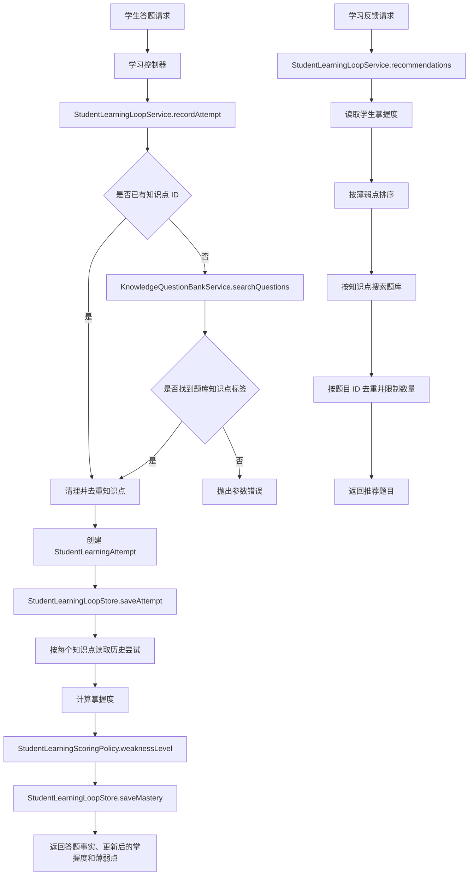

> StudentLearningLoopService 组织学习尝试、知识掌握度更新和下一步学习反馈。

# 学生学习闭环服务

`StudentLearningLoopService` 位于 Java 后端 `learning` 模块，负责把学生的一次答题组织成完整的学习闭环：

1. 记录不可变的答题事实；
2. 根据关联知识点重新计算掌握度；
3. 识别薄弱知识点；
4. 基于薄弱知识点从题库检索下一步练习题。

服务本身不直接实现评分算法和数据库访问，而是分别依赖 `StudentLearningScoringPolicy` 与 `StudentLearningLoopStore`，并通过 `KnowledgeQuestionBankService` 获取知识点和推荐题目。

## 模块职责

### 学习尝试记录

`recordAttempt` 接收租户、学生、题目、知识点、答题正确性和作答耗时等信息。服务会：

- 校验 `tenantId`、`studentId`、`questionId` 等必要字段；
- 清理并去重知识点 ID；
- 将响应时间限制为不小于 `0`；
- 生成 UUID 作为答题尝试 ID；
- 使用注入的 `Clock` 生成提交时间；
- 将答题事实保存到 `StudentLearningLoopStore`。

答题事实由 `StudentLearningAttempt` 表示，包含题目文本、关联知识点、是否答对、作答耗时和提交时间。它与掌握度快照分离保存，因此后续可以调整评分策略，并根据原始答题记录重新计算掌握度。

### 知识点补全

调用方可以直接传入 `knowledgePointIds`。当知识点列表为空时，服务会使用题目文本调用题库的可见搜索：

```java
questionBankService.searchQuestions(tenantId, clean(role), studentId, query, 3)
```

搜索结果中的知识点标签会被提取、清理、去重。服务只使用题库已有的知识点标签，不会自行发明新的知识点；题目文本为空或搜索不到匹配标签时，调用会失败并提示至少需要一个知识点。

这条路径复用了现有题库搜索能力，不额外引入模型或云端分类调用。

### 掌握度投影

保存答题事实后，服务会针对本次答题关联的每个知识点重新读取该学生的全部历史尝试，并生成一个新的 `StudentKnowledgeMastery` 快照。

当前掌握度计算公式为：

```text
masteryPercent =
round((correctCount + PRIOR_CORRECT) * 100
      / (attemptCount + PRIOR_TOTAL))
```

当前平滑先验为：

- `PRIOR_CORRECT = 1`
- `PRIOR_TOTAL = 2`

因此，刚开始没有大量答题样本时，掌握度不会直接等同于简单正确率。掌握度快照同时保存答题总数、答对数、答错数、最近答题时间和可读的证据摘要。

### 薄弱点诊断

掌握度通过 `StudentLearningScoringPolicy.weaknessLevel` 转换为 `0..5` 的风险等级：

- `0`：没有薄弱性；
- `1`：当前策略未直接产生该等级；
- `2`：掌握度达到健康阈值但仍存在错误，或处于一般风险；
- `3`：掌握度低于 `70%`；
- `4`：掌握度低于 `55%`；
- `5`：掌握度低于 `35%`。

特殊情况下，知识点没有答题记录，或掌握度达到 `70%` 且错误数为零，薄弱等级为 `0`。

`mastery` 返回单个学生的掌握度，并按掌握度从低到高排列。`weakPoints` 则过滤出 `weaknessLevel > 0` 的记录。

### 下一步学习反馈

`recommendations` 首先读取学生的掌握度，按薄弱程度筛选知识点，再逐个调用：

```java
questionBankService.searchQuestionsByKnowledgePoint(
    tenantId, clean(role), studentId, point.knowledgePointId(), boundedLimit
)
```

题目结果会附带触发推荐的知识点 ID 和对应薄弱等级，形成 `RecommendedQuestion`。服务使用题目 ID 去重，避免同一道题因为关联多个薄弱点而重复返回。

推荐数量被限制在 `1..50`：

```text
boundedLimit = max(1, min(limit, 50))
```

当结果达到限制后立即返回；如果题库没有足够题目，则返回当前已收集的结果。

## 调用链



关键节点如下：

- `StudentLearningLoopService` 是学习闭环编排入口；
- `StudentLearningLoopStore` 同时承载答题事实和掌握度投影；
- `StudentLearningScoringPolicy` 负责可替换的评分与风险分级；
- `KnowledgeQuestionBankService` 负责知识点补全和题目推荐；
- 推荐结果只建立在已有掌握度和题库搜索结果之上。

## 关键状态与数据关系

### `StudentLearningAttempt`

这是原始答题事实，具有以下特征：

- 每次答题生成独立的 `attemptId`；
- 记录租户和学生身份；
- 可关联多个知识点；
- 保存正确性与响应时间；
- 保存提交时间；
- 追加保存，不作为掌握度的替代物。

同一个答题尝试关联多个知识点时，该次答题会参与每个知识点的重新计算。

### `StudentKnowledgeMastery`

这是按“租户 + 学生 + 知识点”维护的派生快照，主要字段包括：

- `masteryPercent`：平滑后的掌握度；
- `attemptCount`：答题次数；
- `correctCount`：答对次数；
- `incorrectCount`：答错次数；
- `weaknessLevel`：薄弱等级；
- `lastAttemptAt`：最近答题时间；
- `evidenceSummary`：当前统计摘要。

它不是原始事实，而是由历史答题记录投影得到的当前状态。

## 持久化边界

`StudentLearningLoopStore` 定义了学习闭环的持久化接口：

- 保存答题事实；
- 查询某个学生某个知识点的答题记录；
- 保存或更新掌握度快照；
- 查询某个学生的掌握度；
- 查询租户范围内、可选定学生的掌握度。

当前有两种实现：

- `InMemoryStudentLearningLoopStore`：在数据库关闭或未启用时使用，数据保存在进程内并通过并发集合提供线程安全访问；
- `MyBatisStudentLearningLoopStore`：数据库启用时使用，将答题事实和掌握度分别映射到对应实体及 Mapper。

MyBatis 实现将知识点 ID 列表序列化为 JSON 保存，并在读取时反序列化。掌握度以“租户 + 学生 + 知识点”为逻辑键进行查询，存在则更新，不存在则插入。

因此，内存实现适合本地或临时运行环境；需要跨重启保留学习记录时，应使用数据库实现。

## 边界条件

### 输入校验

以下字段会被去除首尾空白并要求非空：

- `tenantId`
- `studentId`
- `questionId`

题目文本为空时无法通过题库搜索补全知识点。若调用方未提供知识点，且题库搜索也没有返回有效标签，则抛出：

```text
knowledgePointIds must contain at least one knowledge point
```

知识点列表中的空值、空字符串会被过滤，重复 ID 会被去重。

### 响应时间

负数响应时间会被归一化为 `0`，不会阻止答题记录保存。

### 租户隔离

学习状态查询始终携带 `tenantId`。学生查询按租户和学生过滤；租户范围查询同样以租户为边界，并可进一步限定某个学生。持久化实现和内存实现都保持这一过滤规则。

### 无历史记录

掌握度重新计算基于查询到的答题记录。正常情况下，本次答题保存成功后，关联知识点至少有一条记录。评分策略仍显式处理零答题次数，避免空数据产生非预期风险等级。

### 推荐不足或重复

题库可能无法为所有薄弱知识点返回题目。服务不会补造推荐项，只返回实际搜索到的题目。多个知识点命中同一题时，按题目 ID 去重，并以第一次加入结果时对应的知识点作为推荐标注来源。

### 一致性边界

一次答题处理先保存答题事实，再逐个知识点重算并保存掌握度。当前服务没有展示事务封装或批量投影接口，因此多知识点更新过程中的部分失败恢复，需要由持久化事务、上层调用策略或后续可靠性设计补充。

## 主要文件

- [`StudentLearningLoopService.java`](backend-java/src/main/java/com/doob/mathagent/learning/StudentLearningLoopService.java#L15-L122)：学习闭环编排、知识点补全、掌握度重算和题目推荐。
- [`StudentLearningAttempt.java`](backend-java/src/main/java/com/doob/mathagent/learning/StudentLearningAttempt.java#L6-L22)：不可变答题事实模型。
- [`StudentKnowledgeMastery.java`](backend-java/src/main/java/com/doob/mathagent/learning/StudentKnowledgeMastery.java#L5-L21)：知识点掌握度派生模型。
- [`StudentLearningScoringPolicy.java`](backend-java/src/main/java/com/doob/mathagent/learning/StudentLearningScoringPolicy.java#L3-L21)：掌握度平滑参数和薄弱等级规则。
- [`StudentLearningLoopStore.java`](backend-java/src/main/java/com/doob/mathagent/learning/StudentLearningLoopStore.java#L5-L22)：学习状态持久化边界。
- [`InMemoryStudentLearningLoopStore.java`](backend-java/src/main/java/com/doob/mathagent/learning/InMemoryStudentLearningLoopStore.java#L10-L55)：内存存储实现及租户范围查询。
- [`MyBatisStudentLearningLoopStore.java`](backend-java/src/main/java/com/doob/mathagent/learning/MyBatisStudentLearningLoopStore.java#L16-L57)：MyBatis 数据库存储实现。
- `learning/controller`：对外承载学生学习、学习意图、学习路径、定向讲义和定向练习相关入口。
- `learning/service`：承载学习意图、学习路径、定向讲义和定向练习等上层学习能力；它们与本页的基础学习闭环状态服务形成协作关系。

## 扩展点

### 替换评分策略

当前评分逻辑集中在 `StudentLearningScoringPolicy`。后续可以在不改变答题事实模型和存储接口的情况下扩展：

- 时间衰减；
- 连续答对或答错权重；
- 不同题型的差异化权重；
- 响应时间对掌握度的影响；
- 知识点难度修正；
- 更细粒度的风险等级。

如果评分规则发生变化，应继续保留原始 `StudentLearningAttempt`，并增加批量重算掌握度的能力，而不是覆盖答题证据。

### 扩展推荐策略

当前推荐按薄弱知识点顺序逐点调用题库搜索，并以题目 ID 去重。后续可以在此边界增加：

- 难度递进；
- 题型平衡；
- 最近做过题目的排除；
- 响应时间与掌握度联合筛选；
- 推荐原因和学习目标；
- 推荐结果缓存。

### 扩展存储与一致性

`StudentLearningLoopStore` 已将领域服务与具体存储解耦。后续可以增加：

- 事务化的“保存答题 + 更新多个掌握度”操作；
- 批量历史重算；
- 分页查询答题记录；
- 掌握度版本号或乐观锁；
- 面向事件的异步投影；
- 更高效的按知识点查询索引。

### 扩展知识点识别

当前缺失知识点时复用可见题库搜索。若未来需要更强的识别能力，应保持“来源可追溯”和“不可凭空创建知识点”的约束，并明确区分题库标签、人工标注和模型候选标签。

Sources: [StudentLearningLoopService.java](backend-java/src/main/java/com/doob/mathagent/learning/StudentLearningLoopService.java#L1-L125)  
Sources: [StudentLearningAttempt.java](backend-java/src/main/java/com/doob/mathagent/learning/StudentLearningAttempt.java#L1-L23)  
Sources: [StudentKnowledgeMastery.java](backend-java/src/main/java/com/doob/mathagent/learning/StudentKnowledgeMastery.java#L1-L23)  
Sources: [StudentLearningScoringPolicy.java](backend-java/src/main/java/com/doob/mathagent/learning/StudentLearningScoringPolicy.java#L1-L23)  
Sources: [StudentLearningLoopStore.java](backend-java/src/main/java/com/doob/mathagent/learning/StudentLearningLoopStore.java#L1-L23)  
Sources: [InMemoryStudentLearningLoopStore.java](backend-java/src/main/java/com/doob/mathagent/learning/InMemoryStudentLearningLoopStore.java#L1-L57)  
Sources: [MyBatisStudentLearningLoopStore.java](backend-java/src/main/java/com/doob/mathagent/learning/MyBatisStudentLearningLoopStore.java#L1-L59)
