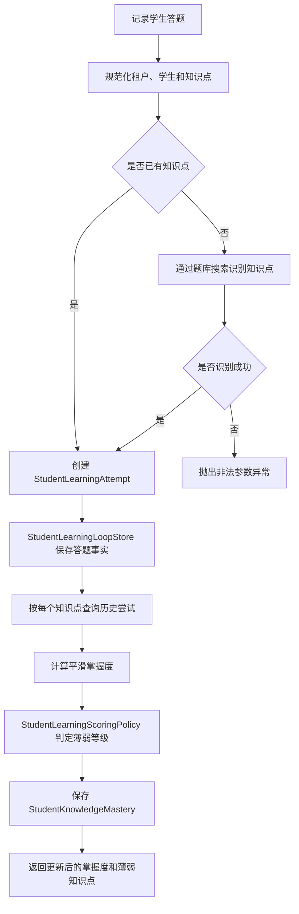

> StudentLearningScoringPolicy 将学习尝试映射为评分和掌握度变化，是学习闭环的可替换策略边界。

# 学习评分策略

`StudentLearningScoringPolicy` 位于 `learning` 模块，是学生学习闭环中负责解释学习表现的策略边界。它将答题尝试汇总为知识点掌握度，并进一步转换为可供教师和推荐逻辑使用的薄弱程度。

当前实现由命名常量和静态方法组成，策略本身不持有学生状态，也不直接访问存储。原始答题事实由 `StudentLearningAttempt` 保存，掌握度则作为可重新计算的派生快照保存为 `StudentKnowledgeMastery`。因此，评分规则变化时理论上可以基于历史答题事实重新生成掌握度，而不必丢失原始证据。

## 职责边界

策略相关职责分布如下：

- `StudentLearningAttempt` 保存不可变的答题事实，包括租户、学生、题目、关联知识点、是否答对、答题耗时和提交时间。
- `StudentLearningLoopStore` 负责保存答题事实、查询某个学生和知识点的历史尝试，以及保存掌握度投影。
- `StudentLearningLoopService` 负责闭环编排：记录尝试、确定知识点、重新计算掌握度、筛选薄弱知识点和生成推荐题。
- `StudentLearningScoringPolicy` 提供掌握度模型使用的先验参数和薄弱程度判定规则。
- `StudentKnowledgeMastery` 表示一个学生在一个知识点上的当前派生状态。

当前代码中，掌握度百分比的计算位于 `StudentLearningLoopService.recompute`，而不是策略类本身。策略类直接负责的是风险等级 `weaknessLevel` 的判定，以及被掌握度计算使用的先验常量。因此，“评分策略”是一个逻辑边界，但当前实现仍是轻量的静态策略。

## 调用链

一次真实答题的主链路如下：



关键节点：

- 答题事实先持久化，再从持久化的历史尝试重新计算知识点状态。
- 一个答题可以关联多个知识点，因此每个知识点都会独立执行一次 `recompute`。
- 如果请求没有提供知识点，服务会使用已有题库搜索能力从题目文本中提取题库返回的知识点标签。
- 如果既没有显式知识点，也无法从题库命中知识点，当前请求会被拒绝，不会凭空创建知识点。
- 掌握度更新完成后，服务只返回 `weaknessLevel > 0` 的知识点作为薄弱点。

## 当前掌握度模型

服务使用贝叶斯式平滑的先验计数计算掌握度：

```text
masteryPercent =
  round((correctCount + PRIOR_CORRECT) * 100
        / (attemptCount + PRIOR_TOTAL))
```

当前参数为：

| 参数 | 当前值 | 含义 |
| --- | ---: | --- |
| `PRIOR_CORRECT` | `1` | 平滑计算中的先验正确次数 |
| `PRIOR_TOTAL` | `2` | 平滑计算中的先验总次数 |
| `HEALTHY_MASTERY_PERCENT` | `70` | 健康掌握度阈值 |
| `WEAK_MASTERY_PERCENT` | `55` | 较弱掌握度阈值 |
| `CRITICAL_MASTERY_PERCENT` | `35` | 严重薄弱掌握度阈值 |
| `MAX_WEAKNESS_LEVEL` | `5` | 最高薄弱等级 |

先验使少量答题不会直接把掌握度推到极端。例如，没有答题时，服务不会创建掌握度行；一旦存在一次答题，掌握度会基于先验计数进行平滑。

掌握度状态保存为 `StudentKnowledgeMastery`，包括：

- `masteryPercent`：平滑后的掌握度百分比；
- `attemptCount`：答题总数；
- `correctCount`：答对次数；
- `incorrectCount`：答错次数；
- `weaknessLevel`：风险等级；
- `lastAttemptAt`：最近一次答题时间；
- `evidenceSummary`：当前为 `attempts/correct/incorrect` 计数摘要。

## 薄弱程度判定

`weaknessLevel` 的判定同时使用掌握度和答错证据：

| 条件 | 薄弱等级 |
| --- | ---: |
| 没有答题 | `0` |
| 掌握度不低于 70%，且答错数为 0 | `0` |
| 掌握度低于 35% | `5` |
| 掌握度低于 55% | `4` |
| 掌握度低于 70% | `3` |
| 其他已有答题但未达到健康条件的情况 | `2` |

等级 `0` 表示健康，不会进入薄弱点列表。当前实现没有产生等级 `1` 的分支；实际输出的非零等级为 `2`、`3`、`4`、`5`。

这里存在一个重要边界：掌握度达到或超过 70% 并不必然表示健康。如果仍有至少一次答错，代码会返回等级 `2`。这使“整体准确率较高但仍出现错误”的知识点继续保留在诊断和推荐链路中。

## 关键状态与持久化关系

答题事实和掌握度投影是两个不同层次的数据：

```text
StudentLearningAttempt
        |
        | 按 tenantId + studentId + knowledgePointId 查询
        v
历史答题集合
        |
        | 重新统计 correct / incorrect / total
        v
StudentKnowledgeMastery
```

`StudentLearningAttempt` 是原始证据，保留每次答题及其知识点列表。`StudentKnowledgeMastery` 是按学生和知识点保存的当前快照。`StudentLearningLoopStore` 明确区分了保存尝试和保存掌握度的方法，这为替换存储实现及重算投影提供了边界。

当前存在两种存储实现：

- `InMemoryStudentLearningLoopStore`：数据库关闭或未启用时使用，按租户和学生保存答题，并按掌握度从低到高返回状态。
- `MyBatisStudentLearningLoopStore`：生产数据库实现，承担同一存储接口的持久化职责。

内存实现的键包含租户、学生和知识点，查询答题时还会检查答题的 `knowledgePointIds` 是否包含目标知识点。因此，同一答题关联多个知识点时，会分别计入每个知识点的统计。

## 对下游闭环的影响

掌握度和薄弱等级会直接影响推荐链路：

1. `StudentLearningLoopService.mastery` 查询学生的掌握度列表。
2. `weakPoints` 过滤出 `weaknessLevel > 0` 的知识点。
3. `recommendations` 按薄弱知识点逐个调用 `KnowledgeQuestionBankService.searchQuestionsByKnowledgePoint`。
4. 推荐结果附带知识点标识和对应薄弱等级。
5. 服务使用 `LinkedHashSet` 按题目 ID 去重，并将返回数量限制在 `1..50`。

因此，评分策略的变化不仅会改变仪表盘中的掌握度状态，也会改变哪些知识点进入推荐流程，以及推荐题目携带的风险等级。

## 边界条件

当前实现对输入和计算边界有明确处理：

- 租户 ID、学生 ID、题目 ID 为空或只包含空白字符时，会抛出 `IllegalArgumentException`。
- 响应时间小于零时会归一化为 `0`。
- 知识点列表会去除空值、首尾空白并去重。
- 没有显式知识点时，服务最多使用题目文本搜索结果中的 3 个题目提取知识点标签。
- 空题目文本无法用于知识点识别。
- 知识点识别依赖题库已有标签；未匹配时拒绝答题记录。
- 没有历史答题时，`lastAttemptAt` 为 `null`，但正常的重算路径不会为无尝试的知识点创建掌握度行。
- 掌握度列表按掌握度升序返回，薄弱知识点自然优先。
- 推荐数量会限制在最少 1 条、最多 50 条。
- `weaknessLevel` 接收整数参数，但当前调用方传入的是服务计算出的掌握度、答错数和答题数；策略类自身没有额外的参数范围校验。

## 扩展点

当前策略由 `final` 工具类和静态常量组成，扩展时需要注意“逻辑上可替换”和“代码实现上已注入”并不相同。现状中 `StudentLearningLoopService` 直接引用 `StudentLearningScoringPolicy` 的静态成员，因此更换规则通常需要修改代码并重新部署。

可以沿现有边界演进为以下方向：

- 将“掌握度计算”和“薄弱等级判定”集中到策略接口中，由服务注入具体实现。
- 保留 `StudentLearningAttempt` 作为不可变事实，使新策略可以基于历史数据重算。
- 将先验参数、阈值和等级映射抽象为策略配置或不同策略实现。
- 增加策略版本或评分模型标识，便于区分不同算法生成的掌握度快照。
- 为边界样例补充测试，重点覆盖无答题、健康但有错误、35/55/70 阈值附近以及多知识点答题。
- 在改变掌握度或薄弱等级定义时，同时验证推荐结果，因为推荐服务依赖薄弱点筛选和等级排序。

Sources: [StudentLearningScoringPolicy.java](backend-java/src/main/java/com/doob/mathagent/learning/StudentLearningScoringPolicy.java#L1-L23)  
[StudentLearningLoopService.java](backend-java/src/main/java/com/doob/mathagent/learning/StudentLearningLoopService.java#L1-L125)  
[StudentLearningAttempt.java](backend-java/src/main/java/com/doob/mathagent/learning/StudentLearningAttempt.java#L1-L23)  
[StudentKnowledgeMastery.java](backend-java/src/main/java/com/doob/mathagent/learning/StudentKnowledgeMastery.java#L1-L23)  
[StudentLearningLoopStore.java](backend-java/src/main/java/com/doob/mathagent/learning/StudentLearningLoopStore.java#L1-L23)  
[InMemoryStudentLearningLoopStore.java](backend-java/src/main/java/com/doob/mathagent/learning/InMemoryStudentLearningLoopStore.java#L1-L57)
