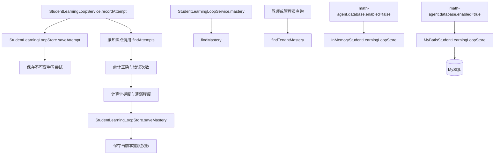

> StudentLearningLoopStore 抽象学习状态持久化，同时提供内存实现和 MyBatis 数据库实现。

# 学习状态存储实现

`StudentLearningLoopStore` 是学生学习闭环的持久化边界，负责保存两类状态：

- **学习尝试事实**：记录学生对某道题的一次真实作答，属于不可变事实。
- **知识点掌握度投影**：根据尝试事实计算出的某学生、某知识点当前掌握状态，属于可更新快照。

该接口将学习闭环服务与具体存储介质解耦。当前提供两个实现：数据库启用时使用 MyBatis 实现，否则使用线程安全的内存实现。

图中，`saveAttempt` 保存原始作答证据，随后服务通过 `findAttempts` 重新读取该知识点的历史尝试并计算掌握度，最后使用 `saveMastery` 写入派生投影。掌握度查询和租户范围查询则直接读取掌握度快照。

## 模块职责

### StudentLearningLoopStore

接口定义了学习闭环所需的最小存储能力：

- `saveAttempt`：保存一次学习尝试并返回保存后的值。
- `findAttempts`：按租户、学生和知识点查询相关尝试。
- `saveMastery`：保存或更新某个知识点的当前掌握度。
- `findMastery`：查询一个学生的全部掌握度记录。
- `findTenantMastery`：查询租户内可见的掌握度记录，可限定某个学生，也可查询租户内全部学生。

接口注释明确区分了“不可变尝试”和“派生掌握度行”。这种分离使评分策略发生变化时，可以基于原始作答重新计算掌握度，而不必丢失答案证据。

### StudentLearningLoopService 调用链

`StudentLearningLoopService.recordAttempt` 是写入闭环状态的主要入口：

1. 校验租户和学生标识，并清理知识点列表。
2. 如果请求没有提供知识点，调用题库搜索，根据已有题库标签识别知识点。
3. 创建带有 UUID、作答结果、响应耗时和提交时间的 `StudentLearningAttempt`。
4. 调用 `store.saveAttempt` 保存尝试事实。
5. 对本次尝试关联的每个知识点调用 `findAttempts`。
6. 根据历史尝试统计正确数、错误数和总次数。
7. 使用 `StudentLearningScoringPolicy` 计算掌握度和薄弱程度。
8. 创建并保存 `StudentKnowledgeMastery` 投影。
9. 返回本次尝试、更新后的掌握度以及薄弱知识点。

掌握度读取由 `mastery` 调用 `findMastery` 完成；教师或管理员查看指定学生或整个租户的薄弱知识点时，服务调用 `findTenantMastery`，再过滤出 `weaknessLevel > 0` 的记录。

## 关键状态模型

### 学习尝试

`StudentLearningAttempt` 是不可变 record，包含：

- `attemptId`：尝试唯一标识。
- `tenantId`、`studentId`：租户和学生范围。
- `questionId`、`questionText`：题目标识和题目文本。
- `knowledgePointIds`：该题关联的一个或多个知识点。
- `correct`：是否答对。
- `responseTimeMs`：响应耗时。
- `submittedAt`：提交时间。

服务会将响应耗时限制为不小于 `0`，并在写入前清理知识点标识、题目文本和主体标识。

### 掌握度投影

`StudentKnowledgeMastery` 表示一个学生对一个知识点的派生状态：

- `masteryPercent`：平滑后的掌握度，范围为 `0..100`。
- `attemptCount`：尝试次数。
- `correctCount`、`incorrectCount`：正确和错误次数。
- `weaknessLevel`：`0` 表示状态健康，`1..5` 表示不同程度的薄弱。
- `lastAttemptAt`：该知识点最近一次尝试时间。
- `evidenceSummary`：当前统计摘要，例如尝试、正确和错误数量。

掌握度不是直接累加保存，而是由历史尝试重新统计后覆盖写入。服务取查询结果中最新的尝试作为 `lastAttemptAt`。

## 内存实现

`InMemoryStudentLearningLoopStore` 在 `math-agent.database.enabled=false` 或配置缺省时由 Spring 注册。

它维护两个并发容器：

- `ConcurrentHashMap<String, CopyOnWriteArrayList<StudentLearningAttempt>> attempts`
- `ConcurrentHashMap<String, StudentKnowledgeMastery> mastery`

尝试事实以“租户 + 学生”为分组键保存。查询时再按知识点过滤，并按 `submittedAt` 倒序返回，因此最新尝试位于结果首位。

掌握度使用“租户 + 学生 + 知识点”作为唯一键。`saveMastery` 通过 `put` 覆盖同一学生、同一知识点的旧投影，模拟数据库中的更新行为。

`findMastery` 只返回指定租户和学生的记录，并按掌握度升序排列，弱掌握记录优先。`findTenantMastery` 同样按掌握度升序排列；当 `studentId` 为 `null` 或空白时返回租户内所有学生，否则限定到指定学生。

该实现适合数据库关闭、本地开发或轻量运行场景，但数据只存在于当前进程内，进程重启后尝试和掌握度都会丢失。

## MyBatis 数据库实现

`MyBatisStudentLearningLoopStore` 在 `math-agent.database.enabled=true` 时由 Spring 注册，并通过两个 Mapper 访问数据库：

- `StudentLearningAttemptMapper`
- `StudentKnowledgeMasteryMapper`

### 尝试事实持久化

学习尝试映射到 `StudentLearningAttemptEntity`，对应表 `student_learning_attempt`。写入时：

- 复制尝试 ID、租户、学生、题目和作答结果。
- 将知识点 ID 列表通过 `ObjectMapper` 序列化为 JSON。
- 将 `Instant submittedAt` 转换为 UTC 的 `LocalDateTime`。
- 调用 `attemptMapper.insert` 插入记录。

查询时，数据库先按租户、学生过滤并按提交时间倒序排列，读取实体后再将知识点 JSON 反序列化为列表，并按知识点过滤。

JSON 序列化或反序列化失败会抛出 `IllegalStateException`，不会静默返回空知识点列表。这样可以避免损坏的持久化数据被误认为没有知识点关联。

### 掌握度保存与更新

掌握度以租户、学生和知识点三列定位当前记录：

1. 根据三元组查询已有实体。
2. 如果不存在，执行 `insert`。
3. 如果存在，保留已有定位字段并执行 `update`。
4. 返回领域对象。

该逻辑体现了“一个学生对一个知识点一条当前投影”的存储模型。历史尝试仍然以追加方式保存，掌握度则是可更新记录。

### 掌握度读取

`findMastery` 按租户和学生查询，并按 `masteryPercent` 升序排列。

`findTenantMastery` 必须先限定租户；只有当 `studentId` 非空时才追加学生条件。因此：

- 指定学生时，只返回该学生的掌握度。
- `studentId` 为空或空白时，返回整个租户的掌握度。
- 结果始终按掌握度从低到高排列，便于优先发现薄弱知识点。

## 边界条件

- `tenantId` 和 `studentId` 为空或仅包含空白时，服务层会拒绝请求。
- `questionId` 为空时，记录尝试会失败。
- 知识点列表为空时，服务会尝试通过可见题库搜索识别知识点。
- 题库搜索仍无法提供知识点时，请求会抛出异常，不会凭空创建知识点。
- 知识点列表中的空值和空白值会被移除，重复知识点会被去重。
- 响应耗时小于零时会被归一化为 `0`。
- 没有历史尝试时，掌握度投影的最近尝试时间为 `null`。
- 内存实现使用并发集合，支持并发读写；但它不提供跨进程或重启后的持久化能力。
- MyBatis 实现依赖知识点 ID JSON 的完整性，序列化或反序列化错误会直接暴露为非法状态异常。
- 租户范围查询始终带有租户过滤，学生条件仅在指定学生时生效。

## 主要文件

- [StudentLearningLoopStore.java](backend-java/src/main/java/com/doob/mathagent/learning/StudentLearningLoopStore.java)：定义学习状态存储接口。
- [InMemoryStudentLearningLoopStore.java](backend-java/src/main/java/com/doob/mathagent/learning/InMemoryStudentLearningLoopStore.java)：数据库关闭时使用的线程安全内存实现。
- [MyBatisStudentLearningLoopStore.java](backend-java/src/main/java/com/doob/mathagent/learning/MyBatisStudentLearningLoopStore.java)：数据库启用时使用的 MyBatis 实现。
- [StudentLearningLoopService.java](backend-java/src/main/java/com/doob/mathagent/learning/StudentLearningLoopService.java)：负责尝试写入、历史重算、掌握度投影和查询编排。
- [StudentLearningAttempt.java](backend-java/src/main/java/com/doob/mathagent/learning/StudentLearningAttempt.java)：不可变学习尝试领域模型。
- [StudentKnowledgeMastery.java](backend-java/src/main/java/com/doob/mathagent/learning/StudentKnowledgeMastery.java)：知识点掌握度领域模型。
- [StudentLearningAttemptEntity.java](backend-java/src/main/java/com/doob/mathagent/learning/entity/StudentLearningAttemptEntity.java)：学习尝试数据库实体，对应 `student_learning_attempt` 表。

## 扩展点

`StudentLearningLoopStore` 是主要替换边界。新增存储实现只需实现尝试保存与查询、掌握度保存与查询，并保持租户和学生过滤语义一致。

评分规则位于 `StudentLearningScoringPolicy`，与存储实现分离。若调整平滑算法、薄弱等级或掌握度计算方式，可以继续从 `findAttempts` 读取原始事实并重新生成掌握度投影。

如果未来需要更强的一致性，可以围绕“保存尝试”和“更新关联知识点掌握度”增加事务边界；如果需要大规模查询，则可在 Mapper 查询层增加知识点过滤、分页或索引支持，同时保持领域层的返回模型不变。

Sources: [StudentLearningLoopStore.java](backend-java/src/main/java/com/doob/mathagent/learning/StudentLearningLoopStore.java#L1-L23)  
[InMemoryStudentLearningLoopStore.java](backend-java/src/main/java/com/doob/mathagent/learning/InMemoryStudentLearningLoopStore.java#L1-L57)  
[MyBatisStudentLearningLoopStore.java](backend-java/src/main/java/com/doob/mathagent/learning/MyBatisStudentLearningLoopStore.java#L1-L59)  
[StudentLearningLoopService.java](backend-java/src/main/java/com/doob/mathagent/learning/StudentLearningLoopService.java#L15-L119)  
[StudentLearningAttempt.java](backend-java/src/main/java/com/doob/mathagent/learning/StudentLearningAttempt.java#L6-L21)  
[StudentKnowledgeMastery.java](backend-java/src/main/java/com/doob/mathagent/learning/StudentKnowledgeMastery.java#L5-L21)  
[StudentLearningAttemptEntity.java](backend-java/src/main/java/com/doob/mathagent/learning/entity/StudentLearningAttemptEntity.java#L7-L21)
