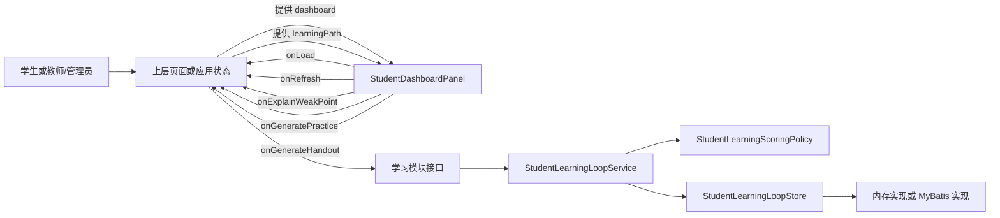
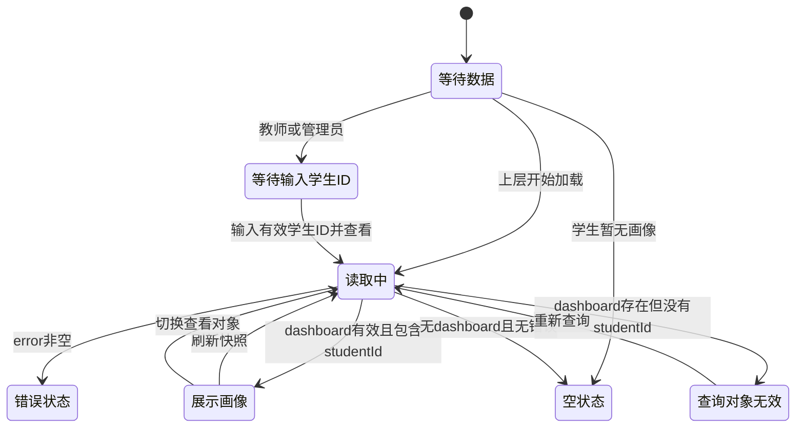

> StudentDashboardPanel 展示学生学习状态和闭环反馈，是学习模块的主要前端承载。

# 学生仪表盘

`StudentDashboardPanel` 是学习模块的主要前端承载，负责把学生学习状态转换为可浏览、可操作的学习画像，并承接从状态展示到下一步学习行动的闭环反馈。

页面同时支持学生查看自己的学习画像，以及教师或管理员按学生 ID 查看指定学生画像。

## 模块职责

页面职责集中在四个方面：

1. **展示学习状态**
   - 知识点进度
   - 薄弱点及薄弱等级
   - 历史问题
   - 成绩趋势
   - 最近一次成绩和年级排名

2. **提供角色化视图**
   - 学生看到“我的学习画像”
   - 教师或管理员看到“查看学生画像”
   - 教师或管理员需要先输入学生 ID
   - 个性化学习路径仅在学生视角且存在路径步骤时展示

3. **承接闭环反馈**
   - 学生可以针对薄弱知识点请求“针对性讲解”
   - 学生可以生成专项练习
   - 教师或管理员可以生成针对性讲义
   - 页面可以刷新当前学习快照

4. **控制展示规模**
   - 知识点进度、薄弱点、历史问题和成绩趋势分别分页
   - 每个列表独立维护当前页和每页条数
   - 支持每页 `10`、`20`、`50` 条

## 调用链

页面本身不负责请求数据，也不直接实现学习评分或持久化。它通过属性接收已经准备好的仪表盘数据和学习路径，并通过回调把用户操作交给上层应用。

关键节点说明：

- `StudentDashboardPanel` 是展示和交互边界，输入包括 `dashboard`、`learningPath`、`loading`、`error` 以及角色和操作回调。
- 上层页面负责把加载、刷新、薄弱点讲解、讲义生成和专项练习等操作连接到后端或其他前端模块。
- `StudentLearningLoopService` 负责学习尝试、知识掌握度更新和下一步反馈。
- `StudentLearningScoringPolicy` 是评分与掌握度变化的策略边界，决定一次学习尝试如何影响学习状态。
- `StudentLearningLoopStore` 隔离持久化方式，当前证据显示同时存在内存实现和 MyBatis 数据库实现。

因此，仪表盘展示的是学习闭环服务的结果投影，而不是学习状态的计算源。

## 页面结构

### 1. 页面头部与操作区

页面头部根据查看者角色切换标题：

- 学生：`我的学习画像`
- 教师或管理员：`查看学生画像`

当已有仪表盘数据时，页面显示查看者角色标签，例如“管理员查看”。

操作区包括：

- 教师或管理员：`生成针对性讲义`
- 学生：`生成专项练习`
- 所有角色：`刷新快照`

讲义和练习按钮只有在已经加载出有效学生对象后才可用。刷新按钮在加载中不可用；教师或管理员未填写学生 ID 时也不可用。

### 2. 学生选择区

教师或管理员拥有学生选择区：

- 输入目标学生 ID
- 输入内容通过 `onTargetStudentIdChange` 回传上层
- 点击“查看学生”触发 `onLoad`
- 学生 ID 为空或仅包含空白字符时，查询按钮不可用

学生角色不显示该区域，也不会通过页面选择其他学生。

### 3. 学生身份摘要

成功取得有效学生仪表盘后，页面展示：

- 学生 ID
- 查看者 ID
- 最近成绩和年级排名

最近成绩取 `scoreTrend` 的最后一项。如果没有成绩记录，则显示“未记录”。

### 4. 知识点进度

知识点进度列表使用进度条展示每个知识点的完成百分比，并在存在教材锚点时展示对应的教材位置。

进度条宽度经过 `boundedPercent` 处理，避免异常百分比直接造成布局问题。页面同时显示分页信息和每页条数控制。

如果没有进度数据，显示“暂无知识点进度”。

### 5. 个性化学习路径

个性化学习路径仅满足以下条件时显示：

- 当前查看者角色为学生
- `learningPath` 存在
- `learningPath.steps` 至少包含一个步骤

每个步骤展示：

- 顺序
- 知识点名称
- 掌握度百分比
- 学习建议

教师和管理员不会在该页面看到学生个性化路径区块。

### 6. 薄弱点

薄弱点列表展示：

- 薄弱知识点名称
- 薄弱等级

学生视角下，如果存在知识点 ID 和 `onExplainWeakPoint` 回调，会提供“针对性讲解”操作。该操作将知识点 ID 回传给上层。

教师或管理员视角不会显示该操作标签。

### 7. 历史问题

历史问题列表展示：

- 历史问题标题
- 问题来源的中文标签
- 问题状态的中文标签

页面对来源和状态进行展示层翻译，不直接暴露内部值。例如测试明确要求不渲染原始的 `student_memory / active`，也不把知识图谱内部字段直接展示给用户。

### 8. 成绩趋势

成绩趋势列表展示：

- 考试名称
- 成绩条
- 分数

成绩条按照 `score / 150` 计算显示比例，并通过 `boundedPercent` 限制在合法范围内。成绩列表独立分页；没有成绩时显示“暂无成绩记录”。

## 关键状态

页面状态主要分为外部状态和内部展示状态。

### 外部状态

由上层传入：

- `dashboard`：学生学习仪表盘快照，可为空
- `learningPath`：学生学习路径，可为空
- `loading`：是否正在读取学习画像
- `error`：错误信息
- `viewerRole`：当前查看者角色
- `targetStudentId`：教师或管理员当前选择的学生 ID

页面不修改这些对象，而是通过回调通知上层发生了输入或操作。

### 内部状态

页面独立维护四组分页状态：

- `progressPage`、`progressPageSize`
- `weakPage`、`weakPageSize`
- `questionPage`、`questionPageSize`
- `scorePage`、`scorePageSize`

各列表通过 `useMemo` 根据完整数据、当前页和每页条数计算可见项，避免把所有数据同时渲染到页面上。

当仪表盘的租户、学生或查看者主体发生变化时，页面会：

- 将四个列表的页码重置为第 1 页
- 将四个列表的每页条数重置为默认值 `10`

这样可以避免切换学生后仍停留在旧数据的后续页，或由于旧分页设置导致新数据没有可见内容。

## 页面状态流转

关键边界：

- `loading` 优先显示“正在读取学习画像”状态。
- `error` 存在时显示错误提示。
- 没有数据、没有加载、没有错误时显示空状态。
- `dashboard` 存在但没有有效 `studentId` 时，不渲染画像主体，而显示“当前查询对象不是学生，无法展示学习画像”。
- 教师或管理员没有目标学生 ID 时，不会展示全局仪表盘，也不会使用特殊的全局学生标识。

## 主要文件

### 前端页面

[`frontend/src/app/components/StudentDashboardPanel.tsx`](frontend/src/app/components/StudentDashboardPanel.tsx#L1-L420)

负责：

- 角色判断
- 学生选择
- 加载、错误和空状态
- 学习数据展示
- 四组列表分页
- 薄弱点讲解、讲义和练习等操作回调

### 前端测试

[`frontend/src/app/StudentDashboardPanel.test.tsx`](frontend/src/app/StudentDashboardPanel.test.tsx#L1-L120)

当前测试覆盖的关键契约包括：

- 中文页面内容正常渲染
- 管理员视角显示学生选择和管理员查看标签
- 分页和每页条数正常显示
- 内部知识图谱字段不直接泄漏到页面
- 管理员未选择学生时不展示全局仪表盘
- 不使用 `__all_students__` 作为隐式全局查询对象

### 学习闭环服务

`backend-java/src/main/java/com/doob/mathagent/learning/StudentLearningLoopService.java`

负责组织：

- 学习尝试
- 知识掌握度更新
- 下一步学习反馈

### 学习评分策略

`backend-java/src/main/java/com/doob/mathagent/learning/StudentLearningScoringPolicy.java`

负责将学习尝试映射为评分和掌握度变化，是后续替换评分算法的主要扩展边界。

### 学习状态存储

`backend-java/src/main/java/com/doob/mathagent/learning/StudentLearningLoopStore.java`

定义学习状态持久化抽象。

当前已有两种实现：

- `InMemoryStudentLearningLoopStore`
- `MyBatisStudentLearningLoopStore`

前者适合本地或测试场景，后者承担数据库持久化。

## 边界条件与降级行为

1. **目标学生为空**
   - 教师或管理员无法发起查询。
   - 页面提示输入学生 ID。
   - 不展示全局概览或所有学生聚合数据。

2. **查询对象不是学生**
   - 即使返回了 `dashboard`，若缺少有效 `studentId`，也不会渲染学习画像主体。

3. **仪表盘为空**
   - 学生视角显示“暂无学习画像”。
   - 教师或管理员提示输入要查看的学生 ID。

4. **列表为空**
   - 各区块分别显示自己的空状态，不影响其他区块渲染。

5. **成绩缺失**
   - 顶部最近成绩显示“未记录”。
   - 成绩趋势区块显示“暂无成绩记录”。

6. **学习路径缺失**
   - 学生视角不显示个性化学习路径区块。
   - 该缺失不会阻断知识点进度、薄弱点或成绩展示。

7. **加载或错误**
   - 加载中显示带旋转状态的提示。
   - 错误通过危险样式状态行展示。
   - 操作按钮根据加载状态禁用，避免重复触发。

8. **百分比异常**
   - 知识点进度、学习路径掌握度和成绩条均经过 `boundedPercent` 限制，防止超出进度条合法范围。

9. **内部数据结构不应直接呈现**
   - `knowledgeGraph` 可以作为后端响应的一部分存在，但当前页面不直接展示图节点、边、生成来源或内部关系类型。
   - 来源和状态字段通过中文标签转换后再呈现。

## 扩展点

### 接入新的学习反馈动作

可以继续增加新的回调属性，例如：

- 推荐资源
- 开始知识点练习
- 标记学习目标
- 查看知识点证据

新增动作应由上层负责实际调用，面板仅负责按钮状态、展示和参数回传。

### 扩展学习路径展示

当前学习路径直接遍历 `learningPath.steps`。后续可以在步骤层增加：

- 完成状态
- 推荐资源
- 前置知识点
- 预计学习时长
- 练习入口

这些字段应优先扩展响应模型和学习闭环服务，再由页面进行投影。

### 替换评分策略

`StudentLearningScoringPolicy` 已经隔离评分和掌握度变化逻辑。可以在不改变仪表盘结构的情况下替换：

- 答题正确率评分
- 时间衰减
- 连续学习奖励
- 按题型或知识点加权
- 多次尝试的掌握度合并规则

### 增加证据与资源入口

知识点进度目前只展示教材锚点文本。后续可以根据已有教材资源和证据能力增加受控链接，但需要保持权限边界，避免把未授权的教材、飞书或检索证据直接暴露给当前查看者。

### 增加可视化趋势

当前成绩趋势使用条形展示，适合快速比较。若增加折线图或更复杂的知识点关系图，应继续保持内部图数据与用户展示模型分离，避免直接渲染 `knowledgeGraph` 的内部字段。

## Sources

Sources: [frontend/src/app/components/StudentDashboardPanel.tsx](frontend/src/app/components/StudentDashboardPanel.tsx#L1-L420)  
Sources: [frontend/src/app/StudentDashboardPanel.test.tsx](frontend/src/app/StudentDashboardPanel.test.tsx#L1-L120)  
Sources: [backend-java/src/main/java/com/doob/mathagent/learning/StudentLearningLoopService.java](backend-java/src/main/java/com/doob/mathagent/learning/StudentLearningLoopService.java#L1-L200)  
Sources: [backend-java/src/main/java/com/doob/mathagent/learning/StudentLearningScoringPolicy.java](backend-java/src/main/java/com/doob/mathagent/learning/StudentLearningScoringPolicy.java#L1-L120)  
Sources: [backend-java/src/main/java/com/doob/mathagent/learning/StudentLearningLoopStore.java](backend-java/src/main/java/com/doob/mathagent/learning/StudentLearningLoopStore.java#L1-L120)
