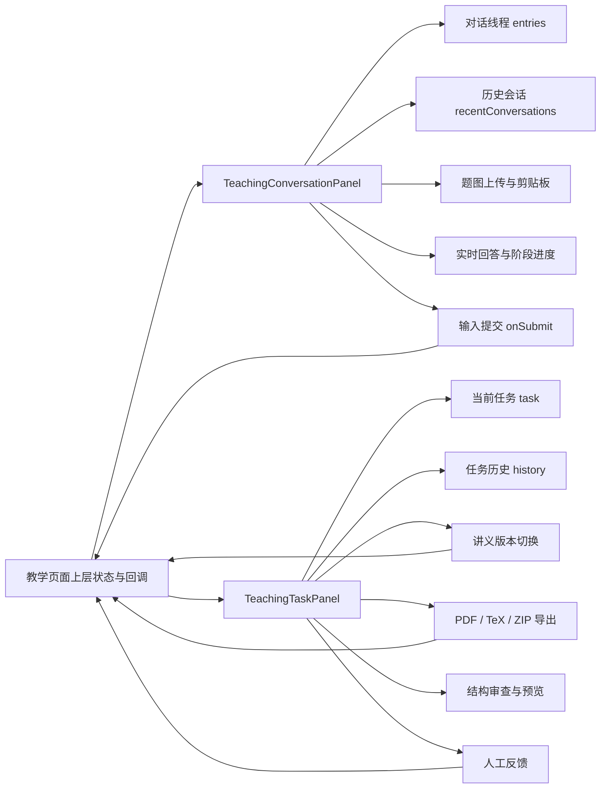
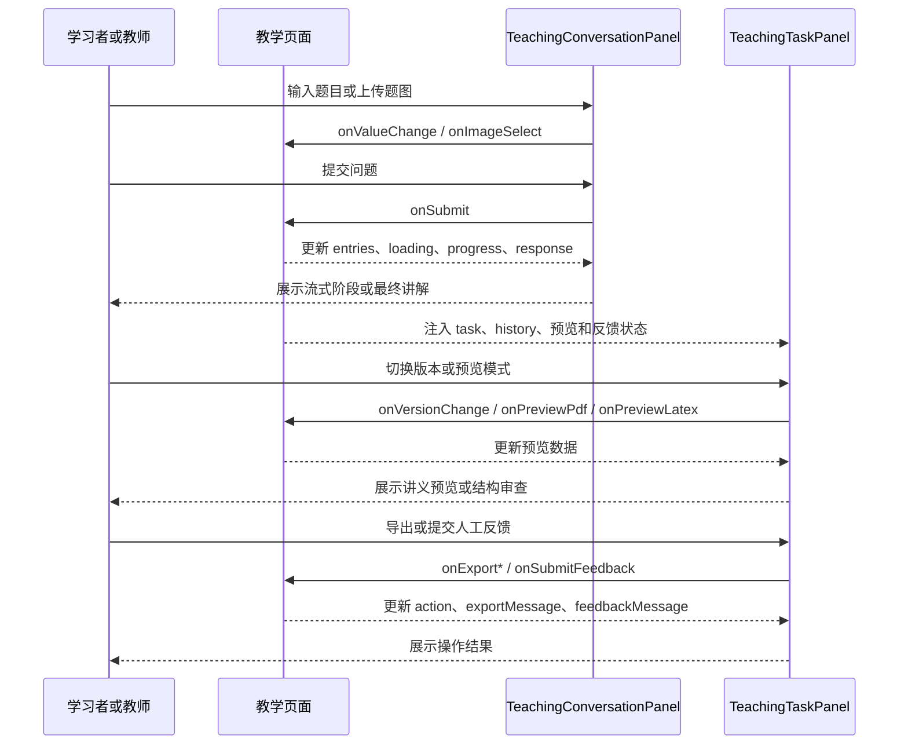

> TeachingConversationPanel 和 TeachingTaskPanel 组织教学对话、任务执行及反馈交互。

# 教学对话与任务面板

教学页面由 `TeachingConversationPanel` 与 `TeachingTaskPanel` 组成：

- `TeachingConversationPanel` 负责 AI 讲题对话、历史会话切换、题图上传、流式回答展示和追问输入。
- `TeachingTaskPanel` 负责讲义任务状态展示、历史任务恢复、版本切换、预览、导出和人工反馈入口。
- 两个面板都采用“展示状态 + 回调事件”的受控组件模式。数据请求、任务提交、会话恢复和后端状态同步由上层页面或业务服务负责，面板本身主要组织交互和渲染。

图中上层状态通过 props 注入两个面板，用户操作通过回调返回上层。对话面板和任务面板之间没有在源码中直接互相调用的关系；它们分别承载实时讲题和讲义任务结果。

## 对话面板

### 模块职责

`TeachingConversationPanel` 的根节点是带有 `AI 讲题` 标签的教学实时区域。它组织以下交互：

1. 展示当前对话标题。
2. 创建新对话。
3. 展示最近三条会话快捷入口。
4. 通过历史抽屉展示最近十二条会话。
5. 渲染用户问题、题图和图片状态。
6. 渲染助手最终回答、实时流式回答或错误状态。
7. 处理文本输入、文件选择、直接粘贴图片和主动读取剪贴板图片。
8. 在用户仍查看旧内容时保持滚动位置，避免流式响应抢夺阅读位置。

面板接收的核心数据包括：

- `conversationTitle`：当前会话标题。
- `value`：输入框文本。
- `entries`：对话线程条目。
- `recentConversations`：历史会话摘要。
- `loading`、`loadingHistory`：当前提交和历史加载状态。
- `imageDraft`、`uploadingImage`、`imageError`：题图上传状态。
- `openingConversationId`：正在打开的历史会话。
- `error`：全局错误信息。

主要行为通过回调交给上层：

- `onValueChange`
- `onSubmit`
- `onImageSelect`
- `onClearImage`
- `onStartNewConversation`
- `onOpenConversation`

`conversationMemoryEnabled` 和 `onConversationMemoryChange` 被标记为兼容性属性。源码明确说明：同一会话内的上下文始终启用，因此当前面板不再提供可选的记忆开关。

### 对话线程模型

`TeachingConversationThreadItem` 使用联合类型区分用户条目和助手条目。

用户条目包含：

- `questionText`
- `imagePreviewUrl`
- `imageFileName`
- `imageStatus`
- `createdAt`

助手条目包含：

- 可选的关联问题和题图信息
- `loading`
- `error`
- `response`
- `progress`
- `liveContent`
- `liveThinking`

其中 `progress` 表示服务器发送的最新工作流快照，源码注释强调它不会由客户端计时器推进；`liveContent` 表示从实时模型流中接收到的文本增量；`liveThinking` 仅作为兼容性字段存在，原始推理内容不会展示给学习者。

### 渲染状态

对话列表按 `entries` 顺序渲染：

- 用户条目显示为用户气泡。
- 用户存在题图时，先展示图片，再展示题目文本。
- 用户存在文件名时，额外展示文件名和图片状态。
- 助手存在 `response` 时，渲染最终回答。
- 助手处于 `loading` 时，渲染实时回答。
- 助手存在 `error` 且没有最终回答时，展示“这次讲解没有完成”的错误卡片。
- 没有上述内容时，不渲染助手正文。

当没有任何对话条目时，面板显示三个轻量入口提示：发题目、贴题图、继续追问。

全局 `error` 会在对话流末尾展示；如果同一错误已经被某个助手条目展示，则不会重复显示。

### 流式展示与滚动

面板通过 `scrollRef` 获取对话滚动容器，并用 `followsLatestRef` 记录用户是否仍跟随最新内容：

1. 当内容或 `loading` 状态变化时，如果用户位于底部附近，自动滚动到最新内容。
2. 用户滚动时，根据剩余滚动距离判断是否仍跟随最新内容。
3. 当用户正在阅读较早的流式卡片时，不强制滚动到底部。

底部阈值为 `24px`。这使实时响应可以持续更新，同时保留用户查看历史内容的能力。

### 题图输入边界

题图可以通过三种方式进入面板：

- 文件选择器，限制为 `image/*`。
- 在文本框中直接粘贴图片。
- 通过浏览器剪贴板 API 主动读取图片。

剪贴板主动读取存在明确降级路径：

- 浏览器不支持 `navigator.clipboard.read` 时，提示用户直接使用 `Ctrl+V`。
- 剪贴板中没有图片时，显示“剪贴板里没有图片”。
- 读取失败时，提示改用直接粘贴。

输入框上方的上传区域有两种状态：

- `imageDraft` 存在：展示缩略图、原文件名、上传说明和移除按钮。
- `uploadingImage` 为真但尚未得到草稿：展示上传中的占位状态和加载图标。

发送按钮在以下任一条件成立时禁用：

- 当前正在加载回答。
- 图片仍在上传。
- 文本为空且没有已上传题图。

## 任务面板

### 模块职责

`TeachingTaskPanel` 面向讲义任务的后续处理，承担以下职责：

- 展示当前讲义任务及状态。
- 恢复和切换历史教学任务。
- 在教师版、学生版和 `16:10` 讲解版之间切换。
- 预览 PDF。
- 进行结构审查。
- 下载 PDF 和 TeX。
- 将内容打包为 ZIP。
- 展示生成状态、导出状态和人工反馈。
- 为教师提交评分、决策和文字评论。

面板接收的核心对象是：

- `task: TeachingTaskResponse | null`：当前任务。
- `history`：任务历史。
- `previewLatex`：结构审查使用的 LaTeX。
- `previewPdfUrl`、`previewPdfBytes`、`previewPdfMeta`：PDF 预览数据。
- `version`：当前讲义版本。
- `action`：当前正在执行的导出或预览动作。
- `feedbackRating`、`feedbackDecision`、`feedbackComment`：反馈表单状态。
- `feedbackHistory`：历史人工反馈。
- `batchFolderPath`：ZIP 包内的目标文件夹路径。

动作同样通过回调交给上层，包括版本切换、预览、导出、历史任务选择和反馈提交。

### 任务状态

面板根据 `task.status` 派生出两个关键状态：

- `completed`：状态为 `COMPLETED`。
- `terminalNonCompleted`：状态为 `FAILED`、`WAITING_REVIEW` 或 `DRAFT_ONLY`。

页面对不同状态提供明确反馈：

- `RETRYING`：任务正在重试，已完成阶段不会重复执行。
- `WAITING_REVIEW`：自动检查完成，等待教师审校。
- `DRAFT_ONLY`：内容保留为草稿，尚未进入发布流程。
- `FAILED`：任务失败，可以从当前任务恢复。
- `COMPLETED`：讲义已生成，教师版可下载 PDF，学生版用于留白练习。
- 其他非完成且非终态状态：提示讲义仍在生成，完成后可打开 PDF 或结构审查。

当面板正在恢复任务历史时，显示“正在恢复上次教学任务”。当没有任务、没有加载且没有错误时，显示空状态，提示提交讲义主题后再查看预览、下载、历史记录和人工复核入口。

### 版本与预览

当前版本通过 `handoutDraftForVersion(task, version)` 得到 `selectedDraft`。支持三种版本：

- `teacher`：教师版。
- `student`：学生版。
- `lecture`：`16:10` 讲解版。

面板内部使用 `previewMode` 管理三种预览模式，初始值为 `lecture`：

- `lecture`：协作卡片，由 `LectureHandoutPreview` 渲染。
- `pdf`：打印预览，由 `PdfCanvasPreview` 渲染。
- `review`：结构审查，由 `HandoutStructuredPreview` 渲染。

预览分支如下：

1. 选择 PDF 模式且存在 `previewPdfUrl` 时，展示 PDF Canvas 预览。
2. 选择结构审查且存在 `selectedDraft` 时，展示 `previewLatex`；若其为空，则回退到当前版本草稿。
3. 其他情况下，只要存在 `selectedDraft`，展示协作卡片。
4. 没有可用草稿时：
   - 已完成任务显示“当前版本暂无讲义内容”。
   - 未完成任务显示“正在等待讲义完成”。

PDF 预览模式只有在存在 `previewPdfUrl` 时可用，结构审查模式只有在存在 `selectedDraft` 时可用。

### 导出与操作互斥

面板将 `action` 是否为空转换为 `busy`。当存在进行中的动作时，PDF、PDF 预览、结构审查、TeX 下载和 ZIP 打包按钮统一禁用，避免多个导出或预览操作并行修改同一展示区域。

支持的操作包括：

- `pdf`：下载 PDF。
- `preview-pdf`：生成或加载 PDF 预览。
- `preview`：准备结构审查内容。
- `latex`：下载 TeX。
- `zip`：打包导出。

所有操作还要求存在 `selectedDraft`。ZIP 导出额外使用 `batchFolderPath` 指定压缩包内部文件夹，默认提示值为 `handouts/{taskId}`。

操作进行中通过 `OperationStatus` 展示动作和当前版本；导出完成后通过 `exportMessage` 和带有安全标识的状态行展示结果。

### 历史任务

`HistoryPanel` 接收：

- `history`
- `currentTaskId`
- `loading`
- `loadingTaskId`
- `onSelectHistory`

因此历史列表支持整体加载状态，也能区分当前正在加载的具体任务。选择历史任务不会在面板内直接读取数据，而是通过 `onSelectHistory` 将选择事件交给上层。

## 两个面板的调用链

关键边界是：面板只根据传入状态决定渲染结果，并通过事件回调表达用户意图。对话流、任务生成、预览生成、导出以及反馈提交的异步执行逻辑不在这两个组件的已读代码中。

## 关键边界条件

### 对话侧

- 没有历史会话时，历史抽屉显示空状态。
- 历史会话快捷入口最多显示三条，抽屉最多显示十二条。
- 当前正在加载回答时，不能新建对话或打开历史会话。
- 打开某一历史会话期间，该会话按钮单独禁用并显示加载状态。
- 没有文本和题图时不能提交。
- 图片上传失败和剪贴板读取失败统一进入输入区域的错误展示。
- 原始模型推理字段不会直接呈现给学习者。
- 用户离开底部后，流式更新不会强行改变滚动位置。

### 任务侧

- 没有当前任务时不展示任务详情区域。
- 没有当前版本草稿时，所有依赖草稿的预览和导出操作不可用。
- 已完成任务也可能没有当前版本内容，因此需要显示版本内容缺失提示。
- 任务处于重试、等待审查、仅草稿或失败状态时，页面仍保留任务上下文，但提供不同的状态反馈。
- 同一时刻存在导出或预览动作时，其他操作被禁用。
- PDF 和结构审查模式分别依赖 `previewPdfUrl` 与 `selectedDraft`。
- 人工反馈包含评分、决策和评论，并通过 `submittingFeedback`、`feedbackMessage` 和反馈历史状态支持提交过程展示。

## 扩展点

### 对话扩展

- 可在 `TeachingConversationThreadItem` 中增加新的服务端进度字段，并在实时回答组件中映射新的工作流阶段。
- 可扩展题图输入方式，例如增加拖拽上传，但应继续通过 `onImageSelect` 统一交给上层处理。
- 可替换历史会话展示策略，同时保留“快捷历史”和“完整抽屉”两级入口。
- 可增加新的助手响应状态，但应明确最终回答、流式回答和错误状态的优先级。
- 可扩展会话摘要展示，但应继续通过 `onOpenConversation` 触发恢复流程。

### 任务扩展

- 可增加新的 `HandoutVersion`，同时补充 `handoutDraftForVersion` 和版本选择器。
- 可增加新的 `PreviewMode`，并在预览分支中提供对应渲染器。
- 可增加新的导出动作，但需要纳入 `action` 的互斥控制和操作状态展示。
- 可替换 PDF 渲染实现，当前 PDF 展示边界由 `PdfCanvasPreview` 和 `pdfRendererLabel` 承担。
- 可扩展人工反馈字段或决策选项，但应同步更新受控表单 props、提交回调和反馈历史展示。
- 可增加任务状态，但应同时补充状态标签、状态说明和预览占位逻辑，避免新状态落入含义不明确的默认分支。

## Sources

Sources: [TeachingConversationPanel.tsx](frontend/src/app/components/TeachingConversationPanel.tsx#L1-L337)  
Sources: [TeachingTaskPanel.tsx](frontend/src/app/components/TeachingTaskPanel.tsx#L1-L208)
