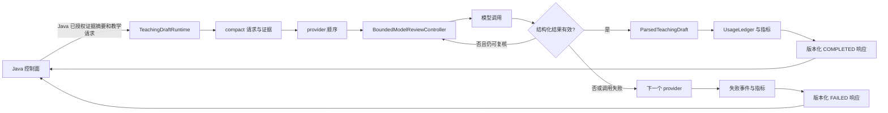
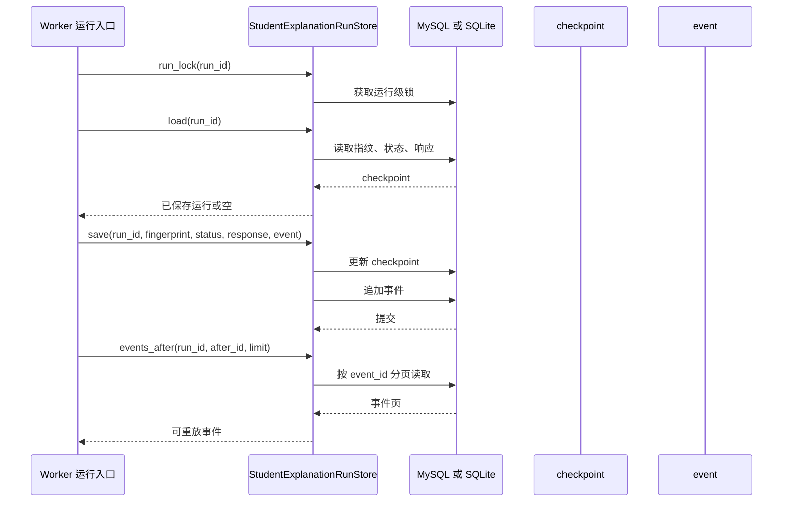

> Python 侧教学草稿运行时、学生解释运行时和解释图模块支持面向学生的教学内容生成。

# 教学草稿与解释图

本页面聚焦 Python 侧面向学生的教学内容生成能力，包含两类运行时：

- `TeachingDraftRuntime`：为非手册类教学功能生成结构化教学草稿。
- 学生解释运行时：为学生解释模型运行提供持久化、并发控制和事件重放基础。
- 解释图相关能力：当前已读证据能够确认其属于教学内容生成边界，但未包含独立的图节点、边或渲染协议定义，因此这里只描述其与运行时的接口边界，不推断未展示的图结构。

## 模块职责

### 教学草稿运行时

[teaching_draft_runtime.py](ai-worker-python/app/teaching_draft_runtime.py#L1-L260) 将一次教学草稿生成封装为受约束的 Python 执行单元。

它负责：

- 接收 Java 已授权、已经摘要化的证据；
- 对请求和证据进行长度及字段约束；
- 按配置的 provider 顺序调用模型；
- 使用 `BoundedModelReviewController` 执行有限次数的结构化输出复核；
- 解析并规范化模型结果；
- 记录 provider、模型、耗时、token 用量和估算成本；
- 在成功或失败时返回稳定的版本化 JSON 合同。

它不负责：

- 用户身份管理；
- Java 业务数据访问；
- 来源权限校验；
- SQL 持久化；
- 文件系统或原始资源读取；
- 手册工作流的 LangGraph 图执行。

源码明确将该运行时与较大的手册生成图区分开来：传统教学任务仍由自身的确定性渲染器负责，教学草稿运行时只处理一次 provider-backed 的结构化草稿生成。

### 学生解释运行时

[student_explanation_runtime.py](ai-worker-python/app/student_explanation_runtime.py#L23-L160) 的已读部分主要体现了学生解释运行的耐久化和重放基础。

`StudentExplanationRunStore` 负责：

- 保存一次运行的 `run_id`、请求指纹、状态和响应；
- 保存与运行关联的事件；
- 在 MySQL 和 SQLite 开发回退实现之间切换；
- 为同一个 `run_id` 提供运行级锁；
- 读取 checkpoint；
- 更新响应并追加事件；
- 分页读取事件，且单页上限为 `100` 条。

该存储将 checkpoint 与事件分开：

```text
student_explanation_checkpoint
  run_id
  request_fingerprint
  status
  response_json
  updated_at

student_explanation_event
  event_id
  run_id
  event_json
  created_at
```

因此，运行结果可以通过 checkpoint 恢复，过程事件则可以通过游标继续读取。SQLite 使用本地文件和线程锁；MySQL 使用共享数据库，并通过 MySQL advisory lock 进行跨进程运行锁定。

## 调用链

教学草稿的源码证据支持以下调用链：



关键节点：

- `TeachingDraftRequest.compact()` 在进入 provider 请求前限制输入字段和证据规模。
- 单次请求最多保留 `24` 条证据，每条证据的摘要长度最多 `1,200` 个字符。
- 模型复核由 `BoundedModelReviewController` 控制，而不是无限重试。
- provider 调用失败、结构化输出无效和复核耗尽会分别进入事件与指标记录。
- Java 获得的是稳定的 `COMPLETED` 或 `FAILED` 响应，而不是 Python 内部对象。

学生解释运行的持久化链路可以概括为：



这里的 `status` 对学生解释运行是持久化字段，已读片段没有定义其完整枚举，因此不能从当前证据推断所有状态名称或状态转换规则。

## 关键状态与响应

### 教学草稿请求状态

请求模型包含以下主要上下文：

- `runId`：运行标识，长度至少为 `8`；
- `taskId`：教学任务标识；
- `contractVersion`：跨语言合同版本，默认值为 `teaching-ai-v1`；
- `writingGoal`、`questionText`：教学目标和题目文本；
- `supplementaryRequirements`：补充要求；
- `templateCode`、`templateSummary`：模板信息；
- `memoryReuse`：可复用记忆；
- `evidence`：已授权的证据摘要；
- `deadlineEpochMs`：可选截止时间。

响应成功时包含：

```json
{
  "status": "COMPLETED",
  "draft": {
    "teacherExplanation": "...",
    "studentHint": "...",
    "knowledgePoints": [],
    "followUpQuestions": [],
    "content": "..."
  },
  "usage": {},
  "recoveryEvents": [],
  "metrics": {}
}
```

失败时仍保持相同的外层合同，`draft` 返回空字段，并通过 `parseError`、`recoveryEvents` 和 `metrics` 暴露失败摘要。估算成本未知时，`usage.estimatedCost` 使用 `-1.0` 表示未知。

### 学生解释运行状态

学生解释运行的状态由 checkpoint 保存：

```text
run_id + request_fingerprint
          |
          +-- status
          +-- response_json
          +-- updated_at
```

请求指纹用于识别同一 `run_id` 对应的请求内容，响应则可以在进程重启或重复投递后恢复。事件以递增 `event_id` 作为游标，调用方通过 `events_after(run_id, after_id, limit)` 获取后续事件。

并发边界包括：

- SQLite：进程内按 `run_id` 维护线程锁；
- MySQL：按 `run_id` 计算不超过 64 字符限制的 advisory lock 名称；
- 无法获得 MySQL 锁时抛出 HTTP `409`，错误为 `STUDENT_EXPLANATION_RUN_LOCK_TIMEOUT`；
- 事件分页大小会被限制在 `1` 到 `100` 之间。

## 输入约束与安全边界

教学草稿运行时在请求进入模型前执行多层限制：

- 请求未知字段被拒绝，避免手册调用方误进入旧教学运行时；
- 普通输入字段有最大字符数；
- 证据列表最多 `24` 项；
- 证据摘要、标题、chunk 标识、图片描述和资源 ID 均有独立长度限制；
- `compact()` 会去除首尾空白、压缩标题空白并再次截断字段；
- 原始路径和原始资源不会作为教学证据合同的一部分暴露给 provider，证据模型的说明强调其只包含权限过滤后的摘要信息。

学生侧还存在学生内容禁用标记集合，例如：

```text
答案与评分点
参考答案
参考解析
评分标准
完整解析
教师讲解
教师提示
推导路径
结论核对
```

这些标记表明教学内容需要区分学生可见解释与教师侧答案、评分或推导信息。当前已读片段没有展示这些标记具体在哪个解析或校验函数中生效，因此这里只能将其视为学生内容边界，不能进一步断言过滤时机或失败响应。

## 失败与降级

教学草稿 provider 调用存在两层失败处理：

1. 当前 provider 的结构化输出无效  
   由模型复核控制器进行有限复核。复核耗尽后记录 `STRUCTURED_OUTPUT_INVALID`。

2. 当前 provider 调用异常  
   `HTTPException`、请求异常、值错误和键错误会被捕获，记录 `MODEL_CALL_FAILED`，然后继续尝试 provider 顺序中的后续 provider。

所有 provider 都失败时：

- 响应状态为 `FAILED`；
- 不返回部分草稿；
- `providerName` 和 `modelCode` 为空；
- `parseError` 保存最后一次失败摘要；
- usage、恢复事件和尝试指标仍会返回。

学生解释运行的主要失败边界则是：

- checkpoint 数据库或受限 MySQL 账号不可用时，初始化阶段抛出运行时错误；
- 同一运行被并发处理且锁获取失败时返回 `409`；
- 更新不存在的运行时抛出 `student explanation run is missing`；
- SQLite 是开发回退实现，生产共享执行依赖 MySQL 配置和已有表结构。

## 扩展点

### 增加或调整模型 provider

provider 顺序和模型选择由 `TeachingDraftRuntime` 的配置方法承载。扩展 provider 时需要保持：

- 相同的结构化草稿解析合同；
- 相同的 usage 字段语义；
- provider 调用异常可被现有失败路径捕获；
- 诊断信息不泄露 prompt、原始来源正文或业务身份数据。

### 替换模型复核策略

`BoundedModelReviewController` 是有限复核边界。可以通过其 profile 或配置调整复核次数与策略，但必须保留有界执行，避免教学任务因模型自审进入无限循环。

### 替换学生解释 checkpoint 后端

`StudentExplanationRunStore` 已将后端选择集中在存储层：

- `MATH_AGENT_STUDENT_EXPLANATION_CHECKPOINT_BACKEND=mysql` 使用共享 MySQL；
- 其他值或默认配置使用 SQLite；
- SQLite 数据路径由 `MATH_AGENT_STUDENT_EXPLANATION_CHECKPOINT_DB` 指定。

新增后端需要实现相同的 `load`、`save`、`update_response`、`events_after` 和运行锁语义，尤其要保持 checkpoint 更新与事件追加的一致性。

### 扩展解释图

当前证据没有展示解释图的独立源码接口。可确认的扩展边界是：解释图生成应消费学生可见的结构化教学结果或受控证据摘要，并通过学生解释运行时的 `run_id`、checkpoint 和事件机制支持恢复与重放。图节点、边类型、布局和渲染格式需要以实际解释图模块的源码合同为准，不能直接复用教师答案、评分点或原始来源资产。

## Sources

Sources: [ai-worker-python/app/teaching_draft_runtime.py](ai-worker-python/app/teaching_draft_runtime.py#L1-L260), [ai-worker-python/app/teaching_draft_runtime.py](ai-worker-python/app/teaching_draft_runtime.py#L120-L479), [ai-worker-python/app/student_explanation_runtime.py](ai-worker-python/app/student_explanation_runtime.py#L1-L160), [ai-worker-python/app/student_explanation_runtime.py](ai-worker-python/app/student_explanation_runtime.py#L115-L294)
