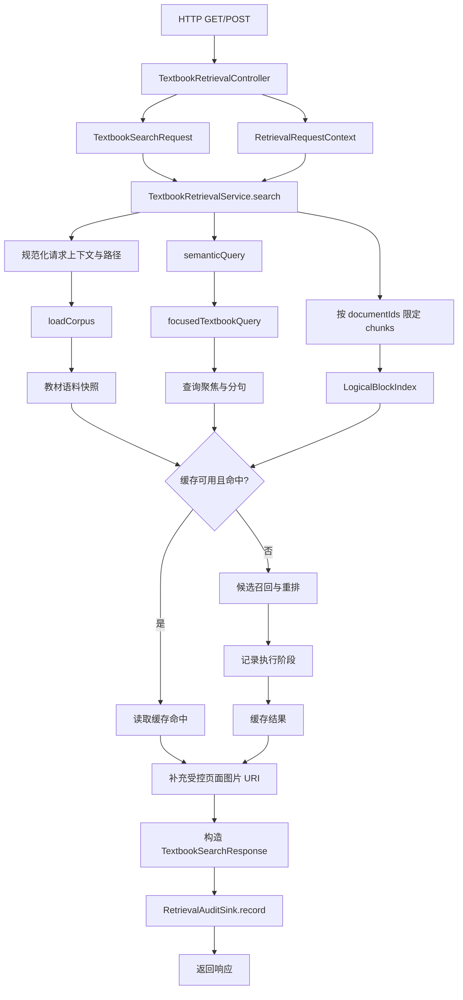
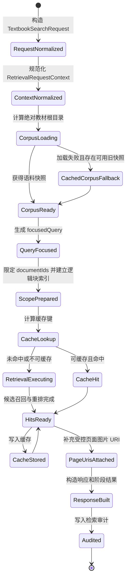

> TextbookRetrievalService 统筹教材检索请求、检索模式、阶段结果和响应，是教材知识获取的核心服务。

# 教材检索总流程

`TextbookRetrievalService` 是教材知识获取的核心编排服务。它接收规范化的教材检索请求，加载或复用教材语料，构造聚焦查询，按请求指定的检索模式执行候选召回与重排，补充受控页面图片地址，生成阶段结果与最终响应，并同步写入检索审计事件。

服务本身不直接承担 HTTP 参数解析、资源根目录配置或请求主体解析，这些职责由 `TextbookRetrievalController` 完成；也不把教师资料图谱扩展注入教材检索主链路。教材检索使用固定公共教材语料，图谱上下文在当前流程中明确设置为空，以避免一跳教师资料扩展影响教材逻辑小标题的召回率。

## 请求入口与参数规范化

HTTP 入口提供 GET 和 POST 两种形式：

- `GET /api/retrieval/textbooks/search`
  - 接收 `query`、`limit`、可选 `documentId`、可选 `retrievalMode`。
  - 使用配置中的 `processedBooksRoot()` 作为教材处理目录。
- `POST /api/retrieval/textbooks/search`
  - 直接接收 `TextbookSearchRequest`，适合传递公式文本和公式图像数据。
  - 请求体为空时使用空查询和默认数量构造请求。

控制器从请求中解析租户、主体类型、主体 ID、客户端 IP、设备 ID、User-Agent 和 URI，组装 `RetrievalRequestContext` 后交给服务。`X-Forwarded-For` 存在时取其第一个地址，否则使用 Servlet 远端地址。没有 HTTP 请求对象时则使用默认教材检索上下文。

`TextbookSearchRequest` 在构造阶段完成基础边界处理：

- `query` 去除首尾空白，空值转为空字符串。
- `formulaQuery` 折叠连续空白。
- `formulaImage` 去除首尾空白。
- `retrievalMode` 通过 `TextbookRetrievalMode.from(...)` 归一化为稳定编码。
- `limit` 小于等于 0 时默认为 10，大于 50 时限制为 50。
- `documentIds` 支持逗号分隔，过滤空值并去重。
- `semanticQuery()` 将主题查询和公式查询拼接为统一的语义检索意图。
- 只要存在公式图像，`hasFormulaImage()` 就返回真。

## 总体调用链



关键节点如下：

1. 控制器负责协议适配和请求上下文，不负责检索策略。
2. 服务先获得教材语料快照，再确定查询、文档范围和逻辑块索引。
3. 缓存命中时直接复用命中结果；未命中时执行候选召回和重排。
4. 页面图片 URI 的补充发生在缓存读取或检索完成之后，因此缓存中的命中结果仍可统一经过资源地址控制。
5. 响应生成后同步写入审计事件，审计失败或处理方式由 `RetrievalAuditSink` 的实现决定。

## 服务依赖与职责边界

`TextbookRetrievalService` 通过构造器注入以下能力：

| 依赖 | 在总流程中的职责 |
| --- | --- |
| `TextbookCatalogReader` | 读取教材目录或教材条目 |
| `TextbookChunkReader` | 读取教材分块内容 |
| `LocalTextbookBm25SearchEngine` | 提供本地词法候选召回能力 |
| `TextbookSearchCache` | 读取和写入教材检索缓存 |
| `RedisTextbookSearchCacheProperties` | 提供缓存 TTL 等运行参数 |
| `TextbookPageTextSearchService` | 页面文本检索能力，可选注入 |
| `TextbookPageImageSearchService` | 页面图像检索能力，可选注入 |
| `VectorIndexService` | 向量检索或语义重排能力 |
| `TextbookPageImageService` | 将页面命中转换为受控图片资源地址 |
| `TeacherResourceGraphAlignmentService` | 提供图谱对齐接口，但教材主流程显式使用空图谱上下文 |
| `RetrievalAuditSink` | 记录请求、响应、耗时和请求主体上下文 |
| `TextbookRetrievalProperties` | 控制查询聚焦、候选规模和检索运行策略 |

构造器使用 `Objects.requireNonNull` 校验核心依赖。另有兼容构造器，为直接调用方和测试保留默认配置，并将页面文本搜索和页面图像搜索依赖设为 `null`。Spring 使用配置感知的完整构造器。

## 主流程状态

一次检索请求主要经过以下状态转换：



服务维护两个与语料加载相关的进程内状态：

- `cachedCorpus`
  - 保存最近一次成功加载的教材语料快照。
  - 当源文件暂时异常时，可作为旧快照兜底，降低缓存雪崩影响。
- `lastLoadFailure`
  - 保存最近一次语料加载失败状态。
  - 配合 30 秒失败冷却窗口，避免底层文件或存储故障时每个请求都重复触发昂贵加载。

`corpusLoadLock` 用于串行化语料加载，避免缓存未命中时多个请求同时读取大量教材文件，降低缓存击穿风险。

## 查询聚焦

服务不会直接把 Agent 生成的完整包装句送入 BM25 或语义模型。`focusedTextbookQuery` 会先根据配置选择：

- 启用 Agent 包装语句清理时，调用 `normalizeTextbookQuery`。
- 未启用时，仅做通用空白规范化。

包装语句清理只移除明确的教材检索路由前缀和“相关内容/资料”等通用尾部，保留真实主题词。例如，检索意图中的“函数定义”“双曲线定义”等词不会因为包含“定义”而被删除。

随后查询会按换行、逗号、句号、分号、冒号、问号、括号等符号拆分为分句，并进行去重。聚焦策略按以下顺序组织查询片段：

1. 优先选择与主标签匹配的分句。
2. 再选择与扩展标签匹配的分句。
3. 如果图谱没有提供可用匹配，则按长度优先补入有效分句。
4. 加入受配置限制的主标签和扩展标签。
5. 根据最大分句数、图谱标签数和最大查询字符数截断。

当前教材主流程将 `QueryGraphContext` 固定为 `EMPTY`，因此实际默认走与语料无关的规范化和最长有效分句回退逻辑。这样可以避免教师资料图谱的扩展词污染教材 BM25 和 BGE 候选集。

## 语料范围与逻辑块索引

服务首先将传入的教材根目录转换为绝对、规范化路径，然后通过 `loadCorpus` 获取教材语料。语料至少包含：

- 教材目录条目；
- 教材分块集合；
- 全库逻辑块索引。

如果请求没有指定 `documentIds`，服务直接使用语料快照中的全库 `logicalBlockIndex`。如果请求指定了文档范围，则先通过 `scopedChunks` 过滤分块，再基于过滤后的分块重新建立逻辑章节索引。

这一区分保证了文档筛选不会继续使用包含其他教材文档的全局逻辑结构。

## 缓存与检索执行

缓存键由语料信息、查询、数量、文档范围和检索模式共同参与计算。缓存身份还包含：

- `SEARCH_PIPELINE_VERSION`
  - 当前值为 `two_stage_doc_page_v4_bounded_semantic_first_parent_rerank`。
  - 任何会改变候选准入、排序链路或重排顺序的修改都应同步更新。
- `SEARCH_CACHE_SCHEMA_VERSION`
  - 当前值为 `two_stage_section_block_reference_index`。
  - 候选校验或缓存结构语义变化时需要更新。

当请求不包含公式图像时，服务允许读取和写入缓存。包含公式图像时，`cacheable` 为假，不读取缓存，也不会将此次结果写入缓存。这是因为公式图像会进入页面图像检索路径，不能仅依赖文本查询建立可复用的缓存身份。

缓存未命中时，服务调用 `rerankedHits(...)` 执行候选检索和重排，并通过 `executionStages` 收集阶段结果。缓存命中时直接使用缓存中的命中列表，因此响应中的版本标识会区分：

- 实际执行检索：`SEARCH_PIPELINE_VERSION`
- Redis 缓存命中：`redis_` 加上当前管线版本

缓存 TTL 也区分空结果和非空结果：

- 空结果使用 `normalizedNullValueTtl()`，用于短时间缓存无命中结果。
- 非空结果使用 `normalizedTtl()`。

## 两阶段检索与阶段结果

服务将本地词法检索定位为粗召回阶段，而不是最终排序器。两阶段结构的职责是：

1. **候选准入**
   - 使用 BM25、元数据和轻量语义信号，以较低成本、较宽范围筛选文档或页面候选。
2. **页面级竞争**
   - 对最终页面候选使用真正的语义重排模型决定返回顺序。

服务保留 `executionStages`，并在响应中通过 `retrievalStages(...)` 输出阶段结果。这样上层不仅能获得最终命中列表，还能了解本次请求采用的检索模式、范围、命中数量以及执行过的阶段。

页面重排完成后，服务统一调用 `attachControlledPageImageUris(...)`。因此返回给调用方的是经过页面资源服务控制的图片 URI，而不是直接暴露底层文件路径。

## 响应与审计

`TextbookSearchResponse` 至少包含以下信息：

- 本次请求生成的 `queryId`；
- 原始请求查询词；
- 规范化后的数量上限；
- 检索管线版本或缓存版本标识；
- 检索描述；
- 检索阶段结果；
- 命中数量；
- 最终 `TextbookSearchHit` 列表。

响应保留原始 `request.query()`，而召回、重排和缓存使用的是聚焦后的 `focusedQuery`。这使 API 展示和审计能够保留用户原始输入，同时让检索模型接收更紧凑的主题意图。

服务在响应构造后同步调用：

```text
auditSink.record(
    RetrievalAuditEvent.from(
        queryId,
        request,
        response,
        elapsedMs,
        normalizedContext
    )
)
```

审计事件能够关联请求、响应、耗时和请求主体上下文，构成教材检索的行为追踪边界。

## 主要边界条件

- **空请求体**：POST 请求体为空时转为空查询、默认数量 10 的请求。
- **空查询**：查询规范化后仍为空时，聚焦器返回空字符串，后续检索由具体检索引擎决定其空查询行为。
- **数量越界**：数量始终限制在 1 到 50 的有效范围内；非正数回退到 10。
- **无效文档 ID**：空值、空白值被过滤；逗号分隔的 ID 会拆分、去空白并去重。
- **公式图像查询**：不参与缓存，以避免图像条件导致错误复用文本缓存。
- **缓存未命中并发**：语料加载通过互斥锁控制，避免多个请求同时加载大批量文件。
- **语料加载失败**：失败状态进入冷却窗口；若已有最近成功快照，可使用旧快照继续服务。
- **教师图谱扩展**：教材检索当前显式禁用一跳图谱扩展，避免降低教材小标题召回率。
- **缓存陈旧**：检索候选准入、校验或排序语义变化时必须更新管线版本或缓存结构版本，否则可能返回旧结果。
- **请求主体缺失**：控制器通过 `RequestSubject.normalize()` 取得稳定主体信息；无 Servlet 请求时使用默认上下文。

## 扩展点

### 新增检索模式

`TextbookSearchRequest.retrievalMode` 通过 `TextbookRetrievalMode` 归一化，服务再将模式传入候选召回、响应描述和阶段结果构造。新增模式时需要同时考虑：

- 模式编码的兼容性；
- `rerankedHits(...)` 的候选和重排分支；
- `retrievalDescription(...)` 与 `retrievalStages(...)` 的可解释输出；
- 缓存键是否必须区分该模式；
- 管线版本是否需要更新。

### 增加页面检索能力

页面文本和页面图像搜索服务已作为可选依赖保留。扩展页面检索时，应保持不同检索路线使用相同的聚焦主题意图，使 BM25、向量检索、页面文本检索和页面图像检索的结果具有可比性。

### 调整查询聚焦策略

查询前缀、尾部清理、分句规则、标签匹配和截断预算都集中在 `TextbookRetrievalService` 的聚焦逻辑及 `TextbookRetrievalProperties.queryFocus()` 配置边界内。改变这些规则会直接影响候选集合，应同步评估缓存版本和审计可解释性。

### 替换缓存实现

`TextbookSearchCache` 抽象了缓存读写，Redis 相关 TTL 通过 `RedisTextbookSearchCacheProperties` 提供。替换为其他实现时，需要保留：

- 查询、语料和检索模式之间的缓存隔离；
- 空结果与非空结果的不同 TTL；
- 管线版本对缓存身份的影响；
- 公式图像查询不可缓存的约束。

### 扩展审计

`RetrievalAuditSink` 是检索行为记录的边界。可以在不改变检索主流程的前提下增加 JDBC、内存或组合 Sink，但应继续保留 `queryId`、原始请求、响应、耗时和 `RetrievalRequestContext` 的关联关系。

### 调整重排链路

本地 BM25 适合作为粗召回阶段，最终顺序由页面级语义竞争决定。任何新增召回器、重排器或候选准入规则都应明确其所属阶段，并更新 `TextbookRetrievalStage` 的输出以及 `SEARCH_PIPELINE_VERSION`。

Sources: [TextbookRetrievalService.java](backend-java/src/main/java/com/doob/mathagent/retrieval/TextbookRetrievalService.java#L35-L210), [TextbookRetrievalService.java](backend-java/src/main/java/com/doob/mathagent/retrieval/TextbookRetrievalService.java#L213-L355), [TextbookRetrievalService.java](backend-java/src/main/java/com/doob/mathagent/retrieval/TextbookRetrievalService.java#L357-L370), [TextbookRetrievalController.java](backend-java/src/main/java/com/doob/mathagent/retrieval/TextbookRetrievalController.java#L14-L84), [TextbookSearchRequest.java](backend-java/src/main/java/com/doob/mathagent/retrieval/TextbookSearchRequest.java#L6-L61)
