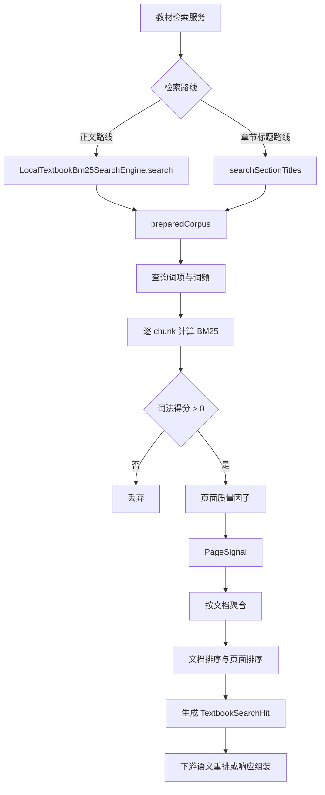

> LocalTextbookBm25SearchEngine 提供本地教材文本搜索能力，并以 TextbookSearchHit 统一命中结果。

# 本地 BM25 文本检索

`LocalTextbookBm25SearchEngine` 是教材检索链路中的本地词法召回组件。它接收查询文本和教材 `TextbookChunk` 列表，基于 BM25 对教材正文或章节标题进行匹配，结合页面质量和资源图谱词项生成候选排序，最终统一输出 `TextbookSearchHit`。

该组件定位为**粗召回阶段**，负责发现可能相关的教材页面或文档，不承担最终语义排序。`TextbookRetrievalService` 可将正文 BM25 和章节标题 BM25 作为独立检索路线，再交给后续语义重排及响应组装逻辑。

## 模块职责

核心职责包括：

- 将查询文本规范化为词项，并统计查询词频。
- 对教材正文执行本地 BM25 评分。
- 对可见章节标题执行独立的标题 BM25 评分。
- 缓存教材快照对应的词频、文档频率和平均长度等统计信息。
- 过滤没有文本证据的页面，使 OCR 空文本页面不会通过文本 BM25 命中。
- 使用页面质量分类结果修正词法得分。
- 使用查询图谱词项和紧凑文本匹配结果辅助正向命中之间的排序。
- 从命中页面构造包含教材元数据、片段、公式和图片路径的 `TextbookSearchHit`。
- 为下游语义重排保留查询相关的文本片段，而不是简单截取页面开头。

## 调用链



关键节点：

- `preparedCorpus` 负责准备与教材快照绑定的索引统计。
- 正文路线使用正文词频、文档频率和文档长度。
- 标题路线使用独立的标题词频、标题文档频率和标题长度。
- 只有 BM25 得分大于零的页面会进入 `PageSignal`。
- 命中先按文档聚合，再在文档内进行页面排序。
- `TextbookSearchHit` 是本地检索结果向上层暴露的统一数据合同。

## 正文 BM25 路线

入口为：

```java
search(String query, List<TextbookChunk> chunks, int limit)
```

该重载使用空的 `QueryGraphContext`，实际转发到带查询图谱上下文的搜索方法：

```java
search(
    String query,
    List<TextbookChunk> chunks,
    int limit,
    QueryGraphContext queryGraph)
```

正文路线的处理步骤如下：

1. 解析查询词项。
2. 对查询词项进行频次统计。
3. 从 `QueryGraphContext` 中取得可用于辅助匹配的图谱词项。
4. 取得用于片段截取的查询相关词项。
5. 从已准备的教材语料中读取当前页面的正文统计。
6. 计算页面 BM25 分数。
7. 对无文本证据的页面不建立正文统计，因此不能获得正文 BM25 命中。
8. 根据 `TextbookPageQualityClassifier` 返回的页面质量标签和评分因子修正词法分数。
9. 记录紧凑页面文本是否包含紧凑查询，以及元数据和图谱词项的词法匹配数量。
10. 通过 `rankedHits` 完成文档级和页面级排序，并转换为 `TextbookSearchHit`。

页面质量因子直接作用于词法分数。这样，目录页、封面等可能重复出现章节名称的页面不会仅凭精确标题重复就压过教材正文页面。

## 章节标题 BM25 路线

入口为：

```java
searchSectionTitles(String query, List<TextbookChunk> chunks, int limit)
```

该路线将章节标题作为独立的词法证据字段：

- 使用标题词频和标题文档频率计算 BM25。
- 正文词频不会参与标题路线的 BM25 计算。
- 标题路线保留原始 `TextbookChunk` 引用，不会额外物化一份正文语料。
- 标题 BM25 命中后，同样应用页面质量因子。
- 标题路线使用独立的检索策略标识 `local_title_bm25`。

正文路线使用 `local_bm25` 作为 `retrievalStrategy`。两条路线可以保持各自的 BM25 分数，由上层检索服务按路线进行编排。

## 语料准备与关键状态

组件维护一个进程内的准备语料缓存：

```java
Map<List<TextbookChunk>, PreparedCorpus> preparedCorpora
```

缓存使用 `IdentityHashMap`，键不是列表内容相等性，而是 `TextbookRetrievalService` 提供的教材快照列表对象身份。源码注释明确指出：

- 相同的不可变教材快照可以复用已经完成的分词和统计。
- 源数据更新并产生新的快照列表后，会自动建立新的索引。
- 查询时不需要反复扫描并重新分词整个教材语料。
- 缓存访问由同步包装和显式同步块保护，避免并发构建同一语料统计。

`PreparedCorpus` 保存的主要状态包括：

- 每个 chunk 的正文词频。
- 每个 chunk 的正文长度。
- 每个 chunk 的章节标题词频。
- 每个 chunk 的章节标题长度。
- 正文文档频率。
- 标题文档频率。
- 正文平均长度。
- 标题平均长度。
- 紧凑化的元数据文本。
- 紧凑化的页面正文文本。
- 紧凑化的章节标题。
- 每个文档的最大页码。

`prepareCorpus` 可在没有查询的情况下提前建立这些统计，供检索预热流程调用，从而将首次查询中的语料准备成本提前完成。

## 文本证据与 OCR 空页面

语料准备时，组件会先判断 chunk 是否具有文本证据：

- 没有文本证据的页面保存为空词频和零长度。
- 这类页面不会赢得本地文本 BM25 排名。
- OCR 空页面仍可由独立的页面图像检索路线处理，文本检索组件不负责替代图像路线。

源码定义了用于识别空页面提示的标记，包括：

- `本页文本层为空`
- `需 ocr`
- `需要 ocr`
- `视觉模型补充`
- `text layer is empty`
- `ocr required`

因此，文本 BM25 与页面图像检索之间形成明确边界：文本层有效时走词法召回，文本层为空时保留给图像路线处理。

## 排序与结果截断

`rankedHits` 的排序过程具有两级结构：

1. 按 `docId` 将正向页面信号聚合为文档。
2. 对文档排序。
3. 在每个文档内对页面排序。
4. 将页面转换为 `TextbookSearchHit`。
5. 达到有效限制后停止继续收集，并再次按限制截断结果。

当调用方传入的 `limit` 小于或等于零时，有效限制默认为 `10`。如果没有任何正向词法命中，则直接返回空列表。

源码注释说明，片段预算只控制发送给下游语义重排器和调用方的证据文本，不参与 BM25 排名。当前片段相关常量为：

- 最大片段长度：`360` 字符。
- 最多片段窗口：`3` 个。
- 每个匹配窗口的半径：`88` 字符。

片段生成会优先保留查询相关句子或窗口，避免长教材页面仅截取开头，导致下游语义重排器看不到真正区分结果的证据。

## `TextbookSearchHit` 结果合同

本地 BM25 不直接返回内部页面信号，而是通过 `TextbookSearchHit` 统一输出。结果包含：

- chunk、section、文档和书名信息。
- 卷册、章节路径、页码和印刷页码。
- 章节标题。
- 文本片段。
- 公式文本。
- 图片相对路径和源页面图片信息。
- 页面质量标签。
- 页面图片 URI。
- 路线标识和排序分数。

`TextbookSearchHit` 提供两个重要的不可变变换方法：

- `withPageImageUri`：由上层服务在获得命中后补充受控图片地址，避免本地检索引擎直接耦合 HTTP 资源暴露规则。
- `withSectionTitle`：允许检索服务为页面摘要文本记录恢复可见章节标题。

这说明本地引擎负责检索和基础结果映射，而资源 URI 的公开规则及部分展示字段恢复由服务层继续处理。

## 边界条件

主要边界行为如下：

- 查询词项为空时返回空列表。
- `chunks` 为 `null` 或空列表时返回空列表。
- 没有任何页面获得正 BM25 分数时返回空列表。
- `limit <= 0` 时使用默认限制 `10`。
- 无文本证据的页面正文统计为空，不会通过正文 BM25 命中。
- 页面质量分类会降低或调整词法得分，因此原始 BM25 分数不一定等于最终 `TextbookSearchHit.score`。
- 标题路线和正文路线使用不同的统计集合及检索策略标识。
- 片段长度预算不会改变页面是否通过 BM25 召回。
- 缓存依赖列表对象身份；若调用方为未变化的语料反复创建新列表，将触发新的语料准备。

## 主要文件

- [`LocalTextbookBm25SearchEngine.java`](backend-java/src/main/java/com/doob/mathagent/retrieval/LocalTextbookBm25SearchEngine.java#L20-L275)：本地正文 BM25、章节标题 BM25、语料准备、缓存和排序入口。
- [`LocalTextbookBm25SearchEngine.java`](backend-java/src/main/java/com/doob/mathagent/retrieval/LocalTextbookBm25SearchEngine.java#L131-L210)：正文搜索、正向页面信号生成、文档与页面排序。
- [`LocalTextbookBm25SearchEngine.java`](backend-java/src/main/java/com/doob/mathagent/retrieval/LocalTextbookBm25SearchEngine.java#L213-L272)：教材快照统计构建与 OCR 空文本处理。
- [`TextbookSearchHit.java`](backend-java/src/main/java/com/doob/mathagent/retrieval/TextbookSearchHit.java#L5-L104)：统一教材检索命中结果及图片 URI、章节标题的不可变补充操作。

## 扩展点

- **页面质量策略**：通过构造器注入 `TextbookPageQualityClassifier`，可以调整页面标签和质量评分因子，而不改变 BM25 主流程。
- **查询图谱对齐**：通过 `QueryGraphContext` 提供别名或图谱相关词项，用于已获得正向词法命中的页面之间进行辅助排序。
- **检索路线扩展**：正文和章节标题已经采用独立路线，可继续由上层检索服务增加其他字段或召回路线，同时保留各自的策略标识。
- **语料预热**：调用 `prepareCorpus` 可在搜索前建立快照索引，适合教材加载或检索预热阶段。
- **下游排序**：本地引擎保持 BM25 为粗召回依据，语义重排可以在不改变本地索引结构的情况下消费其 `TextbookSearchHit` 和查询相关片段。
- **结果资源补全**：图片 URI 和展示字段可继续由服务层通过 `withPageImageUri`、`withSectionTitle` 等不可变方法补充。

Sources: [LocalTextbookBm25SearchEngine.java](backend-java/src/main/java/com/doob/mathagent/retrieval/LocalTextbookBm25SearchEngine.java#L1-L723), [TextbookSearchHit.java](backend-java/src/main/java/com/doob/mathagent/retrieval/TextbookSearchHit.java#L1-L107), [TextbookPageTextSearchService.java](backend-java/src/main/java/com/doob/mathagent/retrieval/TextbookPageTextSearchService.java#L19-L99)
