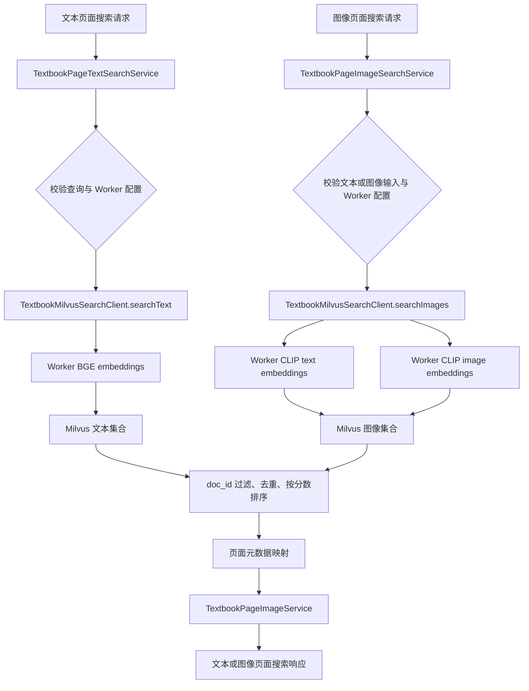

> TextbookMilvusSearchClient 连接向量检索后端，页面搜索服务负责文本或图像页面命中结果。

# Milvus 与页面向量检索

页面向量检索位于 `retrieval` 模块，Java 后端负责请求校验、向量检索调用、文档过滤、结果映射和页面图片 URI 构造；向量编码由本地 Worker 承担，Milvus 负责向量集合中的近似召回。在线路径不会将语料向量加载到 Java 进程内存中，也不会在 Java 进程中加载 BGE 或 CLIP 模型。

## 模块职责

### `TextbookMilvusSearchClient`

`TextbookMilvusSearchClient` 是 Milvus 访问边界，职责包括：

- 调用 Worker 的 BGE 或 CLIP embedding 接口生成查询向量。
- 调用 Milvus `/v2/vectordb/entities/search` 执行向量搜索。
- 使用独立的文本集合和图像集合，分别保留 BGE 与 CLIP 的距离语义。
- 限制搜索数量，最大搜索上限为 50。
- 根据 `doc_id` 对候选结果进行过滤。
- 合并文本查询和图像查询产生的重复命中，并保留同一 ID 中得分更高的结果。
- 按得分降序排列后返回 `MilvusHit`。

Milvus 请求统一使用 `COSINE` 度量，并请求返回 `id`、`text` 和 `metadata` 字段。Milvus 响应必须同时满足 HTTP 2xx 和响应 JSON 中 `code == 0`，否则会转换为 `IllegalStateException`。

### `TextbookPageTextSearchService`

文本页面搜索服务负责 BGE 页面检索的业务映射：

1. 规范化空请求。
2. 要求文本查询非空。
3. 检查本地 embedding Worker 的地址和 API Key。
4. 调用 `TextbookMilvusSearchClient.searchText`。
5. 从 Milvus 元数据中提取文档、章节、页码和来源信息。
6. 通过 `TextbookPageImageService` 构造页面图片 URI。
7. 去除同一文档内重复的章节命中。
8. 返回 `TextbookPageTextSearchResponse`，并标记检索后端为 `milvus`。

文本页面结果要求 `doc_id` 非空且 `page_no > 0`。章节标识优先读取 `section_id`，为空时回退到 `chunk_id`；如果两者都为空，结果会被丢弃。

### `TextbookPageImageSearchService`

图像页面搜索服务负责 CLIP 页面检索：

- 查询可以只包含文本、只包含图像，或同时包含两者。
- 文本输入调用 Worker 的 `/clip/text-embeddings`。
- 图像输入调用 Worker 的 `/clip/image-embeddings`。
- 多个查询向量会被送入同一个 Milvus 图像集合，并在客户端合并重复结果。
- 结果直接映射为页面图像命中，并补充页面图片 URI。
- 返回结果的后端标识为 `milvus`，模型标识为 `local_clip`。

当文本和图像均为空时，服务拒绝请求。图像结果中的章节路径、印刷页码、章节标题和命中文本会经过乱码修复后再返回。

## 调用链

关键节点如下：

- `TextbookPageTextSearchService` 和 `TextbookPageImageSearchService` 是页面级业务入口。
- `TextbookMilvusSearchClient` 统一封装 Worker embedding 和 Milvus HTTP 调用。
- Worker 只负责查询编码；语料向量由 Milvus 保存和检索。
- 页面服务负责将 Milvus 的原始元数据转换为页面搜索命中，并生成可访问的页面图片 URI。

## 文本检索路径

文本搜索调用 `searchText`，使用配置中的文本集合名称、embedding 模型和文本向量维度。查询文本会以 OpenAI 兼容格式发送到 Worker 的 `/embeddings` 接口，请求中包含模型名和单条输入。

Worker 返回的每个 embedding 都会校验维度。维度不匹配或 Worker 未返回向量时，检索立即失败。向量通过 Milvus 搜索接口查询后，客户端执行以下处理：

- 将 `docIds` 去空、去首尾空格并去重。
- 当指定文档过滤条件时，仅保留元数据中 `doc_id` 匹配的结果。
- 按 Milvus 命中 ID 合并重复项。
- 对同一 ID 保留分数更高的候选。
- 按分数降序排列，并截取请求数量。

文本页面服务随后按 `doc_id + "#" + sectionId` 去重，因此同一文档中的同一章节只返回一个页面命中。

## 图像检索路径

图像搜索允许两类输入分别生成向量：

- 文本查询通过 `/clip/text-embeddings` 编码。
- 页面图像通过 `/clip/image-embeddings` 编码。

如果配置的图像集合存储维度高于 Worker 当前的 CLIP 查询维度，客户端会先对查询向量进行 L2 归一化，再在末尾补零，直到达到 Milvus 图像集合的存储维度。该处理用于保持旧页面向量的公共前缀余弦相似度，同时满足集合 schema 的维度要求。

此路径有两个明确的异常边界：

- 存储维度小于查询维度时，认为配置无效并抛出异常。
- CLIP 查询向量范数为零时，无法归一化并抛出异常。

文本和图像查询都为空时，不会访问 Worker 或 Milvus，而是直接拒绝请求。

## 关键状态与数据流

页面搜索本身没有持久化状态，运行时状态主要体现在以下几个阶段：

1. **请求状态**：请求可能为空，文本和图像服务分别使用默认请求对象进行规范化。
2. **配置状态**：Worker 地址和 API Key 缺失时，搜索不可用。
3. **向量状态**：Worker 必须返回非空且维度正确的向量。
4. **集合状态**：Milvus 集合通过远端目录判断是否存在；可选语料集合不应由在线检索路径创建。
5. **候选状态**：Milvus 原始结果经过文档过滤、ID 合并和分数排序。
6. **页面状态**：只有能够映射出有效页面元数据的文本命中才进入文本页面响应。
7. **响应状态**：响应包含查询、限制数量、后端标识、模型标识、命中数量和不可变命中列表。

`collectionExists` 只读取 Milvus 的集合目录状态。它不会为了让可选证据分支“可用”而创建空集合，集合的创建和填充责任属于摄取流程。

## 外部调用与认证

所有 HTTP 调用都通过 `VectorHttpTransport` 完成，并使用配置中的超时时间：

- Worker 请求使用 `embeddingApiKey` 作为 Bearer Token。
- Milvus 请求在配置了 token 时使用 `Authorization: Bearer ...`。
- Milvus 请求额外发送 `Request-Timeout`，单位为秒。
- URL 通过去除 base URL 尾部斜杠后再拼接路径，避免产生重复斜杠。

Worker 响应只要求 HTTP 2xx，因为 Worker 使用 OpenAI 兼容响应格式，不包含 Milvus 的 `code` 字段。Milvus 响应则必须检查 HTTP 状态和 Milvus JSON `code`。

## 边界条件

- 空文本查询：文本页面服务抛出 `IllegalArgumentException`。
- 文本和图像均为空：图像页面服务抛出 `IllegalArgumentException`。
- 缺少 Worker 地址或凭证：服务抛出 `IllegalStateException`。
- embedding 响应无向量：客户端抛出 `IllegalStateException`。
- embedding 维度不符合配置：客户端抛出 `IllegalStateException`。
- Milvus 返回非 2xx、业务错误码或非法 JSON：客户端抛出 `IllegalStateException`。
- Milvus 元数据不是合法 JSON：按空对象处理，因此相关页面字段会使用默认值。
- 文本命中缺少 `doc_id`、页码无效或无法确定章节标识：该命中不会进入响应。
- `limit` 会被规范化到至少 1，且不超过 50。
- 文档过滤为空时不限制文档；过滤列表会忽略空值并去重。
- 图像集合维度小于查询维度，或查询向量为零范数：图像检索失败。

## 主要文件

- `TextbookMilvusSearchClient.java`：Worker embedding、Milvus 搜索、过滤、合并、排序和响应校验。
- `TextbookPageTextSearchService.java`：文本页面检索校验、页面元数据映射和章节去重。
- `TextbookPageImageSearchService.java`：文本或图像驱动的 CLIP 页面检索和结果映射。
- `TextbookPageTextSearchRequest.java`、`TextbookPageTextSearchResponse.java`、`TextbookPageTextSearchHit.java`：文本页面搜索合同。
- `TextbookPageImageSearchRequest.java`、`TextbookPageImageSearchResponse.java`、`TextbookPageImageSearchHit.java`：图像页面搜索合同。
- `TextbookPageImageSearchController.java`：图像页面搜索的 Web 控制器入口。
- `TextbookRetrievalController.java`、`TextbookRetrievalService.java`：教材检索总入口及更高层检索编排。
- `TextbookPageImageService.java`：页面图片 URI 构造边界。
- `VectorIndexProperties`、`VectorHttpTransport`：向量服务配置和 HTTP 传输依赖。

## 扩展点

### 增加新的向量集合

可以复用 `searchTextCollection`，只替换集合名称。该方法仍然统一使用配置的 BGE embedding 和相同的 Milvus 搜索协议，避免调用方重复实现向量 HTTP 调用。

新增可选语料时，应先通过 `collectionExists` 检查权威集合目录，再决定是否进入该检索分支。集合的创建和填充应继续由所属摄取流程负责。

### 增加新的查询模态

图像路径已经支持文本 CLIP 和图像 CLIP 两种输入。后续增加其他查询模态时，需要明确：

- Worker embedding 端点和认证方式。
- 查询向量维度。
- Milvus 集合 schema 维度。
- 向量归一化和距离语义。
- 多向量命中的合并规则。
- 结果元数据到页面命中的映射方式。

### 替换向量后端

页面服务依赖的是 `TextbookMilvusSearchClient.MilvusHit` 形态，而不是直接依赖 Milvus JSON。若替换后端，可在客户端边界内继续输出统一的 `id`、`text`、`metadata` 和 `score`，页面服务的结果映射逻辑即可保持稳定。

### 调整召回和去重策略

候选数量、最大限制、同 ID 合并、文档过滤和文本章节去重都位于当前检索边界内。调整这些策略时，需要同时考虑多查询向量合并后的排序，以及一个章节对应多个页面向量的情况。

Sources: [backend-java/src/main/java/com/doob/mathagent/retrieval/TextbookMilvusSearchClient.java](backend-java/src/main/java/com/doob/mathagent/retrieval/TextbookMilvusSearchClient.java#L1-L80) [backend-java/src/main/java/com/doob/mathagent/retrieval/TextbookPageTextSearchService.java](backend-java/src/main/java/com/doob/mathagent/retrieval/TextbookPageTextSearchService.java#L1-L80) [backend-java/src/main/java/com/doob/mathagent/retrieval/TextbookPageImageSearchService.java](backend-java/src/main/java/com/doob/mathagent/retrieval/TextbookPageImageSearchService.java#L1-L80)
