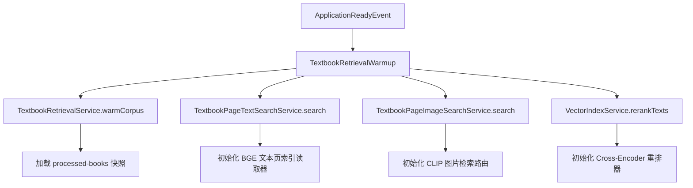
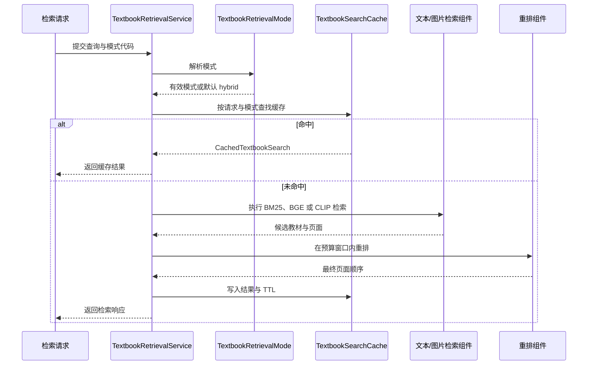

> 检索模式、配置属性、Redis 或禁用缓存及预热组件共同决定教材搜索的运行策略。

# 检索模式、缓存与预热

教材检索的运行策略由三层共同决定：

1. **请求选择的检索模式**决定使用文本页索引、CLIP 图片页索引，或两者组合。
2. **`TextbookRetrievalProperties` 配置**限制查询聚焦、候选文档数量、页面数量、重排输入规模及文本负载大小。
3. **搜索缓存与启动预热**分别影响重复请求的结果复用和首次请求延迟，但不改变检索结果的业务语义。

## 模式选择

`TextbookRetrievalMode` 是用户可选择的检索策略枚举，同时被请求、缓存键和响应诊断复用。当前提供四种模式：

| 模式 | 代码 | 检索来源 | 后续处理 |
| --- | --- | --- | --- |
| 混合 RAG | `hybrid` | BM25 与 BGE 文本页召回 | 合并后由后端重排确认教材证据 |
| 文本语义检索 | `text_bge` | BGE 教材页文本索引 | 使用 BGE 重排确认相关性 |
| 公式语义检索 | `formula_bge` | LaTeX 公式与主题词对应的 BGE 文本索引 | 使用 BGE 重排确认相关性 |
| 公式图片检索 | `image_clip` | CLIP 图片页索引 | 比较上传公式图与教材页面图，再由 BGE 重排文本证据 |

前三种模式使用文本页索引，只有 `image_clip` 使用 CLIP 页面索引。默认链路是 `hybrid`，不会因为系统支持 CLIP 就自动启用图片检索。

模式解析通过 `TextbookRetrievalMode.from(String)` 完成：输入会先去除首尾空白并转为小写；空值、未知值或未实现的模式都会安全回退到 `HYBRID`。因此，HTTP 请求中的非法模式不会直接导致进入不存在的检索分支。

## 配置属性与候选预算

`TextbookRetrievalConfiguration` 从 Spring `Environment` 构造 `TextbookRetrievalProperties`，将部署配置注入教材检索服务。该配置对象也支持直接使用默认值构造，便于聚焦测试及非 Spring 工具运行。

配置分为 `QueryFocus` 和 `RerankBudget` 两组。

### 查询聚焦

查询聚焦配置用于在语义检索前去除路由噪声：

| 属性 | 默认值 | 作用 |
| --- | ---: | --- |
| `max-query-chars` | `120` | 查询最大字符数 |
| `max-clauses` | `2` | 查询最多保留的子句数 |
| `max-graph-tags` | `4` | 查询最多保留的图标签数 |
| `lexical-first-max-query-chars` | `24` | 词法优先阶段的查询长度上限 |
| `semantic-title-context-limit` | `3` | 语义查询使用的标题上下文限制 |
| `dynamic-route-enabled` | `false` | 是否启用动态路由 |
| `normalize-agent-wrapper-enabled` | `false` | 是否规范化 Agent 包装层输入 |

构造 `QueryFocus` 时会执行基本边界约束：查询最大长度至少为 `32`，子句数至少为 `1`，图标签数不能小于 `0`；词法优先查询长度至少为 `8`，且不会超过查询总长度；标题上下文限制不能小于 `0`。

对应的配置前缀是：

```text
math-agent.textbook.retrieval.query-focus.*
```

### 重排预算

`RerankBudget` 控制候选准入、粗召回范围、最终重排窗口以及发送给重排端点的文本大小。默认生产证据窗口为 **3 本教材、每本 3 页**，粗召回窗口更宽，为 **最多 5 本教材、每本最多 5 页**，从而避免正确教材在进入 Cross-Encoder 前被过早截断。

主要默认值包括：

| 属性 | 默认值 | 作用 |
| --- | ---: | --- |
| `max-document-candidates` | `3` | 最终候选教材数 |
| `max-pages-per-document` | `3` | 每本教材最终页面数 |
| `max-rerank-documents` | `3` | 送入重排的教材数 |
| `max-page-candidates` | `9` | 页面候选总数 |
| `max-coarse-document-candidates` | `5` | 粗召回候选教材数 |
| `max-coarse-pages-per-document` | `5` | 粗召回阶段每本教材的页面数 |
| `coarse-rrf-k` | `60` | 粗召回 RRF 平滑常数 |
| `page-text-chars` | `120` | 页面文本负载长度 |
| `formula-text-chars` | `40` | 公式文本负载长度 |
| `document-text-chars` | `320` | 教材文本负载长度 |
| `lexical-dominant-pages-per-document` | `5` | 词法主导场景下的页面预算 |

对应的配置前缀是：

```text
math-agent.textbook.retrieval.rerank.*
```

这些配置只负责候选窗口和 Worker I/O 边界，不定义隐藏的分数融合逻辑。BM25 按稳定词法顺序准入文档，BGE 或 CLIP 在各自准入文档中保留独立的补充证据，最终页面顺序由 Cross-Encoder 重排结果决定。

## 搜索缓存边界

检索服务始终依赖 `TextbookSearchCache` 抽象，因此缓存是否启用不会改变上层检索服务的依赖关系。Spring 根据以下配置创建具体实现：

```text
math-agent.redis.search-cache.enabled
```

### Redis 缓存

当 `enabled=true` 时，Spring 创建 `RedisTextbookSearchCache`。该实现：

- 使用 `StringRedisTemplate` 存取字符串值；
- 使用 Jackson 将 `CachedTextbookSearch` 序列化为 JSON；
- 通过配置中的规范化前缀和缓存键组成 Redis key；
- 写入时使用调用方传入的 TTL；
- 读取到空值或空白值时视为未命中；
- JSON 反序列化失败时删除损坏的 Redis key，并按未命中继续检索；
- Redis 写入异常被忽略，保证 Redis 短暂不可用时搜索主链路仍能继续。

Redis 实现将 `distributed()` 标记为 `true`，表明它提供分布式结果复用能力。缓存配置属性由 `TextbookSearchCacheConfiguration` 通过 `@EnableConfigurationProperties` 注册。

### 禁用缓存

当 `enabled=false` 时，Spring 创建 `DisabledTextbookSearchCache`。该实现保留同一缓存接口，但具有明确的空操作语义：

- `find` 始终返回空结果；
- `put` 丢弃搜索结果；
- 不保留任何先前捕获的检索结果。

这种模式用于源资料重新同步和绕过缓存的验收场景，使每次查询都读取当前 MySQL/Milvus 状态，避免继续使用同步前的 OCR 或页面结果。

因此，缓存禁用不会让检索服务走另一套调用链，而是将缓存边界变成始终未命中的实现。缓存异常或禁用都不应阻断底层教材检索。

## 启动预热

`TextbookRetrievalWarmup` 监听 `ApplicationReadyEvent`，在应用启动完成后执行教材检索相关组件预热。预热目标是把不可变教材源快照和本地模型路由的初始化成本转移到应用启动阶段，避免首次教师请求承担打开大量本地教材 chunk 及模型加载的延迟。

预热调用链如下：



预热使用资源配置中的 `processedBooksRoot` 调用 `warmCorpus`。随后分别执行：

- 文本页搜索：使用查询 `数学教材`、限制 `1`、空过滤条件；
- 图片页搜索：使用查询 `数学教材`、无上传图片、限制 `1`、空过滤条件；
- 文本重排：使用 `数学教材` 对单条同名文本执行重排。

这些调用只用于初始化本地读取器和模型，不写入 Redis，不产生检索审计，也不写入语料数据，因此不会改变后续排名或制造隐藏测试数据。

如果预热过程中发生 `RuntimeException`，组件记录警告日志，但不会阻止其他后端 API 启动。教材检索仍可在没有成功预热的情况下保持正确性，只是首次实际请求可能承担相应的文件或模型初始化成本。

## 调用链与状态边界

从运行策略角度，教材搜索可以概括为：



关键状态包括：

- **模式状态**：请求中的原始模式代码经过规范化后成为枚举值；非法输入进入 `HYBRID`。
- **缓存状态**：缓存命中、未命中、损坏值和禁用缓存均通过 `TextbookSearchCache` 边界表达。
- **候选状态**：粗召回候选可以宽于最终重排候选，最终数量受 `RerankBudget` 限制。
- **预热状态**：预热成功表示本地快照、文本索引、图片索引和重排器已尝试初始化；预热失败只记录日志，不阻断应用。
- **结果状态**：最终页面顺序由后端重排结果决定，缓存复用结果不应引入新的排序规则。

## 主要文件与扩展点

- `TextbookRetrievalMode`：新增检索模式时，需要同时明确模式代码、用户标签、描述以及文本页索引和 CLIP 索引的使用标志，并在对应检索服务中实现分支。
- `TextbookRetrievalProperties`：集中承载查询聚焦和重排预算。延长候选窗口或文本负载时，应同步评估本地检索、模型 I/O 和交互延迟。
- `TextbookRetrievalConfiguration`：负责从 Spring 环境读取部署覆盖值，适合扩展新的配置属性。
- `TextbookSearchCache`：缓存实现的稳定扩展边界。Redis 实现适合分布式结果复用，禁用实现适合重新同步和验收场景。
- `RedisTextbookSearchCache`：负责序列化、TTL、key 前缀和损坏值清理；缓存故障应继续保持搜索可用。
- `DisabledTextbookSearchCache`：提供无状态、始终未命中的明确实现。
- `TextbookRetrievalWarmup`：集中编排教材快照、BGE、CLIP 和 Cross-Encoder 的启动初始化。新增需要预热的本地模型或索引时，应保持预热失败不阻断无关 API 的边界。

## Sources

Sources: [TextbookRetrievalMode.java](backend-java/src/main/java/com/doob/mathagent/retrieval/TextbookRetrievalMode.java#L1-L42)  
Sources: [TextbookRetrievalProperties.java](backend-java/src/main/java/com/doob/mathagent/retrieval/TextbookRetrievalProperties.java#L1-L193)  
Sources: [RedisTextbookSearchCache.java](backend-java/src/main/java/com/doob/mathagent/retrieval/RedisTextbookSearchCache.java#L1-L64)  
Sources: [DisabledTextbookSearchCache.java](backend-java/src/main/java/com/doob/mathagent/retrieval/DisabledTextbookSearchCache.java#L1-L31)  
Sources: [TextbookRetrievalWarmup.java](backend-java/src/main/java/com/doob/mathagent/retrieval/TextbookRetrievalWarmup.java#L1-L63)  
Sources: [TextbookRetrievalConfiguration.java](backend-java/src/main/java/com/doob/mathagent/retrieval/TextbookRetrievalConfiguration.java#L1-L16)  
Sources: [TextbookSearchCacheConfiguration.java](backend-java/src/main/java/com/doob/mathagent/retrieval/TextbookSearchCacheConfiguration.java#L1-L13)
