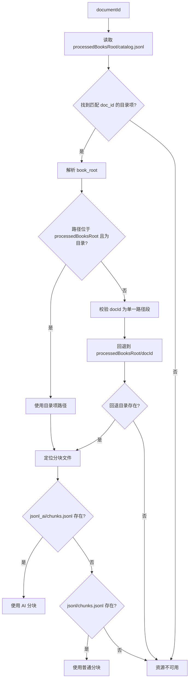

> resources 模块解析教材根目录、目录项和 chunk，并通过授权读取器约束可读内容。

# 教材资源目录、分块与授权读取

`resources` 模块负责从部署配置的教材处理根目录中定位教材资源，读取教材目录和分块数据，并将通过授权校验的分块转换为统一的教师文档块响应。模块的核心边界是：调用方只提交已持久化的 `documentId` 以及检索证据中的页码信息，Java 内部完成目录查找、教材路径解析、分块文件选择和结果映射；调用方不会获得教材文件系统路径或直接的文件访问能力。

## 模块职责

模块主要承担以下职责：

- 从 Spring 配置或环境变量读取教材及本地资源路径。
- 解析 `catalog.jsonl` 教材目录。
- 解析教材目录下的 `chunks.jsonl` 分块文件。
- 将跨机器生成的 `book_root` 转换为当前部署环境中的安全路径。
- 根据 `documentId` 确认教材是否存在且具有可读取的分块文件。
- 仅读取指定教材的分块，并转换为 `TeacherDocumentBlockResponse`。
- 基于检索授权页码读取有限范围的相邻页面。
- 对目录路径、教材 ID 和分块路径执行路径边界校验。

## 目录与路径配置

`ProjectResourceProperties` 统一承载项目级本地资源路径，包括测试数据、设计文档、参考 PDF、本地文件存储和教师资源上传目录。配置优先从 Spring 属性读取，缺失时回退到对应环境变量；路径最终会被规范化为绝对路径。

教材相关的处理根目录由 `TextbookResourceProperties` 提供，`TextbookAuthorizedBlockReader` 在构造时通过 `TextbookResourceProperties.fromSpringEnvironment(environment)` 获取配置。当前已读证据显示，授权读取流程将该根目录作为 `processedBooksRoot`，并在其下查找：

```text
processedBooksRoot/
├── catalog.jsonl
└── <book directory>/
    ├── jsonl_ai/chunks.jsonl
    └── jsonl/chunks.jsonl
```

当 `teacherResourceUploadRoot` 未单独配置时，项目资源配置会将其默认到本地文件存储根目录下的 `teacher-resource-uploads` 子目录。

## 目录项与分块模型

`TextbookCatalogItem` 对应 `catalog.jsonl` 中的教材目录项，支持以下字段：

- `doc_id`：教材稳定标识。
- `book_name`：教材名称。
- `volume`：册次或卷信息。
- `book_root`：教材目录路径。
- `manifest`：清单信息。
- `chunk_count`：分块数量，同时兼容 `section_count`。
- `page_count`：页数，同时兼容 `source_page_rows`。
- `ai_ok`：是否通过 AI 处理。

目录模型使用 `@JsonIgnoreProperties(ignoreUnknown = true)`，因此目录 JSON 中存在额外字段时不会导致反序列化失败。

`TextbookCatalogReader` 按 UTF-8 读取目录文件，逐行处理 JSONL：

1. 读取 `catalog.jsonl` 的全部文本行。
2. 移除行首 UTF-8 BOM。
3. 跳过空行。
4. 使用 Jackson 将每行解析为 `TextbookCatalogItem`。
5. 返回不可变列表。

`TextbookChunkReader` 对 `chunks.jsonl` 使用相同的读取策略，并将每行解析为 `TextbookChunk`。文件读取或解析过程中的 `IOException` 会被包装为 `IllegalStateException`，并包含出错文件路径。

## 教材目录路径解析

`TextbookBookRootResolver` 负责从目录项解析实际教材目录。它不会无条件信任目录中的 `book_root`，因为该路径可能来自另一台机器，例如 Windows 索引环境生成的绝对路径。

解析逻辑如下：

1. 将配置的 `processedBooksRoot` 转换为绝对、规范化路径。
2. 尝试解析目录项中的 `book_root`：
   - 绝对路径直接规范化；
   - 相对路径解析到当前 `processedBooksRoot` 下。
3. 只有当解析结果仍位于 `processedBooksRoot` 内，并且确实是目录时，才采用该路径。
4. 如果目录路径不可用，则回退到 `processedBooksRoot/<docId>`。
5. 回退路径必须存在且为目录。

`docId` 不是任意路径，而必须是单一普通路径段。绝对路径、包含 `/` 或 `\` 的值、`.`、`..`、多段路径以及非法路径都会被拒绝。这保证了目录项不能通过教材 ID 越出教材根目录。



图中的关键安全边界有两层：目录项路径必须位于配置根目录之下；使用 `docId` 回退时，`docId` 必须是单一路径段。分块文件路径也会再次检查其规范化结果是否仍位于已解析的教材目录内。

## 授权读取调用链

`TextbookAuthorizedBlockReader` 是教材分块的受控读取入口。其调用链可以概括为：

```text
调用方
  -> isAvailable(documentId) / read(documentId) / readPageWindow(...)
  -> chunksPath(documentId)
  -> TextbookCatalogReader.read(catalog.jsonl)
  -> TextbookBookRootResolver.resolve(...)
  -> 选择 jsonl_ai/chunks.jsonl 或 jsonl/chunks.jsonl
  -> TextbookChunkReader.read(...)
  -> 过滤指定 documentId
  -> 映射为 TeacherDocumentBlockResponse
```

`chunksPath(documentId)` 首先拒绝空的教材 ID，然后从 `catalog.jsonl` 中查找完全匹配 `doc_id` 的目录项。找不到目录项时返回不可用。解析教材目录后，优先选择：

```text
<bookRoot>/jsonl_ai/chunks.jsonl
```

如果 AI 分块文件不存在，则回退到：

```text
<bookRoot>/jsonl/chunks.jsonl
```

两条路径都会执行 `startsWith(bookRoot)` 校验，避免构造出的分块路径越出已授权教材目录。

## 可用性与完整读取

`isAvailable(documentId)` 用于判断已持久化的教材 ID 是否映射到当前活动的解析教材语料。它调用 `chunksPath`，并将非法参数或状态异常统一转换为 `false`。该方法不向调用方暴露具体失败原因或文件路径。

`read(documentId)` 在分块文件不可用时抛出：

```text
Authorized textbook source is unavailable
```

分块文件可用时，读取其中所有分块，但只保留 `chunk.docId()` 与请求 `documentId` 完全相等的记录。每条分块被映射为 `TeacherDocumentBlockResponse`，其中包括：

- 分块 ID；
- 教材文档 ID；
- 文档类型 `textbook_markdown`；
- 非负页码；
- 章节标题；
- 印刷页码；
- 来源类型 `reference`；
- 分块文本；
- 活跃状态 `active`；
- 固定的默认结构字段和置信度值。

读取结果保持分块文件的源顺序，最终以列表返回。

## 授权页面窗口

`readPageWindow` 用于在检索证据授权的页面附近读取有限内容。它有明确的参数门禁：

- `authorizedPageNo` 必须大于 `0`；
- `requestedPageNo` 必须与 `authorizedPageNo` 完全相等；
- `pageRadius` 不得小于 `0`；
- `pageRadius` 不得大于 `4`。

因此，调用方不能通过传入另一个请求页码来扩大读取范围，也不能请求任意大的页面窗口。

通过参数校验后，方法先执行完整的 `read(documentId)`，再筛选页码与授权页码距离不超过 `pageRadius` 的分块。结果按以下顺序排序：

1. 距离授权页码更近的分块优先；
2. 距离相同时，按 `blockOrder` 升序。

这种返回方式既保留授权页附近的上下文，也将读取范围限制在检索证据允许的局部页面内。

## 关键状态与边界条件

| 状态或条件 | 行为 |
| --- | --- |
| `documentId` 为空 | `isAvailable` 返回 `false`；读取路径无法建立 |
| 目录中不存在对应 `doc_id` | 资源不可用 |
| `book_root` 为空、非法或不在根目录内 | 回退到 `processedBooksRoot/<docId>` |
| `docId` 含路径分隔符或为多段路径 | 抛出非法参数异常 |
| 回退教材目录不存在 | 抛出教材目录不存在异常 |
| AI 分块存在 | 优先读取 `jsonl_ai/chunks.jsonl` |
| AI 分块不存在但普通分块存在 | 回退读取 `jsonl/chunks.jsonl` |
| 两种分块都不存在 | 返回不可用或抛出授权源不可用异常 |
| 分块中的 `doc_id` 与请求 ID 不一致 | 被过滤 |
| 页面授权页码不合法 | `readPageWindow` 拒绝请求 |
| 页面半径大于 4 | 拒绝请求 |
| JSONL 含 UTF-8 BOM | 自动移除后解析 |
| JSONL 含空行 | 跳过 |
| 文件读取失败 | 包装为 `IllegalStateException` |

## 主要文件

- `ProjectResourceProperties`：项目级本地资源路径配置、Spring 属性和环境变量读取、路径规范化。
- `TextbookResourceProperties`：教材资源配置入口；当前授权读取器通过它获取教材处理根目录。
- `TextbookCatalogItem`：教材目录项数据模型。
- `TextbookChunk`：教材分块数据模型。
- `TextbookCatalogReader`：目录 JSONL 读取器。
- `TextbookChunkReader`：分块 JSONL 读取器。
- `TextbookBookRootResolver`：教材目录路径解析、跨部署路径回退和路径遍历防护。
- `TextbookAuthorizedBlockReader`：教材可用性判断、授权分块读取和授权页面窗口读取。
- `TextbookResourceService`、`TextbookResourceController`：资源服务和 HTTP 控制层入口；已读证据仅确认其位于该模块，具体端点行为应以对应源码为准。
- `TextbookPageImageService`、`TextbookPageImageController`：教材页面图片资源相关入口，属于同一资源模块，但本页的核心授权读取链路基于分块读取器。

## 扩展点

### 增加目录字段

可在 `TextbookCatalogItem` 中增加 Jackson 映射字段。由于当前模型忽略未知字段，目录生产端可以先扩展 JSON 字段，再由 Java 模型按需消费。

### 增加分块格式或版本

可以在 `TextbookChunkReader` 后增加格式选择或版本适配，但应保持 `TextbookAuthorizedBlockReader` 的授权边界不变：调用方仍只提供 `documentId`，文件路径仍由目录查找和教材根目录解析产生。

### 增加分块文件优先级

当前优先使用 `jsonl_ai/chunks.jsonl`，再回退到 `jsonl/chunks.jsonl`。若未来引入新的分块版本，应在 `chunksPath` 中明确优先级，并对每个候选路径执行目录边界检查。

### 增强授权上下文

当前页面窗口授权由页码和最大半径控制。若未来需要绑定检索命中、用户或租户，应在授权读取器入口增加显式授权上下文，并继续保证文件系统路径不向调用方泄露。

### 优化大文件读取

目录和分块读取器当前使用 `Files.readAllLines`，会将整个 JSONL 文件加载到内存。对于更大的教材语料，可扩展为流式逐行解析；扩展时需要保留 BOM 处理、空行跳过、异常包装和源顺序语义。

## Sources

Sources: [ProjectResourceProperties.java](backend-java/src/main/java/com/doob/mathagent/resources/ProjectResourceProperties.java#L1-L185)  
Sources: [TextbookBookRootResolver.java](backend-java/src/main/java/com/doob/mathagent/resources/TextbookBookRootResolver.java#L1-L88)  
Sources: [TextbookCatalogReader.java](backend-java/src/main/java/com/doob/mathagent/resources/TextbookCatalogReader.java#L1-L47)  
Sources: [TextbookChunkReader.java](backend-java/src/main/java/com/doob/mathagent/resources/TextbookChunkReader.java#L1-L47)  
Sources: [TextbookAuthorizedBlockReader.java](backend-java/src/main/java/com/doob/mathagent/resources/TextbookAuthorizedBlockReader.java#L1-L108)  
Sources: [TextbookCatalogItem.java](backend-java/src/main/java/com/doob/mathagent/resources/TextbookCatalogItem.java#L1-L20)
