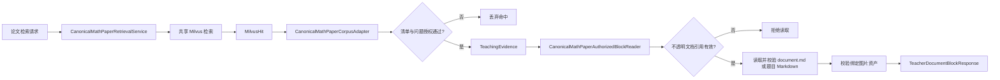

> CanonicalMathPaperCorpusAdapter、授权块读取器和检索服务共同封装数学论文语料的规范化资产与受控检索。

# 数学论文语料与授权检索

数学论文检索由三个边界协同组成：

- `CanonicalMathPaperCorpusAdapter` 将共享向量检索命中转换为受控的教学证据。
- `CanonicalMathPaperAuthorizedBlockReader` 根据不透明文档引用读取经过清单授权、哈希校验的 Markdown 内容。
- `CanonicalMathPaperRetrievalService` 作为论文检索服务边界，连接共享检索能力与论文语料适配逻辑。

其中，文件系统路径、真实文件名和清单位置只在后端内部使用，不进入返回的证据引用。共享检索层负责向量编码和 Milvus 召回，论文适配器负责对召回结果执行来源授权和证据谱系映射。



图中的授权边界分为两层：适配器决定检索命中能否成为可见证据，授权块读取器决定该证据对应的原始 Markdown 和图片能否被读取。

## 规范化语料资产

`CanonicalMathPaperCorpusAdapter` 默认从 `/app/data/math-paper-corpus` 读取语料根目录，也可以通过 `math-agent.teaching.canonical-paper.corpus-root` 配置。构造时会将路径转换为绝对路径并规范化，后续所有路径检查都以该根目录为边界。

语料以文档目录组织，每个已发布文档至少需要具备：

- `source-manifest.json`
- 由清单描述的源文档身份
- 题目及其来源页信息
- 可选的题目资产绑定

`hasPublishedCorpus()` 只有在语料根目录存在，并且至少有一个子目录包含 `source-manifest.json` 时才返回 `true`。目录不存在、目录枚举失败或读取异常都会返回 `false`，不会把异常暴露为已发布语料。

适配器处理每个 `MilvusHit` 时执行以下步骤：

1. 忽略 `recordType` 为 `FULL_DOCUMENT` 的聚合记录。
2. 优先读取 `documentFullName`，兼容旧数据中的 `sourceFile`。
3. 从命中元数据读取 `documentRef` 和 `sourceSha256`；缺失或哈希格式不正确时，回到发布清单重新解析。
4. 验证文档目录位于语料根目录下，并确认清单中的文档名、源文件 SHA-256 和文档引用彼此一致。
5. 验证题号符合 `[1-9]\d{0,2}`，且清单中存在对应题目，并且题目包含来源页。
6. 对带有资产绑定的检索行，比较命中元数据与清单中的资产集合；旧版没有资产字段的行可以走兼容路径。
7. 将命中转换为 `TeachingEvidence`，证据类型固定为 `CANONICAL_MATH_PAPER`，来源类型为 `canonical_math_paper`。

文档引用不是直接暴露的路径或文件名，而是由文档名和源文件哈希通过跨语言一致的 UUID v5 计算得到：

```text
uuid5(documentFullName + "\n" + sourceSha256)
```

证据引用则进一步由文档引用和 Milvus 命中 ID 派生：

```text
paper_<uuid5(documentRef + "\n" + hit.id)>
```

这样既能保持引用稳定、可复算，又避免把本地文件系统信息传递给上层。命中文本会被压缩空白并限制为最多 1200 个字符，作为证据摘要返回。

## 授权块读取

`CanonicalMathPaperAuthorizedBlockReader` 只接受不透明的 `documentRef`，调用方不能传入任意文件路径。`read()` 用于读取已发布论文的原始页面 Markdown 块，`readQuestion()` 用于读取清单中指定题号对应的题目 Markdown。

读取流程首先通过 `resolve()` 遍历语料根目录下的文档目录，并寻找匹配的不透明文档引用。一个可解析的发布文档必须满足：

- 文档目录仍位于配置的语料根目录下。
- `source-manifest.json` 和 `document.md` 都是常规文件。
- 清单能够提供文档身份、源文件哈希和 Markdown 哈希等发布信息。
- 文档引用与清单身份一致。

通过解析后，读取器使用清单中的哈希对 Markdown 内容执行验证，再将内容转换为 `TeacherDocumentBlockResponse`。因此，检索命中本身不能直接授权读取；它必须先对应到完整、发布过且哈希绑定的文档。

题目读取还具有更窄的选择边界：

- 题号必须匹配 `[1-9]\d{0,2}`。
- 题目必须存在于当前文档清单的 `questions` 数组。
- `questionMarkdown` 必须匹配 `questions/q-[0-9]{3}.md`。
- 题目 Markdown 路径必须规范化后仍位于论文根目录内。
- 题目文件必须通过清单中的 `questionMarkdownSha256` 校验。
- 返回的来源页取题目清单 `sourcePages` 的第一个页面。

非法题号、未授权题目、路径越界、哈希格式错误或文件不可读时，读取器会拒绝请求，而不是尝试从调用方给出的路径读取内容。

## 图片资产边界

题目 Markdown 中只有符合以下形式的原始图片行才可能被投影：

```markdown

```

读取器从 Markdown 中提取图片行，再与题目清单中的资产逐项匹配。一个图片资产必须同时满足：

- Markdown 中存在完全对应的逻辑路径。
- 路径符合 `figures/[A-Za-z0-9._/-]+`。
- 路径不包含 `..`。
- 清单提供合法的 64 位 SHA-256。
- 解析后的文件仍位于论文根目录内。
- 图片文件存在且实际 SHA-256 与清单一致。

最终返回的 `imageRefs` 只包含 Markdown 原始行和逻辑路径。页面图片、未绑定资产和合成行不会跨过该边界。

## 关键状态与失败行为

该模块没有把“目录存在”当作“语料可用”。核心状态依次包括：

- **未发布**：语料根目录不存在，或没有包含发布清单的文档目录。
- **清单不可用**：清单缺失、解析失败、文档名或哈希不匹配。
- **命中未授权**：命中缺少有效文档身份、题号、来源页或资产绑定不一致。
- **文档可读**：不透明引用能够解析到完整发布文档，且 Markdown 哈希通过。
- **题目可读**：题号在清单中存在，题目路径和题目哈希均通过。
- **资产可投影**：图片同时通过 Markdown、清单路径和文件哈希三重校验。

多数校验失败采用 fail-closed 行为：适配器跳过该命中，读取器返回不可用状态或抛出通用授权异常。清单读取异常不会产生新的资产绑定，也不会让向量元数据单独取得授权。

## 主要扩展点

扩展新的数学论文来源时，应保持现有边界：

- 在 `CanonicalMathPaperRetrievalService` 或共享检索层扩展召回策略，继续输出可被适配器消费的 `MilvusHit`。
- 在 `CanonicalMathPaperCorpusAdapter` 中增加新的元数据兼容规则，但最终授权仍应回到发布清单。
- 在授权块读取器中扩展清单模式或文档块投影时，继续使用不透明引用、根目录约束和哈希校验。
- 增加新的资产类型时，应为每种资产定义清单身份、允许的相对路径格式和内容哈希校验规则。
- 跨 Java、Python 或其他摄取组件生成引用时，应复用当前 UUID v5 命名空间和输入拼接规则，避免同一发布文档产生不一致的来源身份。

Sources: [CanonicalMathPaperCorpusAdapter.java](backend-java/src/main/java/com/doob/mathagent/retrieval/CanonicalMathPaperCorpusAdapter.java#L1-L267), [CanonicalMathPaperAuthorizedBlockReader.java](backend-java/src/main/java/com/doob/mathagent/retrieval/CanonicalMathPaperAuthorizedBlockReader.java#L1-L254), [CanonicalMathPaperRetrievalService.java](backend-java/src/main/java/com/doob/mathagent/retrieval/CanonicalMathPaperRetrievalService.java#L1-L80)
