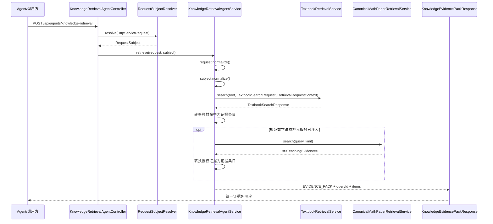

> KnowledgeRetrievalAgentService 将知识检索能力封装为 Agent 入口，并通过证据包响应向上层提供结果。

# AI 检索代理与证据包

`KnowledgeRetrievalAgentService` 是统一知识检索能力的 Agent 入口。它接收查询请求和认证主体，将请求规范化后交给教材检索服务，并可选地合并规范数学试卷语料的授权证据，最终以稳定的 `KnowledgeEvidencePackResponse` 形式向上层提供可追溯的证据片段。

## 模块职责

该模块位于 HTTP Agent 入口与具体检索实现之间，主要承担四项职责：

- 暴露 `POST /api/agents/knowledge-retrieval` 接口。
- 规范化查询文本和结果数量。
- 将认证主体转换为教材检索所需的审计上下文。
- 将不同来源的检索命中统一投影为证据包条目。

服务本身不负责实现 BM25、向量检索、页面重排或语料读取。教材检索由 `TextbookRetrievalService` 承担；规范数学试卷检索则由可选的 `CanonicalMathPaperRetrievalService` 承担。

## 调用链



关键节点如下：

1. `KnowledgeRetrievalAgentController` 只负责 HTTP 适配，并通过 `RequestSubjectResolver` 获取请求主体。
2. `KnowledgeRetrievalAgentService` 使用 `request.normalize()` 和 `subject.normalize()` 固化输入与身份状态。
3. 教材检索调用携带 `RetrievalRequestContext`，其中包含租户、主体类型、主体 ID、设备 ID、Agent 名称和请求路径。
4. 教材命中被转换为 `textbook://{docId}/page/{pageNo}#chunk={chunkId}` 形式的来源 URI。
5. 规范数学试卷证据只有在可选服务存在时才会追加；其来源引用由适配器提供，代理不自行暴露 collection、路径或存储细节。
6. 最终响应固定使用 `artifactType = "EVIDENCE_PACK"`。

## 请求规范化

请求模型为：

```java
record KnowledgeRetrievalAgentRequest(String query, int limit)
```

规范化规则：

- `query == null` 时按空字符串处理。
- 查询会执行 `strip()`。
- 空查询或全空白查询直接抛出 `IllegalArgumentException`。
- `limit <= 0` 时使用默认值 `8`。
- 结果数量限制在 `1..20` 范围内。

因此，代理入口保证下游收到非空查询，并限制单次请求的结果规模。规范数学试卷检索服务还会将自身的上限限制为最多 `12` 条，但代理层最终返回的合并列表并不会在追加试卷证据后再次执行统一截断。

## 证据包结构

响应模型为：

```java
record KnowledgeEvidencePackResponse(
    String artifactType,
    String queryId,
    String query,
    List<Item> items
)
```

每个条目包含：

```java
record Item(
    String sourceUri,
    String title,
    String snippet,
    double score
)
```

### 教材证据

教材命中字段映射如下：

| 证据包字段 | 来源 |
| --- | --- |
| `sourceUri` | `textbook://` 加文档、页码和 chunk 标识 |
| `title` | `bookName + " / " + sectionTitle` |
| `snippet` | `textSnippet` |
| `score` | 教材检索命中的 `score` |

教材检索返回的 `queryId` 和 `query` 会直接进入证据包响应，便于上层关联一次检索及其结果。

### 规范数学试卷证据

规范试卷检索返回 `TeachingEvidence`，代理将其映射为：

- `sourceUri = evidence.chunkId()`
- `title = evidence.sourceTitle()`
- `snippet = evidence.snippet()`
- `score = 0.0d`

这里的 `chunkId` 是适配器签发的不透明证据引用。服务明确避免把本地路径、Milvus collection 名称或底层存储信息纳入全局证据合同。

## 下游教材检索

`TextbookRetrievalService` 是教材检索的主要执行组件。它依赖教材目录读取、chunk 读取、本地 BM25 搜索、缓存、审计、页面资源、图谱对齐和向量索引等组件。

从已读实现可以确认，教材检索采用分阶段候选与重排思路：

1. 使用正文 BM25 获取粗召回候选。
2. 独立使用可见小标题 BM25 补充候选。
3. 使用语义检索提供候选来源。
4. 合并不同检索路线的文档级候选。
5. 在最终页面或文本块竞争阶段使用实际重排模型。

正文 BM25、小标题 BM25 和语义检索分数不会被简单相加。词法检索主要负责粗粒度召回，最终排序保留给页面级竞争阶段，以处理相邻页面或同一章节内页面的混淆。

服务还维护若干影响运行行为的状态：

- `cachedCorpus`：最近一次成功加载的教材语料快照，可在源文件临时异常时提供旧快照兜底。
- `lastLoadFailure`：最近一次语料加载失败状态，用于失败冷却，避免持续触发昂贵加载。
- `corpusLoadLock`：语料加载互斥锁，用于降低缓存未命中时的并发加载和缓存击穿风险。
- 搜索流水线版本和缓存 schema 版本：检索排序或候选规则变化时用于区分缓存身份。

这些状态属于教材检索服务内部，证据包接口不会向调用方暴露。

## 规范数学试卷检索

`CanonicalMathPaperRetrievalService` 是可选的补充检索能力。它复用 `TextbookMilvusSearchClient` 进行文本向量搜索，再交给 `CanonicalMathPaperCorpusAdapter` 做来源授权和证据归一化。

该服务的边界包括：

- 空查询直接返回空列表。
- 服务未就绪时返回空列表。
- 请求数量限制在 `1..12`。
- 为应对历史 collection 中可能存在的未发布记录，先读取有界候选窗口，再由语料适配器执行权威来源过滤。
- 只有经过适配器授权的 `TeachingEvidence` 才能进入统一证据包。

由于该依赖通过 `Optional<CanonicalMathPaperRetrievalService>` 注入，代理可以在没有规范试卷检索能力时继续提供教材检索。此时响应仍是合法的 `EVIDENCE_PACK`，但只包含教材条目。

## 身份与审计边界

调用方提交的查询文本只能表达检索意图，不能选择租户或数据范围。服务从解析并规范化后的 `RequestSubject` 获取身份信息，并构造：

```text
RetrievalRequestContext(
  tenantId,
  subjectType,
  subjectId,
  null,
  deviceId,
  "KnowledgeRetrievalAgent",
  "/api/agents/knowledge-retrieval"
)
```

因此：

- 租户和主体范围来自请求认证上下文。
- Agent 名称和入口路径由服务端固定填写。
- 查询参数不参与租户选择。
- 检索审计可以关联主体、设备和 Agent 入口。

## 边界条件

需要重点关注以下行为：

- 空查询在 Agent 请求规范化阶段抛出异常；规范试卷检索自身对空查询则返回空列表。
- `limit` 会在 Agent 层限制到 `1..20`，规范试卷服务还会再次限制到 `1..12`。
- 规范试卷检索服务是可选依赖，缺失时不会阻断教材检索。
- 规范试卷服务未就绪时静默返回空证据，不会产生试卷条目。
- 教材检索可能使用最近成功加载的语料快照应对短暂源文件异常。
- 教材检索加载失败存在冷却状态，避免每个请求重复触发底层加载。
- 证据包只返回来源锚点、标题、片段和分数，不返回本地语料路径或向量存储位置。
- 合并规范试卷证据时，其 `score` 固定为 `0.0`，不能直接与教材检索分数进行跨来源排名比较。

## 主要文件

- [KnowledgeRetrievalAgentController.java](backend-java/src/main/java/com/doob/mathagent/agent/controller/KnowledgeRetrievalAgentController.java)：HTTP Agent 入口。
- [KnowledgeRetrievalAgentService.java](backend-java/src/main/java/com/doob/mathagent/agent/service/KnowledgeRetrievalAgentService.java)：请求规范化、身份上下文构造、检索编排和证据包组装。
- [KnowledgeRetrievalAgentRequest.java](backend-java/src/main/java/com/doob/mathagent/agent/dto/KnowledgeRetrievalAgentRequest.java)：查询和数量限制的输入合同。
- [KnowledgeEvidencePackResponse.java](backend-java/src/main/java/com/doob/mathagent/agent/vo/KnowledgeEvidencePackResponse.java)：统一证据包响应合同。
- [TextbookRetrievalService.java](backend-java/src/main/java/com/doob/mathagent/retrieval/TextbookRetrievalService.java)：教材语料检索、候选融合、页面重排、缓存和加载状态管理。
- [CanonicalMathPaperRetrievalService.java](backend-java/src/main/java/com/doob/mathagent/retrieval/CanonicalMathPaperRetrievalService.java)：规范数学试卷的向量候选检索和授权证据转换。

## 扩展点

新增知识来源时，应优先遵循当前代理的统一证据边界：

1. 在来源专属服务中完成检索、授权和来源标识归一化。
2. 向代理提供稳定的 `TeachingEvidence` 或等价的来源中立结果。
3. 在 `KnowledgeRetrievalAgentService` 中增加可选依赖和明确的来源映射。
4. 继续只输出不透明来源 URI、标题、片段和分数。
5. 不把本地路径、底层 collection、索引实现或存储结构加入 `KnowledgeEvidencePackResponse`。
6. 对新来源定义独立的数量上限、未就绪行为和授权失败行为，避免破坏教材检索主链路。

这种设计使 Agent 入口保持稳定，而具体检索引擎、语料适配器和授权规则可以在各自模块内演进。

Sources: [KnowledgeRetrievalAgentService.java](backend-java/src/main/java/com/doob/mathagent/agent/service/KnowledgeRetrievalAgentService.java#L1-L63), [KnowledgeRetrievalAgentController.java](backend-java/src/main/java/com/doob/mathagent/agent/controller/KnowledgeRetrievalAgentController.java#L1-L25), [KnowledgeRetrievalAgentRequest.java](backend-java/src/main/java/com/doob/mathagent/agent/dto/KnowledgeRetrievalAgentRequest.java#L1-L13), [KnowledgeEvidencePackResponse.java](backend-java/src/main/java/com/doob/mathagent/agent/vo/KnowledgeEvidencePackResponse.java#L1-L10), [TextbookRetrievalService.java](backend-java/src/main/java/com/doob/mathagent/retrieval/TextbookRetrievalService.java#L1-L280), [TextbookRetrievalService.java](backend-java/src/main/java/com/doob/mathagent/retrieval/TextbookRetrievalService.java#L280-L430), [CanonicalMathPaperRetrievalService.java](backend-java/src/main/java/com/doob/mathagent/retrieval/CanonicalMathPaperRetrievalService.java#L1-L59)
