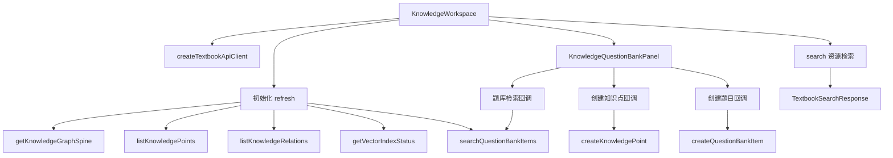

> 知识库工作区和题库面板承载检索结果、知识问题和资源交互。

# 前端知识库工作区与题库

知识库工作区由 `KnowledgeWorkspace` 负责页面级状态、数据加载、资源检索、知识点与题目创建，以及知识图谱的交互渲染；`KnowledgeQuestionBankPanel` 负责知识点摘要、知识关系和题库列表的展示，并通过受控表单将用户操作回传给工作区。

页面承载三类主要交互：

- 知识图谱主干浏览
- 教材资源检索
- 知识点与题库的创建、检索和分页浏览

## 模块职责

### `KnowledgeWorkspace`

文件：`frontend/src/app/knowledge/KnowledgeWorkspace.tsx`

该组件是页面容器，接收一个由 `createTextbookApiClient` 创建的 API 客户端：

```ts
type KnowledgeWorkspaceProps = {
  api: TextbookApiClient;
};
```

它负责：

- 获取知识图谱主干节点和边
- 获取知识点、知识关系、向量索引状态
- 获取题库数据
- 发起教材资源检索
- 创建知识点
- 创建题库题目
- 保存页面级加载、保存、搜索和错误状态
- 管理知识图谱的布局模拟、缩放、平移、拖拽和悬停高亮
- 将状态和事件处理器传递给题库面板

知识图谱中的节点按 `MODULE`、`TOPIC`、`METHOD` 三类处理。模块节点使用循环分配的颜色，知识点和方法使用固定颜色；只有参与关系连接的节点以及模块节点会进入最终渲染集合。

### `KnowledgeQuestionBankPanel`

文件：`frontend/src/app/components/KnowledgeQuestionBankPanel.tsx`

该组件是展示与表单面板，本身不直接访问 API。它通过 props 接收数据、输入值、分页状态和回调函数，负责：

- 展示主干知识点
- 展示知识点之间的主干关系
- 创建知识点的表单
- 创建题目的表单
- 题库关键词检索表单
- 题库结果摘要和空状态
- 题目详情展开
- 题库分页和每页数量控制

面板优先显示 `sourceSummary` 中包含“主干”的知识点；如果没有主干标记，则回退到全部知识点。展示的知识点最多 8 个，关系最多 6 条，并且只保留两端都在当前展示集合中的关系。

## 页面调用链



初始化时，`refresh` 使用 `Promise.all` 并行读取五类数据：

1. 知识图谱主干
2. 知识点列表
3. 知识关系列表
4. 向量索引状态
5. 当前题库查询对应的题目列表

所有请求成功后，结果分别写入页面状态。任一请求失败时，页面会清空图谱、知识点、关系、题目、向量状态和已有资源检索结果，再将错误转换为用户可见文本。这样可以避免认证失效或受保护请求失败时继续展示旧数据。

`KnowledgeQuestionBankPanel` 通过回调把表单提交交回 `KnowledgeWorkspace`，由工作区执行 API 调用并更新本地列表。

## 关键状态

### 数据状态

- `graph`：知识图谱响应，包含节点和边。
- `knowledgePoints`：知识点列表。
- `knowledgeRelations`：知识点关系列表。
- `questions`：题库题目列表。
- `vectorStatus`：向量索引状态。
- `searchResult`：最近一次教材资源检索结果。

图谱为空时，节点和边分别回退为空数组。图谱渲染只使用实际存在于响应中的节点和边。

### 输入状态

- `query`：教材资源检索词。
- `questionQuery`：题库检索词。
- `pointName`：新知识点名称。
- `chapterPath`：知识点章节路径。
- `questionTitle`：新题目标题。
- `questionText`：新题目正文。
- `retrievalMode`：教材检索模式，支持 `hybrid`、`text_bge`、`formula_bge`、`image_clip`。

教材资源检索要求 `query.trim()` 非空；题库检索允许空查询，此时用于浏览最近题目。

### 操作状态

- `loading`：初始化刷新或题库检索期间的加载状态。
- `searching`：教材资源检索期间的加载状态。
- `saving`：创建知识点或题目期间的保存状态。
- `error`：当前页面错误信息。
- `graphReady`：图谱布局模拟是否完成。

题库面板接收的 `loadingQuestions` 对应工作区的加载状态，因此题库检索期间会显示“正在读取题库”。

### 图谱交互状态

- `hoveredId`：当前悬停节点。
- `zoom`：缩放比例，范围限制为 `0.2` 到 `4`。
- `pan`：画布平移偏移量。
- `dragging`：当前拖拽节点及其鼠标位置。
- `simNodesRef`：知识图谱模拟节点的可变位置数据。
- `simFrameRef`：布局动画帧引用。

图谱使用最多 200 次 `requestAnimationFrame` 迭代完成一个简单力导向布局。布局包含中心吸引、节点排斥和边长约束。布局结束后设置 `graphReady`，再计算边的端点位置。

节点拖拽直接修改模拟节点的位置；画布平移只在鼠标按下目标为 SVG 根元素时启动。悬停节点会计算关联边和邻居节点，用于界面高亮。

## 知识点与题目创建

### 创建知识点

提交前要求知识点名称和章节路径均非空。请求使用去除首尾空白后的值，并固定写入：

```ts
{
  permissionScope: "MATH_VIP",
  sourceSummary: "前端创建"
}
```

创建成功后，新知识点被插入当前列表头部，并清空知识点名称和章节路径输入框。

### 创建题目

提交前要求题目标题和题干均非空。当前前端固定提交：

```ts
{
  answerJson: "{}",
  difficulty: "medium",
  permissionScope: "MATH_VIP",
  knowledgePointIds: knowledgePoints
    .slice(0, 1)
    .map((point) => point.knowledgePointId)
}
```

因此新题目最多关联当前知识点列表中的第一个知识点。创建成功后，题目插入列表头部，并清空标题和题干输入框。

这也是当前创建能力的明确边界：难度、权限范围、答案结构和知识点关联策略尚未在页面中开放为用户可配置项。

## 资源检索与题库检索

### 教材资源检索

资源检索使用：

```ts
api.search({
  query: query.trim(),
  limit: 8,
  retrievalMode,
});
```

每次检索最多请求 8 条结果，并保留检索模式。检索失败时只更新错误状态，不会主动清空已有的 `searchResult`，因此需要由上层界面决定是否继续展示上一次结果。

### 题库检索

题库检索使用：

```ts
api.searchQuestionBankItems(
  questionQuery.trim(),
  QUESTION_BANK_MAX_SEARCH_ROWS,
);
```

题库请求结果先完整写入 `questions`，面板再在前端执行分页。题库查询为空时，界面显示最近题目；非空时显示关键词摘要。

题目展示包括：

- 清理后的题目标题
- 权限范围
- 难度
- 题干摘要
- 可展开的完整题干

如果标题清理后没有有效内容，面板会尝试从题干生成显示标题；仍无法得到有效标题时显示“未命名题目”。

## 题库分页边界

每页数量在面板中被限制为 5 到 30：

```ts
const normalizedPageSize = Math.max(
  5,
  Math.min(30, questionPageSize || 10),
);
```

页数至少为 1，当前页也会被限制在有效页码范围内。分页只作用于已经加载到前端的 `questions` 数组，不会因为翻页再次调用后端。

因此，`QUESTION_BANK_MAX_SEARCH_ROWS` 决定了当前页面可浏览的题目上限；当题库规模超过该上限时，页面分页不能替代后端分页。

## 知识图谱展示边界

图谱展示前会过滤节点：

- 参与至少一条边连接的节点会保留
- 所有 `MODULE` 节点会保留
- 没有关系且不是模块的孤立节点会被隐藏

布局只对过滤后的节点和两端都存在的边执行。节点颜色按模块名称分配，模块颜色表循环使用，模块数量超过预设颜色数量时会复用颜色。

图谱交互属于前端临时视图状态：

- 拖拽节点位置不会回写后端
- 缩放范围固定为 `0.2` 到 `4`
- 平移和缩放不会改变知识图谱数据
- 图谱数据变化后会取消旧动画并重新初始化布局

## 错误、空数据与权限表现

页面区分加载中的真实数据和空数据：

- 初始化或检索失败时显示错误状态
- 题库加载中显示读取提示
- 题库为空且有关键词时显示“没有匹配题目”
- 题库为空且无关键词时显示尚未入库提示
- 没有可展示的主干关系时显示关系空状态

知识点和题目创建使用统一的 `saving` 状态，因此两个创建表单共享保存期间的禁用行为。创建请求中的 `permissionScope` 固定为 `MATH_VIP`，后端仍是最终权限校验边界；前端展示的权限标签来自后端返回的数据。

## 扩展点

### API 合同扩展

`KnowledgeWorkspace` 依赖 `textbookApi` 导出的响应类型和客户端方法。增加新的资源类型或检索能力时，应优先扩展该 API 合同，再由工作区接入状态和交互。

当前页面已经通过 `retrievalMode` 保留了多种检索模式入口，后续可以在不改变资源检索调用结构的情况下增加模式选项或模式说明。

### 题库分页扩展

当前题库分页为前端分页。题库规模扩大后，可将页码、页大小和总数下沉到 API 响应，并让 `onQuestionPageChange` 触发后端分页请求，避免一次性加载 `QUESTION_BANK_MAX_SEARCH_ROWS` 条数据。

### 创建表单扩展

题目创建可以进一步开放：

- 难度选择
- 答案内容
- 权限范围
- 多知识点关联
- 题型或来源信息

这些字段应同时扩展请求类型、表单状态和后端校验，不能仅在前端增加展示字段。

### 图谱布局扩展

当前布局算法在组件内维护，适合有限规模的主干图谱。节点数量或关系数量增长后，可以将布局计算拆为独立模块，或替换为专用图布局实现，并继续保留现有的节点过滤、悬停邻居计算和交互状态边界。

Sources: [frontend/src/app/knowledge/KnowledgeWorkspace.tsx](frontend/src/app/knowledge/KnowledgeWorkspace.tsx#L1-L260), [frontend/src/app/knowledge/KnowledgeWorkspace.tsx](frontend/src/app/knowledge/KnowledgeWorkspace.tsx#L187-L620), [frontend/src/app/components/KnowledgeQuestionBankPanel.tsx](frontend/src/app/components/KnowledgeQuestionBankPanel.tsx#L1-L315), [frontend/src/app/components/KnowledgeQuestionBankPanel.tsx](frontend/src/app/components/KnowledgeQuestionBankPanel.tsx#L174-L315)
