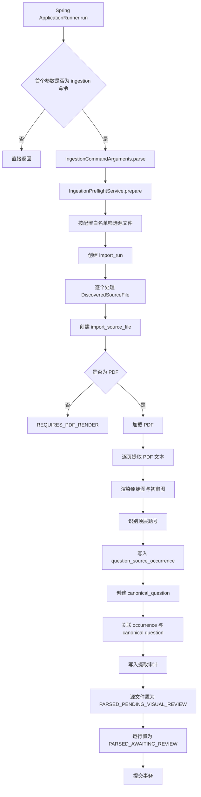
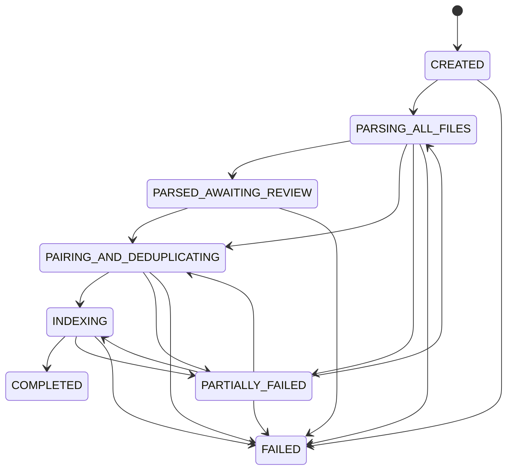

> IngestionBatchRunner 负责批量导入、进度维护、状态转换以及题目和证据的发布主链路。

# 摄取批处理主流程

`IngestionBatchRunner` 是 Java 摄取模块的一次性批处理入口，负责在显式命令触发后发现输入文件、建立导入运行记录、解析 PDF 页面、生成题目候选及页面证据，并将结果以可恢复的状态写入数据库。

它并不在普通 Web Server 启动时自动执行。只有 Spring 收到 `ingestion` 命令且第一个源参数匹配 `IngestionCommandArguments.COMMAND` 时，才会进入批处理逻辑。这样可以避免容器重启或挂载目录变化导致资料被意外重复导入。

## 模块职责

主流程集中在 `IngestionBatchRunner`，其职责边界包括：

- 解析命令行参数并判断是否执行批处理。
- 调用预检服务发现输入文件，并应用配置中的文件白名单。
- 创建 `import_run` 运行记录。
- 为每个输入文件创建 `import_source_file` 记录。
- 对 PDF 按页提取文本。
- 渲染原始页面图和低成本初审 JPEG。
- 根据文本层中的顶层题号生成题目来源出现记录。
- 创建可检索的规范题目文本记录。
- 将来源出现与规范题目关联。
- 写入系统规则审计记录。
- 在事务中完成整次 durable parse pass，并将运行状态置为等待审核。

Runner 直接依赖 `DataSource`、`ObjectMapper` 和 `IngestionProperties`，并在内部组合：

- `IngestionPreflightService`：输入预检和源文件发现。
- `PdfEvidencePageRenderer`：页面渲染。
- `VisionPageImageOptimizer`：页面图像优化。

## 调用链



关键节点是：

- `import_run` 是一次批处理的总体记录。
- `import_source_file` 保存每个源文件的发现、解析状态、页数和失败摘要。
- `question_source_occurrence` 保存题目在原始来源中的一次出现，包括页码、区域、指纹和识别内容。
- `canonical_question` 保存规范化后的题目文本，可作为后续检索对象。
- `question_ingestion_audit` 保存系统规则动作及其决策数据。

## 运行事务与进度

`execute` 会为每次执行生成新的 UUID 作为 `runId`，并通过 JDBC 连接关闭自动提交：

1. 插入 `import_run`，初始状态为 `PARSING_ALL_FILES`。
2. 逐个解析预检得到的源文件。
3. 所有文件处理成功后，将运行状态更新为 `PARSED_AWAITING_REVIEW`。
4. 保持验证状态为 `NOT_STARTED`。
5. 提交事务。

任一处理步骤抛出异常时，整个事务回滚，然后将异常继续抛出。文件级的 PDF `IOException` 会先将该源文件标记为 `FAILED`，但由于外层事务随后回滚，这个失败标记是否最终持久化取决于后续错误处理边界；当前代码没有为单文件失败建立独立事务。

初始进度 JSON 只记录已发现文件数和当前候选题目数：

```json
{
  "discoveredFiles": 3,
  "candidateQuestions": 0
}
```

`ImportRunProgress` 定义了面向状态面板的完整计数契约：

- `discoveredFiles`
- `parsedFiles`
- `failedFiles`
- `extractedQuestions`
- `pendingReviewQuestions`
- `pairedQuestions`
- `deduplicatedQuestions`
- `totalTokens`
- `elapsedMilliseconds`

其约束包括：

- 所有计数和耗时必须非负。
- `parsedFiles + failedFiles` 不能超过 `discoveredFiles`。
- `completedFiles()` 等于已解析文件数与失败文件数之和。
- 没有支持的源文件时，完成百分比为 `0`。

当前 `IngestionBatchRunner` 的已读实现主要完成解析阶段，尚未展示这些计数在每个页面或题目处理步骤中的持续更新。

## 源文件处理

源文件首先写入 `import_source_file`，初始状态为 `DISCOVERED`。非 PDF 文件不会直接进入共享 PDF 解析器，而是被标记为：

```text
REQUIRES_PDF_RENDER
```

失败摘要明确指出 DOCX 需要先通过 LibreOffice 转换为 PDF。PDF 文件则经过以下阶段：

```text
DISCOVERED
  -> PARSING
  -> PARSED_PENDING_VISUAL_REVIEW
```

PDF 加载后，Runner 获取总页数并逐页处理。每页会：

1. 使用 `PDFTextStripper` 提取该页文本。
2. 读取页面 `MediaBox`。
3. 渲染原始 PNG。
4. 生成初审 JPEG。
5. 从文本行中识别题号并持久化候选。

证据文件按运行、源文件哈希和页码组织：

```text
<evidenceRoot>/runs/<runId>/<sourceSha256>/
  page-<page>.png
  page-<page>-initial-review.jpg
```

原始图和初审图都会写入题目候选的内容 JSON，但低成本初审流程只适合发送优化后的 JPEG。两种图像仍然属于同一页证据。

## 题目候选与规范题目

页面文本按行扫描，通过 `QuestionNumberDetector.topLevelNumber` 识别顶层题号。单页内使用集合去重，因此相同打印题号由多个 PDF 文本层片段重复产生时，只创建一个来源候选。

候选文本从题号所在行开始，持续拼接到下一个顶层题号出现之前的文本行。随后使用整页 PDF MediaBox 生成暂时区域：

```json
{
  "x1": 0,
  "y1": 0,
  "x2": 0,
  "y2": 0,
  "coordinateSpace": "PDF_MEDIA_BOX"
}
```

区域状态被标记为：

```text
PENDING_VISUAL_REVIEW
```

这意味着文本层可以证明页面上存在题号和文本候选，但不能证明：

- 题目所在的列级裁剪范围。
- 图表是否属于该题。
- 题目是否跨页延续。
- 哪些内容属于答案。
- 当前候选是否满足公开发布条件。

来源出现记录写入后，Runner 才创建 `canonical_question`。这一顺序保证规范题目始终引用一个持久化的、来源范围明确的 occurrence；如果后续视觉审核否定裁剪结果，规范记录仍可以从来源出现重新建立。

规范题目的当前写入特征是：

- `paper_type` 固定为 `GAOKAO`。
- 内容以文本 block 保存。
- 提取方式为 `PDF_TEXT_LAYER`。
- 公式结构暂不推断，`formula_canonical_json` 写入空数组。
- 公式文本保持原样，状态为 `VERBATIM_PENDING_STRUCTURED_PARSE`。
- 存储状态使用 `AUTO_APPROVED_TEXT_FORMULA`。
- 展示引用格式为“文件名 第 X 页 第 Y 题”。

这里的“自动批准”仅表示非空文本和公式候选可以作为规范存储记录保存和检索，并不代表视觉区域、答案、图像资产或公开发布已经批准。

## 状态模型

### 导入运行状态

`ImportRunState` 对整个导入运行提供可恢复状态机：



状态转换只允许向前推进，或从活动阶段进入失败状态。`COMPLETED` 和 `FAILED` 都是终态，不能再次转换。`PARTIALLY_FAILED` 可以回到解析、配对去重或索引阶段，为检查点恢复保留入口。

当前 Runner 在 durable parse pass 成功后进入 `PARSED_AWAITING_REVIEW`，而不是直接进入 `COMPLETED`。后续配对、去重、索引和公开发布需要经过独立阶段。

### 验证状态

`ImportVerificationState` 与运行状态并列存在，二者语义不混合：

```text
NOT_STARTED
  -> RULE_CHECKING
  -> GOLDEN_COMPARING
  -> AI_REVIEWING
  -> VERIFIED
```

也可以进入：

```text
VERIFICATION_FAILED
```

因此，解析完成不等于内容已经验证，更不等于已经公开。当前解析完成时验证状态仍为 `NOT_STARTED`，运行状态说明中也明确指出视觉区域、Golden 比较和人工批准仍未完成。

## 发布主链路的边界

当前实现已经建立了题目和证据的持久化基础，但公开发布仍受多重门禁约束：

- 文本候选可以自动写入规范题目表。
- 来源区域默认保持 `PENDING_VISUAL_REVIEW`。
- `answerApproved` 为 `false`。
- `visualAssetsApproved` 为 `false`。
- 运行状态停留在 `PARSED_AWAITING_REVIEW`。
- 验证状态停留在 `NOT_STARTED`。

因此，Runner 的职责是构造“可审核、可恢复、可继续处理”的候选数据，而不是绕过审核直接发布。`DeduplicationDecisionGate`、`QuestionPublicationGate`、`IngestionReviewQueueService` 以及 `ImportVerificationState` 所代表的后续边界，负责把候选推进到配对、去重、验证和发布阶段。

## 边界条件

### 命令未触发

当没有源参数，或第一个参数不是预期摄取命令时，`run` 直接返回，不创建运行记录。

### 配置源文件缺失

当配置指定了文件白名单时，Runner 只处理匹配文件。若任一配置文件名未在挂载目录中发现，则抛出异常并拒绝启动该次摄取：

```text
Configured ingestion source files are missing: [...]
```

### 空文件白名单

如果没有配置选择性文件名，则使用预检服务发现的全部文件，并重新构造对应的 `ImportRunProgress`。

### 非 PDF 输入

非 PDF 文件被记录为 `REQUIRES_PDF_RENDER`，不会被 `Loader.loadPDF` 处理。DOCX 转 PDF 是进入共享 PDF 解析器的前置边界。

### 空文本或无题号页面

只有识别到顶层题号的页面文本才会产生候选。没有题号的行、重复题号或没有可识别题号的页面不会写入来源出现记录。

### 重复题号

同一页内通过 `HashSet` 避免同一顶层题号因文本层碎片重复生成多个候选。跨页、跨文件或内容级重复则需要后续身份指纹和去重阶段处理。

### 页面区域不可信

文本提取阶段使用整页 MediaBox 作为暂时区域，并显式要求视觉审核。该区域不是最终题目裁剪结果。

### 数据库回滚

整次执行使用一个数据库事务。解析或写入过程出现异常时回滚全部数据库变更，外部已经生成的页面图像文件则不受该数据库回滚控制，后续恢复逻辑需要考虑文件系统证据与数据库记录之间的协调。

## 扩展点

- **输入扩展**：在 `IngestionSourceFileDiscoverer` 和 `IngestionPreflightService` 中扩展文件发现、媒体类型识别和预检规则。
- **格式转换**：为 `REQUIRES_PDF_RENDER` 增加 DOCX 转 PDF 执行器，使非 PDF 文件能够进入统一页面解析链路。
- **页面证据**：替换或扩展 `PdfEvidencePageRenderer`、`VisionPageImageOptimizer`，支持不同渲染分辨率、图像格式或审查成本策略。
- **题号识别**：扩展 `QuestionNumberDetector`，处理更多题号样式、章节结构和跨页题目。
- **区域解析**：在文本候选之后接入视觉区域检测和布局解析，将整页暂存区域替换为可信题目区域。
- **公式处理**：在 `TextFormulaCandidateApproval` 与 `FormulaCanonicalizer` 之后接入结构化公式解析，填充规范公式字段。
- **身份与去重**：使用 `QuestionOccurrenceIdentity`、`DeduplicationDecisionGate` 和相关决策模型完成跨来源重复判定。
- **人工审核**：通过 `IngestionReviewQueueService`、审核控制器和审核决策请求承接视觉、答案和发布审核。
- **发布控制**：由 `QuestionPublicationGate` 结合验证结果、视觉审核和去重决策决定是否允许进入公开知识库。
- **进度维护**：将 `ImportRunProgress` 的结构化计数与页面、文件、审核和索引阶段的持久化更新连接起来，避免状态面板只显示初始发现数。

Sources: [IngestionBatchRunner.java](backend-java/src/main/java/com/doob/mathagent/ingestion/IngestionBatchRunner.java#L1-L280)  
Sources: [ImportRunProgress.java](backend-java/src/main/java/com/doob/mathagent/ingestion/ImportRunProgress.java#L1-L41)  
Sources: [ImportRunState.java](backend-java/src/main/java/com/doob/mathagent/ingestion/ImportRunState.java#L1-L35)  
Sources: [ImportVerificationState.java](backend-java/src/main/java/com/doob/mathagent/ingestion/ImportVerificationState.java#L1-L33)
