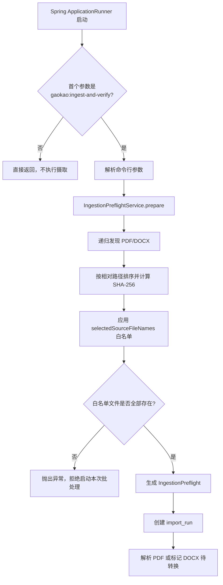

> 命令行参数、Spring 配置属性和预检服务定义摄取任务的配置边界及启动前检查。

# 输入参数、属性与预检

摄取入口由三层配置边界组成：

1. `IngestionCommandArguments` 定义一次命令行运行的显式参数合同。
2. `IngestionProperties` 定义 Spring 配置中的输入目录、证据目录、图像初审参数和源文件白名单。
3. `IngestionPreflightService` 在创建数据库运行记录、渲染页面或调用模型前，完成本地文件发现并初始化进度。

`IngestionBatchRunner` 将三者串联起来：只有检测到指定的批处理命令时才执行摄取；命令参数解析完成后先进行预检，再按配置白名单限制文件，最后创建持久化运行记录并进入解析阶段。



图中的关键边界是：普通 Spring Web 启动不会触发摄取，命令行合同也不会与 Spring Web 或服务器启动参数耦合。预检只执行本地、确定性的输入检查；模型调用、页面渲染和数据库运行记录创建均发生在预检之后。

## 命令行参数

命令名固定为：

```text
gaokao:ingest-and-verify
```

参数解析接受两种形式：

```text
--input /app/data/gaokao-input --paper-type GAOKAO_2024 --model gpt-5.6-luna
```

或：

```text
--input=/app/data/gaokao-input --paper-type=GAOKAO_2024 --model=gpt-5.6-luna
```

解析结果是不可变记录 `IngestionCommandArguments`，包含：

| 参数 | 必填 | 作用 |
|---|---:|---|
| `--input` | 是 | 本次运行使用的输入根目录 |
| `--paper-type` | 是 | 转换为 `PaperType` 枚举，比较时使用大写形式 |
| `--model` | 否 | 请求使用的模型名称 |

命令名缺失或不匹配时，解析失败。`--input` 和 `--paper-type` 为空、缺失时也会失败；选项值会去除首尾空白，空白值按未提供处理。

参数解析器只接受长选项，并拒绝以下情况：

- 出现不以 `--` 开头的 token；
- 选项缺少值；
- 同一个选项重复出现；
- `paper-type` 无法映射到 `PaperType`；
- 命令不是 `gaokao:ingest-and-verify`。

`--model` 未提供时，不在命令参数记录中填充默认值，而是在创建 `import_run` 时使用 `gpt-5.6-luna`。这使得命令参数解析和持久化运行配置之间保持清晰边界。

`IngestionBatchRunner` 实现 `ApplicationRunner`，读取 Spring 的 `ApplicationArguments`，仅当第一个 source argument 是指定命令时调用解析和执行逻辑。因此，容器重启或普通服务启动不会因为挂载了资料目录而自动导入文件。

## Spring 配置属性

`IngestionConfiguration` 通过 `@EnableConfigurationProperties` 注册 `IngestionProperties`，属性前缀为：

```yaml
math-agent:
  ingestion:
    input-root: /app/data/gaokao-input
    evidence-root: /app/data/math-paper-corpus
    initial-review-max-long-edge-pixels: 960
    initial-review-jpeg-quality: 0.82
    selected-source-file-names: []
```

属性职责如下：

| 属性 | 默认值 | 约束与用途 |
|---|---|---|
| `inputRoot` | `/app/data/gaokao-input` | 输入资料根目录，不能为空 |
| `evidenceRoot` | `/app/data/math-paper-corpus` | 页面证据及派生资源的持久化目标目录，不能为空 |
| `initialReviewMaxLongEdgePixels` | `960` | 初审 JPEG 的最长边像素，必须大于 `0` |
| `initialReviewJpegQuality` | `0.82` | 初审 JPEG 质量，必须大于 `0` 且不超过 `1` |
| `selectedSourceFileNames` | 空列表 | 可选的源文件名白名单，空列表表示不额外筛选 |

路径属性通过 setter 进行非空校验并去除首尾空白，避免空配置被解释为当前工作目录。配置类不从 `GAOKAO`、`INPUT` 等进程环境变量派生路径，输入和证据目录需要在配置文件中明确声明，以保持批处理可复现。

`selectedSourceFileNames` 的配置值会清理掉空元素和空白名称。白名单匹配使用发现文件的基础文件名，而不是完整相对路径；因此同一目录树中存在同名文件时，名称白名单可能选中多个匹配项，这是当前实现的文件选择语义。

## 预检服务与结果

`IngestionPreflightService` 依赖 `IngestionSourceFileDiscoverer`，通过构造器强制要求发现器非空。其 `prepare` 方法：

1. 校验命令参数对象非空；
2. 将 `arguments.inputRoot()` 转换为 `Path`；
3. 调用发现器递归扫描输入目录；
4. 生成 `IngestionPreflight`；
5. 将所有导入进度计数初始化为零，文件总数设置为发现文件数。

`IngestionPreflight` 是不可变结果，保存：

- 原始的 `IngestionCommandArguments`；
- 已发现的 `DiscoveredSourceFile` 列表；
- 初始的 `ImportRunProgress`。

文件列表在记录构造时通过 `List.copyOf` 复制，防止预检结果被外部修改。预检明确发生在数据库运行记录创建前，因此空目录会表现为零输入结果，而不是被误记为一次成功的解析任务。

## 文件发现边界

`IngestionSourceFileDiscoverer` 只依据扩展名识别支持的源文件：

- `.pdf` 映射为 `application/pdf`；
- `.docx` 映射为对应的 Office Open XML MIME 类型；
- 其它文件被忽略。

输入根目录必须是现有目录，否则抛出异常。发现过程递归遍历目录，只保留普通文件，并按相对于输入根目录的路径排序，保证相同输入在不同运行中的处理顺序稳定。

每个支持的文件都会以流式方式计算 SHA-256：

- 文件不会整体加载到堆内存；
- 摘要保存在 `DiscoveredSourceFile` 中；
- 文件读取或哈希失败会抛出包含原始路径的发现异常；
- 失败不会被转换成部分成功的发现结果。

因此，预检的输入边界同时包含目录存在性、扩展名筛选、稳定排序和内容指纹。当前证据显示，哈希用于后续检查点或完成状态识别，但本页面涉及的预检阶段只负责生成并携带该指纹。

## 白名单限制与启动前失败

完成基础发现后，`IngestionBatchRunner` 调用 `restrictToConfiguredSources`：

- 白名单为空：保留全部已发现文件；
- 白名单非空：只保留基础文件名命中的文件；
- 任意配置文件名在发现结果中不存在：立即抛出异常；
- 不会静默忽略缺失的显式配置项。

白名单缺失时的失败关闭行为是重要的启动前检查。它防止挂载目录变化、文件名拼写错误或资料不完整时创建一个看似正常但实际缺少输入的导入运行。

白名单筛选成功后，会重新构造 `IngestionPreflight`，并将进度中的文件总数改为筛选后的数量。后续创建的 `import_run` 使用这个筛选结果，并将：

- `paper_type` 设置为命令参数中的论文类型；
- `requested_model` 设置为命令提供的模型，或默认模型 `gpt-5.6-luna`；
- `input_root` 设置为命令参数中的输入目录；
- `evidence_path` 设置为 Spring 属性中的证据目录；
- 初始状态设置为 `PARSING_ALL_FILES`；
- 初始验证状态设置为 `NOT_STARTED`。

## 调用链与状态边界

完整调用链为：

```text
ApplicationRunner.run
  -> IngestionCommandArguments.parse
  -> IngestionPreflightService.prepare
       -> IngestionSourceFileDiscoverer.discover
  -> IngestionBatchRunner.restrictToConfiguredSources
  -> insertRun
  -> parseSource
```

预检阶段不创建数据库记录，也不发起模型请求。预检通过后才创建 `import_run`，并在同一个数据库事务中处理源文件。

源文件进入解析时：

- PDF 直接使用 PDF 解析器处理；
- DOCX 不在该阶段直接解析，而是被标记为 `REQUIRES_PDF_RENDER`，要求先经过 LibreOffice 转换为 PDF；
- 所有源文件解析完成后，运行状态变为 `PARSED_AWAITING_REVIEW`；
- 验证状态仍为 `NOT_STARTED`；
- 事务提交前发生异常时回滚数据库事务。

这里将“运行是否完成解析”和“内容是否完成验证”拆成两个状态维度。解析成功不代表页面区域、Golden 比对或人工审核已经完成，后续流程需要依据独立的验证状态继续推进。

## 主要文件

- [IngestionCommandArguments.java](backend-java/src/main/java/com/doob/mathagent/ingestion/IngestionCommandArguments.java#L8-L80)：定义命令名称、选项解析、必填校验和 `PaperType` 转换。
- [IngestionProperties.java](backend-java/src/main/java/com/doob/mathagent/ingestion/IngestionProperties.java#L7-L71)：定义 Spring 配置属性、默认值及数值和路径约束。
- [IngestionConfiguration.java](backend-java/src/main/java/com/doob/mathagent/ingestion/IngestionConfiguration.java#L3-L9)：注册 `math-agent.ingestion` 配置属性。
- [IngestionPreflightService.java](backend-java/src/main/java/com/doob/mathagent/ingestion/IngestionPreflightService.java#L7-L28)：执行数据库写入和模型调用前的本地预检。
- [IngestionPreflight.java](backend-java/src/main/java/com/doob/mathagent/ingestion/IngestionPreflight.java#L5-L16)：封装命令参数、发现文件和零起始进度。
- [IngestionSourceFileDiscoverer.java](backend-java/src/main/java/com/doob/mathagent/ingestion/IngestionSourceFileDiscoverer.java#L14-L99)：递归发现 PDF/DOCX、排序并计算文件哈希。
- [IngestionBatchRunner.java](backend-java/src/main/java/com/doob/mathagent/ingestion/IngestionBatchRunner.java#L29-L119)：控制命令触发、预检、白名单限制和导入运行记录创建。

## 边界条件与扩展点

当前实现的关键边界包括：

- 没有批处理命令时直接返回；
- 输入目录不存在或不是目录时失败；
- 空目录可以形成零输入预检结果，但不会凭空产生成功的解析结果；
- 不支持的文件类型被忽略；
- 支持文件无法读取或哈希失败时，预检整体失败；
- 配置白名单中的文件缺失时失败关闭；
- DOCX 需要先转换为 PDF；
- 解析完成后的状态仍等待视觉审核和后续验证。

扩展命令参数时，应继续在 `IngestionCommandArguments` 中维护显式解析合同，并同步调整持久化运行记录或调用方，而不应把领域参数隐含到 Spring Web 启动参数中。扩展文件类型时，应在 `IngestionSourceFileDiscoverer` 中增加明确的扩展名到媒体类型映射，并定义该类型进入共享解析链路前是否需要转换。扩展预检检查时，可在 `IngestionPreflightService` 中增加确定性的本地校验，同时保持其位于数据库写入、页面渲染和远程模型请求之前。

Sources: [IngestionCommandArguments.java](backend-java/src/main/java/com/doob/mathagent/ingestion/IngestionCommandArguments.java#L1-L81), [IngestionProperties.java](backend-java/src/main/java/com/doob/mathagent/ingestion/IngestionProperties.java#L1-L72), [IngestionPreflight.java](backend-java/src/main/java/com/doob/mathagent/ingestion/IngestionPreflight.java#L1-L17), [IngestionPreflightService.java](backend-java/src/main/java/com/doob/mathagent/ingestion/IngestionPreflightService.java#L1-L29), [IngestionSourceFileDiscoverer.java](backend-java/src/main/java/com/doob/mathagent/ingestion/IngestionSourceFileDiscoverer.java#L1-L100), [IngestionConfiguration.java](backend-java/src/main/java/com/doob/mathagent/ingestion/IngestionConfiguration.java#L1-L10), [IngestionBatchRunner.java](backend-java/src/main/java/com/doob/mathagent/ingestion/IngestionBatchRunner.java#L1-L130)
