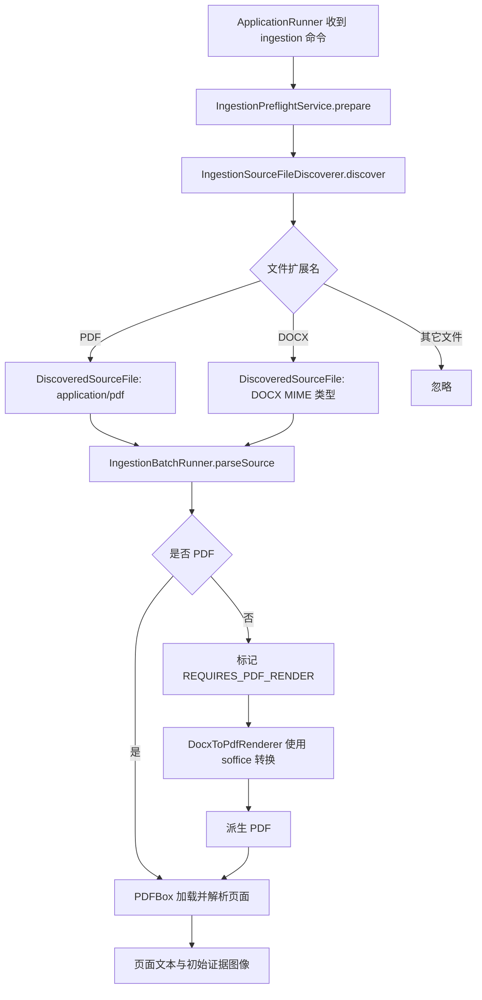

> 源文件发现器定位输入资料，DocxToPdfRenderer 将 DOCX 转换为 PDF 以进入后续页面证据处理。

# 源文件发现与 DOCX/PDF 转换

本页面覆盖摄取流程的输入边界：`IngestionSourceFileDiscoverer` 负责从输入目录中发现可处理的 PDF 和 DOCX 文件，并为每个文件计算稳定的 SHA-256 标识；`DocxToPdfRenderer` 负责在 Linux 部署环境中将 DOCX 转换为 PDF，使其能够复用后续的 PDF 页面解析与证据处理链路。

## 模块职责

### 源文件发现器

`IngestionSourceFileDiscoverer` 接收一次摄取任务指定的输入根目录，递归遍历其中的普通文件，并仅识别扩展名为 `.pdf` 或 `.docx` 的文件。

发现结果以不可变记录 `DiscoveredSourceFile` 表示，包含：

- `path`：规范化后的绝对路径，用于实际读取文件；
- `fileName`：基础文件名，用于进度展示和配置筛选；
- `mediaType`：根据扩展名确定的固定 MIME 类型；
- `sha256`：文件内容的 SHA-256 十六进制摘要，用作持久化幂等身份和后续证据目录的一部分。

扩展名匹配使用 `Locale.ROOT` 转为小写，因此 `.PDF` 和 `.DOCX` 也可被识别。文件类型不依赖操作系统的 MIME 探测，避免不同平台的探测结果影响检查点和重复运行行为。

发现结果按输入根目录的相对路径排序，保证同一目录内容在不同运行中的处理顺序可复现。摘要计算采用 8192 字节缓冲区流式读取，不会将大型文档一次性加载到堆内存。

### DOCX 转 PDF

`DocxToPdfRenderer` 使用部署环境中的 `soffice` 执行无界面转换，固定命令参数为：

```text
soffice --headless --convert-to pdf:writer_pdf_Export --outdir <outputDirectory> <sourceDocx>
```

转换前会检查源路径是否为现有的 `.docx` 普通文件，并创建输出目录。转换过程有 90 秒超时限制：

- 超时后强制销毁进程并抛出 `IOException`；
- 当前线程被中断时恢复中断标志，并将中断转换为 `IOException`；
- `soffice` 退出码非零，或预期 PDF 不存在时，转换视为失败；
- 源 DOCX 不会被修改；
- 输出文件名仅移除源文件名最后一个扩展名，因此文件名中的前置点号和其它点号会被保留。

该组件返回输出目录中与 DOCX 基础文件名对应的确切 PDF 路径。转换后的 PDF 可进入与原生 PDF 相同的页面文本提取、页面图像渲染和后续证据处理流程。

## 调用链



关键节点含义如下：

- `IngestionPreflightService` 在创建数据库运行记录或发起模型调用之前执行本地输入检查。
- `IngestionSourceFileDiscoverer` 返回确定性排序且带内容摘要的输入列表。
- `IngestionBatchRunner` 对发现结果应用可选的配置白名单，然后逐个创建源文件记录。
- 在已读的 `parseSource` 证据中，原生 PDF 直接由 PDFBox 读取；非 PDF 文件被标记为 `REQUIRES_PDF_RENDER`，并明确记录需要先通过 LibreOffice 转换。
- `DocxToPdfRenderer` 的转换入口和 PDF 输出校验已由独立组件定义；给出的 `IngestionBatchRunner` 代码片段展示了 DOCX 的待转换状态和共享 PDF 解析目标，但未展示实际调用 `render` 的编排代码。

## 关键状态

### 发现阶段

输入根目录必须满足以下条件：

- 路径非空；
- 路径指向现有目录；
- 目录能够被递归读取。

否则发现器抛出 `IllegalArgumentException`。遍历或计算摘要失败会传播 `IOException`；单个候选文件摘要失败时会包装为包含原始路径的 `SourceDiscoveryException`，避免把不完整的发现结果误认为成功。

空目录或目录中没有 PDF/DOCX 时，发现结果为空。预检服务将其视为明确的零输入结果，而不是虚构出一次成功解析运行。

### 源文件处理阶段

`IngestionBatchRunner` 会为每个发现文件创建源文件记录：

- PDF 进入 `PARSING`，读取页数并逐页处理；
- DOCX 在当前证据展示的分支中进入 `REQUIRES_PDF_RENDER`；
- PDF 页面全部处理成功后，源文件状态进入 `PARSED_PENDING_VISUAL_REVIEW`；
- PDF 解析或页面处理发生 `IOException` 时，源文件状态进入 `FAILED`，随后异常继续向上抛出。

整个批次使用数据库事务。所有源文件解析成功后，运行状态更新为 `PARSED_AWAITING_REVIEW`，验证状态保持 `NOT_STARTED`。这表示文本候选已经持久化，但视觉区域确认、Golden 对比和人工批准仍未完成。

### 证据身份

源文件摘要同时承担两个作用：

1. 检测文件内容是否发生变化，防止把已完成的旧文件误认为当前文件；
2. 参与页面证据目录和题目出现身份的构建。

初始页面证据路径按以下结构组织：

```text
<evidenceRoot>/runs/<runId>/<sourceSha256>/
```

页面渲染器生成原始 PNG 和初始审核 JPEG，例如：

```text
page-1.png
page-1-initial-review.jpg
```

因此，运行 ID 区分一次摄取运行，源文件 SHA-256 区分输入内容，页码区分文档内页面。

## 边界条件

- 仅支持 `.pdf` 和 `.docx` 后缀，未识别的文件会被静默忽略。
- 类型判断基于文件名后缀，不验证文件内容是否真的符合对应格式；格式错误会在后续解析或转换阶段暴露。
- 发现器要求输入根目录已存在且为目录，不负责创建输入目录。
- 文件路径被转换为绝对规范化路径；展示层应使用 `fileName`，避免暴露或混淆递归目录中的完整路径。
- 配置的源文件白名单按 `fileName` 匹配，而不是按相对路径或摘要匹配。同名文件存在于不同子目录时，可能同时匹配配置名称；缺失的配置名称会使运行直接失败。
- SHA-256 读取失败会阻止该文件作为成功发现结果返回。
- DOCX 转换依赖运行环境提供名为 `soffice` 的可执行文件。
- 转换输出目录可以不存在，组件会自动创建；输出文件已存在时，具体覆盖行为由 LibreOffice 命令执行环境决定。
- 转换超时固定为 90 秒，未提供调用方级别的超时参数。
- DOCX 转换失败不会产生可供后续 PDF 解析的有效输入，调用方必须处理 `IOException`。
- PDF 页面解析与 DOCX 转换之间的状态边界已经明确为 `REQUIRES_PDF_RENDER`，但已读的批处理片段未展示该状态如何被单独的转换步骤重新推进到 PDF 解析。

## 扩展点

### 增加输入格式

可以扩展 `mediaType(Path)`，为新后缀增加明确的媒体类型，并在批处理编排中增加对应的规范化步骤。新增格式应继续产出具有稳定身份的 `DiscoveredSourceFile`，并在进入页面证据处理前转换为统一的 PDF 或其它受支持中间格式。

### 替换 DOCX 转换器

`DocxToPdfRenderer` 将转换命令集中在 `command` 方法中，便于替换：

- LibreOffice 参数或导出过滤器；
- 容器内可执行文件路径；
- 其它 DOCX 转 PDF 引擎；
- 转换超时和进程终止策略。

替换实现仍应保留输入校验、输出文件存在性检查、超时处理和源文件只读约束。

### 增强身份与筛选

当前稳定身份主要由文件内容摘要构成，展示和白名单筛选则使用基础文件名。若需要严格区分同名文件，可将根目录相对路径纳入配置匹配或持久化身份，同时保持 SHA-256 用于内容变更检测。

### 引入转换缓存

可以基于 DOCX SHA-256 建立派生 PDF 缓存。缓存命中时直接复用已验证的 PDF，缓存未命中时调用转换器。缓存实现需要同时验证派生文件存在、可读，并与源文件摘要及转换配置关联，避免转换参数变化后错误复用旧产物。

### 完善状态编排

当前源码证据已经定义 DOCX 的 `REQUIRES_PDF_RENDER` 状态和 `DocxToPdfRenderer.render` 能力。后续编排可以围绕该状态增加：

- DOCX 转换任务；
- 转换成功后的派生 PDF 记录；
- 转换失败原因和重试次数；
- 从 `REQUIRES_PDF_RENDER` 到 PDF 页面解析状态的明确迁移；
- 转换产物与原始 DOCX 摘要之间的可追溯关联。

Sources: [IngestionSourceFileDiscoverer.java](backend-java/src/main/java/com/doob/mathagent/ingestion/IngestionSourceFileDiscoverer.java#L1-L100)  
Sources: [DiscoveredSourceFile.java](backend-java/src/main/java/com/doob/mathagent/ingestion/DiscoveredSourceFile.java#L1-L10)  
Sources: [DocxToPdfRenderer.java](backend-java/src/main/java/com/doob/mathagent/ingestion/DocxToPdfRenderer.java#L1-L69)  
Sources: [IngestionBatchRunner.java](backend-java/src/main/java/com/doob/mathagent/ingestion/IngestionBatchRunner.java#L1-L280)  
Sources: [IngestionPreflightService.java](backend-java/src/main/java/com/doob/mathagent/ingestion/IngestionPreflightService.java#L1-L29)
