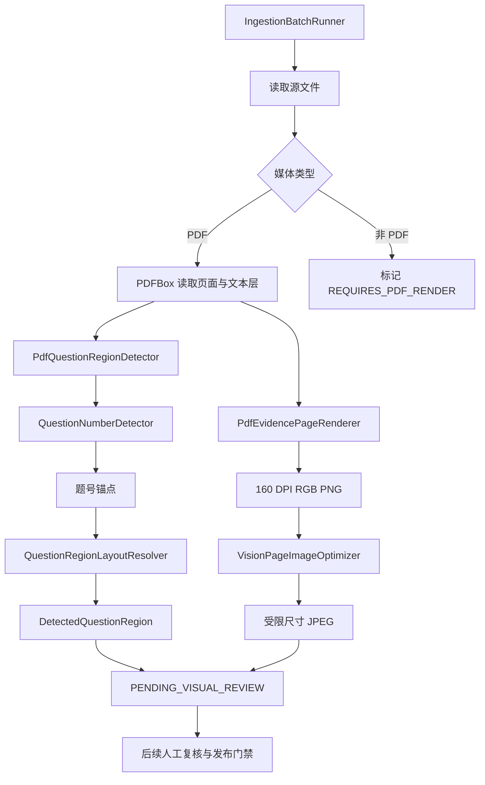

> PDF 页面渲染、图像优化、题号识别和问题区域检测共同从文档中定位可发布题目区域。

# PDF 页面渲染与题目区域检测

PDF 页面处理位于摄取流程的“页面证据”阶段，目标是从源文档中生成可复核的页面图像，并基于 PDF 文本层中的题号锚点推导题目候选区域。该阶段只负责形成候选证据和几何边界，不负责确认题目身份、答案归属、跨页关系或最终发布。

图中的两条分支分别承担不同职责：渲染和优化负责提供视觉证据，文本解析和布局解析负责提供题目区域候选。两者最终都只能支持后续复核，不能单独完成发布决策。

## 模块职责

### `PdfEvidencePageRenderer`

`PdfEvidencePageRenderer` 使用 PDFBox 打开源 PDF，并将指定页面渲染为 RGB PNG：

- 页码采用 one-based 约定，页码小于 `1` 时直接抛出 `IllegalArgumentException`。
- 渲染前检查页码不能超过 PDF 实际页数。
- 目标 DPI 固定为 `160`，用于在题目文字可读性和远程请求大小之间取得平衡。
- 输出目录会自动创建。
- PDF 以只读方式加载，页面通过 `PDFRenderer.renderImageWithDPI` 生成。
- 如果运行环境没有 PNG writer，则抛出 `IOException`。

该组件保留页面级来源关系：每个证据图像对应明确的源 PDF 和页面号，便于复核时追溯。

### `VisionPageImageOptimizer`

`VisionPageImageOptimizer` 生成供视觉模型使用的 JPEG 派生图，同时保留原始 PNG 作为高细节复核来源。

处理步骤为：

1. 校验最长边像素配置必须大于 `0`。
2. 校验 JPEG 质量必须位于 `(0, 1]`。
3. 读取源 PNG；无法读取时抛出 `IOException`。
4. 当源图最长边超过限制时按比例缩放，否则保持原尺寸。
5. 使用双三次插值和高质量渲染提示生成 RGB 图像。
6. 创建输出目录，并通过 ImageIO 的 JPEG writer 写出指定质量的图像。

缩放比例不会大于 `1`，因此该组件只负责压缩或保持尺寸，不会放大页面图像。JPEG writer 不可用时同样会失败，而不是静默生成无效证据。

### `QuestionNumberDetector`

`QuestionNumberDetector` 从文本行开头识别顶层题号，目前支持两类格式：

- 阿拉伯数字题号，例如以 `1.`、`1．`、`1、`1.(2)` 等形式开头的行。
- 中文题号，例如 `第 1 题`，并允许后接中英文冒号。

空行、空白文本和 `null` 返回空结果。检测器明确排除子问题、年份或普通正文等不能作为顶层题目边界的文本。

题号识别只是边界提示，不是题目身份。源码注释明确指出，列布局、跨页关系以及审核决定不能由题号识别单独确定。

### `PdfQuestionRegionDetector`

`PdfQuestionRegionDetector` 面向具有可读文本层的 PDF：

1. 使用 PDFBox 打开文档。
2. 按页面遍历。
3. 获取页面 `MediaBox`，并将页面宽高转换为整数。
4. 为每页创建按位置排序的 `PDFTextStripper`。
5. 在 `writeString` 回调中处理每个文本行。
6. 使用 `QuestionNumberDetector` 判断该行是否以顶层题号开头。
7. 从该行第一个字形的 PDF 坐标提取题号位置。
8. 将坐标限制在页面范围内。
9. 对同一页面重复出现的同一题号只保留首次锚点。
10. 将锚点交给 `QuestionRegionLayoutResolver` 转换为 `DetectedQuestionRegion`。

坐标来自首个字形的实际位置，而不是从提取文本中估算，因此候选区域可以保留与页面几何相关的来源信息。

重复题号通过 `LinkedHashMap` 按题号去重，保留第一次出现的锚点。该规则用于抑制重复文本层、选项标签或 PDF 提取回声，但也意味着同一页同一题号的多个文本层位置不会直接形成多个持久化区域。

### `QuestionRegionLayoutResolver`

布局解析器将题号锚点转换成矩形候选区域。它不会尝试从 PDF 文本层推断精确 OCR 框，而是采用保守边界：

- 页面按宽度中线分为左右两部分。
- 当左右两侧都至少存在 `2` 个锚点时，页面被视为双栏布局。
- 双栏页面分别在左右栏内解析区域。
- 其他情况按单栏处理，所有候选使用整页宽度。
- 同一栏中的锚点按 `y` 坐标、再按 `x` 坐标排序。
- 当前题目区域的顶部为题号纵坐标减去 `16` 个 PDF 点，限制为不小于 `0`。
- 当前题目的底部为下一题锚点纵坐标减去相同 headroom；最后一个区域延伸至页面底部。
- 如果底部不大于顶部，则丢弃该候选，避免产生空区域或反向矩形。
- 双栏结果最终按页面号、区域顶部和区域左边界排序。

`16` 个 PDF 点是针对字形基线的预留空间，用来保留题号所在行，同时尽量避免吞入下一题的首行内容。

## 调用链与状态

`IngestionBatchRunner` 是批处理入口。它只在明确传入摄取命令时执行，普通 Web 服务启动不会自动导入挂载目录。执行时：

- 创建导入运行记录，初始状态为 `PARSING_ALL_FILES`。
- 对预检发现的源文件逐个调用 `parseSource`。
- 非 PDF 文件会被标记为 `REQUIRES_PDF_RENDER`，并等待 DOCX 等源文件先转换为 PDF。
- PDF 文件进入 `PARSING` 状态，并读取页面数量。
- 解析完成后，运行状态变为 `PARSED_AWAITING_REVIEW`，验证状态仍为 `NOT_STARTED`。
- 页面区域和视觉证据仍处于待审核边界，相关候选可标记为 `PENDING_VISUAL_REVIEW`。
- 任一异常会回滚当前数据库事务，而不是提交部分导入结果。

批处理运行器持有页面渲染器和图像优化器，说明它是页面证据处理的流程编排边界；但页面图像如何具体落盘、上传或与候选题目关联，应以运行器未展示的后续实现及其他证据合同为准，不能仅由这几类检测器推断。

## 关键数据与边界

页面区域检测至少围绕以下信息组织：

- 页面号
- 顶层题号
- 题号原始文本行
- 页面坐标中的题号位置
- 候选区域矩形
- 页面布局类型，例如 `SINGLE_COLUMN` 或 `TWO_COLUMN`

该结果是“审核候选”，不是发布记录。文本顺序和坐标无法可靠证明以下事实：

- 扫描图或题目插图是否属于当前题目
- 双栏页面中的完整列边界
- 题目是否跨页延续
- 答案或解析是否属于当前题目
- 题目是否可以公开发布

因此，页面区域检测应与视觉审核、题目身份判定、去重决策和发布门禁保持职责分离。当前批处理说明也明确：非空文本或公式候选可以先形成可检索的规范化记录，但其矩形仍需视觉审核。

## 扩展点

后续扩展可以保持现有边界：

- 在 `QuestionNumberDetector` 中增加更多题号格式时，应继续限制为行首顶层题号，避免把子题号和正文数字误识别为主问题。
- 在 `QuestionRegionLayoutResolver` 中支持三栏或不规则栏布局时，应引入可验证的锚点密度和分栏规则，不能直接把单个异常锚点当作新栏。
- 对扫描 PDF，可在保持现有文本层检测器不变的前提下增加 OCR 锚点来源，并将 OCR 置信度纳入审核候选，而不是直接提升为发布结论。
- 对跨页题目，可在区域模型之上增加跨页关系或审核合并结果；当前解析器只按单页、单栏内相邻题号生成边界。
- 对图文混排题目，可把 PNG 高细节版本和受限尺寸 JPEG 作为不同用途的证据输入：JPEG 面向模型请求，PNG 面向人工复核。
- 对更严格的图像交付要求，可在优化器外围增加输出文件校验、原图与派生图关联以及失败重试，但不应改变其“源 PNG 不变、生成 JPEG 派生物”的职责。

## Sources

Sources: [PdfEvidencePageRenderer.java](backend-java/src/main/java/com/doob/mathagent/ingestion/PdfEvidencePageRenderer.java#L1-L35), [VisionPageImageOptimizer.java](backend-java/src/main/java/com/doob/mathagent/ingestion/VisionPageImageOptimizer.java#L1-L46), [QuestionNumberDetector.java](backend-java/src/main/java/com/doob/mathagent/ingestion/QuestionNumberDetector.java#L1-L33), [PdfQuestionRegionDetector.java](backend-java/src/main/java/com/doob/mathagent/ingestion/PdfQuestionRegionDetector.java#L1-L80), [QuestionRegionLayoutResolver.java](backend-java/src/main/java/com/doob/mathagent/ingestion/QuestionRegionLayoutResolver.java#L1-L59), [IngestionBatchRunner.java](backend-java/src/main/java/com/doob/mathagent/ingestion/IngestionBatchRunner.java#L1-L280)
