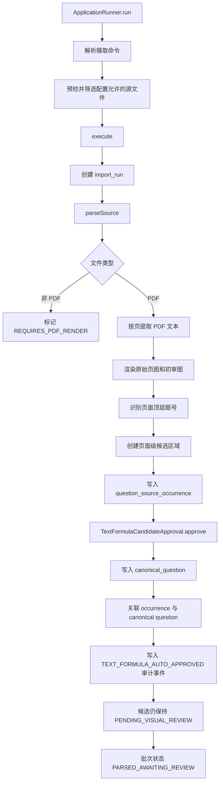

> FormulaCanonicalizer 统一公式表示，TextFormulaCandidateApproval 为文本识别出的公式候选提供审核状态。

# 公式规范化与文本公式审核

## 模块职责

`ingestion` 模块将 PDF 文本层中识别出的题目候选分为两个相互配合但职责不同的处理边界：

- `FormulaCanonicalizer`：对公式字符串进行保守的格式规范化，用于候选比较。
- `TextFormulaCandidateApproval`：对文本层识别出的非空题目文本生成确定性的审核结果和指纹，用于内部存储与检索。

两者都不负责证明题目区域、答案归属或公开发布资格。源码明确将文本层提取视为“可保存、可检索”的证据，而不是完整的视觉审核结论。

## 公式规范化

`FormulaCanonicalizer` 是不可实例化的工具类，通过静态方法 `canonicalize(String latex)` 处理公式文本：

1. `null` 或空白输入转换为空字符串。
2. 删除所有空白字符。
3. 将简单分式形式：

   ```latex
   \frac{a}{b}
   ```

   规范化为：

   ```text
   frac(a,b)
   ```

4. 将带花括号的下标形式：

   ```latex
   x_{ij}
   ```

   规范化为：

   ```text
   x_(ij)
   ```

替换逻辑使用正则表达式和 `Matcher`，并通过 `Matcher.quoteReplacement` 避免替换内容被误解释为正则替换语法。

该规范化是有意保守的：它只处理格式层面的变化，不重建完整的数学语法树，也不推断未被支持的结构。注释说明，所有符号和值都应保留；无法处理的构造保持可见，避免把不同公式错误判断为完全相同的公式。

当前源码证据中，`FormulaCanonicalizer` 是候选比较工具；`IngestionBatchRunner` 的文本候选持久化路径仍保留公式和文本原始内容，且明确说明公式文本会保持逐字形式，直到专用公式解析器能够证明其结构。因此，规范化结果不应被理解为原始证据的替代品。

## 文本公式候选审核

`TextFormulaCandidateApproval` 是一个不可变 record，包含：

- `normalizedText`：仅做提取文本层面的空白规范化后的文本。
- `fingerprint`：基于来源范围生成的 SHA-256 指纹。

审核入口为：

```java
TextFormulaCandidateApproval.approve(
    sourceHash,
    pageNumber,
    questionNumber,
    extractedText
)
```

文本规范化规则为：

- `null` 转换为空字符串；
- 连续空白折叠为单个空格；
- 首尾空白被去除。

如果规范化后的文本为空，方法抛出 `IllegalArgumentException`。这保证了自动审核只适用于确实存在文本内容的候选。

指纹输入由以下字段按固定顺序拼接而成：

```text
sourceHash|pageNumber|questionNumber|normalizedText
```

随后使用 Java 运行时的 SHA-256 计算，并以十六进制字符串返回。来源哈希、页码和题号被纳入指纹，表示同一段文本在不同来源范围内应保持独立的审计身份。源码特别说明，空白卷和解答卷的副本在配对之前必须能够独立审计。

该类公开的状态常量为：

```text
AUTO_APPROVED_TEXT_FORMULA
```

它表示文本或公式记录已经通过确定性的存储审核，可供内部检索实验使用。它不表示：

- 答案已审核；
- 视觉资源已审核；
- 题目已经公开发布；
- 文本已经证明了正确的题目裁剪范围。

## 调用链

批处理入口由 `IngestionBatchRunner` 承担。它只有在命令行首个参数匹配摄取命令时才执行，普通 Web Server 启动不会自动导入挂载资料。

核心调用链如下：



关键节点说明：

- 页面文本由 PDFBox `PDFTextStripper` 按页提取。
- 每页只对顶层题号创建候选；同一页重复出现的题号会被 `Set` 去重。
- 候选文本从题号所在行开始，持续收集到下一个顶层题号之前的文本行。
- 在生成 canonical 记录之前，系统先写入持久化的 `question_source_occurrence`，确保 canonical 记录可以关联到稳定的来源出现记录。
- 文本审核成功后，canonical 记录被创建并关联回来源出现记录。
- 审计事件同时记录文本自动审核、答案未审核和视觉资源未审核等边界状态。

## 关键状态与状态边界

文本候选至少同时处于两条状态维度中：

| 状态或标记 | 含义 |
| --- | --- |
| `AUTO_APPROVED_TEXT_FORMULA` | 文本/公式记录可以存储并参与内部检索 |
| `PENDING_VISUAL_REVIEW` | 来源区域仍需要视觉审核 |
| `PARSED_AWAITING_REVIEW` | 批次解析完成，但视觉区域、Golden 比较和人工审核尚未完成 |
| `answerApproved=false` | 当前流程没有批准答案 |
| `visualAssetsApproved=false` | 当前流程没有批准图像或视觉资源 |

这种拆分避免把“文本存在”误认为“题目已经完整确认”。文本层能够帮助保留非空题干，但不能可靠证明：

- 多栏页面中的题目裁剪范围；
- 图表或图片属于哪一道题；
- 题目是否跨页延续；
- 文本是否为答案或解答；
- 题目是否具备公开发布所需的最终答案。

公开发布还受到 `QuestionPublicationGate` 约束。缺少答案时，或者答案属于模型辅助但没有人工批准时，发布决策仍为拒绝。也就是说，文本公式自动审核与答案发布资格是两个独立门禁。

## 主要文件

- [`FormulaCanonicalizer.java`](backend-java/src/main/java/com/doob/mathagent/ingestion/FormulaCanonicalizer.java#L1-L39)：公式格式规范化与候选比较辅助逻辑。
- [`TextFormulaCandidateApproval.java`](backend-java/src/main/java/com/doob/mathagent/ingestion/TextFormulaCandidateApproval.java#L1-L40)：文本候选的空白规范化、非空校验、来源指纹和自动审核状态定义。
- [`IngestionBatchRunner.java`](backend-java/src/main/java/com/doob/mathagent/ingestion/IngestionBatchRunner.java#L1-L280)：批处理入口、PDF 页面解析、题号候选提取、证据渲染及文本候选持久化。
- [`DeduplicationDecisionGate.java`](backend-java/src/main/java/com/doob/mathagent/ingestion/DeduplicationDecisionGate.java#L1-L26)：候选关系进入自动合并、保持独立或人工审核的决策边界。
- [`QuestionPublicationGate.java`](backend-java/src/main/java/com/doob/mathagent/ingestion/QuestionPublicationGate.java#L1-L26)：最终答案和人工审核对公开发布资格的约束。

## 边界条件

### 输入文本

- `FormulaCanonicalizer.canonicalize(null)` 和空白公式返回 `""`。
- `TextFormulaCandidateApproval.approve` 对 `null` 文本会得到空文本，并因非空校验失败。
- 只折叠提取文本中的空白，不对自然语言内容进行语义改写。
- 公式规范化仅覆盖简单、非嵌套的 `\frac` 和下标花括号形式；复杂或不支持的结构不会被猜测转换。

### 页面候选

- 非 PDF 源文件不会进入共享 PDF 解析器，而会被标记为 `REQUIRES_PDF_RENDER`。
- 页面中没有顶层题号的文本不会创建题目候选。
- 同一页重复识别到相同顶层题号时只保留一个源候选。
- 页面候选暂时使用整页 PDF media box 作为区域，不能据此推断真实题目裁剪区域。
- 候选区域写入后仍为 `PENDING_VISUAL_REVIEW`。

### 数据一致性

- canonical 记录在来源出现记录之后写入并关联。
- 整个批处理使用事务；解析异常会回滚当前批次。
- 批次完成后状态为“已解析、等待审核”，而不是将等待审核错误标记为失败。
- 文本审核记录、视觉审核和答案审核彼此独立，不能从其中一个状态推导另一个状态。

## 扩展点

1. **增加公式语法支持**  
   可在 `FormulaCanonicalizer` 中增加经过明确验证的格式等价规则。扩展时应继续保留原始公式，并避免将结构不明确的表达式强行归一化为相同结果。

2. **引入专用公式解析器**  
   当前 canonical 持久化路径保留公式原文。未来可在结构能够被证明后增加 AST 或结构化公式字段，同时继续保存原始文本以支持审计和回溯。

3. **完善文本候选审核策略**  
   `TextFormulaCandidateApproval` 当前只证明文本非空并生成确定性身份。更高等级的审核可以增加字符编码检查、公式解析状态或 OCR/PDF 文本来源标识，但不应绕过视觉区域和答案审核门禁。

4. **连接视觉审核流程**  
   后续审核可以根据视觉确认结果更新来源出现记录的区域和状态，并决定是否保留、修正或拒绝由文本层创建的 canonical 记录。

5. **接入候选去重流程**  
   规范化公式可以作为候选比较输入之一，但最终合并仍需结合参数、条件、图形、选项和目标等确定性字段。存在冲突或关系不明确时，应进入人工审核，而不是仅凭公式相似度自动合并。

6. **加强测试覆盖**  
   重点测试空输入、连续空白、简单分式、下标、嵌套或不支持结构、同一来源重复指纹，以及不同来源范围下指纹必须不同等行为。

Sources: [FormulaCanonicalizer.java](backend-java/src/main/java/com/doob/mathagent/ingestion/FormulaCanonicalizer.java#L1-L39), [TextFormulaCandidateApproval.java](backend-java/src/main/java/com/doob/mathagent/ingestion/TextFormulaCandidateApproval.java#L1-L40), [IngestionBatchRunner.java](backend-java/src/main/java/com/doob/mathagent/ingestion/IngestionBatchRunner.java#L1-L280), [DeduplicationDecisionGate.java](backend-java/src/main/java/com/doob/mathagent/ingestion/DeduplicationDecisionGate.java#L1-L26), [QuestionPublicationGate.java](backend-java/src/main/java/com/doob/mathagent/ingestion/QuestionPublicationGate.java#L1-L26)
