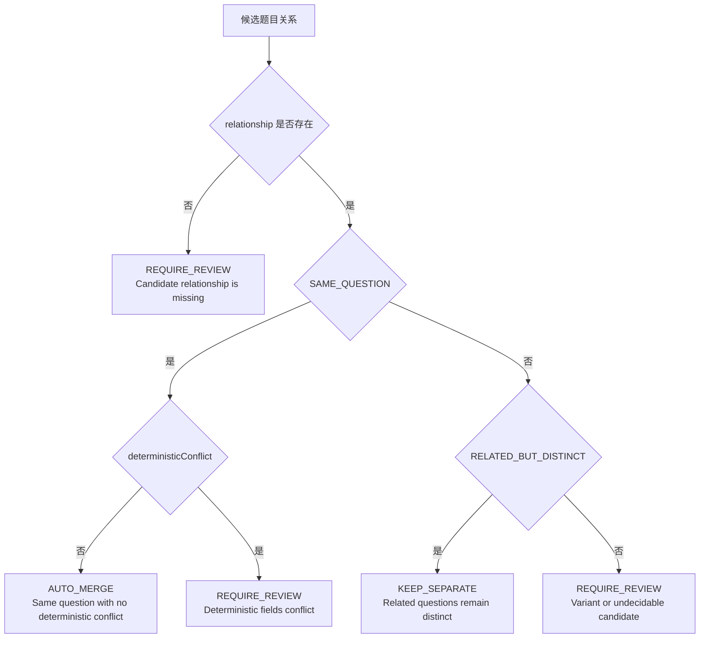
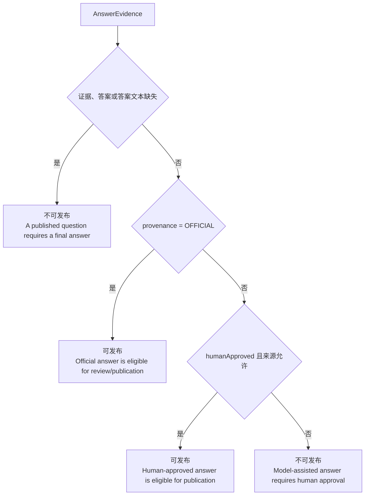
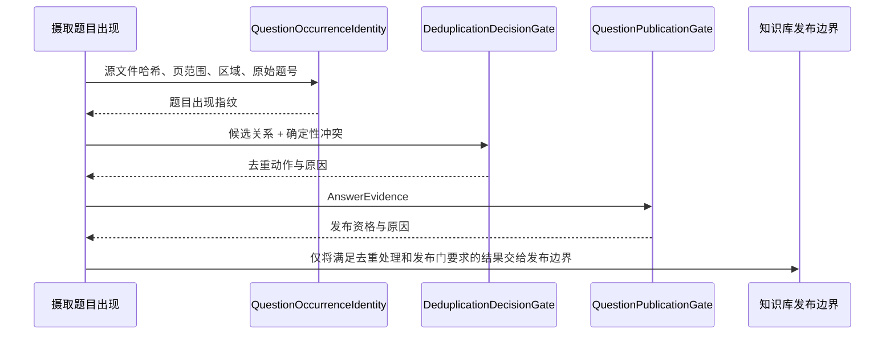

> 题目出现身份、去重决策门、发布决策和题目发布门共同控制题目是否进入知识库。

# 题目身份、重复判定与发布门禁

摄取流程中，一个题目是否进入知识库，至少受到三类信息约束：

1. **题目出现身份**：确认题目来自哪个源文件版本、哪一页或页段、页面上的哪个区域，以及原始题号。
2. **重复判定决策门**：将候选题目关系转换为可审计的合并、分开或人工审核动作。
3. **题目发布门**：检查最终答案是否存在，以及答案是否满足来源和人工审核要求。

这些边界分别解决“这是哪个物理出现实例”“它是否可以与已有题目合并”“它是否具备进入知识库的发布资格”三个问题。

## 模块职责

`ingestion` 包中的相关类型以小型领域对象和纯决策门为主：

- `QuestionOccurrenceIdentity` 为一次检测到的题目出现生成稳定指纹。
- `DeduplicationDecisionGate` 将题目关系和确定性冲突转换为 `DeduplicationDecision`。
- `QuestionPublicationGate` 根据 `AnswerEvidence` 计算 `PublicationDecision`。
- `AnswerEvidence` 保存答案文本、答案来源、人工审核状态和模型信息。
- `DeduplicationDecision` 与 `PublicationDecision` 都保留人类可读的 `reason`，使决策结果能够进入审计证据，而不只是留下一个布尔值。
- `DeduplicationAction` 定义去重决策的三种结果：自动合并、要求审核、保持分开。

从职责边界看，身份生成负责建立可追踪的源出现对象；去重门负责合并安全性；发布门负责答案可发布性。模型或向量候选只能参与候选关系形成，不能绕过确定性冲突检查或答案审核规则。

## 题目出现身份

`QuestionOccurrenceIdentity.fingerprint(...)` 使用以下字段构造身份材料：

- `sourceFileHash`：源文件版本指纹；
- `pageStart`、`pageEnd`：题目覆盖的页范围；
- `QuestionRegion.canonicalForm()`：题目区域的规范化表示；
- `originalQuestionNumber`：原始打印题号。

字段之间使用固定的不可见分隔符连接，随后计算 SHA-256，并返回小写十六进制字符串，适合作为定长数据库键。

题目正文文本被明确排除在身份之外。这样设计意味着 OCR 文本修复或重新识别不会改变同一个物理源位置的审计对象；身份依赖源文件版本和页面区域，而不是当前 OCR 结果。

输入存在明确的前置约束：

- 源文件哈希不能为 `null` 或空白；
- 页码必须从正数开始；
- `pageEnd` 不能小于 `pageStart`；
- 题目区域不能为 `null`；
- 原始题号可以缺失，此时以空字符串参与指纹计算。

违反约束时直接抛出 `IllegalArgumentException`，不会生成不完整的题目身份。

## 去重决策门

`DeduplicationDecisionGate.evaluate(QuestionRelationship relationship, boolean deterministicConflict)` 将候选关系转换为三种动作。

关键规则如下：

| 候选状态 | 确定性冲突 | 决策 |
|---|---:|---|
| 关系缺失 | 任意 | `REQUIRE_REVIEW` |
| `SAME_QUESTION` | 无 | `AUTO_MERGE` |
| `SAME_QUESTION` | 有 | `REQUIRE_REVIEW` |
| `RELATED_BUT_DISTINCT` | 任意 | `KEEP_SEPARATE` |
| 其它关系或无法判断 | 任意 | `REQUIRE_REVIEW` |

确定性冲突覆盖参数、条件、图形、选项和请求目标等字段。候选分类本身只能提名可能重复的一对题目；只要这些字段发生冲突，就不能自动合并。

因此，自动合并是一个窄规则：必须同时满足“关系明确为同题”和“没有确定性冲突”。变体或无法判断的关系不会被默认为重复，而是进入审核。

## 题目发布门

`QuestionPublicationGate.evaluate(AnswerEvidence evidence)` 对发布资格执行顺序检查。

发布门的判断细节：

- `AnswerEvidence` 为 `null`，或 `answer` 为 `null`、空白时，直接不可发布。
- `OFFICIAL` 来源在答案存在时可通过发布资格判断，不要求额外的 `humanApproved` 条件。
- 非官方答案只有在 `humanApproved == true`，且来源属于以下类型之一时才可发布：
  - `MODEL_ASSISTED`
  - `HUMAN_APPROVED_MODEL_ASSISTED`
  - `MANUAL`
- 仅因为存在非空解答，或因为记录了模型名称，都不能推断答案已经获批。
- 模型辅助答案缺少人工审核时不可发布。

该门返回 `PublicationDecision`，同时携带 `publishable` 和 `reason`。发布方应使用门的显式结果，而不是仅依据答案是否非空或模型字段是否存在。

## 控制链路

从领域决策角度，题目进入知识库需要经过以下控制链：

图中最后的发布动作表达的是控制关系，而不是某个已给出实现方法的具体调用名称：当前源码证据确认了身份生成、去重决策和发布决策三个边界，但没有给出知识库写入实现的具体接口。

实际集成时，调用方需要同时保留：

- 题目出现指纹，用于源位置和版本级追踪；
- 去重动作及原因，用于说明是否合并、分开或需要审核；
- 发布决策及原因，用于说明题目是否具备进入知识库的资格。

## 关键状态与结果

本页涉及的核心状态不是一个单一生命周期枚举，而是两个独立决策结果：

- 去重状态：`AUTO_MERGE`、`KEEP_SEPARATE`、`REQUIRE_REVIEW`；
- 发布状态：`publishable = true/false`。

`REQUIRE_REVIEW` 既可能来自缺失候选关系，也可能来自确定性字段冲突或无法判断的题目变体。发布失败则主要表示缺少最终答案，或模型辅助答案尚未获得人工批准。

这两个结果不能互相替代：

- 去重通过不代表答案具备发布资格；
- 答案已批准也不代表两个候选题目可以自动合并；
- 题目身份稳定也不代表题目已经完成审核或可以发布。

## 边界条件与扩展点

### 边界条件

- 源文件哈希、页范围和题目区域是身份生成的硬约束。
- OCR 文本变化不会改变身份，但源文件版本、页面范围或区域规范化结果变化会改变指纹。
- 缺失关系不会默认保守合并，而是要求审核。
- 确定性字段冲突会否决自动合并，即使候选分类认为两题相同。
- 缺少最终答案时，任何答案来源都不能通过发布门。
- `OFFICIAL` 答案与模型辅助答案适用不同的审核条件。
- `humanApproved` 只有在允许的答案来源类型下才足以支持发布。

### 扩展点

- 可扩展 `QuestionRelationship` 的候选分类，但新增关系默认会落入 `REQUIRE_REVIEW`，除非同步定义明确的安全决策规则。
- 可扩展 `AnswerProvenance`，但新来源不会自动获得发布资格；需要在发布门中明确其审核要求。
- 可在 `QuestionRegion.canonicalForm()` 中扩展区域规范化规则，但应评估其对身份稳定性和历史审计关联的影响。
- 可增加更多确定性冲突字段，但这些字段应继续作为自动合并的否决条件，而不是交给模型自行解释。
- `reason` 字段可继续细化，以支持审核队列、审计查询和发布失败诊断。

## Sources

Sources: [QuestionOccurrenceIdentity.java](backend-java/src/main/java/com/doob/mathagent/ingestion/QuestionOccurrenceIdentity.java#L1-L48)  
Sources: [DeduplicationDecisionGate.java](backend-java/src/main/java/com/doob/mathagent/ingestion/DeduplicationDecisionGate.java#L1-L26)  
Sources: [QuestionPublicationGate.java](backend-java/src/main/java/com/doob/mathagent/ingestion/QuestionPublicationGate.java#L1-L26)  
Sources: [PublicationDecision.java](backend-java/src/main/java/com/doob/mathagent/ingestion/PublicationDecision.java#L1-L5)  
Sources: [DeduplicationDecision.java](backend-java/src/main/java/com/doob/mathagent/ingestion/DeduplicationDecision.java#L1-L5)  
Sources: [AnswerEvidence.java](backend-java/src/main/java/com/doob/mathagent/ingestion/AnswerEvidence.java#L1-L5)  
Sources: [DeduplicationAction.java](backend-java/src/main/java/com/doob/mathagent/ingestion/DeduplicationAction.java#L1-L9)
