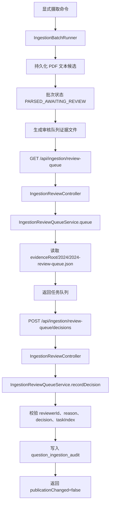

> 审核队列服务、审核控制器和决策请求为待确认的摄取结果提供人工复核入口。

# 摄取人工审核队列

摄取人工审核队列为已完成初步解析、但仍需要人工确认的题目证据提供复核入口。其核心由三部分组成：

- `IngestionBatchRunner`：完成摄取批次的持久化解析，并将批次置于等待审核状态。
- `IngestionReviewQueueService`：读取生成的审核队列，校验人工决策，并将决策写入摄取审计表。
- `IngestionReviewController`：以 HTTP 接口向浏览器暴露队列查询和人工决策提交能力。

该页面对应的是“审核证据”的入口，不是题目发布接口。服务明确保证：记录人工审核结果不会直接修改题目发布状态。

## 模块职责

### 批次运行器

`IngestionBatchRunner` 是人工审核队列的上游。它只在显式传入摄取命令时执行，普通 Web 服务启动不会自动导入挂载目录中的资料。

批次执行时，运行器会：

1. 创建新的 `importRunId`。
2. 创建 `import_run` 记录，初始状态为 `PARSING_ALL_FILES`。
3. 解析发现的源文件，并持久化 PDF 文本及题目候选。
4. 解析成功后，将批次状态更新为 `PARSED_AWAITING_REVIEW`。
5. 将独立的验证状态保持为 `NOT_STARTED`。

`PARSED_AWAITING_REVIEW` 表示文本候选已经持久化，但视觉区域、Golden 比较和人工批准仍未完成。解析成功不等于题目已经具备发布资格。

### 审核队列服务

`IngestionReviewQueueService` 负责审核队列的读取和人工决策记录。

队列文件固定为：

```text
2024/2024-review-queue.json
```

实际读取路径由 `IngestionProperties.evidenceRoot` 与上述相对路径组合得到。调用方不能通过请求参数指定任意文件路径，因此审核接口不会直接读取调用方提供的路径。

服务在读取队列时要求目标文件存在且为普通文件，并使用 Jackson 将其解析为 `Map<String, Object>`。文件不存在时会抛出异常，表示审核证据尚未生成。

提交决策时，服务会从队列中的 `tasks` 列表按 `taskIndex` 取出待审核任务，并将以下内容写入审计记录：

- 队列任务索引；
- 完整任务内容；
- 人工决策；
- 人工填写的原因；
- `importRunId`；
- 审核人标识；
- 审计动作类型。

审计记录写入 `question_ingestion_audit` 表，动作类型为：

```text
HUMAN_REVIEW_ACCEPT
HUMAN_REVIEW_REJECT
HUMAN_REVIEW_DEFER
```

服务返回给浏览器的是经过裁剪的确认结果，只包含是否记录成功、任务索引、决策和 `publicationChanged: false`，不会把数据库连接或内部写入细节暴露给客户端。

### 审核控制器

`IngestionReviewController` 是一个轻量的浏览器适配层，不包含 AI 决策能力，也不自行实现审核规则。所有操作委托给 `IngestionReviewQueueService`。

接口前缀为：

```text
/api/ingestion/review-queue
```

接口包括：

| 方法 | 路径 | 作用 |
|---|---|---|
| `GET` | `/api/ingestion/review-queue` | 读取当前审核队列 |
| `POST` | `/api/ingestion/review-queue/decisions` | 提交人工审核决策 |

源码中的控制器未声明认证或授权注解；当前证据只能确认它提供了接口，不能确认部署层或全局过滤器是否另行施加访问控制。

## 调用链



关键节点如下：

- `PARSED_AWAITING_REVIEW` 是解析和人工复核之间的持久化边界。
- 队列读取始终绑定配置的证据根目录。
- 决策提交必须先重新读取队列，因此任务索引会基于当前队列校验。
- 人工决策只追加审计记录，不在该服务内推进发布状态。
- 后续发布仍需经过验证、答案和题目发布门禁。

## 决策请求与校验

人工请求由 `IngestionReviewDecisionRequest` 表示：

```java
record IngestionReviewDecisionRequest(
    int taskIndex,
    String reviewerId,
    String decision,
    String reason
)
```

服务支持三种决策：

```text
ACCEPT
REJECT
DEFER
```

校验规则如下：

- 请求对象不能为 `null`。
- `reviewerId` 必须存在且不能只包含空白字符。
- `reason` 必须存在且不能只包含空白字符。
- `decision` 必须是 `ACCEPT`、`REJECT` 或 `DEFER`。
- `taskIndex` 必须位于队列 `tasks` 列表的有效范围内。
- 写入时对决策、审核人标识和原因执行 `strip()`，审计内容保存规范化后的字符串。

其中，审核原因是耐久化证据的必需部分。没有命名审核人或原因的请求不会被记录。

## 关键状态

### 批次状态

`ImportRunState` 将审核前后的主流程区分为多个状态：

| 状态 | 含义 |
|---|---|
| `CREATED` | 批次已创建，尚未开始解析 |
| `PARSING_ALL_FILES` | 正在解析全部输入文件 |
| `PARSED_AWAITING_REVIEW` | 解析完成，候选结果等待视觉、Golden 及人工审核 |
| `PAIRING_AND_DEDUPLICATING` | 进入题目配对和去重阶段 |
| `INDEXING` | 进入索引阶段 |
| `COMPLETED` | 批次完成 |
| `PARTIALLY_FAILED` | 部分处理失败，可重新进入部分活动阶段 |
| `FAILED` | 批次终止失败 |

从 `PARSED_AWAITING_REVIEW` 允许进入 `PAIRING_AND_DEDUPLICATING` 或 `FAILED`。状态机不允许从审核等待状态直接进入 `INDEXING` 或 `COMPLETED`，这体现了配对、去重和后续发布流程仍是独立边界。

### 验证状态

批次运行器在解析完成后将 `ImportVerificationState` 设置为 `NOT_STARTED`。因此：

- 运行状态为解析完成，不代表验证已经执行；
- 审核队列的人工决策不等于最终验证完成；
- 验证状态和运行状态需要分别观察，不能用一个状态推断另一个状态。

### 发布资格

`QuestionPublicationGate` 对答案证据单独执行发布资格判断：

- 没有最终答案时，不允许发布；
- `OFFICIAL` 来源的答案可以进入审核或发布资格判断；
- 模型辅助、人工批准模型辅助或人工答案，必须同时满足 `humanApproved`；
- 仅有模型名称、非空解答或一般性审核记录，不能自动推断答案已获批准。

因此，审核队列中的 `ACCEPT` 记录并不自动等价于答案通过，也不等价于题目已发布。

## 边界条件与失败行为

### 队列文件未生成

当配置证据根目录下不存在固定队列文件时，查询和提交都会失败。提交决策不会在没有队列证据的情况下创建独立任务记录。

### 任务索引越界

任务通过整数索引定位。小于零或不小于 `tasks.size()` 的索引会被拒绝，并抛出参数错误。该接口当前没有使用稳定任务 ID，因此队列顺序是提交请求的重要前提。

### 非法决策

除三种白名单值外的决策会被拒绝。源码未显示大小写转换，因此 `accept` 等非标准值不能假定会被接受。

### 重复提交

服务每次提交都会生成新的 UUID 并向 `question_ingestion_audit` 插入一条记录。已读源码没有显示基于任务索引、审核人或客户端请求 ID 的幂等检查，因此重复提交可能形成多条人工审核审计记录。

### 并发与队列变更

服务在提交时重新读取队列，但没有显示版本号、内容哈希或数据库锁。若队列文件在读取之间发生变化，整数索引可能对应不同任务。当前实现依赖队列文件在审核期间保持稳定。

### 数据库写入失败

审计插入通过 JDBC `PreparedStatement` 执行。源码未展示显式事务边界或重试策略，因此数据库异常会沿调用链抛出，浏览器侧应将其视为未确认的提交结果，而不是审核成功。

### 发布状态隔离

即使审计记录成功，返回值仍固定声明：

```json
{
  "recorded": true,
  "publicationChanged": false
}
```

这表示人工审核服务的职责止于记录审核证据。题目是否进入知识库，需要后续验证、去重、答案证据和发布门禁共同决定。

## 扩展点

### 使用稳定任务标识

当前请求使用 `taskIndex`。扩展为稳定的任务 ID、题目出现身份或证据引用，可以降低队列重排和并发更新带来的错审风险，并支持更可靠的幂等键。

### 增加队列版本校验

队列响应和决策请求可以携带队列版本、生成时间或内容摘要。提交时校验版本不一致后拒绝旧请求，避免审核人基于过期任务做出决策。

### 建立决策幂等约束

可以以 `importRunId + taskId + reviewerId + decision` 或专用客户端请求 ID 建立唯一约束，防止浏览器重试或网络重放产生重复审计记录。

### 接入认证主体

当前请求显式携带 `reviewerId`，但控制器源码没有展示认证绑定。后续可从认证主体解析审核人，并将请求中的标识作为校验值或完全移除，避免调用方伪造审核身份。

### 连接后续发布流程

审核记录当前只写入 `question_ingestion_audit`。后续协调器可以消费该审计证据，结合视觉审核、Golden 比较、重复判定、答案证据和 `QuestionPublicationGate`，推动批次进入配对、索引或发布阶段，但不应把单次 `ACCEPT` 直接映射为发布成功。

## Sources

Sources: [IngestionReviewQueueService.java](backend-java/src/main/java/com/doob/mathagent/ingestion/IngestionReviewQueueService.java#L1-L83)  
[IngestionReviewController.java](backend-java/src/main/java/com/doob/mathagent/ingestion/IngestionReviewController.java#L1-L31)  
[IngestionReviewDecisionRequest.java](backend-java/src/main/java/com/doob/mathagent/ingestion/IngestionReviewDecisionRequest.java#L1-L5)  
[IngestionBatchRunner.java](backend-java/src/main/java/com/doob/mathagent/ingestion/IngestionBatchRunner.java#L1-L280)  
[ImportRunState.java](backend-java/src/main/java/com/doob/mathagent/ingestion/ImportRunState.java#L1-L35)  
[QuestionPublicationGate.java](backend-java/src/main/java/com/doob/mathagent/ingestion/QuestionPublicationGate.java#L1-L26)
