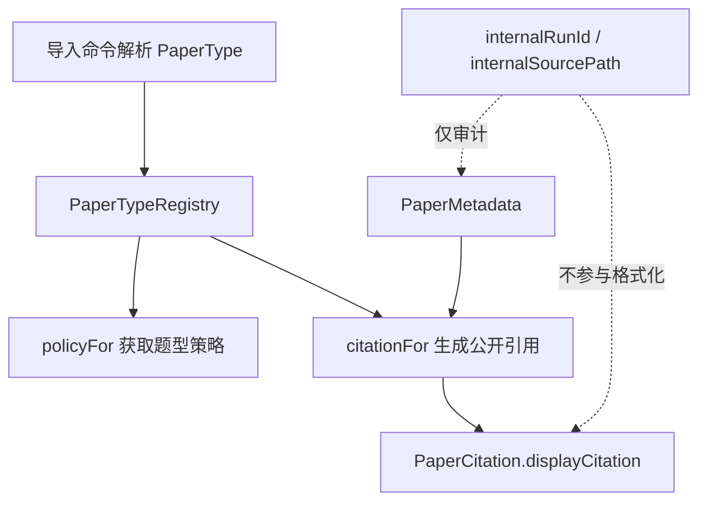
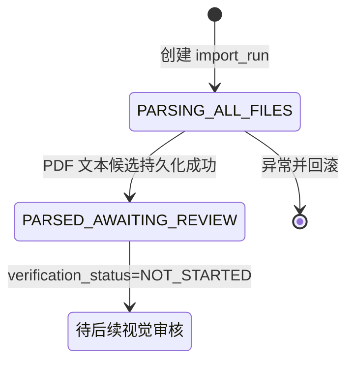

> PaperMetadata、PaperCitation、PaperTypeRegistry 和 PaperTypePolicy 组织论文来源信息及题型处理规则。

# 论文元数据与题型策略

`ingestion` 模块将论文来源信息和题型差异拆分为四个职责明确的对象：

- `PaperMetadata`：保存论文来源的结构化字段，同时保留仅供审计使用的内部运行标识和源文件路径。
- `PaperCitation`：对外暴露人类可读的引用文本。
- `PaperType`：声明论文所属题型，要求每次导入显式指定类型。
- `PaperTypeRegistry` 与 `PaperTypePolicy`：集中维护题型行为规则，并根据安全字段生成公开引用。

这种拆分使内部来源定位信息不会自然流入手册、MCP 响应或其他公开输出，同时避免不同题型的规则散落在多个导入流程中。

## 模块职责

### `PaperMetadata`

`PaperMetadata` 是不可变的 Java record，字段包括：

- `year`：年份。
- `paperName`：试卷或论文名称。
- `region`：地区。
- `institution`：机构，例如学校或命题单位。
- `questionNumber`：题号。
- `internalRunId`：内部导入运行标识。
- `internalSourcePath`：内部源文件路径。

其中，`internalRunId` 和 `internalSourcePath` 明确属于审计数据，不是展示数据。它们可以帮助定位导入批次和原始文件，但不应进入公开引用。

### `PaperCitation`

`PaperCitation` 只包含一个 `displayCitation` 字段，用于承载面向用户的结构化引用文本。它刻意不携带原始路径、数据库标识或导入运行标识，因此调用方拿到该对象后，默认只能使用已经格式化的公开文本。

### `PaperType`

当前支持五种论文类型：

```text
GAOKAO
ZHONGKAO
MOCK_EXAM
COMPETITION
GENERIC
```

`PaperType` 的注释要求每次导入显式声明类型。批处理入口会从命令行参数中解析题型，并将其写入 `import_run.paper_type`，因此题型是导入运行的持久化属性，而不是根据文件名临时推断的状态。

### `PaperTypePolicy`

`PaperTypePolicy` 是按题型保存的不可变规则对象，包含四个策略开关：

| 字段 | 作用 |
| --- | --- |
| `officialAnswerPreferred` | 是否优先采用官方答案。 |
| `automaticCrossSourcePairing` | 是否允许不同来源之间自动配对。 |
| `allowsParentQuestion` | 是否允许题目作为父题存在。 |
| `conservativeDeduplication` | 是否采用更保守的重复题判定策略。 |

策略对象只描述题型行为差异，不负责执行导入、解析文件或做重复判定。这样可以让题型规则成为可替换的策略边界，而不是复制整条导入管线。

## 题型注册与默认策略

`PaperTypeRegistry.defaultRegistry()` 使用 `EnumMap<PaperType, PaperTypePolicy>` 创建完整的默认策略集合，并通过 `Map.copyOf` 保存不可变副本。

当前默认配置如下：

| 题型 | 官方答案优先 | 自动跨来源配对 | 允许父题 | 保守去重 |
| --- | ---: | ---: | ---: | ---: |
| `GAOKAO` | 是 | 是 | 否 | 否 |
| `ZHONGKAO` | 是 | 是 | 否 | 否 |
| `MOCK_EXAM` | 否 | 是 | 是 | 否 |
| `COMPETITION` | 是 | 是 | 否 | 是 |
| `GENERIC` | 否 | 否 | 否 | 是 |

注册表的设计有两个重要约束：

1. 默认注册过程显式为每个 `PaperType` 放入策略，避免新增枚举值后默认集合静默缺失。
2. `policyFor` 拒绝 `null` 或未注册类型，并抛出 `IllegalArgumentException("paper type is required")`。

因此，题型缺失属于输入错误，而不是使用某个隐式默认策略继续执行。

## 公开引用生成

调用链可以概括为：



`citationFor(type, metadata)` 的处理步骤是：

1. 校验 `metadata` 不为空。
2. 无论题型如何，先要求 `questionNumber` 非空白。
3. 根据题型选择公开字段和格式。
4. 对需要年份的类型校验年份范围。
5. 返回只包含展示文本的 `PaperCitation`。

引用格式如下：

- `GAOKAO`、`ZHONGKAO`、`COMPETITION`  
  `年份 论文名 第题号题`
- `MOCK_EXAM`  
  `机构 年份 论文名 第题号题`
- `GENERIC`  
  `论文名 第题号题`

`region` 当前存在于元数据结构中，但不参与 `citationFor` 的格式化。内部运行标识和源文件路径同样不会被读取用于生成公开引用。

## 导入入口中的题型状态

`IngestionBatchRunner` 是批处理导入入口。它只在命令行首参数为规定的 ingestion 命令时执行；普通 Web Server 启动不会自动导入挂载集合。

导入阶段的关键状态关系是：



创建 `import_run` 时，批处理入口会持久化：

- `paper_type`：来自显式命令行参数。
- `status`：初始为 `PARSING_ALL_FILES`。
- `verification_status`：初始为 `NOT_STARTED`。
- `input_root`、请求模型、进度 JSON 和证据根路径。

所有源文件解析成功后，运行状态更新为 `PARSED_AWAITING_REVIEW`，但验证状态仍为 `NOT_STARTED`。这两个状态保持语义分离：文本候选已经保存，不代表视觉区域、Golden 对比或人工审批已经完成。

题型策略注册表和引用生成器属于导入领域模型层；现有批处理证据明确展示了题型进入 `import_run` 的持久化边界，但未显示 `IngestionBatchRunner` 直接调用 `PaperTypeRegistry.policyFor` 或 `citationFor`。因此，不能据此推断注册表已经参与批处理入口的每一个阶段。

## 边界条件与失败行为

### 题型校验

- `type == null` 时拒绝获取策略。
- 未注册的题型同样拒绝。
- 新增 `PaperType` 后，如果没有同步加入默认注册表，调用会失败，而不会使用未定义行为。

### 元数据校验

- `metadata == null` 时，引用生成失败。
- `questionNumber` 为空或只包含空白字符时失败。
- `paperName` 为空或只包含空白字符时失败。
- `institution` 为空或只包含空白字符时，`MOCK_EXAM` 引用失败。
- 需要年份的题型要求年份位于 `1900` 到 `3000`，边界之外或为空都会失败。
- 通过 `required` 校验的字符串会执行 `strip()`，因此首尾空白不会进入公开引用。
- `GENERIC` 不要求年份或机构，但仍要求论文名称和题号。

### 导入边界

- 未提供规定的批处理命令时，`run` 直接返回。
- 配置了来源文件白名单时，指定文件缺失会立即失败。
- 非 PDF 来源会被标记为 `REQUIRES_PDF_RENDER`，等待 DOCX 转 PDF 后再进入共享 PDF 解析器。
- 解析异常会回滚当前数据库事务。
- PDF 文本候选自动保存并不等于题目可以公开发布；视觉区域和人工审核仍属于后续门禁。

## 重复判定与题型策略的边界

`PaperTypePolicy.conservativeDeduplication` 描述题型是否倾向保守去重，但具体合并决策由 `DeduplicationDecisionGate` 执行。该门禁将候选关系和确定性冲突分开处理：

| 条件 | 决策 |
| --- | --- |
| 关系缺失 | `REQUIRE_REVIEW` |
| `SAME_QUESTION` 且无确定性冲突 | `AUTO_MERGE` |
| `RELATED_BUT_DISTINCT` | `KEEP_SEPARATE` |
| 其他情况 | `REQUIRE_REVIEW` |
| 存在确定性字段冲突 | 禁止自动合并并要求审核 |

模型或向量检索只能提出候选关系；参数、条件、图形、选项和目标对象等确定性冲突可以否决合并。这说明题型策略提供的是上层行为偏好，不能替代确定性冲突校验和人工审核门禁。

## 扩展点

新增题型时需要同步考虑以下边界：

1. 在 `PaperType` 中增加枚举值。
2. 在 `defaultRegistry()` 中提供对应的 `PaperTypePolicy`，保证默认注册表完整。
3. 在 `citationFor` 的 `switch` 中定义公开引用格式。
4. 明确该题型是否需要年份、机构、跨来源配对、父题关系和保守去重。
5. 为缺失字段、年份范围和引用格式补充测试。
6. 检查导入运行持久化和后续发布流程是否能够识别新增的 `paper_type`。

如果题型的公开引用字段与现有格式不同，应继续从安全的 `PaperMetadata` 字段构造 `PaperCitation`，不要将 `internalRunId` 或 `internalSourcePath` 作为展示字段。若题型需要更复杂的动态规则，则应扩展 `PaperTypePolicy` 或引入与注册表一致的策略对象，而不是在各个导入步骤中增加题型分支。

Sources: [PaperMetadata.java](backend-java/src/main/java/com/doob/mathagent/ingestion/PaperMetadata.java#L1-L15), [PaperCitation.java](backend-java/src/main/java/com/doob/mathagent/ingestion/PaperCitation.java#L1-L6), [PaperType.java](backend-java/src/main/java/com/doob/mathagent/ingestion/PaperType.java#L1-L7), [PaperTypePolicy.java](backend-java/src/main/java/com/doob/mathagent/ingestion/PaperTypePolicy.java#L1-L10), [PaperTypeRegistry.java](backend-java/src/main/java/com/doob/mathagent/ingestion/PaperTypeRegistry.java#L1-L67), [DeduplicationDecisionGate.java](backend-java/src/main/java/com/doob/mathagent/ingestion/DeduplicationDecisionGate.java#L1-L26), [IngestionBatchRunner.java](backend-java/src/main/java/com/doob/mathagent/ingestion/IngestionBatchRunner.java#L1-L260)
