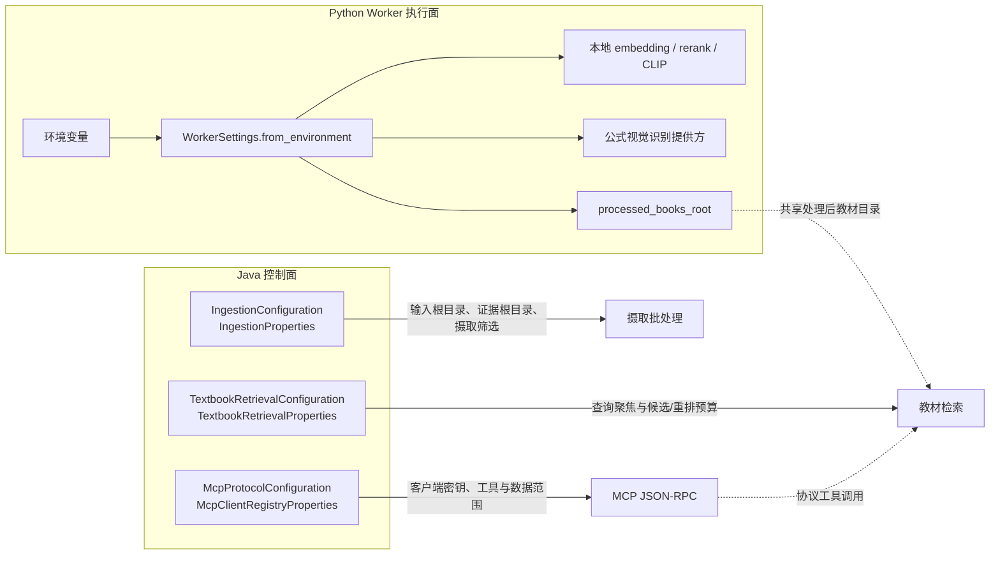

> Java 与 Python 分别通过 ingestion、retrieval、protocol 及 Python settings 配置运行时行为、外部依赖和模型接入。

# 应用运行配置边界

应用运行配置分为 Java 控制面和 Python Worker 执行面两部分。Java 侧通过 `ingestion`、`retrieval` 和 `protocol` 模块装配文件摄取、教材检索及 MCP 协议能力；Python 侧由 `settings.py` 从进程环境构造不可变的 `WorkerSettings`，负责 Worker 凭证、数据目录、模型路径、设备、模型提供方及视觉公式识别参数。

配置的核心边界是：Java 配置决定后端服务如何组织输入、检索预算和协议访问；Python 配置决定执行进程能够访问哪些外部服务、使用哪些本地模型以及如何约束模型调用。两侧通过固定的 Worker 凭证、共享处理后教材目录和协议调用连接，但各自保留运行时参数的所有权。

图中 Java 配置对象由 Spring 注册或创建，并直接进入对应服务边界；Python 则在 Worker 启动时从环境变量生成一份 `WorkerSettings`。本地检索模型与公式视觉模型的配置路径不同：embedding、rerank 和 CLIP 被固定为本地 provider，公式识别则使用显式选择的视觉模型和外部提供方参数。

## Java 摄取配置

`IngestionConfiguration` 使用 `@EnableConfigurationProperties` 注册 `IngestionProperties`，配置前缀为 `math-agent.ingestion`。该模块明确要求摄取路径来自配置文件，而不是从进程环境中的临时变量推导，以保证 Docker/WSL 批处理具有可重复性。

主要配置包括：

- `inputRoot`：真实试卷源文件所在的挂载根目录，默认值为 `/app/data/gaokao-input`。
- `evidenceRoot`：页面证据及相关摄取产物的持久化根目录，默认值为 `/app/data/math-paper-corpus`。
- `initialReviewMaxLongEdgePixels`：初审页面图像的最长边像素上限，默认值为 `960`。
- `initialReviewJpegQuality`：初审 JPEG 质量，默认值为 `0.82`。
- `selectedSourceFileNames`：允许本次摄取处理的源文件名列表，默认为空列表。

路径 setter 会拒绝 `null` 或空白值，并对值执行 `strip`。因此，空路径会在配置绑定阶段快速失败，不会被解释成当前工作目录。初审图像尺寸必须为正数，JPEG 质量必须满足 `(0, 1]`。源文件列表会过滤空值和空白名称，并对保留名称去除首尾空白。

`selectedSourceFileNames` 体现了摄取的文件边界：挂载目录中即使存在其它 PDF，也不应被批处理命令无条件扫描。扩展摄取运行参数时，应继续通过 `IngestionProperties` 增加显式、可校验的配置，而不是重新引入依赖 shell 环境的隐式路径推导。

## Java 教材检索配置

`TextbookRetrievalConfiguration` 创建 `TextbookRetrievalProperties` Bean，并通过 `Environment` 读取 Spring 配置。配置前缀集中在 `math-agent.textbook.retrieval` 下，分为 `query-focus` 和 `rerank` 两组。

### 查询聚焦

`QueryFocus` 负责在进入语义检索前限制查询和路由噪声：

- `maxQueryChars`：查询最大字符数，默认 `120`，最小被约束为 `32`。
- `maxClauses`：最大查询子句数，默认 `2`，至少为 `1`。
- `maxGraphTags`：最多保留的图谱标签数，默认 `4`，不低于 `0`。
- `lexicalFirstMaxQueryChars`：词法优先阶段的查询长度上限，默认 `24`，至少为 `8`，且不会超过 `maxQueryChars`。
- `semanticTitleContextLimit`：语义检索使用的标题上下文数量，默认 `3`，不低于 `0`。
- `dynamicRouteEnabled`：动态路由开关，默认关闭。
- `normalizeAgentWrapperEnabled`：Agent 包装结果规范化开关，默认关闭。

这些字段的职责是控制输入聚焦和路由行为，不是定义检索相关性分数。配置对象在构造时会对数值进行下限和相互约束，避免词法阶段的限制超过总体查询限制。

### 候选与重排预算

`RerankBudget` 负责候选窗口、发送给重排端点的文本大小以及粗召回参数。默认值包括：

- 最终文档候选数：`3`
- 每文档最终页面数：`3`
- 最大重排文档数：`3`
- 最大页面候选数：`9`
- 粗召回文档候选数：`5`
- 每文档粗召回页面数：`5`
- 粗召回 RRF 平滑常数：`60`
- 页面文本字符数：`120`
- 公式文本字符数：`40`
- 文档文本字符数：`320`
- 每文档词法主导页面数：`5`

粗召回窗口比最终重排窗口更宽，目的是让候选先保留足够的教材和页面，再将受控数量送入最终重排。该配置边界只负责候选准入、请求载荷和 Worker I/O 预算，不应被扩展为隐藏的分数融合逻辑。现有约定是：BM25 按稳定词法顺序准入，BGE/CLIP 在已准入文档内保留独立的补充证据，最终页面顺序由 Cross-Encoder 决定。

`TextbookRetrievalProperties.defaults()` 为直接构造、测试和非 Spring 工具提供默认配置；`fromSpringEnvironment` 则读取可选部署覆盖项，未配置的字段回退到默认值。因此，新增检索参数时应同时维护默认值、环境读取和构造期约束，避免把部署参数散落在检索实现中。

## Java MCP 协议配置

`McpProtocolConfiguration` 启用 `McpClientRegistryProperties`，其配置前缀为 `math-agent.protocol.mcp.registry`，并创建标准的 `McpJsonRpcService`。JSON-RPC 服务依赖以下能力：

- `ProtocolDiscoveryService`：发现可暴露的协议能力。
- `McpToolExecutionService`：执行具体 MCP 工具。
- `McpClientResolver`：解析调用方客户端。
- `TextbookResourceService` 与 `TextbookResourceProperties`：提供受控教材资源读取。
- `KnowledgeGraphSpineService`：连接知识图谱能力。

MCP 客户端注册表保存的是客户端配置和密钥哈希，而不是原始密钥。收到 HTTPS Bearer 密钥后，解析器会对去除首尾空白的值计算 SHA-256，并与配置中的 `sha256:<hex>` 值匹配；只有 `enabled` 的客户端能够通过解析。

每个客户端配置包含：

- 稳定的 `clientId`
- `profile`
- `tenantId`
- `subjectId`
- `secretHash`
- `enabled`
- `allowedTools`
- `allowedScopes`

其中 `allowedTools` 和 `allowedScopes` 形成协议访问的细粒度边界：客户端身份验证通过并不等于可以调用所有工具或读取所有数据。协议扩展应继续经过发现服务、工具执行服务和客户端授权上下文，而不应绕过 MCP 注册表直接暴露后端能力。

密钥处理的边界是：原始 Bearer 密钥只用于请求匹配，注册表不保存或记录原始值；配置中只应维护哈希后的密钥材料。客户端列表为空、客户端被禁用、密钥不匹配或工具/范围不允许时，调用应停留在协议授权边界内。

## Python Worker 配置

Python 侧的 `WorkerSettings` 是 `frozen=True` 的数据类，由 `WorkerSettings.from_environment` 从环境映射生成。调用方可以显式传入 `Mapping[str, str]`，测试和非进程环境运行因此不必直接依赖 `os.environ`。

### Worker 与外部服务

基础运行配置包括：

- `MATH_AGENT_WORKER_API_KEY`：Worker 内部凭证。
- `MATH_AGENT_EMBEDDING_API_KEY`：兼容的旧凭证回退来源。
- 两者都未设置时使用固定的本地内部默认值 `local_worker_internal_key`。
- `MATH_AGENT_PROCESSED_BOOKS_ROOT`：处理后教材目录。
- `OPENAI_API_KEY` 与 `OPENAI_BASE_URL`：外部模型提供方接入，Base URL 默认值为 `https://api1.aisz.mom/v1`。
- `QWEN_API_KEY`：Qwen 提供方凭证。
- `FEISHU_APP_SECRET`：飞书相关外部依赖凭证。

Worker 通过 `resolve_processed_books_root` 解析处理后教材目录。显式环境变量优先；未配置时按预设候选路径查找，并要求目录存在 `_page_image_index` 子目录。找不到有效目录时返回 `None`，因此上层必须将其视为运行时能力缺失，而不能假设目录一定存在。

### 本地模型与提供方约束

embedding、rerank 和 CLIP 的 provider 顺序是代码中的固定常量：

- `LOCAL_TEXT_EMBEDDING_PROVIDER_ORDER = ("local_bge_embedding",)`
- `LOCAL_RERANK_PROVIDER_ORDER = ("local_bge_reranker",)`
- `LOCAL_CLIP_PROVIDER_ORDER = ("local_clip",)`

`from_environment` 不允许环境变量改变这三个顺序。该约束是安全和部署不变量，用于保证文本 embedding、重排及图像 CLIP 保持本地模型执行，即使进程继承了远程提供方密钥或旧的 provider-order 配置。

模型路径支持显式配置，也支持按候选路径自动发现：

- `MATH_AGENT_LOCAL_CLIP_MODEL_PATH` 控制 CLIP 模型路径；自动发现要求存在 `pytorch_model.bin` 或 `model.safetensors`。
- `MATH_AGENT_LOCAL_RERANK_MODEL_PATH` 控制本地 reranker 路径；未配置时在预设本地模型目录中查找。
- `MATH_AGENT_LOCAL_TEXT_EMBEDDING_MODEL_PATH` 控制本地文本 embedding 模型路径。

设备和维度由以下配置控制：

- `MATH_AGENT_LOCAL_CLIP_DEVICE`，默认 `cuda`
- `MATH_AGENT_LOCAL_CLIP_DIMENSION`，默认 `512`
- `MATH_AGENT_LOCAL_RERANK_DEVICE`，默认 `cuda`
- `MATH_AGENT_LOCAL_TEXT_EMBEDDING_DEVICE`，默认 `cuda`
- `MATH_AGENT_EMBEDDING_DIMENSION`，默认 `512`
- `MATH_AGENT_LOCAL_RERANK_MAX_TOKENS`，默认 `128`，最小为 `1`

`local_rerank_max_tokens` 是 CPU/GPU 推理成本边界，影响序列长度和执行预算，但不改变检索排序语义。

### 公式视觉识别

公式视觉识别是一条独立的模型接入路径，不会自动影响普通文本摄取成本。配置包括：

- `MATH_AGENT_FORMULA_VISION_MODEL`，默认 `gpt-5.6-luna`；兼容回退键为 `OPENAI_FORMULA_VISION_MODEL`。
- `MATH_AGENT_FORMULA_VISION_TIMEOUT_SECONDS`，默认 `180` 秒，最小为 `1`。
- `MATH_AGENT_FORMULA_VISION_MAX_IMAGE_BYTES`，默认 `4 * 1024 * 1024`，最小为 `1`。
- `MATH_AGENT_FORMULA_VISION_MINIMUM_CONFIDENCE`，默认 `0.9`，最终限制在 `[0.0, 1.0]`。

这些设置只规定实际视觉提供方、请求时限、图像载荷上限和置信度门槛。AI parse 必须由源文档显式选择；未选择 AI parse 时，公式视觉配置不应使普通 `TEXT` 摄取隐式产生额外模型调用。

## 调用链与边界

典型运行链路可以概括为：

1. Spring 启动时注册摄取、检索和 MCP 配置对象。
2. 摄取服务读取 `IngestionProperties`，在明确的输入根目录、证据根目录和源文件白名单内执行批处理。
3. 检索服务读取 `TextbookRetrievalProperties`，先按查询聚焦限制输入，再按候选窗口组织 BM25、BGE/CLIP 和 Cross-Encoder 所需的检索与重排载荷。
4. Python Worker 启动时通过 `WorkerSettings.from_environment` 固化凭证、目录、模型路径、设备和外部提供方参数。
5. Java MCP JSON-RPC 服务通过客户端密钥哈希、启用状态、工具列表和数据范围完成协议访问控制。
6. Java 与 Python 共享受控的 Worker 调用边界及处理后教材目录，但模型 provider 选择和 Python 进程环境仍由 Python settings 管理。

需要重点区分三类失败：

- **配置绑定失败**：Java 路径为空、摄取图像参数越界，或检索配置违反构造约束。
- **能力缺失**：Python 找不到有效的处理后教材目录或本地模型路径，导致对应 Worker 能力不可用。
- **访问拒绝**：MCP 密钥未注册、客户端未启用，或请求超出允许工具和数据范围。

扩展运行配置时，应在所属边界增加字段及校验：文件系统和摄取规则归 `ingestion`，检索窗口和查询限制归 `retrieval`，协议身份与授权归 `protocol`，Worker 模型和外部提供方归 Python `settings`。跨边界复用配置时，应通过已有的服务或客户端契约传递，避免让 Java 直接控制 Python 的 provider 顺序，或让 Python 环境变量反向改变 Java 的摄取路径和检索语义。

Sources: [IngestionConfiguration.java](backend-java/src/main/java/com/doob/mathagent/ingestion/IngestionConfiguration.java#L1-L10)  
Sources: [IngestionProperties.java](backend-java/src/main/java/com/doob/mathagent/ingestion/IngestionProperties.java#L1-L72)  
Sources: [TextbookRetrievalConfiguration.java](backend-java/src/main/java/com/doob/mathagent/retrieval/TextbookRetrievalConfiguration.java#L1-L16)  
Sources: [TextbookRetrievalProperties.java](backend-java/src/main/java/com/doob/mathagent/retrieval/TextbookRetrievalProperties.java#L1-L193)  
Sources: [McpProtocolConfiguration.java](backend-java/src/main/java/com/doob/mathagent/protocol/config/McpProtocolConfiguration.java#L1-L42)  
Sources: [McpClientRegistryProperties.java](backend-java/src/main/java/com/doob/mathagent/protocol/service/McpClientRegistryProperties.java#L1-L239)  
Sources: [settings.py](ai-worker-python/app/settings.py#L1-L171)
